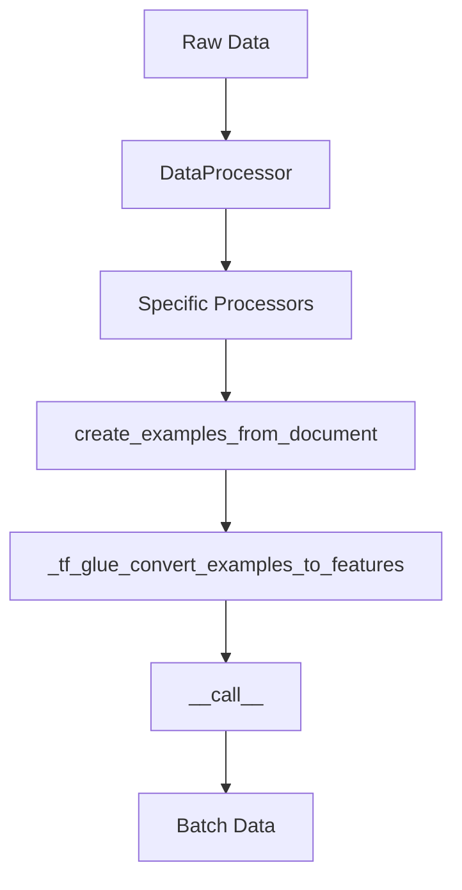

Data Processing refers to the various steps and methods used to prepare raw data for model training and evaluation.

The <SwmToken path="src/transformers/data/processors/utils.py" pos="81:2:2" line-data="class DataProcessor:">`DataProcessor`</SwmToken> class serves as a base class for data converters for sequence classification datasets, providing methods to read data, convert it into examples, and get labels.

Specific processors like <SwmToken path="src/transformers/data/processors/glue.py" pos="562:2:2" line-data="class WnliProcessor(DataProcessor):">`WnliProcessor`</SwmToken>, <SwmToken path="src/transformers/data/processors/glue.py" pos="418:2:2" line-data="class QqpProcessor(DataProcessor):">`QqpProcessor`</SwmToken>, and <SwmToken path="src/transformers/data/processors/glue.py" pos="372:2:2" line-data="class StsbProcessor(DataProcessor):">`StsbProcessor`</SwmToken> inherit from <SwmToken path="src/transformers/data/processors/utils.py" pos="81:2:2" line-data="class DataProcessor:">`DataProcessor`</SwmToken> and implement methods to handle datasets for specific tasks.

The function <SwmToken path="src/transformers/data/datasets/language_modeling.py" pos="424:3:3" line-data="    def create_examples_from_document(self, document: List[List[int]], doc_index: int, block_size: int):">`create_examples_from_document`</SwmToken> is used to create examples from a single document, handling tokenization and special token addition.

The function <SwmToken path="src/transformers/data/processors/glue.py" pos="79:3:3" line-data="    def _tf_glue_convert_examples_to_features(">`_tf_glue_convert_examples_to_features`</SwmToken> converts examples to <SwmToken path="src/transformers/data/processors/glue.py" pos="87:15:17" line-data="            A ``tf.data.Dataset`` containing the task-specific features.">`task-specific`</SwmToken> features, utilizing the processor's methods to map and convert examples.

The `__call__` function in <SwmPath>[src/transformers/data/data_collator.py](src/transformers/data/data_collator.py)</SwmPath> handles the collation of examples into a batch, including padding and masking for masked language modeling.



<SwmSnippet path="/src/transformers/data/processors/utils.py" line="81">

---

<SwmToken path="src/transformers/data/processors/utils.py" pos="81:2:2" line-data="class DataProcessor:">`DataProcessor`</SwmToken> Class The <SwmToken path="src/transformers/data/processors/utils.py" pos="81:2:2" line-data="class DataProcessor:">`DataProcessor`</SwmToken> class serves as a base class for data converters for sequence classification datasets. It provides methods to read data, convert it into examples, and get labels.

```python
class DataProcessor:
    """Base class for data converters for sequence classification data sets."""

    def get_example_from_tensor_dict(self, tensor_dict):
        """
        Gets an example from a dict with tensorflow tensors.

        Args:
            tensor_dict: Keys and values should match the corresponding Glue
                tensorflow_dataset examples.
        """
        raise NotImplementedError()

    def get_train_examples(self, data_dir):
        """Gets a collection of :class:`InputExample` for the train set."""
        raise NotImplementedError()

    def get_dev_examples(self, data_dir):
        """Gets a collection of :class:`InputExample` for the dev set."""
        raise NotImplementedError()

```

---

</SwmSnippet>

<SwmSnippet path="/src/transformers/data/processors/utils.py" line="126">

---

<SwmToken path="src/transformers/data/processors/utils.py" pos="126:2:2" line-data="class SingleSentenceClassificationProcessor(DataProcessor):">`SingleSentenceClassificationProcessor`</SwmToken> Specific processors like <SwmToken path="src/transformers/data/processors/utils.py" pos="126:2:2" line-data="class SingleSentenceClassificationProcessor(DataProcessor):">`SingleSentenceClassificationProcessor`</SwmToken> inherit from <SwmToken path="src/transformers/data/processors/utils.py" pos="126:4:4" line-data="class SingleSentenceClassificationProcessor(DataProcessor):">`DataProcessor`</SwmToken> and implement methods to handle datasets for specific tasks.

```python
class SingleSentenceClassificationProcessor(DataProcessor):
    """Generic processor for a single sentence classification data set."""
```

---

</SwmSnippet>

<SwmSnippet path="/src/transformers/data/datasets/language_modeling.py" line="424">

---

<SwmToken path="src/transformers/data/datasets/language_modeling.py" pos="424:3:3" line-data="    def create_examples_from_document(self, document: List[List[int]], doc_index: int, block_size: int):">`create_examples_from_document`</SwmToken> Function The function <SwmToken path="src/transformers/data/datasets/language_modeling.py" pos="424:3:3" line-data="    def create_examples_from_document(self, document: List[List[int]], doc_index: int, block_size: int):">`create_examples_from_document`</SwmToken> is used to create examples from a single document, handling tokenization and special token addition.

```python
    def create_examples_from_document(self, document: List[List[int]], doc_index: int, block_size: int):
        """Creates examples for a single document."""

        max_num_tokens = block_size - self.tokenizer.num_special_tokens_to_add(pair=True)

        # We *usually* want to fill up the entire sequence since we are padding
        # to `block_size` anyways, so short sequences are generally wasted
        # computation. However, we *sometimes*
        # (i.e., short_seq_prob == 0.1 == 10% of the time) want to use shorter
        # sequences to minimize the mismatch between pretraining and fine-tuning.
        # The `target_seq_length` is just a rough target however, whereas
        # `block_size` is a hard limit.
        target_seq_length = max_num_tokens
        if random.random() < self.short_seq_probability:
            target_seq_length = random.randint(2, max_num_tokens)

        current_chunk = []  # a buffer stored current working segments
        current_length = 0
        i = 0

        while i < len(document):
```

---

</SwmSnippet>

<SwmSnippet path="/src/transformers/data/processors/glue.py" line="79">

---

tf_glue_convert_examples_to_features Function The function <SwmToken path="src/transformers/data/processors/glue.py" pos="79:3:3" line-data="    def _tf_glue_convert_examples_to_features(">`_tf_glue_convert_examples_to_features`</SwmToken> converts examples to <SwmToken path="src/transformers/data/processors/glue.py" pos="87:15:17" line-data="            A ``tf.data.Dataset`` containing the task-specific features.">`task-specific`</SwmToken> features, utilizing the processor's methods to map and convert examples.

```python
    def _tf_glue_convert_examples_to_features(
        examples: tf.data.Dataset,
        tokenizer: PreTrainedTokenizer,
        task=str,
        max_length: Optional[int] = None,
    ) -> tf.data.Dataset:
        """
        Returns:
            A ``tf.data.Dataset`` containing the task-specific features.

        """
        processor = glue_processors[task]()
        examples = [processor.tfds_map(processor.get_example_from_tensor_dict(example)) for example in examples]
        features = glue_convert_examples_to_features(examples, tokenizer, max_length=max_length, task=task)
        label_type = tf.float32 if task == "sts-b" else tf.int64

        def gen():
            for ex in features:
                d = {k: v for k, v in asdict(ex).items() if v is not None}
                label = d.pop("label")
                yield (d, label)
```

---

</SwmSnippet>

&nbsp;

*This is an auto-generated document by Swimm AI 🌊 and has not yet been verified by a human*

<SwmMeta version="3.0.0" repo-id="Z2l0aHViJTNBJTNBdHJhbnNmb3JtZXJzJTNBJTNBc2h1anV1dQ==" repo-name="transformers"><sup>Powered by [Swimm](/)</sup></SwmMeta>
