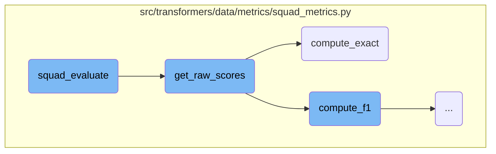

This document explains the process of evaluating predictions using the <SwmToken path="src/transformers/data/metrics/squad_metrics.py" pos="223:2:2" line-data="def squad_evaluate(examples, preds, no_answer_probs=None, no_answer_probability_threshold=1.0):">`squad_evaluate`</SwmToken> function. The function assesses the accuracy of model predictions against a set of examples by computing exact and <SwmToken path="src/transformers/data/metrics/squad_metrics.py" pos="72:16:16" line-data="        # If either is no-answer, then F1 is 1 if they agree, 0 otherwise">`F1`</SwmToken> scores. It categorizes questions based on whether they have an answer, adjusts scores based on <SwmToken path="src/transformers/data/metrics/squad_metrics.py" pos="72:9:11" line-data="        # If either is no-answer, then F1 is 1 if they agree, 0 otherwise">`no-answer`</SwmToken> probabilities, and merges evaluation dictionaries for questions with and without answers. Finally, it determines the best thresholds for the scores and returns the evaluation results.

The evaluation process starts by categorizing questions into those with answers and those without. It then calculates exact and <SwmToken path="src/transformers/data/metrics/squad_metrics.py" pos="72:16:16" line-data="        # If either is no-answer, then F1 is 1 if they agree, 0 otherwise">`F1`</SwmToken> scores for each question by comparing the model's predictions with the actual answers. These scores are adjusted based on the likelihood that a question has no answer. The function then creates evaluation dictionaries for both types of questions and merges them. Finally, it finds the best thresholds for the scores and returns the results, giving a clear picture of the model's performance.

Here is a high level diagram of the flow, showing only the most important functions:

```mermaid
graph TD;
      subgraph src/transformers
9870f4ba9e72507cae90084edc7eff7cdb4bab5522600fb5e45b0212ac47fa66(squad_evaluate):::mainFlowStyle --> b70aff8f483f9e80436e34f1ed7f35989fe2667eeb36b235cadf084a396298a2(get_raw_scores):::mainFlowStyle
end

subgraph src/transformers
b70aff8f483f9e80436e34f1ed7f35989fe2667eeb36b235cadf084a396298a2(get_raw_scores):::mainFlowStyle --> 0217825364fcab4930e87bb2c846ba891f065d83e4b72417d2ca6ec754aea5eb(compute_exact)
end

subgraph src/transformers
b70aff8f483f9e80436e34f1ed7f35989fe2667eeb36b235cadf084a396298a2(get_raw_scores):::mainFlowStyle --> 0098dbaad2d573c4d9f9ff5d024b54c6867cec7e70e0e0812b9d3036c9a23820(compute_f1):::mainFlowStyle
end

subgraph src/transformers
0098dbaad2d573c4d9f9ff5d024b54c6867cec7e70e0e0812b9d3036c9a23820(compute_f1):::mainFlowStyle --> 8f58f4b4a0ed40e2450c7cef60fa68d91b3c986fbae941a6ef37cee007d2cfe2(get_tokens):::mainFlowStyle
end

subgraph src/transformers
8f58f4b4a0ed40e2450c7cef60fa68d91b3c986fbae941a6ef37cee007d2cfe2(get_tokens):::mainFlowStyle --> 1b8e832ea1fd84670d277bf8e7bdca1be56ad54e6b69dcbbefedc470734e78e2(normalize_answer):::mainFlowStyle
end

subgraph src/transformers
1b8e832ea1fd84670d277bf8e7bdca1be56ad54e6b69dcbbefedc470734e78e2(normalize_answer):::mainFlowStyle --> fd94620d46d32e56ba288b947ed6f381ddada39841f9633131cbeb0c44e87c9b(white_space_fix):::mainFlowStyle
end

subgraph src/transformers
fd94620d46d32e56ba288b947ed6f381ddada39841f9633131cbeb0c44e87c9b(white_space_fix):::mainFlowStyle --> c9c1dff04bd1b8c82ff19be78c12c3d12866ff54e597472d47c89d405af429e0(split):::mainFlowStyle
end


      classDef mainFlowStyle color:#000000,fill:#7CB9F4
classDef rootsStyle color:#000000,fill:#00FFF4
classDef Style1 color:#000000,fill:#00FFAA
classDef Style2 color:#000000,fill:#FFFF00
classDef Style3 color:#000000,fill:#AA7CB9

%% Swimm:
%% graph TD;
%%       subgraph <SwmPath>[src/transformers/](src/transformers/)</SwmPath>
%% 9870f4ba9e72507cae90084edc7eff7cdb4bab5522600fb5e45b0212ac47fa66(squad_evaluate):::mainFlowStyle --> b70aff8f483f9e80436e34f1ed7f35989fe2667eeb36b235cadf084a396298a2(get_raw_scores):::mainFlowStyle
%% end
%% 
%% subgraph <SwmPath>[src/transformers/](src/transformers/)</SwmPath>
%% b70aff8f483f9e80436e34f1ed7f35989fe2667eeb36b235cadf084a396298a2(get_raw_scores):::mainFlowStyle --> 0217825364fcab4930e87bb2c846ba891f065d83e4b72417d2ca6ec754aea5eb(compute_exact)
%% end
%% 
%% subgraph <SwmPath>[src/transformers/](src/transformers/)</SwmPath>
%% b70aff8f483f9e80436e34f1ed7f35989fe2667eeb36b235cadf084a396298a2(get_raw_scores):::mainFlowStyle --> 0098dbaad2d573c4d9f9ff5d024b54c6867cec7e70e0e0812b9d3036c9a23820(compute_f1):::mainFlowStyle
%% end
%% 
%% subgraph <SwmPath>[src/transformers/](src/transformers/)</SwmPath>
%% 0098dbaad2d573c4d9f9ff5d024b54c6867cec7e70e0e0812b9d3036c9a23820(compute_f1):::mainFlowStyle --> 8f58f4b4a0ed40e2450c7cef60fa68d91b3c986fbae941a6ef37cee007d2cfe2(get_tokens):::mainFlowStyle
%% end
%% 
%% subgraph <SwmPath>[src/transformers/](src/transformers/)</SwmPath>
%% 8f58f4b4a0ed40e2450c7cef60fa68d91b3c986fbae941a6ef37cee007d2cfe2(get_tokens):::mainFlowStyle --> 1b8e832ea1fd84670d277bf8e7bdca1be56ad54e6b69dcbbefedc470734e78e2(normalize_answer):::mainFlowStyle
%% end
%% 
%% subgraph <SwmPath>[src/transformers/](src/transformers/)</SwmPath>
%% 1b8e832ea1fd84670d277bf8e7bdca1be56ad54e6b69dcbbefedc470734e78e2(normalize_answer):::mainFlowStyle --> fd94620d46d32e56ba288b947ed6f381ddada39841f9633131cbeb0c44e87c9b(white_space_fix):::mainFlowStyle
%% end
%% 
%% subgraph <SwmPath>[src/transformers/](src/transformers/)</SwmPath>
%% fd94620d46d32e56ba288b947ed6f381ddada39841f9633131cbeb0c44e87c9b(white_space_fix):::mainFlowStyle --> c9c1dff04bd1b8c82ff19be78c12c3d12866ff54e597472d47c89d405af429e0(split):::mainFlowStyle
%% end
%% 
%% 
%%       classDef mainFlowStyle color:#000000,fill:#7CB9F4
%% classDef rootsStyle color:#000000,fill:#00FFF4
%% classDef Style1 color:#000000,fill:#00FFAA
%% classDef Style2 color:#000000,fill:#FFFF00
%% classDef Style3 color:#000000,fill:#AA7CB9
```



# Flow drill down

First, we'll zoom into this section of the flow:



<SwmSnippet path="/src/transformers/data/metrics/squad_metrics.py" line="223">

---

## Evaluating predictions

The <SwmToken path="src/transformers/data/metrics/squad_metrics.py" pos="223:2:2" line-data="def squad_evaluate(examples, preds, no_answer_probs=None, no_answer_probability_threshold=1.0):">`squad_evaluate`</SwmToken> function evaluates the predictions made by a model against the provided examples. It first categorizes the questions based on whether they have an answer or not. Then, it computes the exact and <SwmToken path="src/transformers/data/metrics/squad_metrics.py" pos="231:4:4" line-data="    exact, f1 = get_raw_scores(examples, preds)">`f1`</SwmToken> scores using the <SwmToken path="src/transformers/data/metrics/squad_metrics.py" pos="231:8:8" line-data="    exact, f1 = get_raw_scores(examples, preds)">`get_raw_scores`</SwmToken> function. The scores are adjusted based on the <SwmToken path="src/transformers/data/metrics/squad_metrics.py" pos="72:9:11" line-data="        # If either is no-answer, then F1 is 1 if they agree, 0 otherwise">`no-answer`</SwmToken> probabilities, and evaluation dictionaries are created and merged for questions with and without answers. Finally, the function finds the best thresholds for the scores and returns the evaluation results.

```python
def squad_evaluate(examples, preds, no_answer_probs=None, no_answer_probability_threshold=1.0):
    qas_id_to_has_answer = {example.qas_id: bool(example.answers) for example in examples}
    has_answer_qids = [qas_id for qas_id, has_answer in qas_id_to_has_answer.items() if has_answer]
    no_answer_qids = [qas_id for qas_id, has_answer in qas_id_to_has_answer.items() if not has_answer]

    if no_answer_probs is None:
        no_answer_probs = {k: 0.0 for k in preds}

    exact, f1 = get_raw_scores(examples, preds)

    exact_threshold = apply_no_ans_threshold(
        exact, no_answer_probs, qas_id_to_has_answer, no_answer_probability_threshold
    )
    f1_threshold = apply_no_ans_threshold(f1, no_answer_probs, qas_id_to_has_answer, no_answer_probability_threshold)

    evaluation = make_eval_dict(exact_threshold, f1_threshold)

    if has_answer_qids:
        has_ans_eval = make_eval_dict(exact_threshold, f1_threshold, qid_list=has_answer_qids)
        merge_eval(evaluation, has_ans_eval, "HasAns")

```

---

</SwmSnippet>

<SwmSnippet path="/src/transformers/data/metrics/squad_metrics.py" line="82">

---

## Computing raw scores

The <SwmToken path="src/transformers/data/metrics/squad_metrics.py" pos="82:2:2" line-data="def get_raw_scores(examples, preds):">`get_raw_scores`</SwmToken> function computes the exact and <SwmToken path="src/transformers/data/metrics/squad_metrics.py" pos="84:9:9" line-data="    Computes the exact and f1 scores from the examples and the model predictions">`f1`</SwmToken> scores for each question-answer pair in the examples. It iterates over the examples, normalizes the answers, and compares them with the model's predictions. The exact and <SwmToken path="src/transformers/data/metrics/squad_metrics.py" pos="84:9:9" line-data="    Computes the exact and f1 scores from the examples and the model predictions">`f1`</SwmToken> scores are calculated using the <SwmToken path="src/transformers/data/metrics/squad_metrics.py" pos="102:10:10" line-data="        exact_scores[qas_id] = max(compute_exact(a, prediction) for a in gold_answers)">`compute_exact`</SwmToken> and <SwmToken path="src/transformers/data/metrics/squad_metrics.py" pos="66:2:2" line-data="def compute_f1(a_gold, a_pred):">`compute_f1`</SwmToken> functions, respectively. These scores are then stored in dictionaries and returned.

```python
def get_raw_scores(examples, preds):
    """
    Computes the exact and f1 scores from the examples and the model predictions
    """
    exact_scores = {}
    f1_scores = {}

    for example in examples:
        qas_id = example.qas_id
        gold_answers = [answer["text"] for answer in example.answers if normalize_answer(answer["text"])]

        if not gold_answers:
            # For unanswerable questions, only correct answer is empty string
            gold_answers = [""]

        if qas_id not in preds:
            print(f"Missing prediction for {qas_id}")
            continue

        prediction = preds[qas_id]
        exact_scores[qas_id] = max(compute_exact(a, prediction) for a in gold_answers)
```

---

</SwmSnippet>

<SwmSnippet path="/src/transformers/data/metrics/squad_metrics.py" line="62">

---

### Computing exact match

The <SwmToken path="src/transformers/data/metrics/squad_metrics.py" pos="62:2:2" line-data="def compute_exact(a_gold, a_pred):">`compute_exact`</SwmToken> function calculates the exact match score by normalizing both the gold answer and the predicted answer and checking if they are identical. This function returns 1 if the answers match exactly and 0 otherwise.

```python
def compute_exact(a_gold, a_pred):
    return int(normalize_answer(a_gold) == normalize_answer(a_pred))
```

---

</SwmSnippet>

Now, lets zoom into this section of the flow:

```mermaid
graph TD;
      subgraph src/transformers
0098dbaad2d573c4d9f9ff5d024b54c6867cec7e70e0e0812b9d3036c9a23820(compute_f1):::mainFlowStyle --> 8f58f4b4a0ed40e2450c7cef60fa68d91b3c986fbae941a6ef37cee007d2cfe2(get_tokens):::mainFlowStyle
end

subgraph src/transformers
8f58f4b4a0ed40e2450c7cef60fa68d91b3c986fbae941a6ef37cee007d2cfe2(get_tokens):::mainFlowStyle --> 1b8e832ea1fd84670d277bf8e7bdca1be56ad54e6b69dcbbefedc470734e78e2(normalize_answer):::mainFlowStyle
end

subgraph src/transformers
1b8e832ea1fd84670d277bf8e7bdca1be56ad54e6b69dcbbefedc470734e78e2(normalize_answer):::mainFlowStyle --> fd94620d46d32e56ba288b947ed6f381ddada39841f9633131cbeb0c44e87c9b(white_space_fix):::mainFlowStyle
end

subgraph src/transformers
fd94620d46d32e56ba288b947ed6f381ddada39841f9633131cbeb0c44e87c9b(white_space_fix):::mainFlowStyle --> c9c1dff04bd1b8c82ff19be78c12c3d12866ff54e597472d47c89d405af429e0(split):::mainFlowStyle
end


      classDef mainFlowStyle color:#000000,fill:#7CB9F4
classDef rootsStyle color:#000000,fill:#00FFF4
classDef Style1 color:#000000,fill:#00FFAA
classDef Style2 color:#000000,fill:#FFFF00
classDef Style3 color:#000000,fill:#AA7CB9

%% Swimm:
%% graph TD;
%%       subgraph <SwmPath>[src/transformers/](src/transformers/)</SwmPath>
%% 0098dbaad2d573c4d9f9ff5d024b54c6867cec7e70e0e0812b9d3036c9a23820(compute_f1):::mainFlowStyle --> 8f58f4b4a0ed40e2450c7cef60fa68d91b3c986fbae941a6ef37cee007d2cfe2(get_tokens):::mainFlowStyle
%% end
%% 
%% subgraph <SwmPath>[src/transformers/](src/transformers/)</SwmPath>
%% 8f58f4b4a0ed40e2450c7cef60fa68d91b3c986fbae941a6ef37cee007d2cfe2(get_tokens):::mainFlowStyle --> 1b8e832ea1fd84670d277bf8e7bdca1be56ad54e6b69dcbbefedc470734e78e2(normalize_answer):::mainFlowStyle
%% end
%% 
%% subgraph <SwmPath>[src/transformers/](src/transformers/)</SwmPath>
%% 1b8e832ea1fd84670d277bf8e7bdca1be56ad54e6b69dcbbefedc470734e78e2(normalize_answer):::mainFlowStyle --> fd94620d46d32e56ba288b947ed6f381ddada39841f9633131cbeb0c44e87c9b(white_space_fix):::mainFlowStyle
%% end
%% 
%% subgraph <SwmPath>[src/transformers/](src/transformers/)</SwmPath>
%% fd94620d46d32e56ba288b947ed6f381ddada39841f9633131cbeb0c44e87c9b(white_space_fix):::mainFlowStyle --> c9c1dff04bd1b8c82ff19be78c12c3d12866ff54e597472d47c89d405af429e0(split):::mainFlowStyle
%% end
%% 
%% 
%%       classDef mainFlowStyle color:#000000,fill:#7CB9F4
%% classDef rootsStyle color:#000000,fill:#00FFF4
%% classDef Style1 color:#000000,fill:#00FFAA
%% classDef Style2 color:#000000,fill:#FFFF00
%% classDef Style3 color:#000000,fill:#AA7CB9
```



<SwmSnippet path="/src/transformers/data/metrics/squad_metrics.py" line="67">

---

## Calculating <SwmToken path="src/transformers/data/metrics/squad_metrics.py" pos="72:16:16" line-data="        # If either is no-answer, then F1 is 1 if they agree, 0 otherwise">`F1`</SwmToken> Score

The function <SwmToken path="src/transformers/data/metrics/squad_metrics.py" pos="66:2:2" line-data="def compute_f1(a_gold, a_pred):">`compute_f1`</SwmToken> calculates the <SwmToken path="src/transformers/data/metrics/squad_metrics.py" pos="72:16:16" line-data="        # If either is no-answer, then F1 is 1 if they agree, 0 otherwise">`F1`</SwmToken> score by first tokenizing the gold and predicted answers using <SwmToken path="src/transformers/data/metrics/squad_metrics.py" pos="67:5:5" line-data="    gold_toks = get_tokens(a_gold)">`get_tokens`</SwmToken>. It then counts the common tokens between the two sets and calculates precision and recall, which are used to compute the <SwmToken path="src/transformers/data/metrics/squad_metrics.py" pos="72:16:16" line-data="        # If either is no-answer, then F1 is 1 if they agree, 0 otherwise">`F1`</SwmToken> score.

```python
    gold_toks = get_tokens(a_gold)
    pred_toks = get_tokens(a_pred)
    common = collections.Counter(gold_toks) & collections.Counter(pred_toks)
    num_same = sum(common.values())
    if len(gold_toks) == 0 or len(pred_toks) == 0:
        # If either is no-answer, then F1 is 1 if they agree, 0 otherwise
        return int(gold_toks == pred_toks)
    if num_same == 0:
        return 0
    precision = 1.0 * num_same / len(pred_toks)
    recall = 1.0 * num_same / len(gold_toks)
    f1 = (2 * precision * recall) / (precision + recall)
    return f1
```

---

</SwmSnippet>

<SwmSnippet path="/src/transformers/data/metrics/squad_metrics.py" line="56">

---

## Tokenizing Input Strings

The function <SwmToken path="src/transformers/data/metrics/squad_metrics.py" pos="56:2:2" line-data="def get_tokens(s):">`get_tokens`</SwmToken> tokenizes the input string by normalizing it using <SwmToken path="src/transformers/data/metrics/squad_metrics.py" pos="59:3:3" line-data="    return normalize_answer(s).split()">`normalize_answer`</SwmToken> and then splitting it into tokens.

```python
def get_tokens(s):
    if not s:
        return []
    return normalize_answer(s).split()
```

---

</SwmSnippet>

<SwmSnippet path="/src/transformers/data/metrics/squad_metrics.py" line="36">

---

### Normalizing Answers

The function <SwmToken path="src/transformers/data/metrics/squad_metrics.py" pos="36:2:2" line-data="def normalize_answer(s):">`normalize_answer`</SwmToken> processes the input string by converting it to lowercase, removing punctuation and articles, and fixing extra whitespace. This normalization helps in consistent tokenization.

```python
def normalize_answer(s):
    """Lower text and remove punctuation, articles and extra whitespace."""

    def remove_articles(text):
        regex = re.compile(r"\b(a|an|the)\b", re.UNICODE)
        return re.sub(regex, " ", text)

    def white_space_fix(text):
        return " ".join(text.split())

    def remove_punc(text):
        exclude = set(string.punctuation)
        return "".join(ch for ch in text if ch not in exclude)

    def lower(text):
        return text.lower()

    return white_space_fix(remove_articles(remove_punc(lower(s))))
```

---

</SwmSnippet>

<SwmSnippet path="/src/transformers/data/metrics/squad_metrics.py" line="43">

---

### Fixing Whitespace

The function <SwmToken path="src/transformers/data/metrics/squad_metrics.py" pos="43:3:3" line-data="    def white_space_fix(text):">`white_space_fix`</SwmToken> removes extra whitespace from the input string by splitting it and then joining it back with a single space.

```python
    def white_space_fix(text):
        return " ".join(text.split())
```

---

</SwmSnippet>

<SwmSnippet path="/src/transformers/tokenization_utils.py" line="106">

---

### Splitting Text

The function <SwmToken path="src/transformers/tokenization_utils.py" pos="106:3:3" line-data="    def split(self, text: str) -&gt; List[str]:">`split`</SwmToken> divides the input text into tokens based on a trie data structure that matches the longest possible words first. This ensures accurate tokenization of complex strings.

````python
    def split(self, text: str) -> List[str]:
        """
        Will look for the words added to the trie within `text`. Output is the original string splitted along the
        boundaries of the words found.

        This trie will match the longest possible word first !

        Example:

        ```python
        >>> trie = Trie()
        >>> trie.split("[CLS] This is a extra_id_100")
        ["[CLS] This is a extra_id_100"]

        >>> trie.add("[CLS]")
        >>> trie.add("extra_id_1")
        >>> trie.add("extra_id_100")
        >>> trie.split("[CLS] This is a extra_id_100")
        ["[CLS]", " This is a ", "extra_id_100"]
        ```
        """
````

---

</SwmSnippet>

&nbsp;

*This is an auto-generated document by Swimm AI 🌊 and has not yet been verified by a human*

<SwmMeta version="3.0.0" repo-id="Z2l0aHViJTNBJTNBdHJhbnNmb3JtZXJzJTNBJTNBc2h1anV1dQ==" repo-name="transformers" doc-type="flows"><sup>Powered by [Swimm](/)</sup></SwmMeta>
