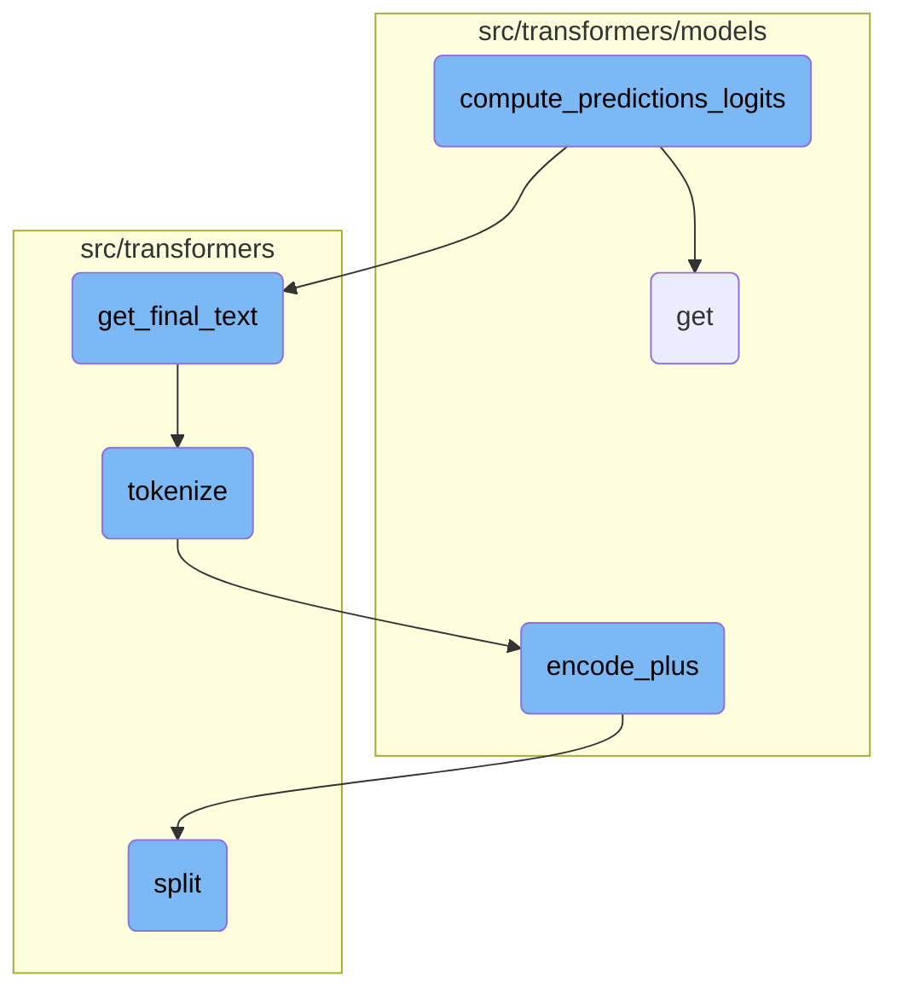
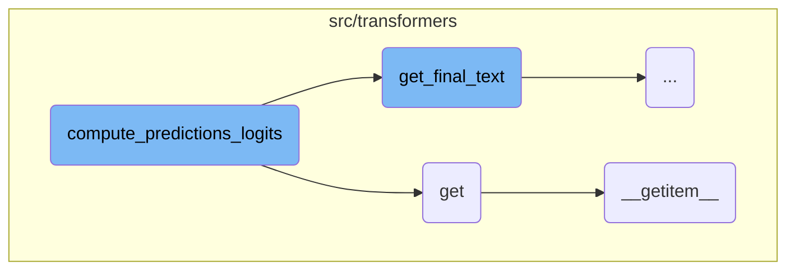

This document explains the process of generating final predictions from model logits. It covers the steps involved in processing logits, handling null predictions, and writing the results to output files. The document also includes a high-level diagram to illustrate the flow of the process.

The process starts with the <SwmToken path="src/transformers/data/metrics/squad_metrics.py" pos="383:2:2" line-data="def compute_predictions_logits(">`compute_predictions_logits`</SwmToken> function, which takes the raw outputs from a model and processes them to find the best possible answers. It handles cases where no answer is found and writes the results to output files. The function retrieves necessary attributes using the <SwmToken path="src/transformers/models/auto/auto_factory.py" pos="759:3:3" line-data="    def get(self, key, default):">`get`</SwmToken> function and aligns the tokenized predictions with the original text using the <SwmToken path="src/transformers/data/metrics/squad_metrics.py" pos="254:2:2" line-data="def get_final_text(pred_text, orig_text, do_lower_case, verbose_logging=False):">`get_final_text`</SwmToken> function. The text is then tokenized, encoded, and split based on specific word boundaries to ensure accurate predictions.

Here is a high level diagram of the flow, showing only the most important functions:



# Flow drill down

First, we'll zoom into this section of the flow:



<SwmSnippet path="/src/transformers/data/metrics/squad_metrics.py" line="383">

---

## Handling Predictions

The <SwmToken path="src/transformers/data/metrics/squad_metrics.py" pos="383:2:2" line-data="def compute_predictions_logits(">`compute_predictions_logits`</SwmToken> function is responsible for generating final predictions from model logits. It processes the logits to identify the best possible answers, handles null predictions, and writes the results to output files. This function is crucial for transforming raw model outputs into human-readable predictions.

```python
def compute_predictions_logits(
    all_examples,
    all_features,
    all_results,
    n_best_size,
    max_answer_length,
    do_lower_case,
    output_prediction_file,
    output_nbest_file,
    output_null_log_odds_file,
    verbose_logging,
    version_2_with_negative,
    null_score_diff_threshold,
    tokenizer,
):
    """Write final predictions to the json file and log-odds of null if needed."""
    if output_prediction_file:
        logger.info(f"Writing predictions to: {output_prediction_file}")
    if output_nbest_file:
        logger.info(f"Writing nbest to: {output_nbest_file}")
    if output_null_log_odds_file and version_2_with_negative:
```

---

</SwmSnippet>

<SwmSnippet path="/src/transformers/models/auto/auto_factory.py" line="759">

---

## Retrieving Model Attributes

The <SwmToken path="src/transformers/models/auto/auto_factory.py" pos="759:3:3" line-data="    def get(self, key, default):">`get`</SwmToken> function attempts to retrieve an item using the <SwmToken path="src/transformers/models/auto/auto_factory.py" pos="761:5:5" line-data="            return self.__getitem__(key)">`__getitem__`</SwmToken> method. If the key is not found, it returns a default value. This function is useful for safely accessing elements in a dictionary-like structure.

```python
    def get(self, key, default):
        try:
            return self.__getitem__(key)
        except KeyError:
            return default
```

---

</SwmSnippet>

<SwmSnippet path="/src/transformers/models/auto/auto_factory.py" line="729">

---

### Accessing Items

The <SwmToken path="src/transformers/models/auto/auto_factory.py" pos="729:3:3" line-data="    def __getitem__(self, key):">`__getitem__`</SwmToken> function is used to access items in a custom mapping. It first checks if the key exists in <SwmToken path="src/transformers/models/auto/auto_factory.py" pos="730:9:9" line-data="        if key in self._extra_content:">`_extra_content`</SwmToken>. If not, it attempts to find the corresponding model type and load the attribute from the module. This function is essential for dynamically retrieving model configurations and attributes.

```python
    def __getitem__(self, key):
        if key in self._extra_content:
            return self._extra_content[key]
        model_type = self._reverse_config_mapping[key.__name__]
        if model_type in self._model_mapping:
            model_name = self._model_mapping[model_type]
            return self._load_attr_from_module(model_type, model_name)

        # Maybe there was several model types associated with this config.
        model_types = [k for k, v in self._config_mapping.items() if v == key.__name__]
        for mtype in model_types:
            if mtype in self._model_mapping:
                model_name = self._model_mapping[mtype]
                return self._load_attr_from_module(mtype, model_name)
        raise KeyError(key)
```

---

</SwmSnippet>

Now, lets zoom into this section of the flow:

```mermaid
graph TD;
      subgraph src/transformers
04c5253127241ba2dd9a17d73b40743aa6cd6457e986d3504d2041b925471cf4(get_final_text):::mainFlowStyle --> cda0694bd07a1228066e2bda92be205936cf8383bf8705b861e77b0250a8e634(tokenize):::mainFlowStyle
end

subgraph src/transformers
cda0694bd07a1228066e2bda92be205936cf8383bf8705b861e77b0250a8e634(tokenize):::mainFlowStyle --> d8587c97c57da5dcd86c8dbb75b4efbc6e29f57a81cd51b68944fb853c16f832(encode_plus):::mainFlowStyle
end

subgraph src/transformers
d8587c97c57da5dcd86c8dbb75b4efbc6e29f57a81cd51b68944fb853c16f832(encode_plus):::mainFlowStyle --> c9c1dff04bd1b8c82ff19be78c12c3d12866ff54e597472d47c89d405af429e0(split):::mainFlowStyle
end


      classDef mainFlowStyle color:#000000,fill:#7CB9F4
classDef rootsStyle color:#000000,fill:#00FFF4
classDef Style1 color:#000000,fill:#00FFAA
classDef Style2 color:#000000,fill:#FFFF00
classDef Style3 color:#000000,fill:#AA7CB9

%% Swimm:
%% graph TD;
%%       subgraph <SwmPath>[src/transformers/](src/transformers/)</SwmPath>
%% 04c5253127241ba2dd9a17d73b40743aa6cd6457e986d3504d2041b925471cf4(get_final_text):::mainFlowStyle --> cda0694bd07a1228066e2bda92be205936cf8383bf8705b861e77b0250a8e634(tokenize):::mainFlowStyle
%% end
%% 
%% subgraph <SwmPath>[src/transformers/](src/transformers/)</SwmPath>
%% cda0694bd07a1228066e2bda92be205936cf8383bf8705b861e77b0250a8e634(tokenize):::mainFlowStyle --> d8587c97c57da5dcd86c8dbb75b4efbc6e29f57a81cd51b68944fb853c16f832(encode_plus):::mainFlowStyle
%% end
%% 
%% subgraph <SwmPath>[src/transformers/](src/transformers/)</SwmPath>
%% d8587c97c57da5dcd86c8dbb75b4efbc6e29f57a81cd51b68944fb853c16f832(encode_plus):::mainFlowStyle --> c9c1dff04bd1b8c82ff19be78c12c3d12866ff54e597472d47c89d405af429e0(split):::mainFlowStyle
%% end
%% 
%% 
%%       classDef mainFlowStyle color:#000000,fill:#7CB9F4
%% classDef rootsStyle color:#000000,fill:#00FFF4
%% classDef Style1 color:#000000,fill:#00FFAA
%% classDef Style2 color:#000000,fill:#FFFF00
%% classDef Style3 color:#000000,fill:#AA7CB9
```



<SwmSnippet path="/src/transformers/data/metrics/squad_metrics.py" line="254">

---

## Aligning tokenized predictions with original text

The <SwmToken path="src/transformers/data/metrics/squad_metrics.py" pos="254:2:2" line-data="def get_final_text(pred_text, orig_text, do_lower_case, verbose_logging=False):">`get_final_text`</SwmToken> function is responsible for aligning the tokenized prediction back to the original text. It uses a heuristic to map the predicted text to the original text by stripping spaces and aligning characters. This ensures that the final output text is a more accurate representation of the original text, even after tokenization and normalization.

```python
def get_final_text(pred_text, orig_text, do_lower_case, verbose_logging=False):
    """Project the tokenized prediction back to the original text."""

    # When we created the data, we kept track of the alignment between original
    # (whitespace tokenized) tokens and our WordPiece tokenized tokens. So
    # now `orig_text` contains the span of our original text corresponding to the
    # span that we predicted.
    #
    # However, `orig_text` may contain extra characters that we don't want in
    # our prediction.
    #
    # For example, let's say:
    #   pred_text = steve smith
    #   orig_text = Steve Smith's
    #
    # We don't want to return `orig_text` because it contains the extra "'s".
    #
    # We don't want to return `pred_text` because it's already been normalized
    # (the SQuAD eval script also does punctuation stripping/lower casing but
    # our tokenizer does additional normalization like stripping accent
    # characters).
```

---

</SwmSnippet>

<SwmSnippet path="/src/transformers/tokenization_utils_fast.py" line="415">

---

## Tokenizing text

The <SwmToken path="src/transformers/tokenization_utils_fast.py" pos="415:3:3" line-data="    def tokenize(self, text: str, pair: Optional[str] = None, add_special_tokens: bool = False, **kwargs) -&gt; List[str]:">`tokenize`</SwmToken> function converts the input text into tokens. It uses the <SwmToken path="src/transformers/tokenization_utils_fast.py" pos="416:5:5" line-data="        return self.encode_plus(text=text, text_pair=pair, add_special_tokens=add_special_tokens, **kwargs).tokens()">`encode_plus`</SwmToken> method to handle the tokenization process, including adding special tokens if required.

```python
    def tokenize(self, text: str, pair: Optional[str] = None, add_special_tokens: bool = False, **kwargs) -> List[str]:
        return self.encode_plus(text=text, text_pair=pair, add_special_tokens=add_special_tokens, **kwargs).tokens()
```

---

</SwmSnippet>

<SwmSnippet path="/src/transformers/models/code_llama/tokenization_code_llama_fast.py" line="311">

---

## Encoding text pairs

The <SwmToken path="src/transformers/models/code_llama/tokenization_code_llama_fast.py" pos="311:3:3" line-data="    def encode_plus(self, text, text_pair=None, suffix_first=False, add_special_tokens=True, **kwargs):">`encode_plus`</SwmToken> function handles the encoding of text pairs. It preprocesses the input text and text pairs, manages special tokens, and ensures that the input is correctly formatted for the model. This function is crucial for preparing the text data before tokenization.

```python
    def encode_plus(self, text, text_pair=None, suffix_first=False, add_special_tokens=True, **kwargs):
        # hack to make sure the input is pre-process but outside rust
        text_pair = kwargs.pop("suffix", text_pair)
        if self.fill_token is not None and self.fill_token in text and text_pair is None:
            text, text_pair = text.split(self.fill_token)

        if text_pair is None or len(text_pair) < 1:
            return super().encode_plus(text, text_pair, add_special_tokens=add_special_tokens, **kwargs)

        if None in (self.prefix_id, self.middle_id, self.suffix_id):
            raise ValueError(
                "Then input includes a `prefix` and a `suffix` used for the infilling task,"
                " the `prefix_id, middle_id, suffix_id` must all be initialized. Current"
                f" values : {self.prefix_id, self.middle_id, self.suffix_id}"
            )

        self.set_infilling_processor(False, suffix_first=suffix_first, add_special_tokens=add_special_tokens)
        tokens = super().encode_plus(" " + text, text_pair=text_pair, add_special_tokens=True, **kwargs)
        self.set_infilling_processor(True)
        return tokens
```

---

</SwmSnippet>

<SwmSnippet path="/src/transformers/tokenization_utils.py" line="106">

---

## Splitting text based on trie

The <SwmToken path="src/transformers/tokenization_utils.py" pos="106:3:3" line-data="    def split(self, text: str) -&gt; List[str]:">`split`</SwmToken> function splits the input text based on the words added to a trie. It matches the longest possible word first and splits the text along the boundaries of the words found. This function is useful for handling complex tokenization scenarios where specific word boundaries need to be respected.

````python
    def split(self, text: str) -> List[str]:
        """
        Will look for the words added to the trie within `text`. Output is the original string splitted along the
        boundaries of the words found.

        This trie will match the longest possible word first !

        Example:

        ```python
        >>> trie = Trie()
        >>> trie.split("[CLS] This is a extra_id_100")
        ["[CLS] This is a extra_id_100"]

        >>> trie.add("[CLS]")
        >>> trie.add("extra_id_1")
        >>> trie.add("extra_id_100")
        >>> trie.split("[CLS] This is a extra_id_100")
        ["[CLS]", " This is a ", "extra_id_100"]
        ```
        """
````

---

</SwmSnippet>

&nbsp;

*This is an auto-generated document by Swimm AI 🌊 and has not yet been verified by a human*

<SwmMeta version="3.0.0" repo-id="Z2l0aHViJTNBJTNBdHJhbnNmb3JtZXJzJTNBJTNBc2h1anV1dQ==" repo-name="transformers" doc-type="flows"><sup>Powered by [Swimm](/)</sup></SwmMeta>
