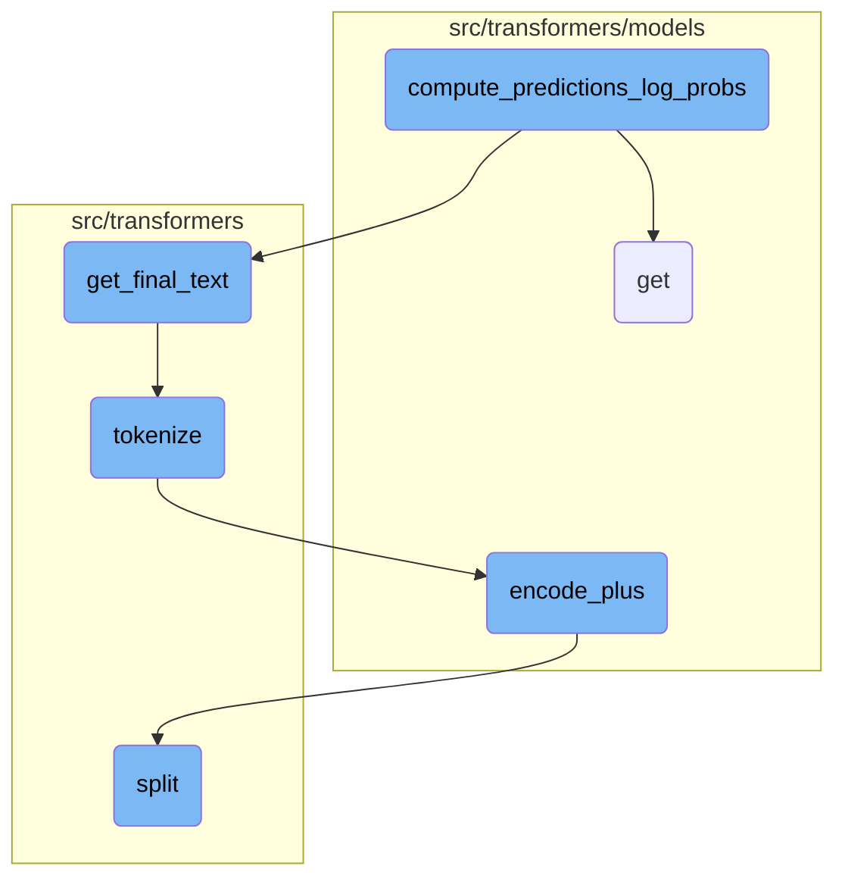
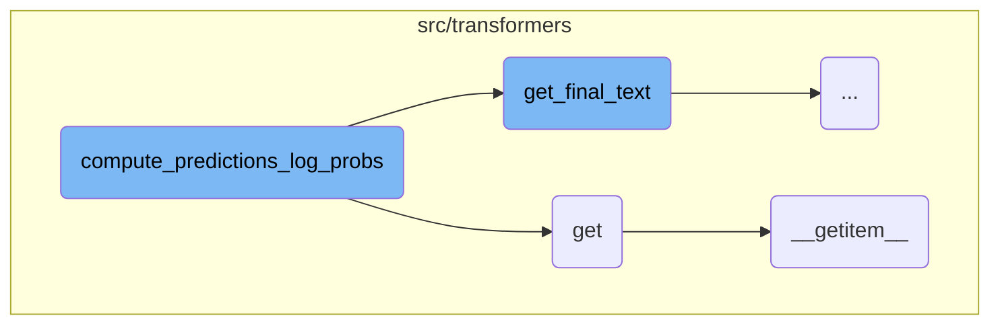

This document explains the process of generating predictions from model outputs. The process involves mapping example indices to features, generating preliminary predictions, filtering and sorting these predictions, and finally writing the best predictions to output files.

The flow starts by mapping example indices to features and unique <SwmToken path="src/transformers/tokenization_utils_fast.py" pos="319:12:12" line-data="            encoding_dict[&quot;input_ids&quot;].append(e.ids)">`ids`</SwmToken> to results. It then generates preliminary predictions based on start and end logits. These predictions are filtered and sorted to form the best predictions. Finally, the best predictions are written to output files.

Here is a high level diagram of the flow, showing only the most important functions:



# Flow drill down

First, we'll zoom into this section of the flow:



<SwmSnippet path="/src/transformers/data/metrics/squad_metrics.py" line="590">

---

## Generating Predictions

The function <SwmToken path="src/transformers/data/metrics/squad_metrics.py" pos="590:2:2" line-data="def compute_predictions_log_probs(">`compute_predictions_log_probs`</SwmToken> is responsible for generating predictions from model outputs. It processes the results by mapping example indices to features and unique <SwmToken path="src/transformers/tokenization_utils_fast.py" pos="319:12:12" line-data="            encoding_dict[&quot;input_ids&quot;].append(e.ids)">`ids`</SwmToken> to results. It then iterates over all examples, generating preliminary predictions based on start and end logits. These predictions are filtered and sorted to form the best predictions, which are then written to output files.

```python
def compute_predictions_log_probs(
    all_examples,
    all_features,
    all_results,
    n_best_size,
    max_answer_length,
    output_prediction_file,
    output_nbest_file,
    output_null_log_odds_file,
    start_n_top,
    end_n_top,
    version_2_with_negative,
    tokenizer,
    verbose_logging,
):
    """
    XLNet write prediction logic (more complex than Bert's). Write final predictions to the json file and log-odds of
    null if needed.

    Requires utils_squad_evaluate.py
    """
```

---

</SwmSnippet>

<SwmSnippet path="/src/transformers/models/auto/auto_factory.py" line="759">

---

## Handling Model Configurations

The function <SwmToken path="src/transformers/models/auto/auto_factory.py" pos="759:3:3" line-data="    def get(self, key, default):">`get`</SwmToken> retrieves a model configuration based on a key. If the key is not found, it returns a default value. This function relies on <SwmToken path="src/transformers/models/auto/auto_factory.py" pos="761:5:5" line-data="            return self.__getitem__(key)">`__getitem__`</SwmToken> to fetch the configuration.

```python
    def get(self, key, default):
        try:
            return self.__getitem__(key)
        except KeyError:
            return default
```

---

</SwmSnippet>

<SwmSnippet path="/src/transformers/models/auto/auto_factory.py" line="729">

---

### Fetching Configuration

The function <SwmToken path="src/transformers/models/auto/auto_factory.py" pos="729:3:3" line-data="    def __getitem__(self, key):">`__getitem__`</SwmToken> fetches a model configuration from internal mappings. It first checks if the key exists in <SwmToken path="src/transformers/models/auto/auto_factory.py" pos="730:9:9" line-data="        if key in self._extra_content:">`_extra_content`</SwmToken>. If not, it looks up the configuration mapping and model mapping to load the appropriate attribute from the module. If the key is not found, it raises a <SwmToken path="src/transformers/models/auto/auto_factory.py" pos="743:3:3" line-data="        raise KeyError(key)">`KeyError`</SwmToken>.

```python
    def __getitem__(self, key):
        if key in self._extra_content:
            return self._extra_content[key]
        model_type = self._reverse_config_mapping[key.__name__]
        if model_type in self._model_mapping:
            model_name = self._model_mapping[model_type]
            return self._load_attr_from_module(model_type, model_name)

        # Maybe there was several model types associated with this config.
        model_types = [k for k, v in self._config_mapping.items() if v == key.__name__]
        for mtype in model_types:
            if mtype in self._model_mapping:
                model_name = self._model_mapping[mtype]
                return self._load_attr_from_module(mtype, model_name)
        raise KeyError(key)
```

---

</SwmSnippet>

Now, lets zoom into this section of the flow:

```mermaid
graph TD;
      subgraph src/transformers
04c5253127241ba2dd9a17d73b40743aa6cd6457e986d3504d2041b925471cf4(get_final_text):::mainFlowStyle --> cda0694bd07a1228066e2bda92be205936cf8383bf8705b861e77b0250a8e634(tokenize):::mainFlowStyle
end

subgraph src/transformers
cda0694bd07a1228066e2bda92be205936cf8383bf8705b861e77b0250a8e634(tokenize):::mainFlowStyle --> d8587c97c57da5dcd86c8dbb75b4efbc6e29f57a81cd51b68944fb853c16f832(encode_plus):::mainFlowStyle
end

subgraph src/transformers
d8587c97c57da5dcd86c8dbb75b4efbc6e29f57a81cd51b68944fb853c16f832(encode_plus):::mainFlowStyle --> c9c1dff04bd1b8c82ff19be78c12c3d12866ff54e597472d47c89d405af429e0(split):::mainFlowStyle
end


      classDef mainFlowStyle color:#000000,fill:#7CB9F4
classDef rootsStyle color:#000000,fill:#00FFF4
classDef Style1 color:#000000,fill:#00FFAA
classDef Style2 color:#000000,fill:#FFFF00
classDef Style3 color:#000000,fill:#AA7CB9

%% Swimm:
%% graph TD;
%%       subgraph <SwmPath>[src/transformers/](src/transformers/)</SwmPath>
%% 04c5253127241ba2dd9a17d73b40743aa6cd6457e986d3504d2041b925471cf4(get_final_text):::mainFlowStyle --> cda0694bd07a1228066e2bda92be205936cf8383bf8705b861e77b0250a8e634(tokenize):::mainFlowStyle
%% end
%% 
%% subgraph <SwmPath>[src/transformers/](src/transformers/)</SwmPath>
%% cda0694bd07a1228066e2bda92be205936cf8383bf8705b861e77b0250a8e634(tokenize):::mainFlowStyle --> d8587c97c57da5dcd86c8dbb75b4efbc6e29f57a81cd51b68944fb853c16f832(encode_plus):::mainFlowStyle
%% end
%% 
%% subgraph <SwmPath>[src/transformers/](src/transformers/)</SwmPath>
%% d8587c97c57da5dcd86c8dbb75b4efbc6e29f57a81cd51b68944fb853c16f832(encode_plus):::mainFlowStyle --> c9c1dff04bd1b8c82ff19be78c12c3d12866ff54e597472d47c89d405af429e0(split):::mainFlowStyle
%% end
%% 
%% 
%%       classDef mainFlowStyle color:#000000,fill:#7CB9F4
%% classDef rootsStyle color:#000000,fill:#00FFF4
%% classDef Style1 color:#000000,fill:#00FFAA
%% classDef Style2 color:#000000,fill:#FFFF00
%% classDef Style3 color:#000000,fill:#AA7CB9
```



<SwmSnippet path="/src/transformers/data/metrics/squad_metrics.py" line="257">

---

## Aligning tokenized predictions with original text

The function <SwmToken path="src/transformers/data/metrics/squad_metrics.py" pos="254:2:2" line-data="def get_final_text(pred_text, orig_text, do_lower_case, verbose_logging=False):">`get_final_text`</SwmToken> aligns the tokenized prediction back to the original text. This involves handling discrepancies between the tokenized and original text, such as extra characters in the original text that should not appear in the prediction.

```python
    # When we created the data, we kept track of the alignment between original
    # (whitespace tokenized) tokens and our WordPiece tokenized tokens. So
    # now `orig_text` contains the span of our original text corresponding to the
    # span that we predicted.
    #
    # However, `orig_text` may contain extra characters that we don't want in
    # our prediction.
    #
    # For example, let's say:
    #   pred_text = steve smith
    #   orig_text = Steve Smith's
    #
    # We don't want to return `orig_text` because it contains the extra "'s".
    #
    # We don't want to return `pred_text` because it's already been normalized
    # (the SQuAD eval script also does punctuation stripping/lower casing but
    # our tokenizer does additional normalization like stripping accent
    # characters).
    #
    # What we really want to return is "Steve Smith".
    #
```

---

</SwmSnippet>

<SwmSnippet path="/src/transformers/data/metrics/squad_metrics.py" line="297">

---

### Tokenizing original text

The original text is tokenized using <SwmToken path="src/transformers/data/metrics/squad_metrics.py" pos="297:5:5" line-data="    tokenizer = BasicTokenizer(do_lower_case=do_lower_case)">`BasicTokenizer`</SwmToken>, and whitespace is stripped from both the tokenized and predicted text to ensure they are of the same length.

```python
    tokenizer = BasicTokenizer(do_lower_case=do_lower_case)

    tok_text = " ".join(tokenizer.tokenize(orig_text))

```

---

</SwmSnippet>

<SwmSnippet path="/src/transformers/data/metrics/squad_metrics.py" line="308">

---

### Mapping token positions

The function creates mappings between non-space characters in the original and tokenized texts. These mappings are used to project the start and end positions of the tokenized prediction back to the original text.

```python
    (orig_ns_text, orig_ns_to_s_map) = _strip_spaces(orig_text)
    (tok_ns_text, tok_ns_to_s_map) = _strip_spaces(tok_text)

    if len(orig_ns_text) != len(tok_ns_text):
        if verbose_logging:
            logger.info(f"Length not equal after stripping spaces: '{orig_ns_text}' vs '{tok_ns_text}'")
        return orig_text

    # We then project the characters in `pred_text` back to `orig_text` using
    # the character-to-character alignment.
    tok_s_to_ns_map = {}
    for i, tok_index in tok_ns_to_s_map.items():
        tok_s_to_ns_map[tok_index] = i

```

---

</SwmSnippet>

<SwmSnippet path="/src/transformers/data/metrics/squad_metrics.py" line="333">

---

### Extracting final text

The start and end positions in the original text are determined using the mappings. The final text is then extracted from the original text based on these positions.

```python
    orig_end_position = None
    if end_position in tok_s_to_ns_map:
        ns_end_position = tok_s_to_ns_map[end_position]
        if ns_end_position in orig_ns_to_s_map:
            orig_end_position = orig_ns_to_s_map[ns_end_position]

    if orig_end_position is None:
        if verbose_logging:
            logger.info("Couldn't map end position")
        return orig_text

    output_text = orig_text[orig_start_position : (orig_end_position + 1)]
    return output_text
```

---

</SwmSnippet>

<SwmSnippet path="/src/transformers/tokenization_utils_fast.py" line="415">

---

## Tokenizing text

The <SwmToken path="src/transformers/tokenization_utils_fast.py" pos="415:3:3" line-data="    def tokenize(self, text: str, pair: Optional[str] = None, add_special_tokens: bool = False, **kwargs) -&gt; List[str]:">`tokenize`</SwmToken> function converts the input text into a list of tokens. It uses the <SwmToken path="src/transformers/tokenization_utils_fast.py" pos="416:5:5" line-data="        return self.encode_plus(text=text, text_pair=pair, add_special_tokens=add_special_tokens, **kwargs).tokens()">`encode_plus`</SwmToken> method to handle the tokenization process.

```python
    def tokenize(self, text: str, pair: Optional[str] = None, add_special_tokens: bool = False, **kwargs) -> List[str]:
        return self.encode_plus(text=text, text_pair=pair, add_special_tokens=add_special_tokens, **kwargs).tokens()
```

---

</SwmSnippet>

<SwmSnippet path="/src/transformers/models/code_llama/tokenization_code_llama_fast.py" line="311">

---

## Encoding text pairs

The <SwmToken path="src/transformers/models/code_llama/tokenization_code_llama_fast.py" pos="311:3:3" line-data="    def encode_plus(self, text, text_pair=None, suffix_first=False, add_special_tokens=True, **kwargs):">`encode_plus`</SwmToken> function processes text pairs, handling special tokens and ensuring the input is pre-processed correctly. It supports tasks like infilling by managing prefixes and suffixes.

```python
    def encode_plus(self, text, text_pair=None, suffix_first=False, add_special_tokens=True, **kwargs):
        # hack to make sure the input is pre-process but outside rust
        text_pair = kwargs.pop("suffix", text_pair)
        if self.fill_token is not None and self.fill_token in text and text_pair is None:
            text, text_pair = text.split(self.fill_token)

        if text_pair is None or len(text_pair) < 1:
            return super().encode_plus(text, text_pair, add_special_tokens=add_special_tokens, **kwargs)

        if None in (self.prefix_id, self.middle_id, self.suffix_id):
            raise ValueError(
                "Then input includes a `prefix` and a `suffix` used for the infilling task,"
                " the `prefix_id, middle_id, suffix_id` must all be initialized. Current"
                f" values : {self.prefix_id, self.middle_id, self.suffix_id}"
            )

        self.set_infilling_processor(False, suffix_first=suffix_first, add_special_tokens=add_special_tokens)
        tokens = super().encode_plus(" " + text, text_pair=text_pair, add_special_tokens=True, **kwargs)
        self.set_infilling_processor(True)
        return tokens
```

---

</SwmSnippet>

<SwmSnippet path="/src/transformers/tokenization_utils.py" line="106">

---

## Splitting text

The <SwmToken path="src/transformers/tokenization_utils.py" pos="106:3:3" line-data="    def split(self, text: str) -&gt; List[str]:">`split`</SwmToken> function divides the input text based on specific boundaries, such as special tokens. It uses a trie data structure to match and split the text efficiently.

````python
    def split(self, text: str) -> List[str]:
        """
        Will look for the words added to the trie within `text`. Output is the original string splitted along the
        boundaries of the words found.

        This trie will match the longest possible word first !

        Example:

        ```python
        >>> trie = Trie()
        >>> trie.split("[CLS] This is a extra_id_100")
        ["[CLS] This is a extra_id_100"]

        >>> trie.add("[CLS]")
        >>> trie.add("extra_id_1")
        >>> trie.add("extra_id_100")
        >>> trie.split("[CLS] This is a extra_id_100")
        ["[CLS]", " This is a ", "extra_id_100"]
        ```
````

---

</SwmSnippet>

&nbsp;

*This is an auto-generated document by Swimm AI 🌊 and has not yet been verified by a human*

<SwmMeta version="3.0.0" repo-id="Z2l0aHViJTNBJTNBdHJhbnNmb3JtZXJzJTNBJTNBc2h1anV1dQ==" repo-name="transformers" doc-type="flows"><sup>Powered by [Swimm](/)</sup></SwmMeta>
