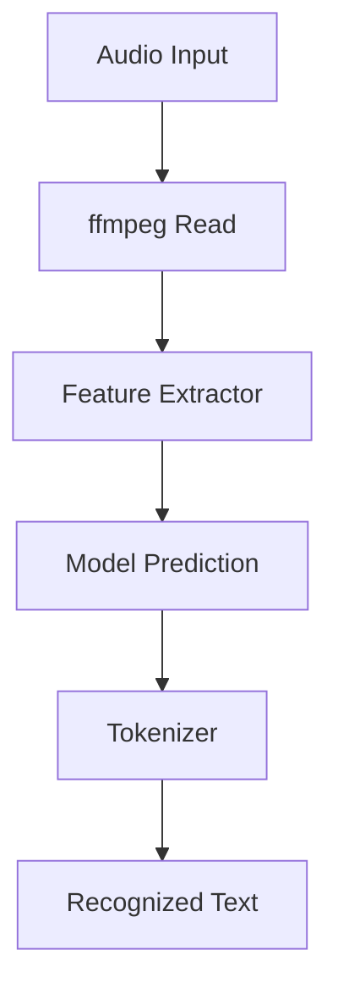
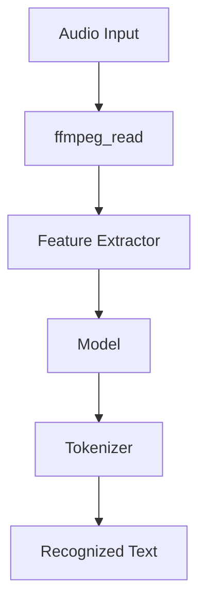

Speech Recognition in Pipelines refers to the process of converting spoken language into written text using machine learning models.

The <SwmToken path="src/transformers/pipelines/automatic_speech_recognition.py" pos="65:2:2" line-data="class AutomaticSpeechRecognitionPipeline(Pipeline):">`AutomaticSpeechRecognitionPipeline`</SwmToken> class is designed to handle this task by taking audio input and producing the corresponding text output.

The input to the pipeline can be a raw waveform, an audio file, or bytes representing the content of an audio file.

If the input is an audio file, the <SwmToken path="src/transformers/pipelines/automatic_speech_recognition.py" pos="31:17:17" line-data="    Helper function to read an audio file through ffmpeg.">`ffmpeg`</SwmToken> tool is used to read and process the audio data.

The processed audio data is then passed through a feature extractor to encode the waveform for the model.

The model, which can be a pretrained model from the <SwmToken path="src/transformers/pipelines/automatic_speech_recognition.py" pos="110:24:24" line-data="        Classify the sequence(s) given as inputs. See the :obj:`~transformers.AutomaticSpeechRecognitionPipeline`">`transformers`</SwmToken> library, makes predictions based on the encoded data.

The tokenizer decodes the model's output into a human-readable text format.

The final output is a dictionary containing the recognized text.



<SwmSnippet path="/src/transformers/pipelines/automatic_speech_recognition.py" line="65">

---

# <SwmToken path="src/transformers/pipelines/automatic_speech_recognition.py" pos="65:2:2" line-data="class AutomaticSpeechRecognitionPipeline(Pipeline):">`AutomaticSpeechRecognitionPipeline`</SwmToken> Class

The <SwmToken path="src/transformers/pipelines/automatic_speech_recognition.py" pos="65:2:2" line-data="class AutomaticSpeechRecognitionPipeline(Pipeline):">`AutomaticSpeechRecognitionPipeline`</SwmToken> class is designed to extract spoken text from audio input. It supports both raw waveforms and audio files, utilizing <SwmToken path="src/transformers/pipelines/automatic_speech_recognition.py" pos="69:39:39" line-data="    The input can be either a raw waveform or a audio file. In case of the audio file, ffmpeg should be installed for">`ffmpeg`</SwmToken> for audio file processing.

```python
class AutomaticSpeechRecognitionPipeline(Pipeline):
    """
    Pipeline that aims at extracting spoken text contained within some audio.

    The input can be either a raw waveform or a audio file. In case of the audio file, ffmpeg should be installed for
    to support multiple audio formats
    """
```

---

</SwmSnippet>

<SwmSnippet path="/src/transformers/pipelines/automatic_speech_recognition.py" line="104">

---

The <SwmToken path="src/transformers/pipelines/automatic_speech_recognition.py" pos="104:3:3" line-data="    def __call__(">`__call__`</SwmToken> method processes the input, which can be a raw waveform, bytes, or a filename. It uses <SwmToken path="src/transformers/pipelines/automatic_speech_recognition.py" pos="29:2:2" line-data="def ffmpeg_read(bpayload: bytes, sampling_rate: int) -&gt; np.array:">`ffmpeg_read`</SwmToken> to handle audio files and passes the processed data through the feature extractor and model to generate the recognized text.

```python
    def __call__(
        self,
        inputs: Union[np.ndarray, bytes, str],
        **kwargs,
    ):
        """
        Classify the sequence(s) given as inputs. See the :obj:`~transformers.AutomaticSpeechRecognitionPipeline`
        documentation for more information.

        Args:
            inputs (:obj:`np.ndarray` or :obj:`bytes` or :obj:`str`):
                The inputs is either a raw waveform (:obj:`np.ndarray` of shape (n, ) of type :obj:`np.float32` or
                :obj:`np.float64`) at the correct sampling rate (no further check will be done) or a :obj:`str` that is
                the filename of the audio file, the file will be read at the correct sampling rate to get the waveform
                using `ffmpeg`. This requires `ffmpeg` to be installed on the system. If `inputs` is :obj:`bytes` it is
                supposed to be the content of an audio file and is interpreted by `ffmpeg` in the same way.

        Return:
            A :obj:`dict` with the following keys:

            - **text** (:obj:`str`) -- The recognized text.
```

---

</SwmSnippet>

<SwmSnippet path="/src/transformers/pipelines/automatic_speech_recognition.py" line="29">

---

The <SwmToken path="src/transformers/pipelines/automatic_speech_recognition.py" pos="29:2:2" line-data="def ffmpeg_read(bpayload: bytes, sampling_rate: int) -&gt; np.array:">`ffmpeg_read`</SwmToken> function reads and processes audio files using <SwmToken path="src/transformers/pipelines/automatic_speech_recognition.py" pos="31:17:17" line-data="    Helper function to read an audio file through ffmpeg.">`ffmpeg`</SwmToken>, converting them into a format suitable for the model.

```python
def ffmpeg_read(bpayload: bytes, sampling_rate: int) -> np.array:
    """
    Helper function to read an audio file through ffmpeg.
    """
    ar = f"{sampling_rate}"
    ac = "1"
    format_for_conversion = "f32le"
    ffmpeg_command = [
        "ffmpeg",
        "-i",
        "pipe:0",
        "-ac",
        ac,
        "-ar",
        ar,
        "-f",
        format_for_conversion,
        "-hide_banner",
        "-loglevel",
        "quiet",
        "pipe:1",
```

---

</SwmSnippet>



# Main functions

There are several main functions in this folder. Some of them are <SwmToken path="src/transformers/pipelines/automatic_speech_recognition.py" pos="29:2:2" line-data="def ffmpeg_read(bpayload: bytes, sampling_rate: int) -&gt; np.array:">`ffmpeg_read`</SwmToken>, **init**, and **call**. We will dive a little into <SwmToken path="src/transformers/pipelines/automatic_speech_recognition.py" pos="29:2:2" line-data="def ffmpeg_read(bpayload: bytes, sampling_rate: int) -&gt; np.array:">`ffmpeg_read`</SwmToken> and **call**.

<SwmSnippet path="/src/transformers/pipelines/automatic_speech_recognition.py" line="29">

---

## <SwmToken path="src/transformers/pipelines/automatic_speech_recognition.py" pos="29:2:2" line-data="def ffmpeg_read(bpayload: bytes, sampling_rate: int) -&gt; np.array:">`ffmpeg_read`</SwmToken>

The <SwmToken path="src/transformers/pipelines/automatic_speech_recognition.py" pos="29:2:2" line-data="def ffmpeg_read(bpayload: bytes, sampling_rate: int) -&gt; np.array:">`ffmpeg_read`</SwmToken> function is a helper function to read an audio file through ffmpeg. It takes a byte payload and a sampling rate as inputs and returns a numpy array representing the audio data. This function is essential for processing audio files in various formats and converting them into a format that can be used by the speech recognition model.

```python
def ffmpeg_read(bpayload: bytes, sampling_rate: int) -> np.array:
    """
    Helper function to read an audio file through ffmpeg.
    """
    ar = f"{sampling_rate}"
    ac = "1"
    format_for_conversion = "f32le"
    ffmpeg_command = [
        "ffmpeg",
        "-i",
        "pipe:0",
        "-ac",
        ac,
        "-ar",
        ar,
        "-f",
        format_for_conversion,
        "-hide_banner",
        "-loglevel",
        "quiet",
        "pipe:1",
```

---

</SwmSnippet>

<SwmSnippet path="/src/transformers/pipelines/automatic_speech_recognition.py" line="104">

---

## **call**

The <SwmToken path="src/transformers/pipelines/automatic_speech_recognition.py" pos="104:3:3" line-data="    def __call__(">`__call__`</SwmToken> function is the main entry point for the <SwmToken path="src/transformers/pipelines/automatic_speech_recognition.py" pos="110:26:26" line-data="        Classify the sequence(s) given as inputs. See the :obj:`~transformers.AutomaticSpeechRecognitionPipeline`">`AutomaticSpeechRecognitionPipeline`</SwmToken> class. It takes inputs in the form of a raw waveform, bytes, or a file path and processes them to produce recognized text. The function handles reading the audio file using <SwmToken path="src/transformers/pipelines/automatic_speech_recognition.py" pos="29:2:2" line-data="def ffmpeg_read(bpayload: bytes, sampling_rate: int) -&gt; np.array:">`ffmpeg_read`</SwmToken>, extracting features using the feature extractor, and making predictions using the model. The final output is a dictionary containing the recognized text.

```python
    def __call__(
        self,
        inputs: Union[np.ndarray, bytes, str],
        **kwargs,
    ):
        """
        Classify the sequence(s) given as inputs. See the :obj:`~transformers.AutomaticSpeechRecognitionPipeline`
        documentation for more information.

        Args:
            inputs (:obj:`np.ndarray` or :obj:`bytes` or :obj:`str`):
                The inputs is either a raw waveform (:obj:`np.ndarray` of shape (n, ) of type :obj:`np.float32` or
                :obj:`np.float64`) at the correct sampling rate (no further check will be done) or a :obj:`str` that is
                the filename of the audio file, the file will be read at the correct sampling rate to get the waveform
                using `ffmpeg`. This requires `ffmpeg` to be installed on the system. If `inputs` is :obj:`bytes` it is
                supposed to be the content of an audio file and is interpreted by `ffmpeg` in the same way.

        Return:
            A :obj:`dict` with the following keys:

            - **text** (:obj:`str`) -- The recognized text.
```

---

</SwmSnippet>

&nbsp;

*This is an auto-generated document by Swimm AI 🌊 and has not yet been verified by a human*

<SwmMeta version="3.0.0" repo-id="Z2l0aHViJTNBJTNBdHJhbnNmb3JtZXJzJTNBJTNBc2h1anV1dQ==" repo-name="transformers"><sup>Powered by [Swimm](/)</sup></SwmMeta>
