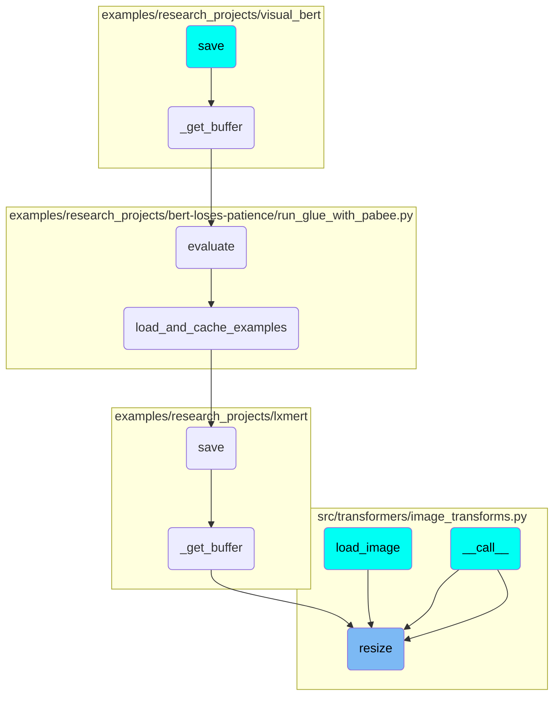

This document explains the process of resizing images. The resizing process involves several steps to ensure the image maintains its quality and format. The steps include converting the image to a PIL format, rescaling the image, adjusting the channel dimensions, and transposing the array if necessary.

The resizing process starts by converting the image to a PIL format, which is a standard format for image processing. Next, the image is rescaled to ensure the pixel values are within the expected range. After rescaling, the channel dimensions of the image are adjusted to maintain consistency. Finally, the image array is transposed to match the required format. This entire process ensures that the image is resized correctly while maintaining its quality and format.

# Flow drill down

```mermaid
graph TD;
      subgraph src/transformers
64855902adc5e3fa89f0cfbb9013ac58a13c6f8a0e06e8149835a31f281bff1c(resize):::mainFlowStyle --> ce64f856e7121d674dd5d3a3a56a6dbefeb51e13200628a0973bc79da06ef85a(to_pil_image):::mainFlowStyle
end

subgraph src/transformers
ce64f856e7121d674dd5d3a3a56a6dbefeb51e13200628a0973bc79da06ef85a(to_pil_image):::mainFlowStyle --> 98fdd77f6f7c06a834defd9575ec7d21dd3243b6e9c32e83f72576cd634d70df(rescale):::mainFlowStyle
end

subgraph src/transformers
98fdd77f6f7c06a834defd9575ec7d21dd3243b6e9c32e83f72576cd634d70df(rescale):::mainFlowStyle --> 94f65867bc565c39eaab9b172da1c955943f3aff021068ef306397283a5d5c19(to_channel_dimension_format):::mainFlowStyle
end

subgraph src/transformers
94f65867bc565c39eaab9b172da1c955943f3aff021068ef306397283a5d5c19(to_channel_dimension_format):::mainFlowStyle --> c60dac41a3d232784a996688a048caaed35ac4bc3c692dc04f954fd95cc4f85e(transpose):::mainFlowStyle
end


      classDef mainFlowStyle color:#000000,fill:#7CB9F4
classDef rootsStyle color:#000000,fill:#00FFF4
classDef Style1 color:#000000,fill:#00FFAA
classDef Style2 color:#000000,fill:#FFFF00
classDef Style3 color:#000000,fill:#AA7CB9

%% Swimm:
%% graph TD;
%%       subgraph <SwmPath>[src/transformers/](src/transformers/)</SwmPath>
%% 64855902adc5e3fa89f0cfbb9013ac58a13c6f8a0e06e8149835a31f281bff1c(resize):::mainFlowStyle --> ce64f856e7121d674dd5d3a3a56a6dbefeb51e13200628a0973bc79da06ef85a(to_pil_image):::mainFlowStyle
%% end
%% 
%% subgraph <SwmPath>[src/transformers/](src/transformers/)</SwmPath>
%% ce64f856e7121d674dd5d3a3a56a6dbefeb51e13200628a0973bc79da06ef85a(to_pil_image):::mainFlowStyle --> 98fdd77f6f7c06a834defd9575ec7d21dd3243b6e9c32e83f72576cd634d70df(rescale):::mainFlowStyle
%% end
%% 
%% subgraph <SwmPath>[src/transformers/](src/transformers/)</SwmPath>
%% 98fdd77f6f7c06a834defd9575ec7d21dd3243b6e9c32e83f72576cd634d70df(rescale):::mainFlowStyle --> 94f65867bc565c39eaab9b172da1c955943f3aff021068ef306397283a5d5c19(to_channel_dimension_format):::mainFlowStyle
%% end
%% 
%% subgraph <SwmPath>[src/transformers/](src/transformers/)</SwmPath>
%% 94f65867bc565c39eaab9b172da1c955943f3aff021068ef306397283a5d5c19(to_channel_dimension_format):::mainFlowStyle --> c60dac41a3d232784a996688a048caaed35ac4bc3c692dc04f954fd95cc4f85e(transpose):::mainFlowStyle
%% end
%% 
%% 
%%       classDef mainFlowStyle color:#000000,fill:#7CB9F4
%% classDef rootsStyle color:#000000,fill:#00FFF4
%% classDef Style1 color:#000000,fill:#00FFAA
%% classDef Style2 color:#000000,fill:#FFFF00
%% classDef Style3 color:#000000,fill:#AA7CB9
```



<SwmSnippet path="/src/transformers/image_transforms.py" line="281">

---

## Image Resizing

The <SwmToken path="src/transformers/image_transforms.py" pos="281:2:2" line-data="def resize(">`resize`</SwmToken> function is responsible for resizing an image to the specified dimensions using the PIL library. It ensures that the image maintains the same data format as the input image unless otherwise specified. The function also handles rescaling the image if necessary and converting it back to a numpy array if required.

```python
def resize(
    image: np.ndarray,
    size: Tuple[int, int],
    resample: "PILImageResampling" = None,
    reducing_gap: Optional[int] = None,
    data_format: Optional[ChannelDimension] = None,
    return_numpy: bool = True,
    input_data_format: Optional[Union[str, ChannelDimension]] = None,
) -> np.ndarray:
    """
    Resizes `image` to `(height, width)` specified by `size` using the PIL library.

    Args:
        image (`np.ndarray`):
            The image to resize.
        size (`Tuple[int, int]`):
            The size to use for resizing the image.
        resample (`int`, *optional*, defaults to `PILImageResampling.BILINEAR`):
            The filter to user for resampling.
        reducing_gap (`int`, *optional*):
            Apply optimization by resizing the image in two steps. The bigger `reducing_gap`, the closer the result to
```

---

</SwmSnippet>

<SwmSnippet path="/src/transformers/image_transforms.py" line="162">

---

## Conversion to PIL Image

The <SwmToken path="src/transformers/image_transforms.py" pos="162:2:2" line-data="def to_pil_image(">`to_pil_image`</SwmToken> function converts various image formats (numpy arrays, torch tensors, etc.) to a PIL Image. It optionally rescales the image and adjusts the channel dimension to be the last axis if needed. This conversion is crucial for the resizing process as PIL operations are performed on PIL Images.

```python
def to_pil_image(
    image: Union[np.ndarray, "PIL.Image.Image", "torch.Tensor", "tf.Tensor", "jnp.ndarray"],
    do_rescale: Optional[bool] = None,
    input_data_format: Optional[Union[str, ChannelDimension]] = None,
) -> "PIL.Image.Image":
    """
    Converts `image` to a PIL Image. Optionally rescales it and puts the channel dimension back as the last axis if
    needed.

    Args:
        image (`PIL.Image.Image` or `numpy.ndarray` or `torch.Tensor` or `tf.Tensor`):
            The image to convert to the `PIL.Image` format.
        do_rescale (`bool`, *optional*):
            Whether or not to apply the scaling factor (to make pixel values integers between 0 and 255). Will default
            to `True` if the image type is a floating type and casting to `int` would result in a loss of precision,
            and `False` otherwise.
        input_data_format (`ChannelDimension`, *optional*):
            The channel dimension format of the input image. If unset, will use the inferred format from the input.

    Returns:
        `PIL.Image.Image`: The converted image.
```

---

</SwmSnippet>

<SwmSnippet path="/src/transformers/image_transforms.py" line="97">

---

## Image Rescaling

The <SwmToken path="src/transformers/image_transforms.py" pos="97:2:2" line-data="def rescale(">`rescale`</SwmToken> function rescales an image by a given scale factor. This is particularly useful when converting images to and from PIL format, ensuring that pixel values are within the expected range.

```python
def rescale(
    image: np.ndarray,
    scale: float,
    data_format: Optional[ChannelDimension] = None,
    dtype: np.dtype = np.float32,
    input_data_format: Optional[Union[str, ChannelDimension]] = None,
) -> np.ndarray:
    """
    Rescales `image` by `scale`.

    Args:
        image (`np.ndarray`):
            The image to rescale.
        scale (`float`):
            The scale to use for rescaling the image.
        data_format (`ChannelDimension`, *optional*):
            The channel dimension format of the image. If not provided, it will be the same as the input image.
        dtype (`np.dtype`, *optional*, defaults to `np.float32`):
            The dtype of the output image. Defaults to `np.float32`. Used for backwards compatibility with feature
            extractors.
        input_data_format (`ChannelDimension`, *optional*):
```

---

</SwmSnippet>

<SwmSnippet path="/src/transformers/image_transforms.py" line="58">

---

## Channel Dimension Formatting

The <SwmToken path="src/transformers/image_transforms.py" pos="58:2:2" line-data="def to_channel_dimension_format(">`to_channel_dimension_format`</SwmToken> function adjusts the channel dimension of an image to the specified format. This ensures compatibility with different image processing libraries and maintains consistency in data format throughout the processing pipeline.

```python
def to_channel_dimension_format(
    image: np.ndarray,
    channel_dim: Union[ChannelDimension, str],
    input_channel_dim: Optional[Union[ChannelDimension, str]] = None,
) -> np.ndarray:
    """
    Converts `image` to the channel dimension format specified by `channel_dim`.

    Args:
        image (`numpy.ndarray`):
            The image to have its channel dimension set.
        channel_dim (`ChannelDimension`):
            The channel dimension format to use.
        input_channel_dim (`ChannelDimension`, *optional*):
            The channel dimension format of the input image. If not provided, it will be inferred from the input image.

    Returns:
        `np.ndarray`: The image with the channel dimension set to `channel_dim`.
    """
    if not isinstance(image, np.ndarray):
        raise TypeError(f"Input image must be of type np.ndarray, got {type(image)}")
```

---

</SwmSnippet>

<SwmSnippet path="/src/transformers/utils/generic.py" line="610">

---

## Transposing Arrays

The <SwmToken path="src/transformers/utils/generic.py" pos="610:2:2" line-data="def transpose(array, axes=None):">`transpose`</SwmToken> function provides a <SwmToken path="src/transformers/utils/generic.py" pos="612:1:3" line-data="    Framework-agnostic version of `numpy.transpose` that will work on torch/TensorFlow/Jax tensors as well as NumPy">`Framework-agnostic`</SwmToken> way to transpose arrays, supporting numpy, torch, <SwmToken path="src/transformers/utils/generic.py" pos="612:25:25" line-data="    Framework-agnostic version of `numpy.transpose` that will work on torch/TensorFlow/Jax tensors as well as NumPy">`TensorFlow`</SwmToken>, and JAX tensors. This utility is essential for manipulating image data in various formats.

```python
def transpose(array, axes=None):
    """
    Framework-agnostic version of `numpy.transpose` that will work on torch/TensorFlow/Jax tensors as well as NumPy
    arrays.
    """
    if is_numpy_array(array):
        return np.transpose(array, axes=axes)
    elif is_torch_tensor(array):
        return array.T if axes is None else array.permute(*axes)
    elif is_tf_tensor(array):
        import tensorflow as tf

        return tf.transpose(array, perm=axes)
    elif is_jax_tensor(array):
        import jax.numpy as jnp

        return jnp.transpose(array, axes=axes)
    else:
        raise ValueError(f"Type not supported for transpose: {type(array)}.")
```

---

</SwmSnippet>

# Where is this flow used?

This flow is used multiple times in the codebase as represented in the following diagram:



&nbsp;

*This is an auto-generated document by Swimm AI 🌊 and has not yet been verified by a human*

<SwmMeta version="3.0.0" repo-id="Z2l0aHViJTNBJTNBdHJhbnNmb3JtZXJzJTNBJTNBc2h1anV1dQ==" repo-name="transformers" doc-type="flows"><sup>Powered by [Swimm](/)</sup></SwmMeta>
