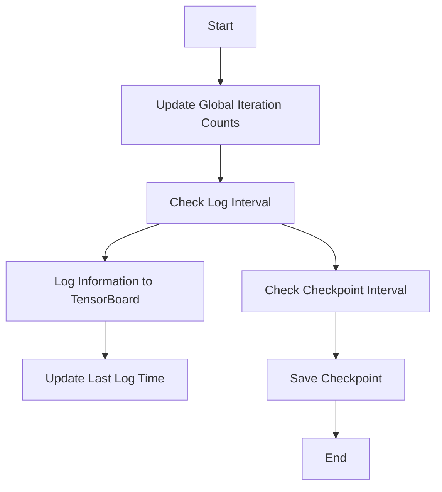

This document will cover the purpose and functionality of the iter function. We'll cover:

1. Updating global iteration counts
2. Logging information to TensorBoard
3. Saving checkpoints at specified intervals.

Technical document: <SwmLink doc-title="Understanding the iter Function">[Understanding the iter Function](/.swm/understanding-the-iter-function.gso16sju.sw.md)</SwmLink>

# Updating Global Iteration Counts

The iter function begins by updating the global iteration counts. This is essential for tracking the progress of the model training process. Each iteration represents a single pass through a batch of data, and keeping track of these counts helps in monitoring the training progress and performance.

# Logging Information to TensorBoard

After updating the iteration counts, the function checks if the total number of iterations has reached a specified interval for logging information. If this condition is met, it logs the necessary information to TensorBoard. TensorBoard is a visualization tool that helps in understanding the training process by providing insights into metrics like loss, accuracy, and other performance indicators. Logging this information at regular intervals allows users to monitor the training process in real-time and make informed decisions.

# Saving Checkpoints at Specified Intervals

The iter function also checks if the total number of iterations has reached a specified interval for saving checkpoints. Checkpoints are snapshots of the model's state at a particular point in time. Saving checkpoints is crucial for several reasons:

1. **Recovery**: In case of interruptions or failures, the training process can be resumed from the last saved checkpoint, avoiding the need to start from scratch.
2. **Experimentation**: Users can experiment with different training parameters and revert to previous states if needed.
3. **Deployment**: Checkpoints can be used to deploy the model at various stages of training. When the checkpoint interval condition is met, the function triggers the saving of the current state of the model, ensuring that the training progress is preserved.

&nbsp;

*This is an auto-generated document by Swimm AI 🌊 and has not yet been verified by a human*

<SwmMeta version="3.0.0" repo-id="Z2l0aHViJTNBJTNBdHJhbnNmb3JtZXJzJTNBJTNBc2h1anV1dQ==" repo-name="transformers">Powered by [Swimm](/)</SwmMeta>
