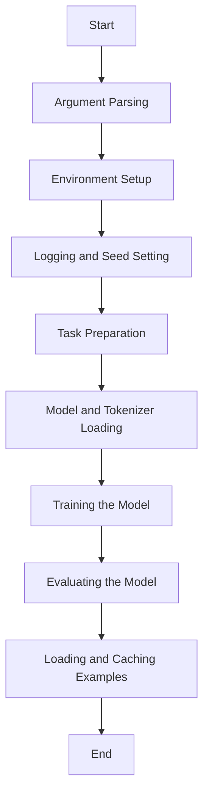

This document will cover the main function flow for training and evaluating NLP models. We'll cover:

1. Argument Parsing
2. Environment Setup
3. Logging and Seed Setting
4. Task Preparation
5. Model and Tokenizer Loading
6. Training the Model
7. Evaluating the Model
8. Loading and Caching Examples

Technical document: <SwmLink doc-title="Main Function Flow">[Main Function Flow](/.swm/main-function-flow.zuo7qvlz.sw.md)</SwmLink>

# Argument Parsing

The main function begins by setting up an argument parser to handle various input parameters required for training and evaluation. These parameters include paths to data directories, model types, task names, and various training configurations. This setup ensures that the script can be flexibly used for different tasks and models.

# Environment Setup

The function then sets up the environment for training, including configuring CUDA for GPU usage and initializing distributed training if necessary. This step is crucial for optimizing the training process and ensuring that the script can run efficiently on different hardware setups.

# Logging and Seed Setting

Logging is configured to provide useful information during training and evaluation. The random seed is also set to ensure reproducibility of results. These steps help in debugging and maintaining consistency across different runs.

# Task Preparation

The function prepares the specific task for training by loading the appropriate processor and obtaining the labels for the task. This step is essential for adapting the model to the specific requirements of the task at hand.

# Model and Tokenizer Loading

Finally, the function loads the pretrained model and tokenizer based on the specified arguments. This step ensures that the model is ready for training or evaluation with the appropriate configurations and pretrained weights.

# Training the Model

The train function is responsible for training the model. It sets up the training environment, including the optimizer and scheduler, and handles the training loop. It also manages distributed training, gradient accumulation, and logging of training metrics.

# Evaluating the Model

The evaluate function evaluates the model's performance on a validation dataset. It handles the evaluation loop, computes evaluation metrics, and logs the results.

# Loading and Caching Examples

The load_and_cache_examples function loads the dataset and caches the processed features for faster subsequent loading. It ensures that only the first process in distributed training processes the dataset, while others use the cached version.

&nbsp;

*This is an auto-generated document by Swimm AI 🌊 and has not yet been verified by a human*

<SwmMeta version="3.0.0" repo-id="Z2l0aHViJTNBJTNBdHJhbnNmb3JtZXJzJTNBJTNBc2h1anV1dQ==" repo-name="transformers">Powered by [Swimm](/)</SwmMeta>
