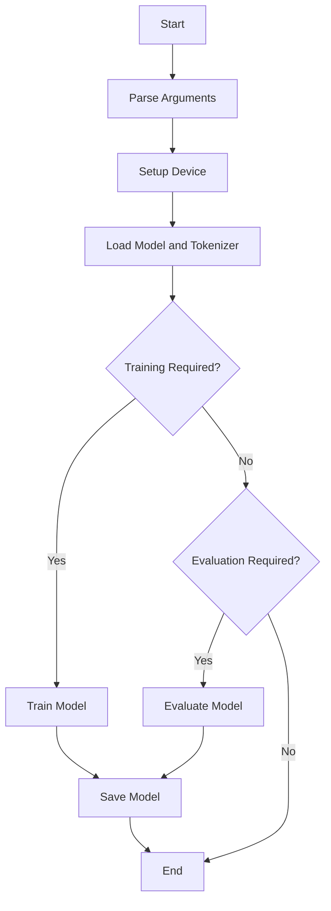

This document will cover the main function flow for training and evaluating NLP models. We'll cover:

1. Argument Parsing
2. Device and Distributed Training Setup
3. Model and Tokenizer Loading
4. Training the Model
5. Evaluating the Model
6. Saving the Model

Technical document: <SwmLink doc-title="Main Function Flow Overview">[Main Function Flow Overview](/.swm/main-function-flow-overview.5jmcbzbd.sw.md)</SwmLink>

# Argument Parsing

The main function begins by parsing command-line arguments. These arguments include essential parameters like the data directory, model type, model name or path, task name, and output directory. This setup ensures that all necessary configurations are provided for the training and evaluation processes. For example, the data directory specifies where the input data files are located, and the model type determines which type of model will be used.

# Device and Distributed Training Setup

The function then sets up the device for training, checking if CUDA (a parallel computing platform) is available and whether distributed training is required. This ensures that the model utilizes available hardware resources efficiently. For instance, if multiple GPUs are available, the function will configure the training to use all of them, which can significantly speed up the training process.

# Model and Tokenizer Loading

The pretrained model and tokenizer are loaded based on the provided arguments. This step is crucial as it prepares the model for training or evaluation by loading the necessary configurations and weights. The tokenizer is responsible for converting text into a format that the model can understand, while the model itself is the neural network that will be trained or evaluated.

# Training the Model

If the 'do_train' flag is set, the function proceeds to train the model. This involves several steps: loading the training dataset, setting up the training environment, and iterating over the training data to update the model's parameters. After training, the model is saved to the specified output directory. This step is essential for improving the model's performance on the given task by adjusting its parameters based on the training data.

# Evaluating the Model

If the 'do_eval' flag is set, the function evaluates the model's performance. This involves loading the evaluation dataset, running the model on this dataset, and logging the results. Evaluation is crucial for assessing how well the model performs on unseen data, which helps in understanding its generalization capabilities.

# Saving the Model

The 'save' function is responsible for saving the trained or evaluated model. It checks the file extension and either saves the model using a specific method for certain file types or uses a general method for other formats. This step ensures that the model can be reloaded and used later, either for further training or for making predictions.

&nbsp;

*This is an auto-generated document by Swimm AI 🌊 and has not yet been verified by a human*

<SwmMeta version="3.0.0" repo-id="Z2l0aHViJTNBJTNBdHJhbnNmb3JtZXJzJTNBJTNBc2h1anV1dQ==" repo-name="transformers">Powered by [Swimm](/)</SwmMeta>
