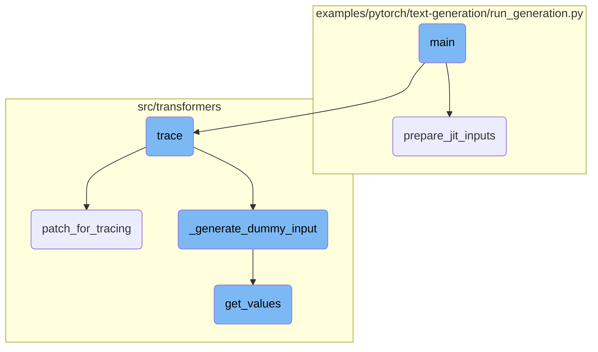
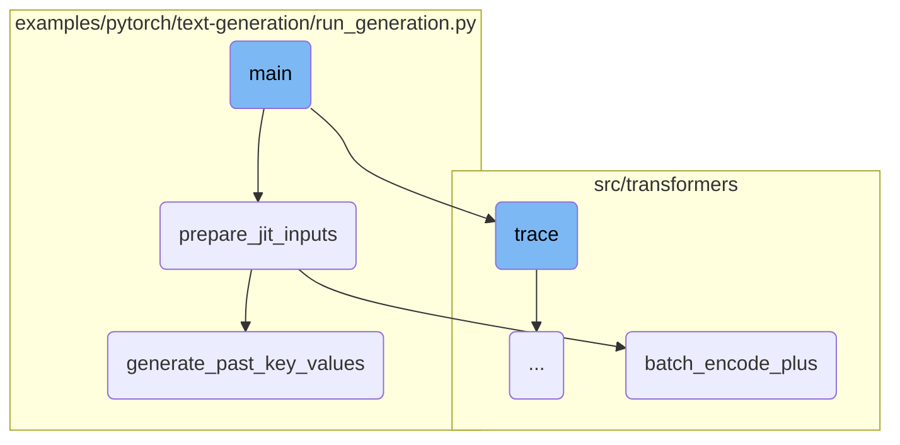
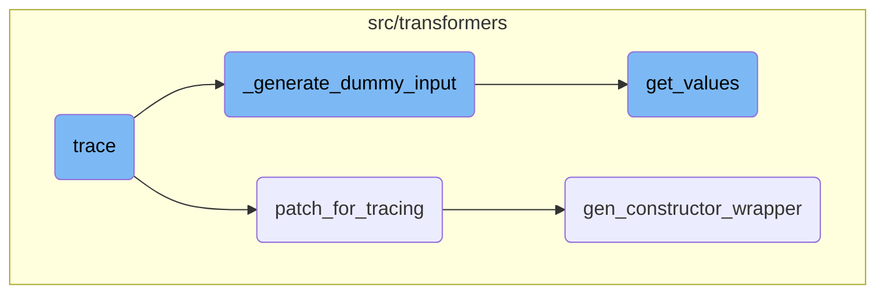

This document provides an overview of the main function's flow in a text generation script. It covers the initialization of the model and tokenizer, preparation of inputs, generation of text sequences, and decoding and displaying the generated sequences.

The main function starts by setting up the environment and initializing the model and tokenizer. It then prepares the input text for the model, ensuring it is in the correct format. The model generates text sequences based on the input, and these sequences are decoded back into readable text. Finally, the generated text is displayed and returned.

Here is a high level diagram of the flow, showing only the most important functions:



# Flow drill down

First, we'll zoom into this section of the flow:



<SwmSnippet path="/examples/pytorch/text-generation/run_generation.py" line="336">

---

## Initializing Model and Tokenizer

The main function starts by parsing command-line arguments and initializing the distributed state. It then sets the random seed if provided and initializes the model and tokenizer based on the specified model type and path.

```python
    # Initialize the distributed state.
    distributed_state = PartialState(cpu=args.use_cpu)

    logger.warning(f"device: {distributed_state.device}, 16-bits inference: {args.fp16}")

    if args.seed is not None:
        set_seed(args.seed)

    # Initialize the model and tokenizer
    try:
        args.model_type = args.model_type.lower()
        model_class, tokenizer_class = MODEL_CLASSES[args.model_type]
    except KeyError:
        raise KeyError("the model {} you specified is not supported. You are welcome to add it and open a PR :)")

    tokenizer = tokenizer_class.from_pretrained(args.model_name_or_path)
    if tokenizer.pad_token is None:
        tokenizer.pad_token = tokenizer.eos_token
    model = model_class.from_pretrained(args.model_name_or_path)

    # Set the model to the right device
```

---

</SwmSnippet>

<SwmSnippet path="/examples/pytorch/text-generation/run_generation.py" line="365">

---

## Preparing Inputs

The function prepares the input text for the model. It checks if preprocessing is required for the model type and encodes the prompt text using the tokenizer. The encoded prompt is then moved to the appropriate device.

```python
    prompt_text = args.prompt if args.prompt else input("Model prompt >>> ")

    # Different models need different input formatting and/or extra arguments
    requires_preprocessing = args.model_type in PREPROCESSING_FUNCTIONS.keys()
    if requires_preprocessing:
        prepare_input = PREPROCESSING_FUNCTIONS.get(args.model_type)
        preprocessed_prompt_text = prepare_input(args, model, tokenizer, prompt_text)

        if model.__class__.__name__ in ["TransfoXLLMHeadModel"]:
            tokenizer_kwargs = {"add_space_before_punct_symbol": True}
        else:
            tokenizer_kwargs = {}

        encoded_prompt = tokenizer.encode(
            preprocessed_prompt_text, add_special_tokens=False, return_tensors="pt", **tokenizer_kwargs
        )
    else:
        prefix = args.prefix if args.prefix else args.padding_text
        encoded_prompt = tokenizer.encode(prefix + prompt_text, add_special_tokens=False, return_tensors="pt")
    encoded_prompt = encoded_prompt.to(distributed_state.device)
```

---

</SwmSnippet>

<SwmSnippet path="/examples/pytorch/text-generation/run_generation.py" line="408">

---

## Generating Text Sequences

The function generates text sequences using the model's generate method. It specifies parameters like max length, temperature, <SwmToken path="examples/pytorch/text-generation/run_generation.py" pos="412:1:1" line-data="        top_k=args.k,">`top_k`</SwmToken>, <SwmToken path="examples/pytorch/text-generation/run_generation.py" pos="413:1:1" line-data="        top_p=args.p,">`top_p`</SwmToken>, repetition penalty, and the number of return sequences.

```python
    output_sequences = model.generate(
        input_ids=input_ids,
        max_length=args.length + len(encoded_prompt[0]),
        temperature=args.temperature,
        top_k=args.k,
        top_p=args.p,
        repetition_penalty=args.repetition_penalty,
        do_sample=True,
        num_return_sequences=args.num_return_sequences,
    )
```

---

</SwmSnippet>

<SwmSnippet path="/examples/pytorch/text-generation/run_generation.py" line="423">

---

## Decoding and Displaying Generated Sequences

The generated sequences are decoded back into text using the tokenizer. The function removes any text after the stop token and appends the prompt text to the generated text. Finally, it prints and returns the generated sequences.

```python
    generated_sequences = []

    for generated_sequence_idx, generated_sequence in enumerate(output_sequences):
        print(f"=== GENERATED SEQUENCE {generated_sequence_idx + 1} ===")
        generated_sequence = generated_sequence.tolist()

        # Decode text
        text = tokenizer.decode(generated_sequence, clean_up_tokenization_spaces=True)

        # Remove all text after the stop token
        text = text[: text.find(args.stop_token) if args.stop_token else None]

        # Add the prompt at the beginning of the sequence. Remove the excess text that was used for pre-processing
        total_sequence = (
            prompt_text + text[len(tokenizer.decode(encoded_prompt[0], clean_up_tokenization_spaces=True)) :]
        )

        generated_sequences.append(total_sequence)
        print(total_sequence)
```

---

</SwmSnippet>

Now, lets zoom into this section of the flow:



<SwmSnippet path="/src/transformers/utils/fx.py" line="1232">

---

## Tracing the Model

The <SwmToken path="src/transformers/utils/fx.py" pos="1232:3:3" line-data="    def trace(">`trace`</SwmToken> function is responsible for tracing a given model or function and returning its FX <SwmToken path="src/transformers/utils/fx.py" pos="1240:18:22" line-data="        Traces `root` and returns the corresponding FX `torch.fx.Graph` representation. `root` can either be a">`torch.fx.Graph`</SwmToken> representation. It handles the creation of dummy inputs, setting up concrete arguments, and patching necessary methods for tracing. The function ensures that the model is correctly traced by generating appropriate dummy inputs and handling various model configurations.

```python
    def trace(
        self,
        root: Union[torch.nn.Module, Callable[..., Any]],
        concrete_args: Optional[Dict[str, Any]] = None,
        dummy_inputs: Optional[Dict[str, Any]] = None,
        complete_concrete_args_with_inputs_not_in_dummy_inputs: bool = True,
    ) -> Graph:
        """
        Traces `root` and returns the corresponding FX `torch.fx.Graph` representation. `root` can either be a
        `torch.nn.Module` instance or a Python callable. Note that after this call, `self.root` may be different from
        the `root` passed in here. For example, when a free function is passed to `trace()`, we will create a
        `torch.nn.Module` instance to use as the root and add embedded constants to.

        Args:
            root (`torch.nn.Module` or  `Callable`):
                Either a `torch.nn.Module`` or a function to be traced through. If root is not a
                [`~transformers.PreTrainedModel`], then `dummy_inputs` must be passed, otherwise tracing will fail.
            concrete_args (`Dict[str, Any], *optional*):
                Concrete arguments that should not be treated as Proxies
            dummy_inputs (`Dict[str, Any]`, *optional*):
                The dummy inputs needed to handle data-dependent control-flow if `root` is not a
```

---

</SwmSnippet>

<SwmSnippet path="/src/transformers/utils/fx.py" line="1196">

---

### Patching for Tracing

The <SwmToken path="src/transformers/utils/fx.py" pos="1196:3:3" line-data="    def patch_for_tracing(self, root: Union[torch.nn.Module, Callable[..., Any]]):">`patch_for_tracing`</SwmToken> function temporarily patches certain torch functions and classes to ensure they are traceable. This is crucial for the tracing process as it modifies the behavior of specific methods to be compatible with FX tracing.

```python
    def patch_for_tracing(self, root: Union[torch.nn.Module, Callable[..., Any]]):
        # Patching torch functions
        self.patched_torch_methods = {
            target: gen_constructor_wrapper(getattr(torch, target)) for target in self._TORCH_METHODS_TO_PATCH
        }
        self.orig_fns = set()

        for name, (wrapper, orig) in self.patched_torch_methods.items():
            setattr(torch, name, wrapper)
            self.orig_fns.add(orig)

        # Patching classes
        patched = []
        module_of_model = inspect.getmodule(root)
        for name, mod in sys.modules.items():
            if module_of_model is not None and mod is not module_of_model:
                continue
            if not name.startswith("transformers"):
                continue
            for orig_cls, patched_cls in self._CLASSES_TO_PATCH.items():
                for attr_name, attr in mod.__dict__.items():
```

---

</SwmSnippet>

<SwmSnippet path="/src/transformers/utils/fx.py" line="900">

---

## Generating Dummy Inputs

The <SwmToken path="src/transformers/utils/fx.py" pos="900:3:3" line-data="    def _generate_dummy_input(">`_generate_dummy_input`</SwmToken> function generates dummy inputs required for model inference recording. It creates appropriate dummy data based on the model's configuration and input requirements. This function supports various model types and input configurations, ensuring that the generated dummy inputs are suitable for the tracing process.

```python
    def _generate_dummy_input(
        self, model: "PreTrainedModel", input_name: str, shape: List[int], input_names: List[str]
    ) -> Dict[str, torch.Tensor]:
        """Generates dummy input for model inference recording."""
        # Retrieving the model class, either from the "class_for_deserialization" attribute if the model was restored
        # from pickle, or from the "__class__" attribute in the general case.
        model_class_name = getattr(model, "class_for_deserialization", model.__class__).__name__
        device = model.device
        inputs_dict = {}

        # when tracing a model with KV cache, we simply need to unsure that the KV cache length is larger than one to
        # rightfully pass certain controlflows (Example: https://github.com/huggingface/transformers/blob/5c8d941d66734811d2ef6f57f15b44f7fb7a98c4/src/transformers/modeling_attn_mask_utils.py#L162).
        # After tracing, the model can then still be used with arbitrary lengths different than the one used during tracing.
        kv_cache_length = 5

        if input_name in ["labels", "start_positions", "end_positions"]:
            batch_size = shape[0]
            if model_class_name in [
                *get_values(MODEL_FOR_NEXT_SENTENCE_PREDICTION_MAPPING_NAMES),
                *get_values(MODEL_FOR_MULTIPLE_CHOICE_MAPPING_NAMES),
                *get_values(MODEL_FOR_IMAGE_CLASSIFICATION_MAPPING_NAMES),
```

---

</SwmSnippet>

<SwmSnippet path="/src/transformers/models/auto/auto_factory.py" line="677">

---

### Retrieving Model Mappings

The <SwmToken path="src/transformers/models/auto/auto_factory.py" pos="677:2:2" line-data="def get_values(model_mapping):">`get_values`</SwmToken> function retrieves the values from a given model mapping. It is used within the tracing process to obtain model-specific configurations and mappings, which are essential for generating dummy inputs and handling model-specific logic.

```python
def get_values(model_mapping):
    result = []
    for model in model_mapping.values():
        if isinstance(model, (list, tuple)):
            result += list(model)
        else:
            result.append(model)

    return result
```

---

</SwmSnippet>

<SwmSnippet path="/src/transformers/utils/fx.py" line="796">

---

### Generating Constructor Wrapper

The <SwmToken path="src/transformers/utils/fx.py" pos="796:2:2" line-data="def gen_constructor_wrapper(target: Callable) -&gt; Tuple[Callable, Callable]:">`gen_constructor_wrapper`</SwmToken> function wraps a given target function to make it proxyable. This is used for tensor creators like <SwmToken path="src/transformers/utils/fx.py" pos="798:25:27" line-data="    Wraps `target` to be proxyable. Used for tensor creators like `torch.ones`, `torch.arange` and so on.">`torch.ones`</SwmToken> and <SwmToken path="src/transformers/utils/fx.py" pos="798:31:33" line-data="    Wraps `target` to be proxyable. Used for tensor creators like `torch.ones`, `torch.arange` and so on.">`torch.arange`</SwmToken>, ensuring that these functions can be traced correctly.

```python
def gen_constructor_wrapper(target: Callable) -> Tuple[Callable, Callable]:
    """
    Wraps `target` to be proxyable. Used for tensor creators like `torch.ones`, `torch.arange` and so on.
    """
    wrapper = create_wrapper(target, "call_function")
    return wrapper, target
```

---

</SwmSnippet>

&nbsp;

*This is an auto-generated document by Swimm AI 🌊 and has not yet been verified by a human*

<SwmMeta version="3.0.0" repo-id="Z2l0aHViJTNBJTNBdHJhbnNmb3JtZXJzJTNBJTNBc2h1anV1dQ==" repo-name="transformers" doc-type="flows"><sup>Powered by [Swimm](/)</sup></SwmMeta>
