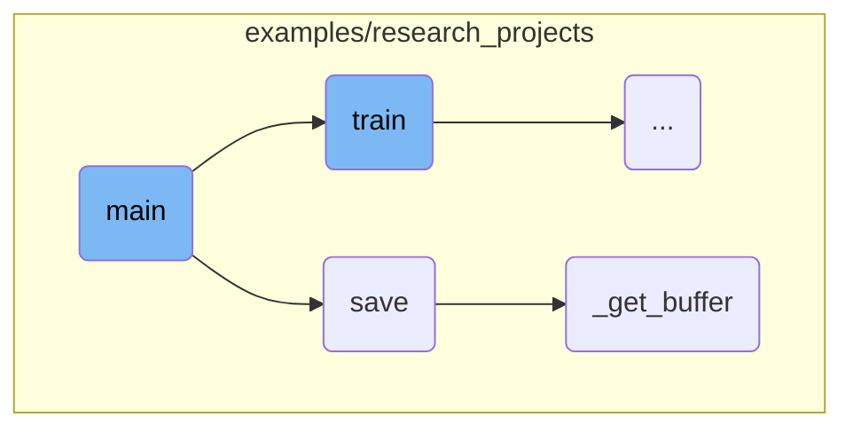
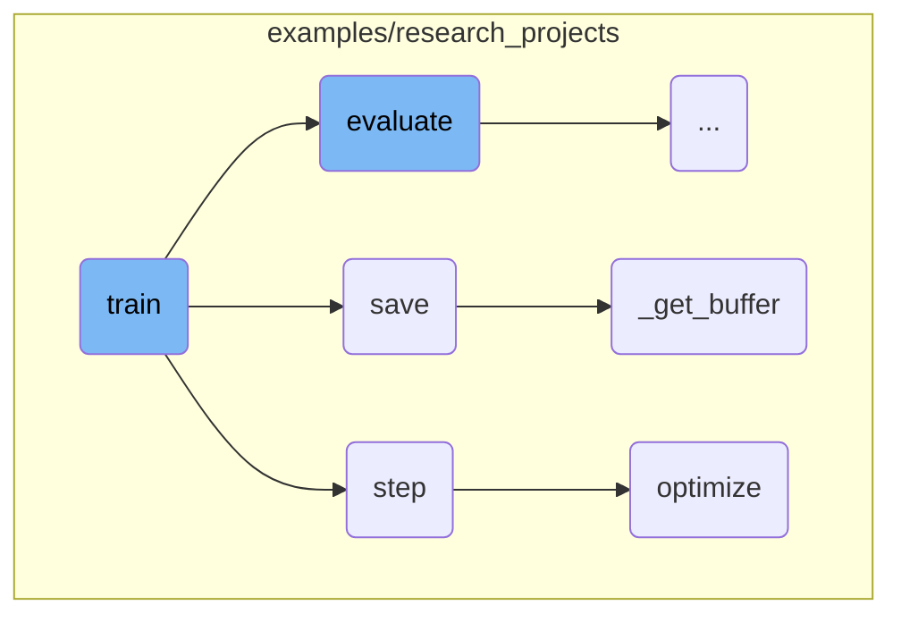
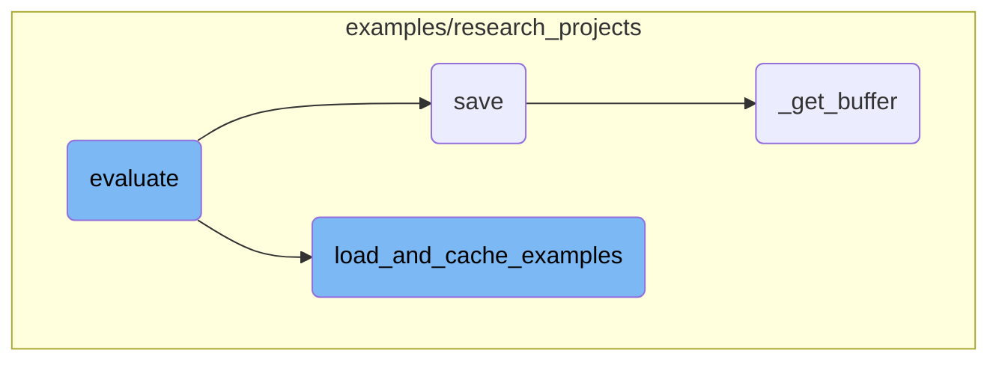

This document provides an overview of the main function's flow in a script designed for training and evaluating models. It covers the essential steps from argument parsing to model training and evaluation.

The main function starts by parsing command-line arguments to get the necessary configurations. It then sets up the device for training, ensuring the model uses available hardware resources efficiently. Next, it loads the pretrained model and tokenizer based on the provided arguments. If training is required, the function trains the model and saves it. If evaluation is needed, it evaluates the model's performance and logs the results.

Here is a high level diagram of the flow, showing only the most important functions:

```mermaid
graph TD;
      subgraph examples/research_projects
c55e52f4334f6f6553e27f6f052f8526d44caef0def32f852959093f8251b137(main):::mainFlowStyle --> a8b9cae6c7e5f9b45965d9c1867cc814f63d54ff23357ee9316532ae21a7382f(save)
end

subgraph examples/research_projects
c55e52f4334f6f6553e27f6f052f8526d44caef0def32f852959093f8251b137(main):::mainFlowStyle --> 3a41dfb77316db0cb5871fe12777f8ee020710911a71d87f0e6c155ef5634411(train):::mainFlowStyle
end

subgraph examples/research_projects
3a41dfb77316db0cb5871fe12777f8ee020710911a71d87f0e6c155ef5634411(train):::mainFlowStyle --> 6e607b060f7c1df9e5d57b2ad94926566134955ed97b0934bff72d2b25b99233(step)
end

subgraph examples/research_projects
3a41dfb77316db0cb5871fe12777f8ee020710911a71d87f0e6c155ef5634411(train):::mainFlowStyle --> a8b9cae6c7e5f9b45965d9c1867cc814f63d54ff23357ee9316532ae21a7382f(save)
end

subgraph examples/research_projects
3a41dfb77316db0cb5871fe12777f8ee020710911a71d87f0e6c155ef5634411(train):::mainFlowStyle --> c71de3ba0fc3c5e16292c8f656c085c4b342da0a3e3a57f83ae03e54ad766afe(evaluate):::mainFlowStyle
end

subgraph examples/research_projects
c71de3ba0fc3c5e16292c8f656c085c4b342da0a3e3a57f83ae03e54ad766afe(evaluate):::mainFlowStyle --> a8b9cae6c7e5f9b45965d9c1867cc814f63d54ff23357ee9316532ae21a7382f(save)
end

subgraph examples/research_projects
c71de3ba0fc3c5e16292c8f656c085c4b342da0a3e3a57f83ae03e54ad766afe(evaluate):::mainFlowStyle --> 6960fe772a31ad459f3e4abfc0fdf90c253b14e047d21d8b3294532ee4ea9ae8(load_and_cache_examples):::mainFlowStyle
end

subgraph examples/research_projects
6960fe772a31ad459f3e4abfc0fdf90c253b14e047d21d8b3294532ee4ea9ae8(load_and_cache_examples):::mainFlowStyle --> a8b9cae6c7e5f9b45965d9c1867cc814f63d54ff23357ee9316532ae21a7382f(save)
end


      classDef mainFlowStyle color:#000000,fill:#7CB9F4
classDef rootsStyle color:#000000,fill:#00FFF4
classDef Style1 color:#000000,fill:#00FFAA
classDef Style2 color:#000000,fill:#FFFF00
classDef Style3 color:#000000,fill:#AA7CB9

%% Swimm:
%% graph TD;
%%       subgraph <SwmPath>[examples/research_projects/](examples/research_projects/)</SwmPath>
%% c55e52f4334f6f6553e27f6f052f8526d44caef0def32f852959093f8251b137(main):::mainFlowStyle --> a8b9cae6c7e5f9b45965d9c1867cc814f63d54ff23357ee9316532ae21a7382f(save)
%% end
%% 
%% subgraph <SwmPath>[examples/research_projects/](examples/research_projects/)</SwmPath>
%% c55e52f4334f6f6553e27f6f052f8526d44caef0def32f852959093f8251b137(main):::mainFlowStyle --> 3a41dfb77316db0cb5871fe12777f8ee020710911a71d87f0e6c155ef5634411(train):::mainFlowStyle
%% end
%% 
%% subgraph <SwmPath>[examples/research_projects/](examples/research_projects/)</SwmPath>
%% 3a41dfb77316db0cb5871fe12777f8ee020710911a71d87f0e6c155ef5634411(train):::mainFlowStyle --> 6e607b060f7c1df9e5d57b2ad94926566134955ed97b0934bff72d2b25b99233(step)
%% end
%% 
%% subgraph <SwmPath>[examples/research_projects/](examples/research_projects/)</SwmPath>
%% 3a41dfb77316db0cb5871fe12777f8ee020710911a71d87f0e6c155ef5634411(train):::mainFlowStyle --> a8b9cae6c7e5f9b45965d9c1867cc814f63d54ff23357ee9316532ae21a7382f(save)
%% end
%% 
%% subgraph <SwmPath>[examples/research_projects/](examples/research_projects/)</SwmPath>
%% 3a41dfb77316db0cb5871fe12777f8ee020710911a71d87f0e6c155ef5634411(train):::mainFlowStyle --> c71de3ba0fc3c5e16292c8f656c085c4b342da0a3e3a57f83ae03e54ad766afe(evaluate):::mainFlowStyle
%% end
%% 
%% subgraph <SwmPath>[examples/research_projects/](examples/research_projects/)</SwmPath>
%% c71de3ba0fc3c5e16292c8f656c085c4b342da0a3e3a57f83ae03e54ad766afe(evaluate):::mainFlowStyle --> a8b9cae6c7e5f9b45965d9c1867cc814f63d54ff23357ee9316532ae21a7382f(save)
%% end
%% 
%% subgraph <SwmPath>[examples/research_projects/](examples/research_projects/)</SwmPath>
%% c71de3ba0fc3c5e16292c8f656c085c4b342da0a3e3a57f83ae03e54ad766afe(evaluate):::mainFlowStyle --> 6960fe772a31ad459f3e4abfc0fdf90c253b14e047d21d8b3294532ee4ea9ae8(load_and_cache_examples):::mainFlowStyle
%% end
%% 
%% subgraph <SwmPath>[examples/research_projects/](examples/research_projects/)</SwmPath>
%% 6960fe772a31ad459f3e4abfc0fdf90c253b14e047d21d8b3294532ee4ea9ae8(load_and_cache_examples):::mainFlowStyle --> a8b9cae6c7e5f9b45965d9c1867cc814f63d54ff23357ee9316532ae21a7382f(save)
%% end
%% 
%% 
%%       classDef mainFlowStyle color:#000000,fill:#7CB9F4
%% classDef rootsStyle color:#000000,fill:#00FFF4
%% classDef Style1 color:#000000,fill:#00FFAA
%% classDef Style2 color:#000000,fill:#FFFF00
%% classDef Style3 color:#000000,fill:#AA7CB9
```



# Flow drill down

First, we'll zoom into this section of the flow:



<SwmSnippet path="/examples/research_projects/deebert/run_glue_deebert.py" line="395">

---

## Argument Parsing

The <SwmToken path="examples/research_projects/deebert/run_glue_deebert.py" pos="395:2:2" line-data="def main():">`main`</SwmToken> function begins by parsing command-line arguments using <SwmToken path="examples/research_projects/deebert/run_glue_deebert.py" pos="396:5:7" line-data="    parser = argparse.ArgumentParser()">`argparse.ArgumentParser`</SwmToken>. These arguments include essential parameters like <SwmToken path="examples/research_projects/deebert/run_glue_deebert.py" pos="400:3:3" line-data="        &quot;--data_dir&quot;,">`data_dir`</SwmToken>, <SwmToken path="examples/research_projects/deebert/run_glue_deebert.py" pos="407:3:3" line-data="        &quot;--model_type&quot;,">`model_type`</SwmToken>, <SwmToken path="examples/research_projects/deebert/run_glue_deebert.py" pos="414:3:3" line-data="        &quot;--model_name_or_path&quot;,">`model_name_or_path`</SwmToken>, <SwmToken path="examples/research_projects/deebert/run_glue_deebert.py" pos="242:22:22" line-data="    eval_task_names = (&quot;mnli&quot;, &quot;mnli-mm&quot;) if args.task_name == &quot;mnli&quot; else (args.task_name,)">`task_name`</SwmToken>, and <SwmToken path="examples/research_projects/deebert/run_glue_deebert.py" pos="243:8:8" line-data="    eval_outputs_dirs = (args.output_dir, args.output_dir + &quot;-MM&quot;) if args.task_name == &quot;mnli&quot; else (args.output_dir,)">`output_dir`</SwmToken>, among others. This setup ensures that all necessary configurations are provided for the training and evaluation processes.

```python
def main():
    parser = argparse.ArgumentParser()

    # Required parameters
    parser.add_argument(
        "--data_dir",
        default=None,
        type=str,
        required=True,
        help="The input data dir. Should contain the .tsv files (or other data files) for the task.",
    )
    parser.add_argument(
        "--model_type",
        default=None,
        type=str,
        required=True,
        help="Model type selected in the list: " + ", ".join(MODEL_CLASSES.keys()),
    )
    parser.add_argument(
        "--model_name_or_path",
        default=None,
```

---

</SwmSnippet>

<SwmSnippet path="/examples/research_projects/deebert/run_glue_deebert.py" line="561">

---

## Device and Distributed Training Setup

The function then sets up the device for training, checking if CUDA is available and whether distributed training is required. This ensures that the model utilizes available hardware resources efficiently.

```python
    # Setup CUDA, GPU & distributed training
    if args.local_rank == -1 or args.no_cuda:
        device = torch.device("cuda" if torch.cuda.is_available() and not args.no_cuda else "cpu")
        args.n_gpu = torch.cuda.device_count()
    else:  # Initializes the distributed backend which will take care of sychronizing nodes/GPUs
        torch.cuda.set_device(args.local_rank)
        device = torch.device("cuda", args.local_rank)
        torch.distributed.init_process_group(backend="nccl")
        args.n_gpu = 1
    args.device = device
```

---

</SwmSnippet>

<SwmSnippet path="/examples/research_projects/deebert/run_glue_deebert.py" line="603">

---

## Model and Tokenizer Loading

The pretrained model and tokenizer are loaded based on the provided arguments. This step is crucial as it prepares the model for training or evaluation by loading the necessary configurations and weights.

```python
    # Load pretrained model and tokenizer
    if args.local_rank not in [-1, 0]:
        torch.distributed.barrier()  # Make sure only the first process in distributed training will download model & vocab

    args.model_type = args.model_type.lower()
    config_class, model_class, tokenizer_class = MODEL_CLASSES[args.model_type]
    config = config_class.from_pretrained(
        args.config_name if args.config_name else args.model_name_or_path,
        num_labels=num_labels,
        finetuning_task=args.task_name,
        cache_dir=args.cache_dir if args.cache_dir else None,
    )
    tokenizer = tokenizer_class.from_pretrained(
        args.tokenizer_name if args.tokenizer_name else args.model_name_or_path,
        do_lower_case=args.do_lower_case,
        cache_dir=args.cache_dir if args.cache_dir else None,
    )
    model = model_class.from_pretrained(
        args.model_name_or_path,
        from_tf=bool(".ckpt" in args.model_name_or_path),
        config=config,
```

---

</SwmSnippet>

<SwmSnippet path="/examples/research_projects/deebert/run_glue_deebert.py" line="643">

---

## Training and Evaluation

If the <SwmToken path="examples/research_projects/deebert/run_glue_deebert.py" pos="644:5:5" line-data="    if args.do_train:">`do_train`</SwmToken> flag is set, the function proceeds to train the model using the <SwmToken path="examples/research_projects/deebert/run_glue_deebert.py" pos="646:8:8" line-data="        global_step, tr_loss = train(args, train_dataset, model, tokenizer)">`train`</SwmToken> function. After training, the model is saved to the specified output directory. If the <SwmToken path="examples/research_projects/deebert/run_glue_deebert.py" pos="466:7:7" line-data="    parser.add_argument(&quot;--do_eval&quot;, action=&quot;store_true&quot;, help=&quot;Whether to run eval on the dev set.&quot;)">`do_eval`</SwmToken> flag is set, the function evaluates the model using the <SwmToken path="examples/research_projects/deebert/run_glue_deebert.py" pos="645:18:18" line-data="        train_dataset = load_and_cache_examples(args, args.task_name, tokenizer, evaluate=False)">`evaluate`</SwmToken> function. This ensures that the model's performance is assessed on the validation set.

```python
    # Training
    if args.do_train:
        train_dataset = load_and_cache_examples(args, args.task_name, tokenizer, evaluate=False)
        global_step, tr_loss = train(args, train_dataset, model, tokenizer)
        logger.info(" global_step = %s, average loss = %s", global_step, tr_loss)

        if args.eval_after_first_stage:
            result = evaluate(args, model, tokenizer, prefix="")
            print_result = get_wanted_result(result)

        train(args, train_dataset, model, tokenizer, train_highway=True)

    # Saving best-practices: if you use defaults names for the model, you can reload it using from_pretrained()
    if args.do_train and (args.local_rank == -1 or torch.distributed.get_rank() == 0):
        # Create output directory if needed
        if not os.path.exists(args.output_dir) and args.local_rank in [-1, 0]:
            os.makedirs(args.output_dir)

        logger.info("Saving model checkpoint to %s", args.output_dir)
        # Save a trained model, configuration and tokenizer using `save_pretrained()`.
        # They can then be reloaded using `from_pretrained()`
```

---

</SwmSnippet>

<SwmSnippet path="/examples/research_projects/lxmert/visualizing_image.py" line="194">

---

## Saving the Model

The <SwmToken path="examples/research_projects/lxmert/visualizing_image.py" pos="194:3:3" line-data="    def save(self, saveas=None):">`save`</SwmToken> function is responsible for saving the visualized image. It checks the file extension and either saves the image using <SwmToken path="examples/research_projects/lxmert/visualizing_image.py" pos="198:1:3" line-data="            cv2.imwrite(">`cv2.imwrite`</SwmToken> for <SwmToken path="examples/research_projects/lxmert/visualizing_image.py" pos="197:12:13" line-data="        if saveas.lower().endswith(&quot;.jpg&quot;) or saveas.lower().endswith(&quot;.png&quot;):">`.jpg`</SwmToken> or <SwmToken path="examples/research_projects/lxmert/visualizing_image.py" pos="197:28:29" line-data="        if saveas.lower().endswith(&quot;.jpg&quot;) or saveas.lower().endswith(&quot;.png&quot;):">`.png`</SwmToken> files or uses <SwmToken path="examples/research_projects/lxmert/visualizing_image.py" pos="203:1:5" line-data="            self.fig.savefig(saveas)">`self.fig.savefig`</SwmToken> for other formats.

```python
    def save(self, saveas=None):
        if saveas is None:
            saveas = self.saveas
        if saveas.lower().endswith(".jpg") or saveas.lower().endswith(".png"):
            cv2.imwrite(
                saveas,
                self._get_buffer()[:, :, ::-1],
            )
        else:
            self.fig.savefig(saveas)
```

---

</SwmSnippet>

<SwmSnippet path="/examples/research_projects/lxmert/visualizing_image.py" line="230">

---

## Buffer Retrieval

The <SwmToken path="examples/research_projects/lxmert/visualizing_image.py" pos="230:3:3" line-data="    def _get_buffer(self):">`_get_buffer`</SwmToken> function retrieves the image buffer, processes it, and returns the visualized image. This function handles different backends and ensures the image is correctly formatted for saving.

```python
    def _get_buffer(self):
        if not self.pynb:
            s, (width, height) = self.canvas.print_to_buffer()
            if (width, height) != (self.width, self.height):
                img = cv2.resize(self.img, (width, height))
            else:
                img = self.img
        else:
            buf = io.BytesIO()  # works for cairo backend
            self.canvas.print_rgba(buf)
            width, height = self.width, self.height
            s = buf.getvalue()
            img = self.img

        buffer = np.frombuffer(s, dtype="uint8")
        img_rgba = buffer.reshape(height, width, 4)
        rgb, alpha = np.split(img_rgba, [3], axis=2)

        try:
            import numexpr as ne  # fuse them with numexpr

```

---

</SwmSnippet>

Now, lets zoom into this section of the flow:



<SwmSnippet path="/examples/research_projects/deebert/run_glue_deebert.py" line="73">

---

## Training the Model

The <SwmToken path="examples/research_projects/deebert/run_glue_deebert.py" pos="73:2:2" line-data="def train(args, train_dataset, model, tokenizer, train_highway=False):">`train`</SwmToken> function is responsible for training the model. It sets up the training environment, including the data loader, optimizer, and scheduler. The function iterates over the training data, performs forward and backward passes, and updates the model parameters. It also handles <SwmToken path="examples/research_projects/deebert/run_glue_deebert.py" pos="257:3:5" line-data="        # multi-gpu eval">`multi-gpu`</SwmToken> and distributed training setups, logging, and checkpoint saving.

```python
def train(args, train_dataset, model, tokenizer, train_highway=False):
    """Train the model"""
    if args.local_rank in [-1, 0]:
        tb_writer = SummaryWriter()

    args.train_batch_size = args.per_gpu_train_batch_size * max(1, args.n_gpu)
    train_sampler = RandomSampler(train_dataset) if args.local_rank == -1 else DistributedSampler(train_dataset)
    train_dataloader = DataLoader(train_dataset, sampler=train_sampler, batch_size=args.train_batch_size)

    if args.max_steps > 0:
        t_total = args.max_steps
        args.num_train_epochs = args.max_steps // (len(train_dataloader) // args.gradient_accumulation_steps) + 1
    else:
        t_total = len(train_dataloader) // args.gradient_accumulation_steps * args.num_train_epochs

    # Prepare optimizer and schedule (linear warmup and decay)
    no_decay = ["bias", "LayerNorm.weight"]
    if train_highway:
        optimizer_grouped_parameters = [
            {
                "params": [
```

---

</SwmSnippet>

<SwmSnippet path="/examples/research_projects/distillation/distiller.py" line="371">

---

## Performing an Optimization Step

The <SwmToken path="examples/research_projects/distillation/distiller.py" pos="371:3:3" line-data="    def step(self, input_ids: torch.tensor, attention_mask: torch.tensor, lm_labels: torch.tensor):">`step`</SwmToken> function performs an optimization step by forwarding both the student and teacher models, calculating the loss, and then calling the <SwmToken path="examples/research_projects/distillation/distiller.py" pos="467:3:3" line-data="    def optimize(self, loss):">`optimize`</SwmToken> function. It handles different types of losses, including cross-entropy, mean squared error, and cosine similarity, and accumulates these losses for gradient updates.

```python
    def step(self, input_ids: torch.tensor, attention_mask: torch.tensor, lm_labels: torch.tensor):
        """
        One optimization step: forward of student AND teacher, backward on the loss (for gradient accumulation),
        and possibly a parameter update (depending on the gradient accumulation).

        Input:
        ------
        input_ids: `torch.tensor(bs, seq_length)` - The token ids.
        attention_mask: `torch.tensor(bs, seq_length)` - The attention mask for self attention.
        lm_labels: `torch.tensor(bs, seq_length)` - The language modeling labels (mlm labels for MLM and clm labels for CLM).
        """
        if self.mlm:
            s_logits, s_hidden_states = self.student(
                input_ids=input_ids, attention_mask=attention_mask
            )  # (bs, seq_length, voc_size)
            with torch.no_grad():
                t_logits, t_hidden_states = self.teacher(
                    input_ids=input_ids, attention_mask=attention_mask
                )  # (bs, seq_length, voc_size)
        else:
            s_logits, _, s_hidden_states = self.student(
```

---

</SwmSnippet>

<SwmSnippet path="/examples/research_projects/distillation/distiller.py" line="467">

---

### Updating Parameters

The <SwmToken path="examples/research_projects/distillation/distiller.py" pos="467:3:3" line-data="    def optimize(self, loss):">`optimize`</SwmToken> function normalizes the loss, performs a backward pass, and updates the model parameters. It also handles gradient clipping and updates the learning rate scheduler. This function ensures that the gradients are properly accumulated and the parameters are updated accordingly.

```python
    def optimize(self, loss):
        """
        Normalization on the loss (gradient accumulation or distributed training), followed by
        backward pass on the loss, possibly followed by a parameter update (depending on the gradient accumulation).
        Also update the metrics for tensorboard.
        """
        # Check for NaN
        if (loss != loss).data.any():
            logger.error("NaN detected")
            exit()

        if self.multi_gpu:
            loss = loss.mean()
        if self.params.gradient_accumulation_steps > 1:
            loss = loss / self.params.gradient_accumulation_steps

        if self.fp16:
            from apex import amp

            with amp.scale_loss(loss, self.optimizer) as scaled_loss:
                scaled_loss.backward()
```

---

</SwmSnippet>

Now, lets zoom into this section of the flow:



<SwmSnippet path="/examples/research_projects/deebert/run_glue_deebert.py" line="240">

---

## Evaluating the Model

The <SwmToken path="examples/research_projects/deebert/run_glue_deebert.py" pos="240:2:2" line-data="def evaluate(args, model, tokenizer, prefix=&quot;&quot;, output_layer=-1, eval_highway=False):">`evaluate`</SwmToken> function is responsible for evaluating the model's performance on a given dataset. It handles multiple evaluation tasks, sets up the evaluation data loader, and performs the evaluation in a loop. The function also manages <SwmToken path="examples/research_projects/deebert/run_glue_deebert.py" pos="257:3:5" line-data="        # multi-gpu eval">`multi-gpu`</SwmToken> evaluation, logs evaluation metrics, and saves the results. This function is crucial for assessing the model's accuracy and other performance metrics after training.

```python
def evaluate(args, model, tokenizer, prefix="", output_layer=-1, eval_highway=False):
    # Loop to handle MNLI double evaluation (matched, mis-matched)
    eval_task_names = ("mnli", "mnli-mm") if args.task_name == "mnli" else (args.task_name,)
    eval_outputs_dirs = (args.output_dir, args.output_dir + "-MM") if args.task_name == "mnli" else (args.output_dir,)

    results = {}
    for eval_task, eval_output_dir in zip(eval_task_names, eval_outputs_dirs):
        eval_dataset = load_and_cache_examples(args, eval_task, tokenizer, evaluate=True)

        if not os.path.exists(eval_output_dir) and args.local_rank in [-1, 0]:
            os.makedirs(eval_output_dir)

        args.eval_batch_size = args.per_gpu_eval_batch_size * max(1, args.n_gpu)
        # Note that DistributedSampler samples randomly
        eval_sampler = SequentialSampler(eval_dataset) if args.local_rank == -1 else DistributedSampler(eval_dataset)
        eval_dataloader = DataLoader(eval_dataset, sampler=eval_sampler, batch_size=args.eval_batch_size)

        # multi-gpu eval
        if args.n_gpu > 1:
            model = nn.DataParallel(model)

```

---

</SwmSnippet>

<SwmSnippet path="/examples/research_projects/deebert/run_glue_deebert.py" line="335">

---

## Loading and Caching Examples

The <SwmToken path="examples/research_projects/deebert/run_glue_deebert.py" pos="335:2:2" line-data="def load_and_cache_examples(args, task, tokenizer, evaluate=False):">`load_and_cache_examples`</SwmToken> function loads the dataset and caches the features for faster subsequent access. It ensures that only the first process in distributed training processes the dataset, while others use the cached version. This function converts the dataset examples into features compatible with the model and saves them to a cache file. It is essential for efficient data handling and preparation before training or evaluation.

```python
def load_and_cache_examples(args, task, tokenizer, evaluate=False):
    if args.local_rank not in [-1, 0] and not evaluate:
        torch.distributed.barrier()  # Make sure only the first process in distributed training process the dataset, and the others will use the cache

    processor = processors[task]()
    output_mode = output_modes[task]
    # Load data features from cache or dataset file
    cached_features_file = os.path.join(
        args.data_dir,
        "cached_{}_{}_{}_{}".format(
            "dev" if evaluate else "train",
            list(filter(None, args.model_name_or_path.split("/"))).pop(),
            str(args.max_seq_length),
            str(task),
        ),
    )
    if os.path.exists(cached_features_file) and not args.overwrite_cache:
        logger.info("Loading features from cached file %s", cached_features_file)
        features = torch.load(cached_features_file)
    else:
        logger.info("Creating features from dataset file at %s", args.data_dir)
```

---

</SwmSnippet>

&nbsp;

*This is an auto-generated document by Swimm AI 🌊 and has not yet been verified by a human*

<SwmMeta version="3.0.0" repo-id="Z2l0aHViJTNBJTNBdHJhbnNmb3JtZXJzJTNBJTNBc2h1anV1dQ==" repo-name="transformers"><sup>Powered by [Swimm](/)</sup></SwmMeta>
