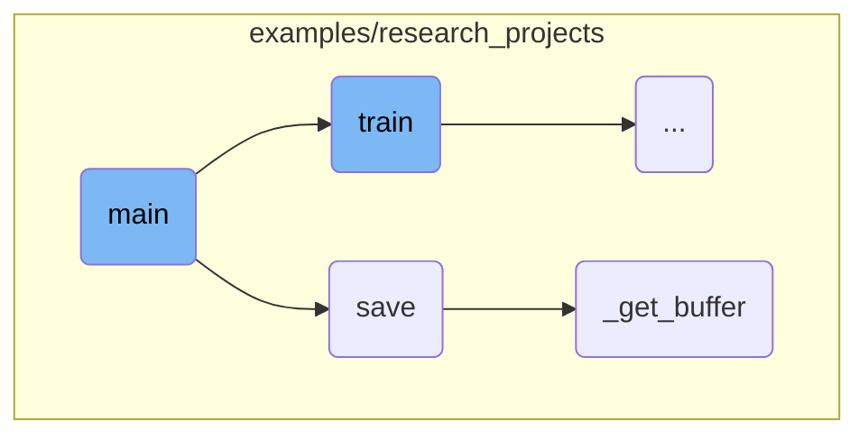
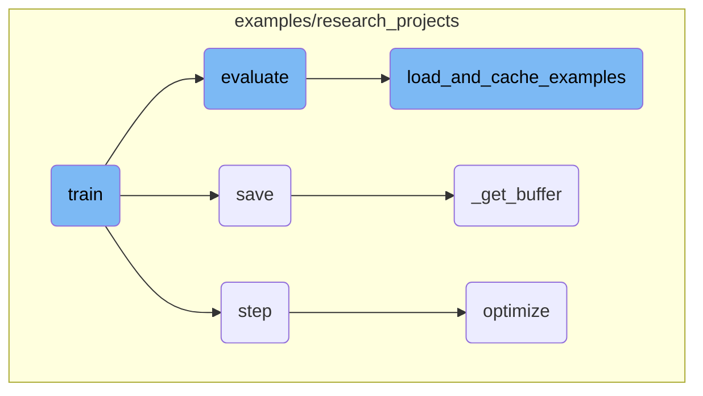

This document provides an overview of the main function's flow in a script used for training and evaluating NLP models. It covers the initial setup, argument parsing, regularization setup, and various checks to ensure smooth execution.

The main function starts by setting up the environment and parsing the necessary arguments. It then checks and adjusts the regularization parameters and issues warnings if certain configurations might cause issues. The function also ensures that the output directory is correctly set up to prevent accidental data loss. Finally, it orchestrates the training and evaluation processes, ensuring that all steps are executed correctly.

Here is a high level diagram of the flow, showing only the most important functions:

```mermaid
graph TD;
      subgraph examples/research_projects
35b594bf7d61666a9165c51fe3c9911b3844dfeaf5f6aaa200e3d3ee364b0d20(main):::mainFlowStyle --> a8b9cae6c7e5f9b45965d9c1867cc814f63d54ff23357ee9316532ae21a7382f(save)
end

subgraph examples/research_projects
35b594bf7d61666a9165c51fe3c9911b3844dfeaf5f6aaa200e3d3ee364b0d20(main):::mainFlowStyle --> 8f8775405adf88379519bd8e96f797f56b3339ed6409357dcf9f5184a6613405(train):::mainFlowStyle
end

subgraph examples/research_projects
8f8775405adf88379519bd8e96f797f56b3339ed6409357dcf9f5184a6613405(train):::mainFlowStyle --> 6e607b060f7c1df9e5d57b2ad94926566134955ed97b0934bff72d2b25b99233(step)
end

subgraph examples/research_projects
8f8775405adf88379519bd8e96f797f56b3339ed6409357dcf9f5184a6613405(train):::mainFlowStyle --> a8b9cae6c7e5f9b45965d9c1867cc814f63d54ff23357ee9316532ae21a7382f(save)
end

subgraph examples/research_projects
8f8775405adf88379519bd8e96f797f56b3339ed6409357dcf9f5184a6613405(train):::mainFlowStyle --> 3fc600ada959d508abe00ed10817ff3d37830cb57260497032a89edff31d46bf(evaluate):::mainFlowStyle
end

subgraph examples/research_projects
3fc600ada959d508abe00ed10817ff3d37830cb57260497032a89edff31d46bf(evaluate):::mainFlowStyle --> f2aedfdfa25ae775b6fb4fc79f06bb10aa2917211d64df2ba26aec66c1e874f0(load_and_cache_examples):::mainFlowStyle
end

subgraph examples/research_projects
f2aedfdfa25ae775b6fb4fc79f06bb10aa2917211d64df2ba26aec66c1e874f0(load_and_cache_examples):::mainFlowStyle --> a8b9cae6c7e5f9b45965d9c1867cc814f63d54ff23357ee9316532ae21a7382f(save)
end


      classDef mainFlowStyle color:#000000,fill:#7CB9F4
classDef rootsStyle color:#000000,fill:#00FFF4
classDef Style1 color:#000000,fill:#00FFAA
classDef Style2 color:#000000,fill:#FFFF00
classDef Style3 color:#000000,fill:#AA7CB9

%% Swimm:
%% graph TD;
%%       subgraph <SwmPath>[examples/research_projects/](examples/research_projects/)</SwmPath>
%% 35b594bf7d61666a9165c51fe3c9911b3844dfeaf5f6aaa200e3d3ee364b0d20(main):::mainFlowStyle --> a8b9cae6c7e5f9b45965d9c1867cc814f63d54ff23357ee9316532ae21a7382f(save)
%% end
%% 
%% subgraph <SwmPath>[examples/research_projects/](examples/research_projects/)</SwmPath>
%% 35b594bf7d61666a9165c51fe3c9911b3844dfeaf5f6aaa200e3d3ee364b0d20(main):::mainFlowStyle --> 8f8775405adf88379519bd8e96f797f56b3339ed6409357dcf9f5184a6613405(train):::mainFlowStyle
%% end
%% 
%% subgraph <SwmPath>[examples/research_projects/](examples/research_projects/)</SwmPath>
%% 8f8775405adf88379519bd8e96f797f56b3339ed6409357dcf9f5184a6613405(train):::mainFlowStyle --> 6e607b060f7c1df9e5d57b2ad94926566134955ed97b0934bff72d2b25b99233(step)
%% end
%% 
%% subgraph <SwmPath>[examples/research_projects/](examples/research_projects/)</SwmPath>
%% 8f8775405adf88379519bd8e96f797f56b3339ed6409357dcf9f5184a6613405(train):::mainFlowStyle --> a8b9cae6c7e5f9b45965d9c1867cc814f63d54ff23357ee9316532ae21a7382f(save)
%% end
%% 
%% subgraph <SwmPath>[examples/research_projects/](examples/research_projects/)</SwmPath>
%% 8f8775405adf88379519bd8e96f797f56b3339ed6409357dcf9f5184a6613405(train):::mainFlowStyle --> 3fc600ada959d508abe00ed10817ff3d37830cb57260497032a89edff31d46bf(evaluate):::mainFlowStyle
%% end
%% 
%% subgraph <SwmPath>[examples/research_projects/](examples/research_projects/)</SwmPath>
%% 3fc600ada959d508abe00ed10817ff3d37830cb57260497032a89edff31d46bf(evaluate):::mainFlowStyle --> f2aedfdfa25ae775b6fb4fc79f06bb10aa2917211d64df2ba26aec66c1e874f0(load_and_cache_examples):::mainFlowStyle
%% end
%% 
%% subgraph <SwmPath>[examples/research_projects/](examples/research_projects/)</SwmPath>
%% f2aedfdfa25ae775b6fb4fc79f06bb10aa2917211d64df2ba26aec66c1e874f0(load_and_cache_examples):::mainFlowStyle --> a8b9cae6c7e5f9b45965d9c1867cc814f63d54ff23357ee9316532ae21a7382f(save)
%% end
%% 
%% 
%%       classDef mainFlowStyle color:#000000,fill:#7CB9F4
%% classDef rootsStyle color:#000000,fill:#00FFF4
%% classDef Style1 color:#000000,fill:#00FFAA
%% classDef Style2 color:#000000,fill:#FFFF00
%% classDef Style3 color:#000000,fill:#AA7CB9
```



# Flow drill down

First, we'll zoom into this section of the flow:



<SwmSnippet path="/examples/research_projects/movement-pruning/masked_run_squad.py" line="667">

---

## Argument Parsing

The <SwmToken path="examples/research_projects/movement-pruning/masked_run_squad.py" pos="666:2:2" line-data="def main():">`main`</SwmToken> function starts by defining and parsing a comprehensive set of command-line arguments using <SwmToken path="examples/research_projects/movement-pruning/masked_run_squad.py" pos="667:5:7" line-data="    parser = argparse.ArgumentParser()">`argparse.ArgumentParser`</SwmToken>. These arguments include model parameters, file paths, training configurations, and various optional settings that control the behavior of the training and evaluation processes.

```python
    parser = argparse.ArgumentParser()

    # Required parameters
    parser.add_argument(
        "--model_type",
        default=None,
        type=str,
        required=True,
        help="Model type selected in the list: " + ", ".join(MODEL_CLASSES.keys()),
    )
    parser.add_argument(
        "--model_name_or_path",
        default=None,
        type=str,
        required=True,
        help="Path to pretrained model or model identifier from huggingface.co/models",
    )
    parser.add_argument(
        "--output_dir",
        default=None,
        type=str,
```

---

</SwmSnippet>

<SwmSnippet path="/examples/research_projects/movement-pruning/masked_run_squad.py" line="944">

---

## Regularization Setup

The function checks if the <SwmToken path="examples/research_projects/movement-pruning/masked_run_squad.py" pos="944:5:5" line-data="    if args.regularization == &quot;null&quot;:">`regularization`</SwmToken> argument is set to 'null' and adjusts it accordingly. This step ensures that the regularization parameter is correctly interpreted.

```python
    if args.regularization == "null":
        args.regularization = None
```

---

</SwmSnippet>

<SwmSnippet path="/examples/research_projects/movement-pruning/masked_run_squad.py" line="947">

---

## Document Stride Warning

A warning is issued if the <SwmToken path="examples/research_projects/movement-pruning/masked_run_squad.py" pos="947:5:5" line-data="    if args.doc_stride &gt;= args.max_seq_length - args.max_query_length:">`doc_stride`</SwmToken> parameter is set to a value that might cause issues during feature building. This helps prevent potential errors in the data processing pipeline.

```python
    if args.doc_stride >= args.max_seq_length - args.max_query_length:
        logger.warning(
            "WARNING - You've set a doc stride which may be superior to the document length in some "
            "examples. This could result in errors when building features from the examples. Please reduce the doc "
            "stride or increase the maximum length to ensure the features are correctly built."
        )
```

---

</SwmSnippet>

<SwmSnippet path="/examples/research_projects/movement-pruning/masked_run_squad.py" line="954">

---

## Output Directory Check

The function checks if the specified output directory already exists and is not empty. If so, and if the <SwmToken path="examples/research_projects/movement-pruning/masked_run_squad.py" pos="958:7:7" line-data="        and not args.overwrite_output_dir">`overwrite_output_dir`</SwmToken> flag is not set, it raises a <SwmToken path="examples/research_projects/movement-pruning/masked_run_squad.py" pos="960:3:3" line-data="        raise ValueError(">`ValueError`</SwmToken> to prevent accidental overwriting of existing data.

```python
    if (
        os.path.exists(args.output_dir)
        and os.listdir(args.output_dir)
        and args.do_train
        and not args.overwrite_output_dir
    ):
        raise ValueError(
            "Output directory ({}) already exists and is not empty. Use --overwrite_output_dir to overcome.".format(
                args.output_dir
            )
        )
```

---

</SwmSnippet>

Now, lets zoom into this section of the flow:



<SwmSnippet path="/examples/research_projects/movement-pruning/masked_run_squad.py" line="114">

---

## Training the Model

The <SwmToken path="examples/research_projects/movement-pruning/masked_run_squad.py" pos="114:2:2" line-data="def train(args, train_dataset, model, tokenizer, teacher=None):">`train`</SwmToken> function is responsible for training the model. It sets up the training environment, including the optimizer and scheduler, and handles the training loop. It also supports distributed training, mixed precision training, and model checkpointing. The function logs training metrics and handles model distillation if a teacher model is provided.

```python
def train(args, train_dataset, model, tokenizer, teacher=None):
    """Train the model"""
    if args.local_rank in [-1, 0]:
        tb_writer = SummaryWriter(log_dir=args.output_dir)

    args.train_batch_size = args.per_gpu_train_batch_size * max(1, args.n_gpu)
    train_sampler = RandomSampler(train_dataset) if args.local_rank == -1 else DistributedSampler(train_dataset)
    train_dataloader = DataLoader(train_dataset, sampler=train_sampler, batch_size=args.train_batch_size)

    if args.max_steps > 0:
        t_total = args.max_steps
        args.num_train_epochs = args.max_steps // (len(train_dataloader) // args.gradient_accumulation_steps) + 1
    else:
        t_total = len(train_dataloader) // args.gradient_accumulation_steps * args.num_train_epochs

    # Prepare optimizer and schedule (linear warmup and decay)
    no_decay = ["bias", "LayerNorm.weight"]
    optimizer_grouped_parameters = [
        {
            "params": [p for n, p in model.named_parameters() if "mask_score" in n and p.requires_grad],
            "lr": args.mask_scores_learning_rate,
```

---

</SwmSnippet>

<SwmSnippet path="/examples/research_projects/distillation/distiller.py" line="371">

---

## Optimization Step

The <SwmToken path="examples/research_projects/distillation/distiller.py" pos="371:3:3" line-data="    def step(self, input_ids: torch.tensor, attention_mask: torch.tensor, lm_labels: torch.tensor):">`step`</SwmToken> function performs one optimization step, including the forward pass for both the student and teacher models, and the backward pass for gradient accumulation. It calculates various loss components, including cross-entropy, mean squared error, and cosine similarity losses, and updates the total loss for the epoch.

```python
    def step(self, input_ids: torch.tensor, attention_mask: torch.tensor, lm_labels: torch.tensor):
        """
        One optimization step: forward of student AND teacher, backward on the loss (for gradient accumulation),
        and possibly a parameter update (depending on the gradient accumulation).

        Input:
        ------
        input_ids: `torch.tensor(bs, seq_length)` - The token ids.
        attention_mask: `torch.tensor(bs, seq_length)` - The attention mask for self attention.
        lm_labels: `torch.tensor(bs, seq_length)` - The language modeling labels (mlm labels for MLM and clm labels for CLM).
        """
        if self.mlm:
            s_logits, s_hidden_states = self.student(
                input_ids=input_ids, attention_mask=attention_mask
            )  # (bs, seq_length, voc_size)
            with torch.no_grad():
                t_logits, t_hidden_states = self.teacher(
                    input_ids=input_ids, attention_mask=attention_mask
                )  # (bs, seq_length, voc_size)
        else:
            s_logits, _, s_hidden_states = self.student(
```

---

</SwmSnippet>

<SwmSnippet path="/examples/research_projects/movement-pruning/masked_run_squad.py" line="444">

---

## Evaluation

The <SwmToken path="examples/research_projects/movement-pruning/masked_run_squad.py" pos="444:2:2" line-data="def evaluate(args, model, tokenizer, prefix=&quot;&quot;):">`evaluate`</SwmToken> function evaluates the model on a validation dataset. It loads and caches the examples, sets up the evaluation data loader, and runs the evaluation loop. The function computes predictions and evaluates the model's performance using metrics like <SwmToken path="examples/research_projects/movement-pruning/masked_run_squad.py" pos="586:7:7" line-data="    # Compute the F1 and exact scores.">`F1`</SwmToken> score and exact match.

```python
def evaluate(args, model, tokenizer, prefix=""):
    dataset, examples, features = load_and_cache_examples(args, tokenizer, evaluate=True, output_examples=True)

    if not os.path.exists(args.output_dir) and args.local_rank in [-1, 0]:
        os.makedirs(args.output_dir)

    args.eval_batch_size = args.per_gpu_eval_batch_size * max(1, args.n_gpu)
    # Note that DistributedSampler samples randomly
    eval_sampler = SequentialSampler(dataset)
    eval_dataloader = DataLoader(dataset, sampler=eval_sampler, batch_size=args.eval_batch_size)

    # multi-gpu eval
    if args.n_gpu > 1 and not isinstance(model, nn.DataParallel):
        model = nn.DataParallel(model)

    # Eval!
    logger.info("***** Running evaluation {} *****".format(prefix))
    logger.info("  Num examples = %d", len(dataset))
    logger.info("  Batch size = %d", args.eval_batch_size)

    all_results = []
```

---

</SwmSnippet>

<SwmSnippet path="/examples/research_projects/movement-pruning/masked_run_squad.py" line="591">

---

## Loading and Caching Examples

The <SwmToken path="examples/research_projects/movement-pruning/masked_run_squad.py" pos="591:2:2" line-data="def load_and_cache_examples(args, tokenizer, evaluate=False, output_examples=False):">`load_and_cache_examples`</SwmToken> function loads the dataset and caches the features for faster subsequent access. It handles distributed training scenarios by ensuring only the first process processes the dataset while others use the cache. The function supports both training and evaluation modes and can return the dataset along with examples and features if required.

```python
def load_and_cache_examples(args, tokenizer, evaluate=False, output_examples=False):
    if args.local_rank not in [-1, 0] and not evaluate:
        # Make sure only the first process in distributed training process the dataset, and the others will use the cache
        torch.distributed.barrier()

    # Load data features from cache or dataset file
    input_dir = args.data_dir if args.data_dir else "."
    cached_features_file = os.path.join(
        input_dir,
        "cached_{}_{}_{}_{}".format(
            "dev" if evaluate else "train",
            args.tokenizer_name
            if args.tokenizer_name
            else list(filter(None, args.model_name_or_path.split("/"))).pop(),
            str(args.max_seq_length),
            list(filter(None, args.predict_file.split("/"))).pop()
            if evaluate
            else list(filter(None, args.train_file.split("/"))).pop(),
        ),
    )

```

---

</SwmSnippet>

<SwmSnippet path="/examples/research_projects/distillation/distiller.py" line="467">

---

### Optimizing the Loss

The <SwmToken path="examples/research_projects/distillation/distiller.py" pos="467:3:3" line-data="    def optimize(self, loss):">`optimize`</SwmToken> function normalizes the loss, performs the backward pass, and updates the model parameters. It handles gradient accumulation and distributed training scenarios. The function also updates metrics for <SwmToken path="examples/research_projects/distillation/distiller.py" pos="471:11:11" line-data="        Also update the metrics for tensorboard.">`tensorboard`</SwmToken> logging.

```python
    def optimize(self, loss):
        """
        Normalization on the loss (gradient accumulation or distributed training), followed by
        backward pass on the loss, possibly followed by a parameter update (depending on the gradient accumulation).
        Also update the metrics for tensorboard.
        """
        # Check for NaN
        if (loss != loss).data.any():
            logger.error("NaN detected")
            exit()

        if self.multi_gpu:
            loss = loss.mean()
        if self.params.gradient_accumulation_steps > 1:
            loss = loss / self.params.gradient_accumulation_steps

        if self.fp16:
            from apex import amp

            with amp.scale_loss(loss, self.optimizer) as scaled_loss:
                scaled_loss.backward()
```

---

</SwmSnippet>

&nbsp;

*This is an auto-generated document by Swimm AI 🌊 and has not yet been verified by a human*

<SwmMeta version="3.0.0" repo-id="Z2l0aHViJTNBJTNBdHJhbnNmb3JtZXJzJTNBJTNBc2h1anV1dQ==" repo-name="transformers"><sup>Powered by [Swimm](/)</sup></SwmMeta>
