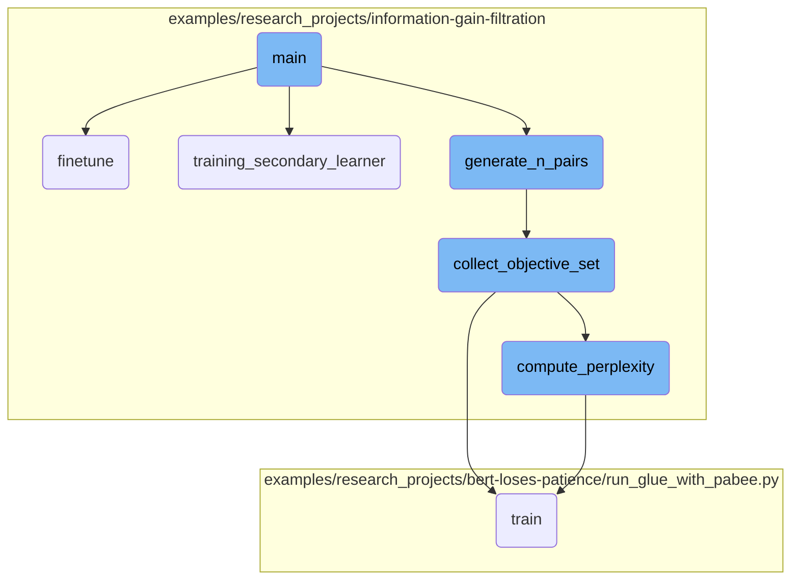
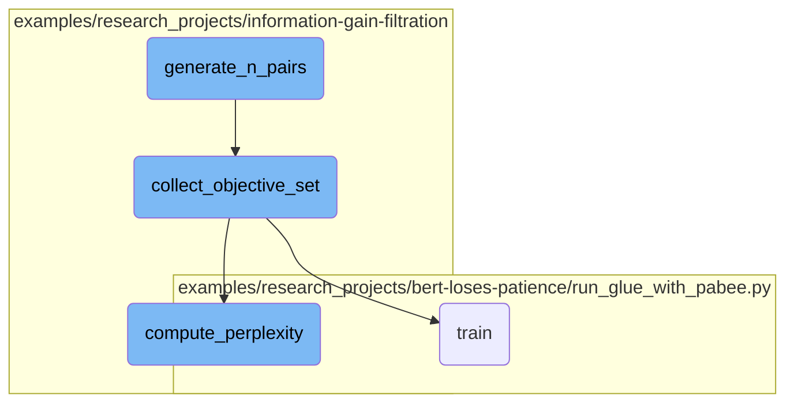

This document provides an overview of the main function's flow in a research project. The main function orchestrates the entire process, from parsing command-line arguments to <SwmToken path="examples/research_projects/information-gain-filtration/run_clm_igf.py" pos="433:3:5" line-data="    # fine-tuning of the openai-community/gpt2 model using igf (Information Gain Filtration)">`fine-tuning`</SwmToken> a <SwmToken path="examples/research_projects/information-gain-filtration/igf/igf.py" pos="40:4:6" line-data="        model: Pre-trained GPT2 model">`Pre-trained`</SwmToken> model. It includes steps such as generating training pairs, loading and training a secondary learner, and <SwmToken path="examples/research_projects/information-gain-filtration/run_clm_igf.py" pos="433:3:5" line-data="    # fine-tuning of the openai-community/gpt2 model using igf (Information Gain Filtration)">`fine-tuning`</SwmToken> the model.

The main function starts by gathering necessary parameters through command-line arguments. It then generates training pairs for the secondary learner and loads the training data. After training the secondary learner, it loads a <SwmToken path="examples/research_projects/information-gain-filtration/igf/igf.py" pos="40:4:6" line-data="        model: Pre-trained GPT2 model">`Pre-trained`</SwmToken> model and generates datasets for training and testing. Finally, it fine-tunes the model using the Information Gain Filtration method.

Here is a high level diagram of the flow, showing only the most important functions:



# Flow drill down

First, we'll zoom into this section of the flow:

```mermaid
graph TD;
      subgraph examples/research_projects/information-gain-filtration
c967914ca6a963d32c7b7de777730e47c9f62a81d2c4f27543be492d49087d01(main):::mainFlowStyle --> 5f0ca8827ed68de97f76953185ffde5f88750a2fb3f4c32c658556e2d1b3752e(finetune)
end

subgraph examples/research_projects/information-gain-filtration
c967914ca6a963d32c7b7de777730e47c9f62a81d2c4f27543be492d49087d01(main):::mainFlowStyle --> c5ce36bf69139eaaeca43666b8f9a39a04995df5c94a7e0365b711cb551a4351(training_secondary_learner)
end

subgraph examples/research_projects/information-gain-filtration
c967914ca6a963d32c7b7de777730e47c9f62a81d2c4f27543be492d49087d01(main):::mainFlowStyle --> 7b6c630bd7e5cf19d6c334bc1ccaee4408b471a24b7ce7ee3875816402993870(generate_n_pairs):::mainFlowStyle
end

subgraph examples/research_projects/information-gain-filtration
7b6c630bd7e5cf19d6c334bc1ccaee4408b471a24b7ce7ee3875816402993870(generate_n_pairs):::mainFlowStyle --> ditrj(...)
end

subgraph examples/research_projects/information-gain-filtration
c5ce36bf69139eaaeca43666b8f9a39a04995df5c94a7e0365b711cb551a4351(training_secondary_learner) --> 51e19deb74e2e70c9b2b8199c23f622d191b763ad66cc61955fbbda914614434(train_secondary_learner)
end

subgraph examples/research_projects/bert-loses-patience/run_glue_with_pabee.py
5f0ca8827ed68de97f76953185ffde5f88750a2fb3f4c32c658556e2d1b3752e(finetune) --> 997b8f5212cd2547cb091260b4408763b348ac29986c918c386c7c6a31ddf2d0(train)
end


      classDef mainFlowStyle color:#000000,fill:#7CB9F4
classDef rootsStyle color:#000000,fill:#00FFF4
classDef Style1 color:#000000,fill:#00FFAA
classDef Style2 color:#000000,fill:#FFFF00
classDef Style3 color:#000000,fill:#AA7CB9

%% Swimm:
%% graph TD;
%%       subgraph <SwmPath>[examples/research_projects/information-gain-filtration/](examples/research_projects/information-gain-filtration/)</SwmPath>
%% c967914ca6a963d32c7b7de777730e47c9f62a81d2c4f27543be492d49087d01(main):::mainFlowStyle --> 5f0ca8827ed68de97f76953185ffde5f88750a2fb3f4c32c658556e2d1b3752e(finetune)
%% end
%% 
%% subgraph <SwmPath>[examples/research_projects/information-gain-filtration/](examples/research_projects/information-gain-filtration/)</SwmPath>
%% c967914ca6a963d32c7b7de777730e47c9f62a81d2c4f27543be492d49087d01(main):::mainFlowStyle --> c5ce36bf69139eaaeca43666b8f9a39a04995df5c94a7e0365b711cb551a4351(training_secondary_learner)
%% end
%% 
%% subgraph <SwmPath>[examples/research_projects/information-gain-filtration/](examples/research_projects/information-gain-filtration/)</SwmPath>
%% c967914ca6a963d32c7b7de777730e47c9f62a81d2c4f27543be492d49087d01(main):::mainFlowStyle --> 7b6c630bd7e5cf19d6c334bc1ccaee4408b471a24b7ce7ee3875816402993870(generate_n_pairs):::mainFlowStyle
%% end
%% 
%% subgraph <SwmPath>[examples/research_projects/information-gain-filtration/](examples/research_projects/information-gain-filtration/)</SwmPath>
%% 7b6c630bd7e5cf19d6c334bc1ccaee4408b471a24b7ce7ee3875816402993870(generate_n_pairs):::mainFlowStyle --> ditrj(...)
%% end
%% 
%% subgraph <SwmPath>[examples/research_projects/information-gain-filtration/](examples/research_projects/information-gain-filtration/)</SwmPath>
%% c5ce36bf69139eaaeca43666b8f9a39a04995df5c94a7e0365b711cb551a4351(training_secondary_learner) --> 51e19deb74e2e70c9b2b8199c23f622d191b763ad66cc61955fbbda914614434(train_secondary_learner)
%% end
%% 
%% subgraph <SwmPath>[examples/research_projects/bert-loses-patience/run_glue_with_pabee.py](examples/research_projects/bert-loses-patience/run_glue_with_pabee.py)</SwmPath>
%% 5f0ca8827ed68de97f76953185ffde5f88750a2fb3f4c32c658556e2d1b3752e(finetune) --> 997b8f5212cd2547cb091260b4408763b348ac29986c918c386c7c6a31ddf2d0(train)
%% end
%% 
%% 
%%       classDef mainFlowStyle color:#000000,fill:#7CB9F4
%% classDef rootsStyle color:#000000,fill:#00FFF4
%% classDef Style1 color:#000000,fill:#00FFAA
%% classDef Style2 color:#000000,fill:#FFFF00
%% classDef Style3 color:#000000,fill:#AA7CB9
```



<SwmSnippet path="/examples/research_projects/information-gain-filtration/run_clm_igf.py" line="268">

---

## Argument Parsing

The <SwmToken path="examples/research_projects/information-gain-filtration/run_clm_igf.py" pos="268:2:2" line-data="def main():">`main`</SwmToken> function begins by parsing command-line arguments to gather necessary parameters such as data directories, model paths, and training configurations.

```python
def main():
    parser = argparse.ArgumentParser(description="Fine-tune a transformer model with IGF on a language modeling task")

    # Required parameters
    parser.add_argument(
        "--data_dir",
        default=None,
        type=str,
        required=True,
        help="The input data dir. Should contain data files for WikiText.",
    )
    parser.add_argument(
        "--model_name_or_path",
        default=None,
        type=str,
        required=True,
        help="Path to pretrained model or model identifier from huggingface.co/models",
    )
    parser.add_argument(
        "--data_file",
        type=str,
```

---

</SwmSnippet>

<SwmSnippet path="/examples/research_projects/information-gain-filtration/run_clm_igf.py" line="400">

---

## Generating Context and Information Gain Pairs

The function calls <SwmToken path="examples/research_projects/information-gain-filtration/run_clm_igf.py" pos="402:1:1" line-data="    generate_n_pairs(">`generate_n_pairs`</SwmToken> to collect context and information gain pairs for training the secondary learner.

```python
    # function calls
    # Collecting *n* pairs of context and information gain(X, IG(X)) for training the secondary learner
    generate_n_pairs(
        context_len=32,
        max_steps=10,
        size_objective_set=100,
        min_len=1026,
        trim=True,
        data_file="data/tokenized_stories_train_wikitext103.jbl",
        igf_data_file="igf_context_pairs.jbl",
    )
```

---

</SwmSnippet>

<SwmSnippet path="/examples/research_projects/information-gain-filtration/run_clm_igf.py" line="412">

---

## Loading and Training Secondary Learner

After loading the training data for the secondary learner, it invokes <SwmToken path="examples/research_projects/information-gain-filtration/run_clm_igf.py" pos="416:5:5" line-data="    secondary_learner = training_secondary_learner(">`training_secondary_learner`</SwmToken> to train the secondary learner model.

```python
    # Load train data for secondary learner
    secondary_learner_train_data = joblib.load("data/IGF_values.jbl")

    # Train secondary learner
    secondary_learner = training_secondary_learner(
        secondary_learner_train_data,
        secondary_learner_max_epochs=15,
        secondary_learner_batch_size=128,
        eval_freq=100,
        igf_model_path="igf_model.pt",
    )
```

---

</SwmSnippet>

<SwmSnippet path="/examples/research_projects/information-gain-filtration/run_clm_igf.py" line="424">

---

## Loading <SwmToken path="examples/research_projects/information-gain-filtration/igf/igf.py" pos="40:4:6" line-data="        model: Pre-trained GPT2 model">`Pre-trained`</SwmToken> Model and Generating Datasets

The <SwmToken path="examples/research_projects/information-gain-filtration/igf/igf.py" pos="40:4:6" line-data="        model: Pre-trained GPT2 model">`Pre-trained`</SwmToken> <SwmToken path="examples/research_projects/information-gain-filtration/igf/igf.py" pos="160:12:14" line-data="        orig_perp: Perplexity of original pretrained GPT-2 model">`GPT-2`</SwmToken> model is then loaded, and training and test datasets are generated.

```python
    # load pretrained openai-community/gpt2 model
    model = GPT2LMHeadModel.from_pretrained("openai-community/gpt2")
    set_seed(42)

    # Generate train and test data to train and evaluate openai-community/gpt2 model
    train_dataset, test_dataset = generate_datasets(
        context_len=32, file="data/tokenized_stories_train_wikitext103.jbl", number=100, min_len=1026, trim=True
    )
```

---

</SwmSnippet>

<SwmSnippet path="/examples/research_projects/information-gain-filtration/run_clm_igf.py" line="433">

---

## <SwmToken path="examples/research_projects/information-gain-filtration/run_clm_igf.py" pos="433:3:5" line-data="    # fine-tuning of the openai-community/gpt2 model using igf (Information Gain Filtration)">`fine-tuning`</SwmToken> the Model

Finally, the <SwmToken path="examples/research_projects/information-gain-filtration/run_clm_igf.py" pos="434:1:1" line-data="    finetune(">`finetune`</SwmToken> function is called to <SwmToken path="examples/research_projects/information-gain-filtration/run_clm_igf.py" pos="269:12:14" line-data="    parser = argparse.ArgumentParser(description=&quot;Fine-tune a transformer model with IGF on a language modeling task&quot;)">`Fine-tune`</SwmToken> the <SwmToken path="examples/research_projects/information-gain-filtration/igf/igf.py" pos="160:12:14" line-data="        orig_perp: Perplexity of original pretrained GPT-2 model">`GPT-2`</SwmToken> model using the IGF method, if a secondary learner is provided, or standard <SwmToken path="examples/research_projects/information-gain-filtration/run_clm_igf.py" pos="433:3:5" line-data="    # fine-tuning of the openai-community/gpt2 model using igf (Information Gain Filtration)">`fine-tuning`</SwmToken> otherwise.

```python
    # fine-tuning of the openai-community/gpt2 model using igf (Information Gain Filtration)
    finetune(
        model,
        train_dataset,
        test_dataset,
        context_len=32,
        max_steps=1000,
        batch_size=16,
        threshold=1.0,
        recopy_model=recopy_gpt2,
        secondary_learner=secondary_learner,
        eval_interval=10,
        finetuned_model_name="openai-community/gpt2_finetuned.pt",
    )
```

---

</SwmSnippet>

Now, lets zoom into this section of the flow:



<SwmSnippet path="/examples/research_projects/information-gain-filtration/run_clm_igf.py" line="74">

---

## Generating Training Pairs

The <SwmToken path="examples/research_projects/information-gain-filtration/run_clm_igf.py" pos="402:1:1" line-data="    generate_n_pairs(">`generate_n_pairs`</SwmToken> function is responsible for generating training pairs for the secondary learner. It sets a seed for reproducibility, generates training data and an objective set, loads a pretrained <SwmToken path="examples/research_projects/information-gain-filtration/igf/igf.py" pos="160:12:14" line-data="        orig_perp: Perplexity of original pretrained GPT-2 model">`GPT-2`</SwmToken> model, and computes the perplexity of the model on the objective set. Finally, it calls <SwmToken path="examples/research_projects/information-gain-filtration/run_clm_igf.py" pos="93:1:1" line-data="    collect_objective_set(model, orig_perp, context_len, train_data, objective_set, max_steps, device, igf_data_file)">`collect_objective_set`</SwmToken> to collect IGF pairs and save them to a file.

```python
    # generates same data everytime
    set_seed(3)
    # generate train_data and objective_set
    train_data, objective_set = generate_datasets(
        context_len, data_file, number=size_objective_set, min_len=1026, trim=True
    )
    # keeps model same across runs
    set_seed(4)
    # model, lm_optimizer, lm_scheduler = recopy_gpt2(model, device, max_steps) # store original model weights
    # can we train on GPU?
    device = torch.device("cuda:0" if torch.cuda.is_available() else "cpu")

    # load pretrained model
    model = load_gpt2("openai-community/gpt2").to(device)
    print("computing perplexity on objective set")
    orig_perp = compute_perplexity(model, objective_set, context_len).item()
    print("perplexity on objective set:", orig_perp)

    # collect igf pairs and save to file demo.jbl
    collect_objective_set(model, orig_perp, context_len, train_data, objective_set, max_steps, device, igf_data_file)

```

---

</SwmSnippet>

<SwmSnippet path="/examples/research_projects/information-gain-filtration/igf/igf.py" line="143">

---

## Collecting Objective Set

The <SwmToken path="examples/research_projects/information-gain-filtration/igf/igf.py" pos="143:2:2" line-data="def collect_objective_set(">`collect_objective_set`</SwmToken> function collects individual IGF values from a pretrained transformer model. It initializes variables to record information, computes the perplexity of the initial model, and iterates through training steps. During each step, it selects a context, computes the perplexity before and after backpropagation, and periodically saves the (X, <SwmToken path="examples/research_projects/information-gain-filtration/run_clm_igf.py" pos="401:24:26" line-data="    # Collecting *n* pairs of context and information gain(X, IG(X)) for training the secondary learner">`IG(X`</SwmToken>)) pairs. The model is reset to its original weights after each iteration.

```python
def collect_objective_set(
    model,
    orig_perp,
    context_len,
    train_data,
    objective_set,
    max_steps,
    device,
    filename="dev.jbl",
    recopy_model=recopy_gpt2,
):
    """
    Collect individual IGF values from pre-trained transformer model
    max_steps samples of training data to train secondary model

    Args:
        model: Pre-trained GPT2 model
        orig_perp: Perplexity of original pretrained GPT-2 model
        context_len: The maximum total input sequence length after tokenization. Sequences longer
                    than this will be truncated, sequences shorter will be padded
        train_data: Data to train model
```

---

</SwmSnippet>

<SwmSnippet path="/examples/research_projects/information-gain-filtration/igf/igf.py" line="35">

---

## Computing Perplexity

The <SwmToken path="examples/research_projects/information-gain-filtration/igf/igf.py" pos="35:2:2" line-data="def compute_perplexity(model, test_data, context_len):">`compute_perplexity`</SwmToken> function calculates the perplexity of a transformer model on a given dataset. It sets the model to evaluation mode, prepares the data loader, and iterates through the data to compute the loss. The perplexity is then calculated as the exponential of the average loss and the model is set back to training mode.

```python
def compute_perplexity(model, test_data, context_len):
    """
    Computes perplexity of the transformer model on data in test_data

    Args:
        model: Pre-trained GPT2 model
        test_data: Data on which perplexity calculation is required
        context_len: The maximum total input sequence length after tokenization. Sequences longer
                     than this will be truncated, sequences shorter will be padded

    Returns:
        Perplexity on input test data

    """

    model.eval()
    device = next(model.parameters()).device
    eval_batch_size = 1
    context = torch.zeros((eval_batch_size, context_len), dtype=torch.long, device=device)
    eval_dataloader = DataLoader(test_data, shuffle=False, batch_size=eval_batch_size)
    eval_loss = torch.zeros(1, device=device)
```

---

</SwmSnippet>

&nbsp;

*This is an auto-generated document by Swimm AI 🌊 and has not yet been verified by a human*

<SwmMeta version="3.0.0" repo-id="Z2l0aHViJTNBJTNBdHJhbnNmb3JtZXJzJTNBJTNBc2h1anV1dQ==" repo-name="transformers" doc-type="flows"><sup>Powered by [Swimm](/)</sup></SwmMeta>
