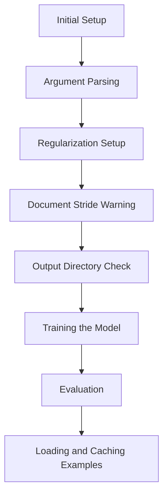

This document will cover the main function flow for training and evaluating NLP models. We'll cover:

1. Initial Setup
2. Argument Parsing
3. Regularization Setup
4. Document Stride Warning
5. Output Directory Check
6. Training the Model
7. Evaluation
8. Loading and Caching Examples

Technical document: <SwmLink doc-title="Main Function Flow Overview">[Main Function Flow Overview](/.swm/main-function-flow-overview.aaf6jkow.sw.md)</SwmLink>

# Initial Setup

The initial setup involves preparing the environment for training and evaluation. This includes setting up necessary configurations and ensuring that all dependencies are in place. This step is crucial to ensure that the subsequent steps can proceed without any issues.

# Argument Parsing

The main function starts by defining and parsing a comprehensive set of command-line arguments. These arguments include model parameters, file paths, training configurations, and various optional settings that control the behavior of the training and evaluation processes. This step allows users to customize the training and evaluation processes according to their specific needs.

# Regularization Setup

The function checks if the regularization argument is set to 'null' and adjusts it accordingly. This step ensures that the regularization parameter is correctly interpreted, which is important for controlling overfitting during training.

# Document Stride Warning

A warning is issued if the doc_stride parameter is set to a value that might cause issues during feature building. This helps prevent potential errors in the data processing pipeline by alerting the user to adjust the stride or increase the maximum length to ensure the features are correctly built.

# Output Directory Check

The function checks if the specified output directory already exists and is not empty. If so, and if the overwrite_output_dir flag is not set, it raises a ValueError to prevent accidental overwriting of existing data. This step is crucial to ensure that valuable data is not lost or overwritten unintentionally.

# Training the Model

The train function is responsible for training the model. It sets up the training environment, including the optimizer and scheduler, and handles the training loop. It also supports distributed training, mixed precision training, and model checkpointing. The function logs training metrics and handles model distillation if a teacher model is provided. This step is essential for building a robust and accurate model.

# Evaluation

The evaluate function evaluates the model on a validation dataset. It loads and caches the examples, sets up the evaluation data loader, and runs the evaluation loop. The function computes predictions and evaluates the model's performance using metrics like F1 score and exact match. This step is important for assessing the model's accuracy and effectiveness.

# Loading and Caching Examples

The load_and_cache_examples function loads the dataset and caches the features for faster subsequent access. It handles distributed training scenarios by ensuring only the first process processes the dataset while others use the cache. The function supports both training and evaluation modes and can return the dataset along with examples and features if required. This step optimizes the data loading process and ensures efficient use of resources.

&nbsp;

*This is an auto-generated document by Swimm AI 🌊 and has not yet been verified by a human*

<SwmMeta version="3.0.0" repo-id="Z2l0aHViJTNBJTNBdHJhbnNmb3JtZXJzJTNBJTNBc2h1anV1dQ==" repo-name="transformers">Powered by [Swimm](/)</SwmMeta>
