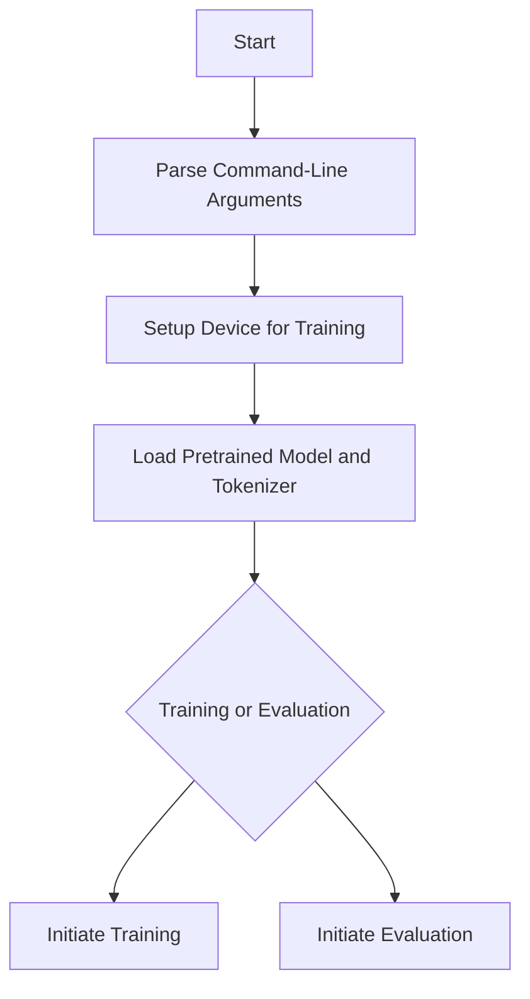

This document will cover the main function flow in a question-answering script. We'll cover:

1. Parsing command-line arguments
2. Setting up the device for training
3. Loading the pretrained model and tokenizer
4. Initiating training or evaluation

Technical document: <SwmLink doc-title="Main Function Flow">[Main Function Flow](/.swm/main-function-flow.cl496riz.sw.md)</SwmLink>

# Parsing Command-Line Arguments

The main function begins by parsing command-line arguments. These arguments include the model type, model path, output directory, and various training and evaluation parameters. This setup is crucial for configuring the model and tokenizer correctly. For example, the user specifies the type of model they want to use, the path to the pretrained model, and where the output should be saved. This step ensures that the script knows exactly what resources to use and where to store the results.

# Setting Up the Device for Training

The function sets up the device for training, whether it's a single GPU, multiple GPUs, or a distributed training setup. This ensures that the model utilizes the available hardware efficiently. For instance, if the user has a powerful GPU, the script will use it to speed up the training process. If multiple GPUs are available, the script can distribute the workload across them, making the training even faster. This step is essential for optimizing the performance and speed of the model training.

# Loading the Pretrained Model and Tokenizer

The pretrained model and tokenizer are loaded using specific configurations. This step is essential for initializing the model with the correct settings and tokenizer. For example, the script will load a model that has been pretrained on a large dataset, which can then be fine-tuned for the user's specific task. The tokenizer is also loaded to ensure that the text data is processed correctly. This step ensures that the model is ready to be trained or evaluated with the right configurations.

# Initiating Training or Evaluation

Depending on the parsed arguments, the function either initiates the training process or starts the evaluation process. This decision is based on specific flags provided by the user. For example, if the user wants to train the model, they will set a flag that tells the script to start the training process. Conversely, if they want to evaluate an already trained model, they will set a different flag. This step ensures that the script performs the correct action based on the user's needs.

&nbsp;

*This is an auto-generated document by Swimm AI 🌊 and has not yet been verified by a human*

<SwmMeta version="3.0.0" repo-id="Z2l0aHViJTNBJTNBdHJhbnNmb3JtZXJzJTNBJTNBc2h1anV1dQ==" repo-name="transformers">Powered by [Swimm](/)</SwmMeta>
