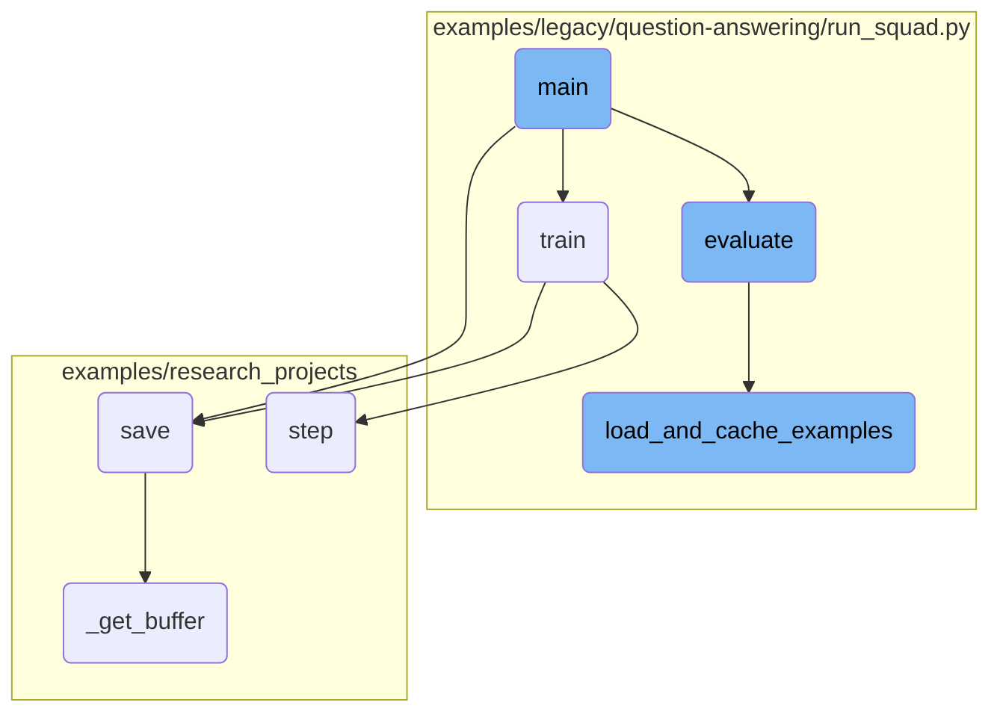

In this document, we will explain the flow of the main function in a <SwmToken path="examples/legacy/question-answering/run_squad.py" pos="16:14:16" line-data="&quot;&quot;&quot; Finetuning the library models for question-answering on SQuAD (DistilBERT, Bert, XLM, XLNet).&quot;&quot;&quot;">`question-answering`</SwmToken> script. The main function orchestrates the entire process, from parsing command-line arguments to training and evaluating the model.

The flow starts with parsing command-line arguments to configure the model and tokenizer. Next, it sets up the device for training, ensuring efficient use of available hardware. The pretrained model and tokenizer are then loaded. Finally, based on the provided arguments, the function either initiates the training process or starts the evaluation process.

# Flow drill down



<SwmSnippet path="/examples/legacy/question-answering/run_squad.py" line="474">

---

## Argument Parsing

The <SwmToken path="examples/legacy/question-answering/run_squad.py" pos="474:2:2" line-data="def main():">`main`</SwmToken> function begins by parsing command-line arguments using <SwmToken path="examples/legacy/question-answering/run_squad.py" pos="475:5:5" line-data="    parser = argparse.ArgumentParser()">`argparse`</SwmToken>. These arguments include model type, model path, output directory, and various training and evaluation parameters. This setup is crucial for configuring the model and tokenizer correctly.

```python
def main():
    parser = argparse.ArgumentParser()

    # Required parameters
    parser.add_argument(
        "--model_type",
        default=None,
        type=str,
        required=True,
        help="Model type selected in the list: " + ", ".join(MODEL_TYPES),
    )
    parser.add_argument(
        "--model_name_or_path",
        default=None,
        type=str,
        required=True,
        help="Path to pretrained model or model identifier from huggingface.co/models",
    )
    parser.add_argument(
        "--output_dir",
        default=None,
```

---

</SwmSnippet>

<SwmSnippet path="/examples/legacy/question-answering/run_squad.py" line="692">

---

## Device and Distributed Training Setup

The function sets up the device for training, whether it's a single GPU, multiple <SwmToken path="examples/legacy/question-answering/run_squad.py" pos="696:28:28" line-data="    else:  # Initializes the distributed backend which will take care of sychronizing nodes/GPUs">`GPUs`</SwmToken>, or a distributed training setup. This ensures that the model utilizes the available hardware efficiently.

```python
    # Setup CUDA, GPU & distributed training
    if args.local_rank == -1 or args.no_cuda:
        device = torch.device("cuda" if torch.cuda.is_available() and not args.no_cuda else "cpu")
        args.n_gpu = 0 if args.no_cuda else torch.cuda.device_count()
    else:  # Initializes the distributed backend which will take care of sychronizing nodes/GPUs
        torch.cuda.set_device(args.local_rank)
        device = torch.device("cuda", args.local_rank)
        torch.distributed.init_process_group(backend="nccl")
        args.n_gpu = 1
    args.device = device
```

---

</SwmSnippet>

<SwmSnippet path="/examples/legacy/question-answering/run_squad.py" line="725">

---

## Model and Tokenizer Loading

The pretrained model and tokenizer are loaded using <SwmToken path="examples/legacy/question-answering/run_squad.py" pos="731:5:5" line-data="    config = AutoConfig.from_pretrained(">`AutoConfig`</SwmToken>, <SwmToken path="examples/legacy/question-answering/run_squad.py" pos="735:5:5" line-data="    tokenizer = AutoTokenizer.from_pretrained(">`AutoTokenizer`</SwmToken>, and <SwmToken path="examples/legacy/question-answering/run_squad.py" pos="741:5:5" line-data="    model = AutoModelForQuestionAnswering.from_pretrained(">`AutoModelForQuestionAnswering`</SwmToken>. This step is essential for initializing the model with the correct configurations and tokenizer.

```python
    # Load pretrained model and tokenizer
    if args.local_rank not in [-1, 0]:
        # Make sure only the first process in distributed training will download model & vocab
        torch.distributed.barrier()

    args.model_type = args.model_type.lower()
    config = AutoConfig.from_pretrained(
        args.config_name if args.config_name else args.model_name_or_path,
        cache_dir=args.cache_dir if args.cache_dir else None,
    )
    tokenizer = AutoTokenizer.from_pretrained(
        args.tokenizer_name if args.tokenizer_name else args.model_name_or_path,
        do_lower_case=args.do_lower_case,
        cache_dir=args.cache_dir if args.cache_dir else None,
        use_fast=False,  # SquadDataset is not compatible with Fast tokenizers which have a smarter overflow handeling
    )
    model = AutoModelForQuestionAnswering.from_pretrained(
        args.model_name_or_path,
        from_tf=bool(".ckpt" in args.model_name_or_path),
        config=config,
        cache_dir=args.cache_dir if args.cache_dir else None,
```

---

</SwmSnippet>

<SwmSnippet path="/examples/legacy/question-answering/run_squad.py" line="767">

---

## Training and Evaluation

Depending on the parsed arguments, the function either initiates the training process by calling the <SwmToken path="examples/legacy/question-answering/run_squad.py" pos="770:8:8" line-data="        global_step, tr_loss = train(args, train_dataset, model, tokenizer)">`train`</SwmToken> function or starts the evaluation process by calling the <SwmToken path="examples/legacy/question-answering/run_squad.py" pos="769:13:13" line-data="        train_dataset = load_and_cache_examples(args, tokenizer, evaluate=False, output_examples=False)">`evaluate`</SwmToken> function. This decision is based on the <SwmToken path="examples/legacy/question-answering/run_squad.py" pos="570:6:7" line-data="    parser.add_argument(&quot;--do_train&quot;, action=&quot;store_true&quot;, help=&quot;Whether to run training.&quot;)">`--do_train`</SwmToken> and <SwmToken path="examples/legacy/question-answering/run_squad.py" pos="571:6:7" line-data="    parser.add_argument(&quot;--do_eval&quot;, action=&quot;store_true&quot;, help=&quot;Whether to run eval on the dev set.&quot;)">`--do_eval`</SwmToken> flags.

```python
    # Training
    if args.do_train:
        train_dataset = load_and_cache_examples(args, tokenizer, evaluate=False, output_examples=False)
        global_step, tr_loss = train(args, train_dataset, model, tokenizer)
        logger.info(" global_step = %s, average loss = %s", global_step, tr_loss)
```

---

</SwmSnippet>

&nbsp;

*This is an auto-generated document by Swimm AI 🌊 and has not yet been verified by a human*

<SwmMeta version="3.0.0" repo-id="Z2l0aHViJTNBJTNBdHJhbnNmb3JtZXJzJTNBJTNBc2h1anV1dQ==" repo-name="transformers"><sup>Powered by [Swimm](/)</sup></SwmMeta>
