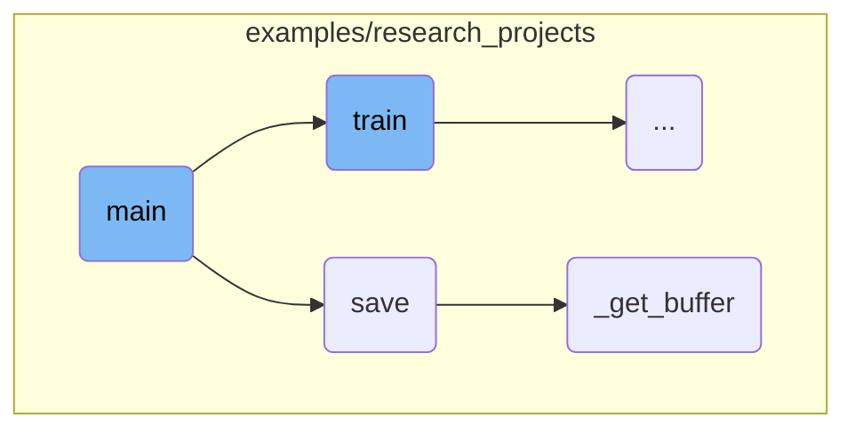
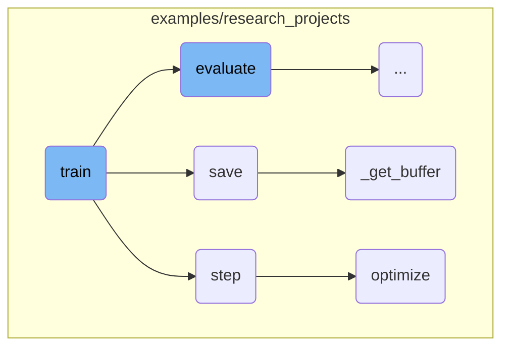
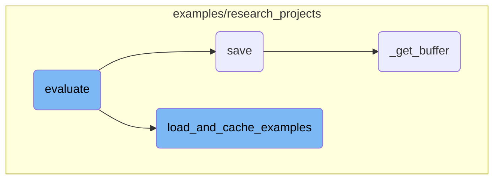

This document provides an overview of the main function's flow in a machine learning training script. The main function orchestrates the entire process, from parsing command-line arguments to training and evaluating the model.

The main function starts by reading the command-line arguments, which include paths to data and model configurations. It then sets up the environment, checking if the output directory exists and configuring the device for training. Next, it loads the pretrained model and tokenizer. If training is enabled, it trains the model and saves the results. If evaluation is enabled, it evaluates the model and logs the results.

Here is a high level diagram of the flow, showing only the most important functions:

```mermaid
graph TD;
      subgraph examples/research_projects
c55e52f4334f6f6553e27f6f052f8526d44caef0def32f852959093f8251b137(main):::mainFlowStyle --> a8b9cae6c7e5f9b45965d9c1867cc814f63d54ff23357ee9316532ae21a7382f(save)
end

subgraph examples/research_projects
c55e52f4334f6f6553e27f6f052f8526d44caef0def32f852959093f8251b137(main):::mainFlowStyle --> 3a41dfb77316db0cb5871fe12777f8ee020710911a71d87f0e6c155ef5634411(train):::mainFlowStyle
end

subgraph examples/research_projects
3a41dfb77316db0cb5871fe12777f8ee020710911a71d87f0e6c155ef5634411(train):::mainFlowStyle --> 6e607b060f7c1df9e5d57b2ad94926566134955ed97b0934bff72d2b25b99233(step)
end

subgraph examples/research_projects
3a41dfb77316db0cb5871fe12777f8ee020710911a71d87f0e6c155ef5634411(train):::mainFlowStyle --> a8b9cae6c7e5f9b45965d9c1867cc814f63d54ff23357ee9316532ae21a7382f(save)
end

subgraph examples/research_projects
3a41dfb77316db0cb5871fe12777f8ee020710911a71d87f0e6c155ef5634411(train):::mainFlowStyle --> c71de3ba0fc3c5e16292c8f656c085c4b342da0a3e3a57f83ae03e54ad766afe(evaluate):::mainFlowStyle
end

subgraph examples/research_projects
c71de3ba0fc3c5e16292c8f656c085c4b342da0a3e3a57f83ae03e54ad766afe(evaluate):::mainFlowStyle --> a8b9cae6c7e5f9b45965d9c1867cc814f63d54ff23357ee9316532ae21a7382f(save)
end

subgraph examples/research_projects
c71de3ba0fc3c5e16292c8f656c085c4b342da0a3e3a57f83ae03e54ad766afe(evaluate):::mainFlowStyle --> 6960fe772a31ad459f3e4abfc0fdf90c253b14e047d21d8b3294532ee4ea9ae8(load_and_cache_examples):::mainFlowStyle
end

subgraph examples/research_projects
6960fe772a31ad459f3e4abfc0fdf90c253b14e047d21d8b3294532ee4ea9ae8(load_and_cache_examples):::mainFlowStyle --> a8b9cae6c7e5f9b45965d9c1867cc814f63d54ff23357ee9316532ae21a7382f(save)
end


      classDef mainFlowStyle color:#000000,fill:#7CB9F4
classDef rootsStyle color:#000000,fill:#00FFF4
classDef Style1 color:#000000,fill:#00FFAA
classDef Style2 color:#000000,fill:#FFFF00
classDef Style3 color:#000000,fill:#AA7CB9

%% Swimm:
%% graph TD;
%%       subgraph <SwmPath>[examples/research_projects/](examples/research_projects/)</SwmPath>
%% c55e52f4334f6f6553e27f6f052f8526d44caef0def32f852959093f8251b137(main):::mainFlowStyle --> a8b9cae6c7e5f9b45965d9c1867cc814f63d54ff23357ee9316532ae21a7382f(save)
%% end
%% 
%% subgraph <SwmPath>[examples/research_projects/](examples/research_projects/)</SwmPath>
%% c55e52f4334f6f6553e27f6f052f8526d44caef0def32f852959093f8251b137(main):::mainFlowStyle --> 3a41dfb77316db0cb5871fe12777f8ee020710911a71d87f0e6c155ef5634411(train):::mainFlowStyle
%% end
%% 
%% subgraph <SwmPath>[examples/research_projects/](examples/research_projects/)</SwmPath>
%% 3a41dfb77316db0cb5871fe12777f8ee020710911a71d87f0e6c155ef5634411(train):::mainFlowStyle --> 6e607b060f7c1df9e5d57b2ad94926566134955ed97b0934bff72d2b25b99233(step)
%% end
%% 
%% subgraph <SwmPath>[examples/research_projects/](examples/research_projects/)</SwmPath>
%% 3a41dfb77316db0cb5871fe12777f8ee020710911a71d87f0e6c155ef5634411(train):::mainFlowStyle --> a8b9cae6c7e5f9b45965d9c1867cc814f63d54ff23357ee9316532ae21a7382f(save)
%% end
%% 
%% subgraph <SwmPath>[examples/research_projects/](examples/research_projects/)</SwmPath>
%% 3a41dfb77316db0cb5871fe12777f8ee020710911a71d87f0e6c155ef5634411(train):::mainFlowStyle --> c71de3ba0fc3c5e16292c8f656c085c4b342da0a3e3a57f83ae03e54ad766afe(evaluate):::mainFlowStyle
%% end
%% 
%% subgraph <SwmPath>[examples/research_projects/](examples/research_projects/)</SwmPath>
%% c71de3ba0fc3c5e16292c8f656c085c4b342da0a3e3a57f83ae03e54ad766afe(evaluate):::mainFlowStyle --> a8b9cae6c7e5f9b45965d9c1867cc814f63d54ff23357ee9316532ae21a7382f(save)
%% end
%% 
%% subgraph <SwmPath>[examples/research_projects/](examples/research_projects/)</SwmPath>
%% c71de3ba0fc3c5e16292c8f656c085c4b342da0a3e3a57f83ae03e54ad766afe(evaluate):::mainFlowStyle --> 6960fe772a31ad459f3e4abfc0fdf90c253b14e047d21d8b3294532ee4ea9ae8(load_and_cache_examples):::mainFlowStyle
%% end
%% 
%% subgraph <SwmPath>[examples/research_projects/](examples/research_projects/)</SwmPath>
%% 6960fe772a31ad459f3e4abfc0fdf90c253b14e047d21d8b3294532ee4ea9ae8(load_and_cache_examples):::mainFlowStyle --> a8b9cae6c7e5f9b45965d9c1867cc814f63d54ff23357ee9316532ae21a7382f(save)
%% end
%% 
%% 
%%       classDef mainFlowStyle color:#000000,fill:#7CB9F4
%% classDef rootsStyle color:#000000,fill:#00FFF4
%% classDef Style1 color:#000000,fill:#00FFAA
%% classDef Style2 color:#000000,fill:#FFFF00
%% classDef Style3 color:#000000,fill:#AA7CB9
```



# Flow drill down

First, we'll zoom into this section of the flow:



<SwmSnippet path="/examples/research_projects/deebert/run_glue_deebert.py" line="395">

---

## Argument Parsing

The <SwmToken path="examples/research_projects/deebert/run_glue_deebert.py" pos="395:2:2" line-data="def main():">`main`</SwmToken> function starts by parsing command-line arguments using <SwmToken path="examples/research_projects/deebert/run_glue_deebert.py" pos="396:5:5" line-data="    parser = argparse.ArgumentParser()">`argparse`</SwmToken>. These arguments include paths to data, model type, task name, and various training parameters. This setup is crucial for configuring the training and evaluation processes.

```python
def main():
    parser = argparse.ArgumentParser()

    # Required parameters
    parser.add_argument(
        "--data_dir",
        default=None,
        type=str,
        required=True,
        help="The input data dir. Should contain the .tsv files (or other data files) for the task.",
    )
    parser.add_argument(
        "--model_type",
        default=None,
        type=str,
        required=True,
        help="Model type selected in the list: " + ", ".join(MODEL_CLASSES.keys()),
    )
    parser.add_argument(
        "--model_name_or_path",
        default=None,
```

---

</SwmSnippet>

<SwmSnippet path="/examples/research_projects/deebert/run_glue_deebert.py" line="545">

---

## Environment Setup

The function then checks if the output directory exists and sets up the environment for distributed training if needed. It configures the device (CPU or GPU) and initializes the distributed backend for <SwmToken path="examples/research_projects/deebert/run_glue_deebert.py" pos="257:3:5" line-data="        # multi-gpu eval">`multi-gpu`</SwmToken> training.

```python
        os.path.exists(args.output_dir)
        and os.listdir(args.output_dir)
        and args.do_train
        and not args.overwrite_output_dir
    ):
        raise ValueError(
            "Output directory ({}) already exists and is not empty. Use --overwrite_output_dir to overcome.".format(
                args.output_dir
            )
        )

    # Setup distant debugging if needed
    if args.server_ip and args.server_port:
        # Distant debugging - see https://code.visualstudio.com/docs/python/debugging#_attach-to-a-local-script
        import ptvsd

        print("Waiting for debugger attach")
        ptvsd.enable_attach(address=(args.server_ip, args.server_port), redirect_output=True)
        ptvsd.wait_for_attach()

    # Setup CUDA, GPU & distributed training
```

---

</SwmSnippet>

<SwmSnippet path="/examples/research_projects/deebert/run_glue_deebert.py" line="607">

---

## Model and Tokenizer Loading

The function loads the pretrained model and tokenizer based on the specified model type and path. It ensures that only the first process in distributed training downloads the model and vocabulary.

```python
    # Load pretrained model and tokenizer
    if args.local_rank not in [-1, 0]:
        torch.distributed.barrier()  # Make sure only the first process in distributed training will download model & vocab

    args.model_type = args.model_type.lower()
    config_class, model_class, tokenizer_class = MODEL_CLASSES[args.model_type]
    config = config_class.from_pretrained(
        args.config_name if args.config_name else args.model_name_or_path,
        num_labels=num_labels,
        finetuning_task=args.task_name,
        cache_dir=args.cache_dir if args.cache_dir else None,
    )
    tokenizer = tokenizer_class.from_pretrained(
        args.tokenizer_name if args.tokenizer_name else args.model_name_or_path,
        do_lower_case=args.do_lower_case,
        cache_dir=args.cache_dir if args.cache_dir else None,
    )
    model = model_class.from_pretrained(
        args.model_name_or_path,
        from_tf=bool(".ckpt" in args.model_name_or_path),
        config=config,
```

---

</SwmSnippet>

<SwmSnippet path="/examples/research_projects/deebert/run_glue_deebert.py" line="647">

---

## Training and Evaluation

If the <SwmToken path="examples/research_projects/deebert/run_glue_deebert.py" pos="648:5:5" line-data="    if args.do_train:">`do_train`</SwmToken> flag is set, the function calls <SwmToken path="examples/research_projects/deebert/run_glue_deebert.py" pos="650:8:8" line-data="        global_step, tr_loss = train(args, train_dataset, model, tokenizer)">`train`</SwmToken> to start the training process. After training, it saves the model and tokenizer. If the <SwmToken path="examples/research_projects/deebert/run_glue_deebert.py" pos="468:7:7" line-data="    parser.add_argument(&quot;--do_eval&quot;, action=&quot;store_true&quot;, help=&quot;Whether to run eval on the dev set.&quot;)">`do_eval`</SwmToken> flag is set, it evaluates the model on the validation set and logs the results.

```python
    # Training
    if args.do_train:
        train_dataset = load_and_cache_examples(args, args.task_name, tokenizer, evaluate=False)
        global_step, tr_loss = train(args, train_dataset, model, tokenizer)
        logger.info(" global_step = %s, average loss = %s", global_step, tr_loss)

        if args.eval_after_first_stage:
            result = evaluate(args, model, tokenizer, prefix="")
            print_result = get_wanted_result(result)

        train(args, train_dataset, model, tokenizer, train_highway=True)

    # Saving best-practices: if you use defaults names for the model, you can reload it using from_pretrained()
    if args.do_train and (args.local_rank == -1 or torch.distributed.get_rank() == 0):
        # Create output directory if needed
        if not os.path.exists(args.output_dir) and args.local_rank in [-1, 0]:
            os.makedirs(args.output_dir)

        logger.info("Saving model checkpoint to %s", args.output_dir)
        # Save a trained model, configuration and tokenizer using `save_pretrained()`.
        # They can then be reloaded using `from_pretrained()`
```

---

</SwmSnippet>

<SwmSnippet path="/examples/research_projects/lxmert/visualizing_image.py" line="195">

---

## Saving the Model

The <SwmToken path="examples/research_projects/lxmert/visualizing_image.py" pos="195:3:3" line-data="    def save(self, saveas=None):">`save`</SwmToken> function saves the visualized image to a specified path. If the path ends with <SwmToken path="examples/research_projects/lxmert/visualizing_image.py" pos="198:12:13" line-data="        if saveas.lower().endswith(&quot;.jpg&quot;) or saveas.lower().endswith(&quot;.png&quot;):">`.jpg`</SwmToken> or <SwmToken path="examples/research_projects/lxmert/visualizing_image.py" pos="198:28:29" line-data="        if saveas.lower().endswith(&quot;.jpg&quot;) or saveas.lower().endswith(&quot;.png&quot;):">`.png`</SwmToken>, it uses OpenCV to write the image file. Otherwise, it uses Matplotlib's <SwmToken path="examples/research_projects/lxmert/visualizing_image.py" pos="204:5:5" line-data="            self.fig.savefig(saveas)">`savefig`</SwmToken> method.

```python
    def save(self, saveas=None):
        if saveas is None:
            saveas = self.saveas
        if saveas.lower().endswith(".jpg") or saveas.lower().endswith(".png"):
            cv2.imwrite(
                saveas,
                self._get_buffer()[:, :, ::-1],
            )
        else:
            self.fig.savefig(saveas)
```

---

</SwmSnippet>

<SwmSnippet path="/examples/research_projects/lxmert/visualizing_image.py" line="231">

---

## Getting the Buffer

The <SwmToken path="examples/research_projects/lxmert/visualizing_image.py" pos="231:3:3" line-data="    def _get_buffer(self):">`_get_buffer`</SwmToken> function retrieves the image buffer from the canvas. It handles resizing and alpha blending to produce the final visualized image.

```python
    def _get_buffer(self):
        if not self.pynb:
            s, (width, height) = self.canvas.print_to_buffer()
            if (width, height) != (self.width, self.height):
                img = cv2.resize(self.img, (width, height))
            else:
                img = self.img
        else:
            buf = io.BytesIO()  # works for cairo backend
            self.canvas.print_rgba(buf)
            width, height = self.width, self.height
            s = buf.getvalue()
            img = self.img

        buffer = np.frombuffer(s, dtype="uint8")
        img_rgba = buffer.reshape(height, width, 4)
        rgb, alpha = np.split(img_rgba, [3], axis=2)

        try:
            import numexpr as ne  # fuse them with numexpr

```

---

</SwmSnippet>

Now, lets zoom into this section of the flow:



<SwmSnippet path="/examples/research_projects/deebert/run_glue_deebert.py" line="73">

---

## Training the Model

The <SwmToken path="examples/research_projects/deebert/run_glue_deebert.py" pos="73:2:2" line-data="def train(args, train_dataset, model, tokenizer, train_highway=False):">`train`</SwmToken> function is responsible for training the model. It sets up the training environment, including the data loader, optimizer, and scheduler. The function iterates over the training data, performs forward and backward passes, and updates the model parameters. It also handles <SwmToken path="examples/research_projects/deebert/run_glue_deebert.py" pos="257:3:5" line-data="        # multi-gpu eval">`multi-gpu`</SwmToken> and distributed training setups, logging, and checkpoint saving.

```python
def train(args, train_dataset, model, tokenizer, train_highway=False):
    """Train the model"""
    if args.local_rank in [-1, 0]:
        tb_writer = SummaryWriter()

    args.train_batch_size = args.per_gpu_train_batch_size * max(1, args.n_gpu)
    train_sampler = RandomSampler(train_dataset) if args.local_rank == -1 else DistributedSampler(train_dataset)
    train_dataloader = DataLoader(train_dataset, sampler=train_sampler, batch_size=args.train_batch_size)

    if args.max_steps > 0:
        t_total = args.max_steps
        args.num_train_epochs = args.max_steps // (len(train_dataloader) // args.gradient_accumulation_steps) + 1
    else:
        t_total = len(train_dataloader) // args.gradient_accumulation_steps * args.num_train_epochs

    # Prepare optimizer and schedule (linear warmup and decay)
    no_decay = ["bias", "LayerNorm.weight"]
    if train_highway:
        optimizer_grouped_parameters = [
            {
                "params": [
```

---

</SwmSnippet>

<SwmSnippet path="/examples/research_projects/distillation/distiller.py" line="372">

---

## Performing an Optimization Step

The <SwmToken path="examples/research_projects/distillation/distiller.py" pos="372:3:3" line-data="    def step(self, input_ids: torch.tensor, attention_mask: torch.tensor, lm_labels: torch.tensor):">`step`</SwmToken> function performs one optimization step, which includes the forward pass of both the student and teacher models, calculating the loss, and calling the <SwmToken path="examples/research_projects/distillation/distiller.py" pos="466:3:3" line-data="    def optimize(self, loss):">`optimize`</SwmToken> function to update the model parameters. It handles different types of losses such as cross-entropy, mean squared error, and cosine similarity, and accumulates these losses for optimization.

```python
    def step(self, input_ids: torch.tensor, attention_mask: torch.tensor, lm_labels: torch.tensor):
        """
        One optimization step: forward of student AND teacher, backward on the loss (for gradient accumulation),
        and possibly a parameter update (depending on the gradient accumulation).

        Input:
        ------
        input_ids: `torch.tensor(bs, seq_length)` - The token ids.
        attention_mask: `torch.tensor(bs, seq_length)` - The attention mask for self attention.
        lm_labels: `torch.tensor(bs, seq_length)` - The language modeling labels (mlm labels for MLM and clm labels for CLM).
        """
        if self.mlm:
            student_outputs = self.student(
                input_ids=input_ids, attention_mask=attention_mask
            )  # (bs, seq_length, voc_size)
            with torch.no_grad():
                teacher_outputs = self.teacher(
                    input_ids=input_ids, attention_mask=attention_mask
                )  # (bs, seq_length, voc_size)
        else:
            student_outputs = self.student(input_ids=input_ids, attention_mask=None)  # (bs, seq_length, voc_size)
```

---

</SwmSnippet>

<SwmSnippet path="/examples/research_projects/distillation/distiller.py" line="466">

---

## Optimizing the Loss

The <SwmToken path="examples/research_projects/distillation/distiller.py" pos="466:3:3" line-data="    def optimize(self, loss):">`optimize`</SwmToken> function normalizes the loss, performs a backward pass, and updates the model parameters. It also handles gradient clipping and updates the learning rate scheduler. This function ensures that the gradients are properly accumulated and the model parameters are updated accordingly.

```python
    def optimize(self, loss):
        """
        Normalization on the loss (gradient accumulation or distributed training), followed by
        backward pass on the loss, possibly followed by a parameter update (depending on the gradient accumulation).
        Also update the metrics for tensorboard.
        """
        # Check for NaN
        if (loss != loss).data.any():
            logger.error("NaN detected")
            exit()

        if self.multi_gpu:
            loss = loss.mean()
        if self.params.gradient_accumulation_steps > 1:
            loss = loss / self.params.gradient_accumulation_steps

        if self.fp16:
            from apex import amp

            with amp.scale_loss(loss, self.optimizer) as scaled_loss:
                scaled_loss.backward()
```

---

</SwmSnippet>

Now, lets zoom into this section of the flow:



<SwmSnippet path="/examples/research_projects/deebert/run_glue_deebert.py" line="240">

---

## Model Evaluation

The <SwmToken path="examples/research_projects/deebert/run_glue_deebert.py" pos="240:2:2" line-data="def evaluate(args, model, tokenizer, prefix=&quot;&quot;, output_layer=-1, eval_highway=False):">`evaluate`</SwmToken> function is responsible for evaluating the model's performance on a given dataset. It handles multiple evaluation tasks, sets up the evaluation data loader, and performs the evaluation loop. The function also logs evaluation metrics and saves the results to a file.

```python
def evaluate(args, model, tokenizer, prefix="", output_layer=-1, eval_highway=False):
    # Loop to handle MNLI double evaluation (matched, mis-matched)
    eval_task_names = ("mnli", "mnli-mm") if args.task_name == "mnli" else (args.task_name,)
    eval_outputs_dirs = (args.output_dir, args.output_dir + "-MM") if args.task_name == "mnli" else (args.output_dir,)

    results = {}
    for eval_task, eval_output_dir in zip(eval_task_names, eval_outputs_dirs):
        eval_dataset = load_and_cache_examples(args, eval_task, tokenizer, evaluate=True)

        if not os.path.exists(eval_output_dir) and args.local_rank in [-1, 0]:
            os.makedirs(eval_output_dir)

        args.eval_batch_size = args.per_gpu_eval_batch_size * max(1, args.n_gpu)
        # Note that DistributedSampler samples randomly
        eval_sampler = SequentialSampler(eval_dataset) if args.local_rank == -1 else DistributedSampler(eval_dataset)
        eval_dataloader = DataLoader(eval_dataset, sampler=eval_sampler, batch_size=args.eval_batch_size)

        # multi-gpu eval
        if args.n_gpu > 1:
            model = nn.DataParallel(model)

```

---

</SwmSnippet>

<SwmSnippet path="/examples/research_projects/deebert/run_glue_deebert.py" line="335">

---

### Loading and Caching Examples

The <SwmToken path="examples/research_projects/deebert/run_glue_deebert.py" pos="335:2:2" line-data="def load_and_cache_examples(args, task, tokenizer, evaluate=False):">`load_and_cache_examples`</SwmToken> function loads the dataset for a specific task, processes it into features, and caches these features for future use. This function ensures that the dataset is only processed once and reused efficiently in subsequent runs.

```python
def load_and_cache_examples(args, task, tokenizer, evaluate=False):
    if args.local_rank not in [-1, 0] and not evaluate:
        torch.distributed.barrier()  # Make sure only the first process in distributed training process the dataset, and the others will use the cache

    processor = processors[task]()
    output_mode = output_modes[task]
    # Load data features from cache or dataset file
    cached_features_file = os.path.join(
        args.data_dir,
        "cached_{}_{}_{}_{}".format(
            "dev" if evaluate else "train",
            list(filter(None, args.model_name_or_path.split("/"))).pop(),
            str(args.max_seq_length),
            str(task),
        ),
    )
    if os.path.exists(cached_features_file) and not args.overwrite_cache:
        logger.info("Loading features from cached file %s", cached_features_file)
        features = torch.load(cached_features_file)
    else:
        logger.info("Creating features from dataset file at %s", args.data_dir)
```

---

</SwmSnippet>

The 'transformers' repository by Hugging Face provides a library for state-of-the-art machine learning models, focusing on transformer architectures. It supports JAX, <SwmToken path="examples/research_projects/distillation/distiller.py" pos="219:17:17" line-data="        )  # previously `dtype=torch.uint8`, cf pytorch 1.2.0 compatibility">`pytorch`</SwmToken>, and TensorFlow, offering thousands of pretrained models for tasks in text, vision, and audio. The library includes APIs for easy model downloading, fine-tuning, and sharing, and integrates with the Hugging Face model hub. The README includes usage examples, installation instructions, and links to further documentation.

&nbsp;

*This is an auto-generated document by Swimm AI 🌊 and has not yet been verified by a human*

<SwmMeta version="3.0.0" repo-id="Z2l0aHViJTNBJTNBdHJhbnNmb3JtZXJzJTNBJTNBc2h1anV1dQ==" repo-name="transformers" doc-type="flows"><sup>Powered by [Swimm](/)</sup></SwmMeta>
