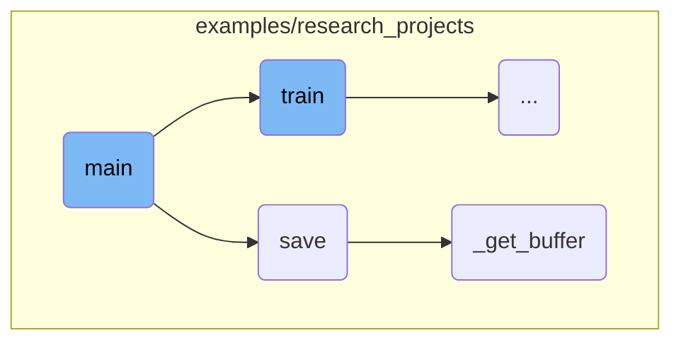
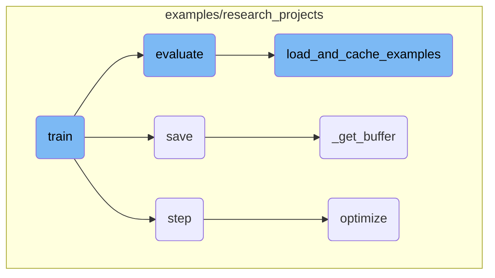

This document provides an overview of the main function's flow in a script used for training and evaluating NLP models. The main function is responsible for setting up the environment, parsing arguments, preparing tasks, loading models, and managing the training and evaluation processes.

The main function starts by setting up an argument parser to handle various input parameters needed for training and evaluation. It then configures the environment, including setting up CUDA for GPU usage and initializing distributed training if necessary. Logging is configured to provide useful information during the process, and a random seed is set for reproducibility. The function prepares the specific task by loading the appropriate processor and obtaining the labels. Finally, it loads the pretrained model and tokenizer based on the specified arguments, ensuring the model is ready for training or evaluation.

Here is a high level diagram of the flow, showing only the most important functions:

```mermaid
graph TD;
      subgraph examples/research_projects
1d2de60c15c9821b9487ef4ab9c46324447eb586aed8c9a4c0ccb2b3b274b7ec(main):::mainFlowStyle --> a8b9cae6c7e5f9b45965d9c1867cc814f63d54ff23357ee9316532ae21a7382f(save)
end

subgraph examples/research_projects
1d2de60c15c9821b9487ef4ab9c46324447eb586aed8c9a4c0ccb2b3b274b7ec(main):::mainFlowStyle --> 49547cd58d7108ed83769f1696c8b699b9c8e8af61958437f08df3177791584e(train):::mainFlowStyle
end

subgraph examples/research_projects
49547cd58d7108ed83769f1696c8b699b9c8e8af61958437f08df3177791584e(train):::mainFlowStyle --> 6e607b060f7c1df9e5d57b2ad94926566134955ed97b0934bff72d2b25b99233(step)
end

subgraph examples/research_projects
49547cd58d7108ed83769f1696c8b699b9c8e8af61958437f08df3177791584e(train):::mainFlowStyle --> a8b9cae6c7e5f9b45965d9c1867cc814f63d54ff23357ee9316532ae21a7382f(save)
end

subgraph examples/research_projects
49547cd58d7108ed83769f1696c8b699b9c8e8af61958437f08df3177791584e(train):::mainFlowStyle --> 416a4c9c2dd39248360609ec81cfee930e7a39f15db12723cbe39ee6007fc4b1(evaluate):::mainFlowStyle
end

subgraph examples/research_projects
416a4c9c2dd39248360609ec81cfee930e7a39f15db12723cbe39ee6007fc4b1(evaluate):::mainFlowStyle --> fd8c633f8bf2caf14fa9f16ce8f9477b12ea87936a5214a6c933068ae611496f(load_and_cache_examples):::mainFlowStyle
end

subgraph examples/research_projects
fd8c633f8bf2caf14fa9f16ce8f9477b12ea87936a5214a6c933068ae611496f(load_and_cache_examples):::mainFlowStyle --> a8b9cae6c7e5f9b45965d9c1867cc814f63d54ff23357ee9316532ae21a7382f(save)
end


      classDef mainFlowStyle color:#000000,fill:#7CB9F4
classDef rootsStyle color:#000000,fill:#00FFF4
classDef Style1 color:#000000,fill:#00FFAA
classDef Style2 color:#000000,fill:#FFFF00
classDef Style3 color:#000000,fill:#AA7CB9

%% Swimm:
%% graph TD;
%%       subgraph <SwmPath>[examples/research_projects/](examples/research_projects/)</SwmPath>
%% 1d2de60c15c9821b9487ef4ab9c46324447eb586aed8c9a4c0ccb2b3b274b7ec(main):::mainFlowStyle --> a8b9cae6c7e5f9b45965d9c1867cc814f63d54ff23357ee9316532ae21a7382f(save)
%% end
%% 
%% subgraph <SwmPath>[examples/research_projects/](examples/research_projects/)</SwmPath>
%% 1d2de60c15c9821b9487ef4ab9c46324447eb586aed8c9a4c0ccb2b3b274b7ec(main):::mainFlowStyle --> 49547cd58d7108ed83769f1696c8b699b9c8e8af61958437f08df3177791584e(train):::mainFlowStyle
%% end
%% 
%% subgraph <SwmPath>[examples/research_projects/](examples/research_projects/)</SwmPath>
%% 49547cd58d7108ed83769f1696c8b699b9c8e8af61958437f08df3177791584e(train):::mainFlowStyle --> 6e607b060f7c1df9e5d57b2ad94926566134955ed97b0934bff72d2b25b99233(step)
%% end
%% 
%% subgraph <SwmPath>[examples/research_projects/](examples/research_projects/)</SwmPath>
%% 49547cd58d7108ed83769f1696c8b699b9c8e8af61958437f08df3177791584e(train):::mainFlowStyle --> a8b9cae6c7e5f9b45965d9c1867cc814f63d54ff23357ee9316532ae21a7382f(save)
%% end
%% 
%% subgraph <SwmPath>[examples/research_projects/](examples/research_projects/)</SwmPath>
%% 49547cd58d7108ed83769f1696c8b699b9c8e8af61958437f08df3177791584e(train):::mainFlowStyle --> 416a4c9c2dd39248360609ec81cfee930e7a39f15db12723cbe39ee6007fc4b1(evaluate):::mainFlowStyle
%% end
%% 
%% subgraph <SwmPath>[examples/research_projects/](examples/research_projects/)</SwmPath>
%% 416a4c9c2dd39248360609ec81cfee930e7a39f15db12723cbe39ee6007fc4b1(evaluate):::mainFlowStyle --> fd8c633f8bf2caf14fa9f16ce8f9477b12ea87936a5214a6c933068ae611496f(load_and_cache_examples):::mainFlowStyle
%% end
%% 
%% subgraph <SwmPath>[examples/research_projects/](examples/research_projects/)</SwmPath>
%% fd8c633f8bf2caf14fa9f16ce8f9477b12ea87936a5214a6c933068ae611496f(load_and_cache_examples):::mainFlowStyle --> a8b9cae6c7e5f9b45965d9c1867cc814f63d54ff23357ee9316532ae21a7382f(save)
%% end
%% 
%% 
%%       classDef mainFlowStyle color:#000000,fill:#7CB9F4
%% classDef rootsStyle color:#000000,fill:#00FFF4
%% classDef Style1 color:#000000,fill:#00FFAA
%% classDef Style2 color:#000000,fill:#FFFF00
%% classDef Style3 color:#000000,fill:#AA7CB9
```



# Flow drill down

First, we'll zoom into this section of the flow:



<SwmSnippet path="/examples/research_projects/movement-pruning/masked_run_glue.py" line="567">

---

## Argument Parsing

The <SwmToken path="examples/research_projects/movement-pruning/masked_run_glue.py" pos="566:2:2" line-data="def main():">`main`</SwmToken> function begins by setting up an argument parser to handle various input parameters required for training and evaluation. These parameters include paths to data directories, model types, task names, and various training configurations. This setup ensures that the script can be flexibly used for different tasks and models.

```python
    parser = argparse.ArgumentParser()

    # Required parameters
    parser.add_argument(
        "--data_dir",
        default=None,
        type=str,
        required=True,
        help="The input data dir. Should contain the .tsv files (or other data files) for the task.",
    )
    parser.add_argument(
        "--model_type",
        default=None,
        type=str,
        required=True,
        help="Model type selected in the list: " + ", ".join(MODEL_CLASSES.keys()),
    )
    parser.add_argument(
        "--model_name_or_path",
        default=None,
        type=str,
```

---

</SwmSnippet>

<SwmSnippet path="/examples/research_projects/movement-pruning/masked_run_glue.py" line="814">

---

## Environment Setup

The function then sets up the environment for training, including configuring CUDA for GPU usage and initializing distributed training if necessary. This step is crucial for optimizing the training process and ensuring that the script can run efficiently on different hardware setups.

```python
    # Setup CUDA, GPU & distributed training
    if args.local_rank == -1 or args.no_cuda:
        device = torch.device("cuda" if torch.cuda.is_available() and not args.no_cuda else "cpu")
        args.n_gpu = 0 if args.no_cuda else torch.cuda.device_count()
    else:  # Initializes the distributed backend which will take care of synchronizing nodes/GPUs
        torch.cuda.set_device(args.local_rank)
        device = torch.device("cuda", args.local_rank)
        torch.distributed.init_process_group(backend="nccl")
        args.n_gpu = 1
    args.device = device
```

---

</SwmSnippet>

<SwmSnippet path="/examples/research_projects/movement-pruning/masked_run_glue.py" line="825">

---

## Logging and Seed Setting

Logging is configured to provide useful information during training and evaluation. The random seed is also set to ensure reproducibility of results. These steps help in debugging and maintaining consistency across different runs.

```python
    # Setup logging
    logging.basicConfig(
        format="%(asctime)s - %(levelname)s - %(name)s - %(message)s",
        datefmt="%m/%d/%Y %H:%M:%S",
        level=logging.INFO if args.local_rank in [-1, 0] else logging.WARN,
    )
    logger.warning(
        "Process rank: %s, device: %s, n_gpu: %s, distributed training: %s, 16-bits training: %s",
        args.local_rank,
        device,
        args.n_gpu,
        bool(args.local_rank != -1),
        args.fp16,
    )

    # Set seed
    set_seed(args)
```

---

</SwmSnippet>

<SwmSnippet path="/examples/research_projects/movement-pruning/masked_run_glue.py" line="843">

---

## Task Preparation

The function prepares the specific task for training by loading the appropriate processor and obtaining the labels for the task. This step is essential for adapting the model to the specific requirements of the task at hand.

```python
    # Prepare GLUE task
    args.task_name = args.task_name.lower()
    if args.task_name not in processors:
        raise ValueError("Task not found: %s" % (args.task_name))
    processor = processors[args.task_name]()
    args.output_mode = output_modes[args.task_name]
    label_list = processor.get_labels()
    num_labels = len(label_list)
```

---

</SwmSnippet>

<SwmSnippet path="/examples/research_projects/movement-pruning/masked_run_glue.py" line="852">

---

## Model and Tokenizer Loading

Finally, the function loads the pretrained model and tokenizer based on the specified arguments. This step ensures that the model is ready for training or evaluation with the appropriate configurations and pretrained weights.

```python
    # Load pretrained model and tokenizer
    if args.local_rank not in [-1, 0]:
        torch.distributed.barrier()  # Make sure only the first process in distributed training will download model & vocab

    args.model_type = args.model_type.lower()
    config_class, model_class, tokenizer_class = MODEL_CLASSES[args.model_type]
    config = config_class.from_pretrained(
        args.config_name if args.config_name else args.model_name_or_path,
        num_labels=num_labels,
        finetuning_task=args.task_name,
        cache_dir=args.cache_dir if args.cache_dir else None,
        pruning_method=args.pruning_method,
        mask_init=args.mask_init,
```

---

</SwmSnippet>

<SwmSnippet path="/examples/research_projects/lxmert/visualizing_image.py" line="194">

---

## Saving Visualizations

The <SwmToken path="examples/research_projects/lxmert/visualizing_image.py" pos="194:3:3" line-data="    def save(self, saveas=None):">`save`</SwmToken> function is responsible for saving visualizations of the model's outputs. It checks the file extension and saves the image accordingly, either using OpenCV for .jpg and .png files or Matplotlib for other formats. This function ensures that visual outputs can be easily saved and reviewed.

```python
    def save(self, saveas=None):
        if saveas is None:
            saveas = self.saveas
        if saveas.lower().endswith(".jpg") or saveas.lower().endswith(".png"):
            cv2.imwrite(
                saveas,
                self._get_buffer()[:, :, ::-1],
            )
        else:
            self.fig.savefig(saveas)
```

---

</SwmSnippet>

<SwmSnippet path="/examples/research_projects/lxmert/visualizing_image.py" line="230">

---

### Buffer Retrieval

The <SwmToken path="examples/research_projects/lxmert/visualizing_image.py" pos="230:3:3" line-data="    def _get_buffer(self):">`_get_buffer`</SwmToken> function retrieves the image buffer, processes it, and returns the visualized image. It handles different backends and ensures that the image is correctly resized and formatted. This function is crucial for preparing the image data for saving or further processing.

```python
    def _get_buffer(self):
        if not self.pynb:
            s, (width, height) = self.canvas.print_to_buffer()
            if (width, height) != (self.width, self.height):
                img = cv2.resize(self.img, (width, height))
            else:
                img = self.img
        else:
            buf = io.BytesIO()  # works for cairo backend
            self.canvas.print_rgba(buf)
            width, height = self.width, self.height
            s = buf.getvalue()
            img = self.img

        buffer = np.frombuffer(s, dtype="uint8")
        img_rgba = buffer.reshape(height, width, 4)
        rgb, alpha = np.split(img_rgba, [3], axis=2)

        try:
            import numexpr as ne  # fuse them with numexpr

```

---

</SwmSnippet>

Now, lets zoom into this section of the flow:



<SwmSnippet path="/examples/research_projects/movement-pruning/masked_run_glue.py" line="106">

---

## Training the Model

The <SwmToken path="examples/research_projects/movement-pruning/masked_run_glue.py" pos="106:2:2" line-data="def train(args, train_dataset, model, tokenizer, teacher=None):">`train`</SwmToken> function is responsible for training the model. It sets up the training environment, including the optimizer and scheduler, and handles the training loop. It also manages distributed training, gradient accumulation, and logging of training metrics.

```python
def train(args, train_dataset, model, tokenizer, teacher=None):
    """Train the model"""
    if args.local_rank in [-1, 0]:
        tb_writer = SummaryWriter(log_dir=args.output_dir)

    args.train_batch_size = args.per_gpu_train_batch_size * max(1, args.n_gpu)
    train_sampler = RandomSampler(train_dataset) if args.local_rank == -1 else DistributedSampler(train_dataset)
    train_dataloader = DataLoader(train_dataset, sampler=train_sampler, batch_size=args.train_batch_size)

    if args.max_steps > 0:
        t_total = args.max_steps
        args.num_train_epochs = args.max_steps // (len(train_dataloader) // args.gradient_accumulation_steps) + 1
    else:
        t_total = len(train_dataloader) // args.gradient_accumulation_steps * args.num_train_epochs

    # Prepare optimizer and schedule (linear warmup and decay)
    no_decay = ["bias", "LayerNorm.weight"]
    optimizer_grouped_parameters = [
        {
            "params": [p for n, p in model.named_parameters() if "mask_score" in n and p.requires_grad],
            "lr": args.mask_scores_learning_rate,
```

---

</SwmSnippet>

<SwmSnippet path="/examples/research_projects/distillation/distiller.py" line="371">

---

## Performing Optimization Steps

The <SwmToken path="examples/research_projects/distillation/distiller.py" pos="371:3:3" line-data="    def step(self, input_ids: torch.tensor, attention_mask: torch.tensor, lm_labels: torch.tensor):">`step`</SwmToken> function performs one optimization step, including the forward pass for both the student and teacher models, backward pass on the loss, and parameter updates. It handles various loss components like cross-entropy, mean squared error, and cosine similarity.

```python
    def step(self, input_ids: torch.tensor, attention_mask: torch.tensor, lm_labels: torch.tensor):
        """
        One optimization step: forward of student AND teacher, backward on the loss (for gradient accumulation),
        and possibly a parameter update (depending on the gradient accumulation).

        Input:
        ------
        input_ids: `torch.tensor(bs, seq_length)` - The token ids.
        attention_mask: `torch.tensor(bs, seq_length)` - The attention mask for self attention.
        lm_labels: `torch.tensor(bs, seq_length)` - The language modeling labels (mlm labels for MLM and clm labels for CLM).
        """
        if self.mlm:
            s_logits, s_hidden_states = self.student(
                input_ids=input_ids, attention_mask=attention_mask
            )  # (bs, seq_length, voc_size)
            with torch.no_grad():
                t_logits, t_hidden_states = self.teacher(
                    input_ids=input_ids, attention_mask=attention_mask
                )  # (bs, seq_length, voc_size)
        else:
            s_logits, _, s_hidden_states = self.student(
```

---

</SwmSnippet>

<SwmSnippet path="/examples/research_projects/movement-pruning/masked_run_glue.py" line="420">

---

## Evaluating the Model

The <SwmToken path="examples/research_projects/movement-pruning/masked_run_glue.py" pos="420:2:2" line-data="def evaluate(args, model, tokenizer, prefix=&quot;&quot;):">`evaluate`</SwmToken> function evaluates the model's performance on a validation dataset. It handles the evaluation loop, computes evaluation metrics, and logs the results.

```python
def evaluate(args, model, tokenizer, prefix=""):
    # Loop to handle MNLI double evaluation (matched, mis-matched)
    eval_task_names = ("mnli", "mnli-mm") if args.task_name == "mnli" else (args.task_name,)
    eval_outputs_dirs = (args.output_dir, args.output_dir + "/MM") if args.task_name == "mnli" else (args.output_dir,)

    results = {}
    for eval_task, eval_output_dir in zip(eval_task_names, eval_outputs_dirs):
        eval_dataset = load_and_cache_examples(args, eval_task, tokenizer, evaluate=True)

        if not os.path.exists(eval_output_dir) and args.local_rank in [-1, 0]:
            os.makedirs(eval_output_dir)

        args.eval_batch_size = args.per_gpu_eval_batch_size * max(1, args.n_gpu)
        # Note that DistributedSampler samples randomly
        eval_sampler = SequentialSampler(eval_dataset)
        eval_dataloader = DataLoader(eval_dataset, sampler=eval_sampler, batch_size=args.eval_batch_size)

        # multi-gpu eval
        if args.n_gpu > 1 and not isinstance(model, nn.DataParallel):
            model = nn.DataParallel(model)

```

---

</SwmSnippet>

<SwmSnippet path="/examples/research_projects/movement-pruning/masked_run_glue.py" line="511">

---

## Loading and Caching Examples

The <SwmToken path="examples/research_projects/movement-pruning/masked_run_glue.py" pos="511:2:2" line-data="def load_and_cache_examples(args, task, tokenizer, evaluate=False):">`load_and_cache_examples`</SwmToken> function loads the dataset and caches the processed features for faster subsequent loading. It ensures that only the first process in distributed training processes the dataset, while others use the cached version.

```python
def load_and_cache_examples(args, task, tokenizer, evaluate=False):
    if args.local_rank not in [-1, 0] and not evaluate:
        torch.distributed.barrier()  # Make sure only the first process in distributed training process the dataset, and the others will use the cache

    processor = processors[task]()
    output_mode = output_modes[task]
    # Load data features from cache or dataset file
    cached_features_file = os.path.join(
        args.data_dir,
        "cached_{}_{}_{}_{}".format(
            "dev" if evaluate else "train",
            list(filter(None, args.model_name_or_path.split("/"))).pop(),
            str(args.max_seq_length),
            str(task),
        ),
    )
    if os.path.exists(cached_features_file) and not args.overwrite_cache:
        logger.info("Loading features from cached file %s", cached_features_file)
        features = torch.load(cached_features_file)
    else:
        logger.info("Creating features from dataset file at %s", args.data_dir)
```

---

</SwmSnippet>

<SwmSnippet path="/examples/research_projects/distillation/distiller.py" line="467">

---

### Optimizing the Loss

The <SwmToken path="examples/research_projects/distillation/distiller.py" pos="467:3:3" line-data="    def optimize(self, loss):">`optimize`</SwmToken> function normalizes the loss, performs the backward pass, and updates the model parameters. It also updates the metrics for <SwmToken path="examples/research_projects/distillation/distiller.py" pos="471:11:11" line-data="        Also update the metrics for tensorboard.">`tensorboard`</SwmToken> logging.

```python
    def optimize(self, loss):
        """
        Normalization on the loss (gradient accumulation or distributed training), followed by
        backward pass on the loss, possibly followed by a parameter update (depending on the gradient accumulation).
        Also update the metrics for tensorboard.
        """
        # Check for NaN
        if (loss != loss).data.any():
            logger.error("NaN detected")
            exit()

        if self.multi_gpu:
            loss = loss.mean()
        if self.params.gradient_accumulation_steps > 1:
            loss = loss / self.params.gradient_accumulation_steps

        if self.fp16:
            from apex import amp

            with amp.scale_loss(loss, self.optimizer) as scaled_loss:
                scaled_loss.backward()
```

---

</SwmSnippet>

&nbsp;

*This is an auto-generated document by Swimm AI 🌊 and has not yet been verified by a human*

<SwmMeta version="3.0.0" repo-id="Z2l0aHViJTNBJTNBdHJhbnNmb3JtZXJzJTNBJTNBc2h1anV1dQ==" repo-name="transformers"><sup>Powered by [Swimm](/)</sup></SwmMeta>
