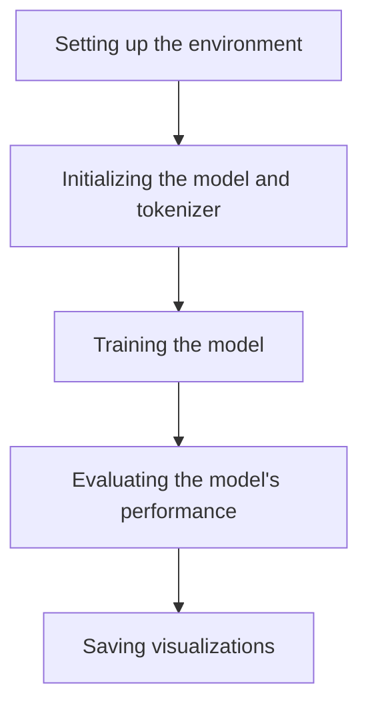

This document will cover the main function's role in orchestrating the entire process of setting up the environment, training, and evaluating models. We'll cover:

1. Setting up the environment
2. Initializing the model and tokenizer
3. Training the model
4. Evaluating the model's performance
5. Saving visualizations.

Technical document: <SwmLink doc-title="Main Function Overview">[Main Function Overview](/.swm/main-function-overview.sysg0hhm.sw.md)</SwmLink>

# Setting up the environment

The main function begins by setting up the environment. This involves parsing necessary arguments, checking if the output directory exists, and configuring logging. It also sets up the environment for distributed training if necessary. This step ensures that all required configurations are in place before proceeding with model initialization and training.

# Initializing the model and tokenizer

Next, the function initializes the model and tokenizer based on the provided configurations. This involves loading a pretrained model and tokenizer, and if a teacher model is specified for distillation, it is also loaded. This step is crucial as it prepares the necessary components for the training process.

# Training the model

The training process involves setting up data loaders, optimizers, and schedulers. The function iterates over the training data, computes the loss, performs backpropagation, and updates the model parameters. It also supports multi-GPU and distributed training setups. This step is essential for improving the model's performance by learning from the training data.

# Evaluating the model's performance

After training, the function evaluates the model's performance on a validation dataset. It sets up the evaluation environment, including data loaders and multi-GPU support. The function iterates over the evaluation data, computes predictions, and logs evaluation metrics. This step helps in assessing how well the model performs on unseen data.

# Saving visualizations

Finally, the function saves visualizations to a file. It checks the file extension and either saves the image using OpenCV or Matplotlib based on the extension. This step is important for visualizing the results and making them accessible for further analysis.

&nbsp;

*This is an auto-generated document by Swimm AI 🌊 and has not yet been verified by a human*

<SwmMeta version="3.0.0" repo-id="Z2l0aHViJTNBJTNBdHJhbnNmb3JtZXJzJTNBJTNBc2h1anV1dQ==" repo-name="transformers">Powered by [Swimm](/)</SwmMeta>
