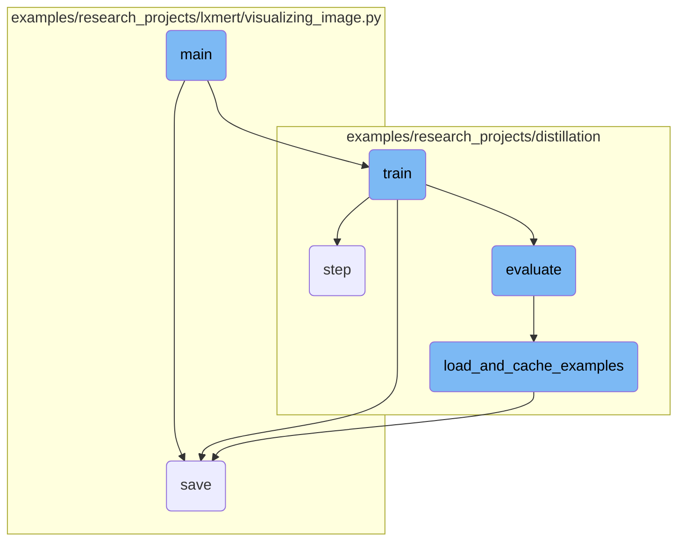
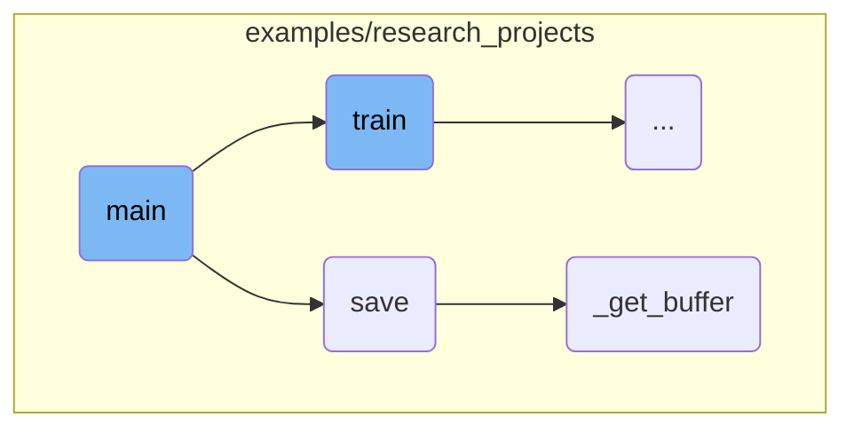
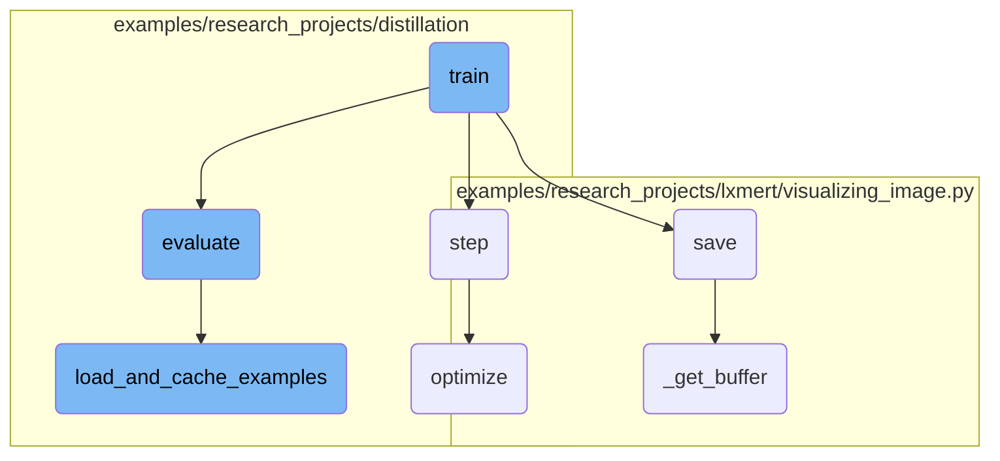

This document provides an overview of the main function's role in different scripts. It outlines how the main function orchestrates the entire process, from setting up the environment to training and evaluating models.

The main function starts by setting up the environment and parsing necessary arguments. It then initializes the model and tokenizer based on the provided configurations. After that, it handles the training process, including data loading, optimization, and logging. Finally, it evaluates the model's performance and saves the results.

Here is a high level diagram of the flow, showing only the most important functions:



# Flow drill down

First, we'll zoom into this section of the flow:



<SwmSnippet path="/examples/research_projects/distillation/run_squad_w_distillation.py" line="496">

---

## Argument Parsing

The <SwmToken path="examples/research_projects/distillation/run_squad_w_distillation.py" pos="496:2:2" line-data="def main():">`main`</SwmToken> function begins by setting up an argument parser to handle various input parameters required for model training and evaluation. This includes parameters for model type, paths, distillation settings, and other configurations.

```python
def main():
    parser = argparse.ArgumentParser()

    # Required parameters
    parser.add_argument(
        "--model_type",
        default=None,
        type=str,
        required=True,
        help="Model type selected in the list: " + ", ".join(MODEL_CLASSES.keys()),
    )
    parser.add_argument(
        "--model_name_or_path",
        default=None,
        type=str,
        required=True,
        help="Path to pretrained model or model identifier from huggingface.co/models",
    )
    parser.add_argument(
        "--output_dir",
        default=None,
```

---

</SwmSnippet>

<SwmSnippet path="/examples/research_projects/distillation/run_squad_w_distillation.py" line="703">

---

## Environment Setup

The function then checks if the output directory exists and sets up the environment for distributed training if necessary. It also configures logging and sets the random seed for reproducibility.

```python
    if (
        os.path.exists(args.output_dir)
        and os.listdir(args.output_dir)
        and args.do_train
        and not args.overwrite_output_dir
    ):
        raise ValueError(
            "Output directory ({}) already exists and is not empty. Use --overwrite_output_dir to overcome.".format(
                args.output_dir
            )
        )

    # Setup distant debugging if needed
    if args.server_ip and args.server_port:
        # Distant debugging - see https://code.visualstudio.com/docs/python/debugging#_attach-to-a-local-script
        import ptvsd

        print("Waiting for debugger attach")
        ptvsd.enable_attach(address=(args.server_ip, args.server_port), redirect_output=True)
        ptvsd.wait_for_attach()

```

---

</SwmSnippet>

<SwmSnippet path="/examples/research_projects/distillation/run_squad_w_distillation.py" line="757">

---

## Model and Tokenizer Initialization

The function loads the pretrained model and tokenizer based on the provided arguments. If a teacher model is specified for distillation, it is also loaded and moved to the appropriate device.

```python
    # Load pretrained model and tokenizer
    if args.local_rank not in [-1, 0]:
        # Make sure only the first process in distributed training will download model & vocab
        torch.distributed.barrier()

    args.model_type = args.model_type.lower()
    config_class, model_class, tokenizer_class = MODEL_CLASSES[args.model_type]
    config = config_class.from_pretrained(
        args.config_name if args.config_name else args.model_name_or_path,
        cache_dir=args.cache_dir if args.cache_dir else None,
    )
    tokenizer = tokenizer_class.from_pretrained(
        args.tokenizer_name if args.tokenizer_name else args.model_name_or_path,
        do_lower_case=args.do_lower_case,
        cache_dir=args.cache_dir if args.cache_dir else None,
    )
    model = model_class.from_pretrained(
        args.model_name_or_path,
        from_tf=bool(".ckpt" in args.model_name_or_path),
        config=config,
        cache_dir=args.cache_dir if args.cache_dir else None,
```

---

</SwmSnippet>

<SwmSnippet path="/examples/research_projects/lxmert/visualizing_image.py" line="194">

---

## Saving Visualizations

The <SwmToken path="examples/research_projects/lxmert/visualizing_image.py" pos="194:3:3" line-data="    def save(self, saveas=None):">`save`</SwmToken> function is responsible for saving visualizations to a file. It checks the file extension and either saves the image using OpenCV or Matplotlib based on the extension.

```python
    def save(self, saveas=None):
        if saveas is None:
            saveas = self.saveas
        if saveas.lower().endswith(".jpg") or saveas.lower().endswith(".png"):
            cv2.imwrite(
                saveas,
                self._get_buffer()[:, :, ::-1],
            )
        else:
            self.fig.savefig(saveas)
```

---

</SwmSnippet>

<SwmSnippet path="/examples/research_projects/lxmert/visualizing_image.py" line="230">

---

### Buffer Retrieval

The <SwmToken path="examples/research_projects/lxmert/visualizing_image.py" pos="230:3:3" line-data="    def _get_buffer(self):">`_get_buffer`</SwmToken> function retrieves the image buffer, processes it, and returns the visualized image. It handles different backends and uses <SwmToken path="examples/research_projects/lxmert/visualizing_image.py" pos="249:3:3" line-data="            import numexpr as ne  # fuse them with numexpr">`numexpr`</SwmToken> for efficient computation if available.

```python
    def _get_buffer(self):
        if not self.pynb:
            s, (width, height) = self.canvas.print_to_buffer()
            if (width, height) != (self.width, self.height):
                img = cv2.resize(self.img, (width, height))
            else:
                img = self.img
        else:
            buf = io.BytesIO()  # works for cairo backend
            self.canvas.print_rgba(buf)
            width, height = self.width, self.height
            s = buf.getvalue()
            img = self.img

        buffer = np.frombuffer(s, dtype="uint8")
        img_rgba = buffer.reshape(height, width, 4)
        rgb, alpha = np.split(img_rgba, [3], axis=2)

        try:
            import numexpr as ne  # fuse them with numexpr

```

---

</SwmSnippet>

Now, lets zoom into this section of the flow:



<SwmSnippet path="/examples/research_projects/distillation/run_squad_w_distillation.py" line="93">

---

## Training the Model

The <SwmToken path="examples/research_projects/distillation/run_squad_w_distillation.py" pos="93:2:2" line-data="def train(args, train_dataset, model, tokenizer, teacher=None):">`train`</SwmToken> function is responsible for training the model. It sets up the training environment, including data loaders, optimizers, and schedulers. It also handles <SwmToken path="examples/research_projects/distillation/run_squad_w_distillation.py" pos="327:3:5" line-data="    # multi-gpu evaluate">`multi-gpu`</SwmToken> and distributed training setups. The function iterates over the training data, computes the loss, performs backpropagation, and updates the model parameters. Additionally, it supports resuming training from checkpoints and logging training metrics.

```python
def train(args, train_dataset, model, tokenizer, teacher=None):
    """Train the model"""
    if args.local_rank in [-1, 0]:
        tb_writer = SummaryWriter()

    args.train_batch_size = args.per_gpu_train_batch_size * max(1, args.n_gpu)
    train_sampler = RandomSampler(train_dataset) if args.local_rank == -1 else DistributedSampler(train_dataset)
    train_dataloader = DataLoader(train_dataset, sampler=train_sampler, batch_size=args.train_batch_size)

    if args.max_steps > 0:
        t_total = args.max_steps
        args.num_train_epochs = args.max_steps // (len(train_dataloader) // args.gradient_accumulation_steps) + 1
    else:
        t_total = len(train_dataloader) // args.gradient_accumulation_steps * args.num_train_epochs

    # Prepare optimizer and schedule (linear warmup and decay)
    no_decay = ["bias", "LayerNorm.weight"]
    optimizer_grouped_parameters = [
        {
            "params": [p for n, p in model.named_parameters() if not any(nd in n for nd in no_decay)],
            "weight_decay": args.weight_decay,
```

---

</SwmSnippet>

<SwmSnippet path="/examples/research_projects/distillation/distiller.py" line="371">

---

## Performing an Optimization Step

The <SwmToken path="examples/research_projects/distillation/distiller.py" pos="371:3:3" line-data="    def step(self, input_ids: torch.tensor, attention_mask: torch.tensor, lm_labels: torch.tensor):">`step`</SwmToken> function performs a single optimization step. It involves a forward pass through both the student and teacher models, computing the loss, and performing a backward pass for gradient accumulation. The function also handles various types of losses, including cross-entropy, mean squared error, and cosine similarity losses, depending on the training configuration.

```python
    def step(self, input_ids: torch.tensor, attention_mask: torch.tensor, lm_labels: torch.tensor):
        """
        One optimization step: forward of student AND teacher, backward on the loss (for gradient accumulation),
        and possibly a parameter update (depending on the gradient accumulation).

        Input:
        ------
        input_ids: `torch.tensor(bs, seq_length)` - The token ids.
        attention_mask: `torch.tensor(bs, seq_length)` - The attention mask for self attention.
        lm_labels: `torch.tensor(bs, seq_length)` - The language modeling labels (mlm labels for MLM and clm labels for CLM).
        """
        if self.mlm:
            s_logits, s_hidden_states = self.student(
                input_ids=input_ids, attention_mask=attention_mask
            )  # (bs, seq_length, voc_size)
            with torch.no_grad():
                t_logits, t_hidden_states = self.teacher(
                    input_ids=input_ids, attention_mask=attention_mask
                )  # (bs, seq_length, voc_size)
        else:
            s_logits, _, s_hidden_states = self.student(
```

---

</SwmSnippet>

<SwmSnippet path="/examples/research_projects/distillation/run_squad_w_distillation.py" line="315">

---

## Evaluating the Model

The <SwmToken path="examples/research_projects/distillation/run_squad_w_distillation.py" pos="315:2:2" line-data="def evaluate(args, model, tokenizer, prefix=&quot;&quot;):">`evaluate`</SwmToken> function evaluates the model's performance on a validation dataset. It sets up the evaluation environment, including data loaders and <SwmToken path="examples/research_projects/distillation/run_squad_w_distillation.py" pos="327:3:5" line-data="    # multi-gpu evaluate">`multi-gpu`</SwmToken> support. The function iterates over the evaluation data, computes predictions, and logs evaluation metrics. It also handles different model types and computes various evaluation metrics like <SwmToken path="examples/research_projects/distillation/run_squad_w_distillation.py" pos="429:7:7" line-data="    # Compute the F1 and exact scores.">`F1`</SwmToken> and exact scores.

```python
def evaluate(args, model, tokenizer, prefix=""):
    dataset, examples, features = load_and_cache_examples(args, tokenizer, evaluate=True, output_examples=True)

    if not os.path.exists(args.output_dir) and args.local_rank in [-1, 0]:
        os.makedirs(args.output_dir)

    args.eval_batch_size = args.per_gpu_eval_batch_size * max(1, args.n_gpu)

    # Note that DistributedSampler samples randomly
    eval_sampler = SequentialSampler(dataset)
    eval_dataloader = DataLoader(dataset, sampler=eval_sampler, batch_size=args.eval_batch_size)

    # multi-gpu evaluate
    if args.n_gpu > 1 and not isinstance(model, nn.DataParallel):
        model = nn.DataParallel(model)

    # Eval!
    logger.info("***** Running evaluation {} *****".format(prefix))
    logger.info("  Num examples = %d", len(dataset))
    logger.info("  Batch size = %d", args.eval_batch_size)

```

---

</SwmSnippet>

<SwmSnippet path="/examples/research_projects/distillation/run_squad_w_distillation.py" line="434">

---

## Loading and Caching Examples

The <SwmToken path="examples/research_projects/distillation/run_squad_w_distillation.py" pos="434:2:2" line-data="def load_and_cache_examples(args, tokenizer, evaluate=False, output_examples=False):">`load_and_cache_examples`</SwmToken> function loads and caches the dataset examples. It checks for existing cached files and loads them if available. If not, it processes the dataset files to create features and caches them for future use. This function ensures efficient data loading and supports distributed training by synchronizing processes.

```python
def load_and_cache_examples(args, tokenizer, evaluate=False, output_examples=False):
    if args.local_rank not in [-1, 0] and not evaluate:
        # Make sure only the first process in distributed training process the dataset, and the others will use the cache
        torch.distributed.barrier()

    # Load data features from cache or dataset file
    input_file = args.predict_file if evaluate else args.train_file
    cached_features_file = os.path.join(
        os.path.dirname(input_file),
        "cached_distillation_{}_{}_{}".format(
            "dev" if evaluate else "train",
            list(filter(None, args.model_name_or_path.split("/"))).pop(),
            str(args.max_seq_length),
        ),
    )
    if os.path.exists(cached_features_file) and not args.overwrite_cache:
        logger.info("Loading features from cached file %s", cached_features_file)
        features_and_dataset = torch.load(cached_features_file)

        try:
            features, dataset, examples = (
```

---

</SwmSnippet>

<SwmSnippet path="/examples/research_projects/distillation/distiller.py" line="467">

---

### Optimizing the Model

The <SwmToken path="examples/research_projects/distillation/distiller.py" pos="467:3:3" line-data="    def optimize(self, loss):">`optimize`</SwmToken> function normalizes the loss, performs a backward pass, and updates the model parameters. It handles gradient accumulation and distributed training setups. The function also updates training metrics for <SwmToken path="examples/research_projects/distillation/distiller.py" pos="471:11:11" line-data="        Also update the metrics for tensorboard.">`tensorboard`</SwmToken> logging and checks for <SwmToken path="examples/research_projects/distillation/distiller.py" pos="473:7:7" line-data="        # Check for NaN">`NaN`</SwmToken> values in the loss to ensure training stability.

```python
    def optimize(self, loss):
        """
        Normalization on the loss (gradient accumulation or distributed training), followed by
        backward pass on the loss, possibly followed by a parameter update (depending on the gradient accumulation).
        Also update the metrics for tensorboard.
        """
        # Check for NaN
        if (loss != loss).data.any():
            logger.error("NaN detected")
            exit()

        if self.multi_gpu:
            loss = loss.mean()
        if self.params.gradient_accumulation_steps > 1:
            loss = loss / self.params.gradient_accumulation_steps

        if self.fp16:
            from apex import amp

            with amp.scale_loss(loss, self.optimizer) as scaled_loss:
                scaled_loss.backward()
```

---

</SwmSnippet>

&nbsp;

*This is an auto-generated document by Swimm AI 🌊 and has not yet been verified by a human*

<SwmMeta version="3.0.0" repo-id="Z2l0aHViJTNBJTNBdHJhbnNmb3JtZXJzJTNBJTNBc2h1anV1dQ==" repo-name="transformers"><sup>Powered by [Swimm](/)</sup></SwmMeta>
