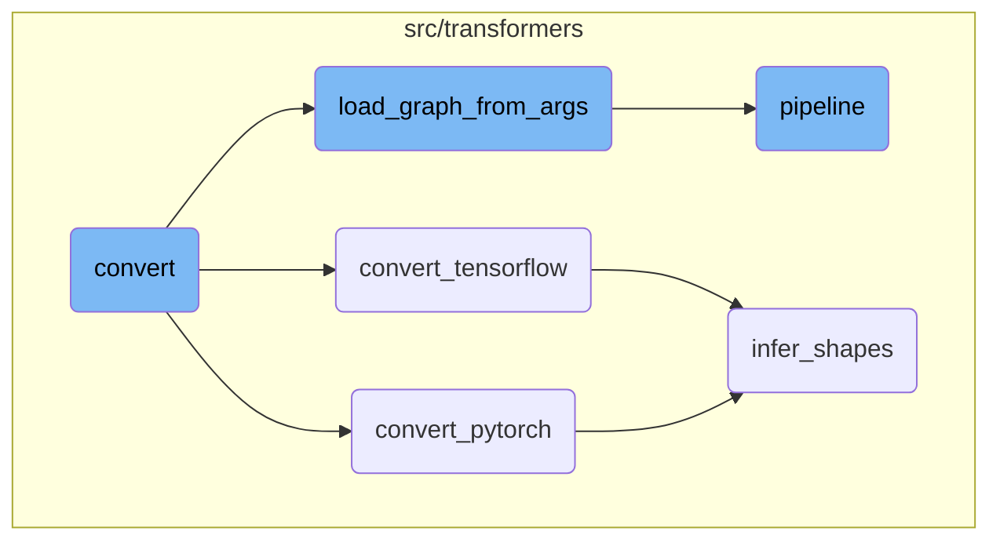
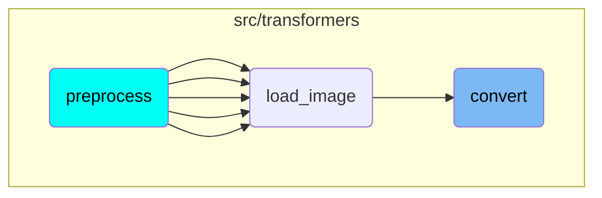

This document explains the process of converting machine learning models to the ONNX format. The conversion process involves several steps, including loading the model pipeline, checking the output directory, and performing the actual conversion based on the framework <SwmToken path="src/transformers/convert_graph_to_onnx.py" pos="354:27:28" line-data="            Split the model definition from its parameters to allow model bigger than 2GB (PyTorch only)">`(PyTorch`</SwmToken> or <SwmToken path="src/transformers/convert_graph_to_onnx.py" pos="296:5:5" line-data="    Export a TensorFlow backed pipeline to ONNX Intermediate Representation (IR)">`TensorFlow`</SwmToken>).

The conversion process starts by loading the model pipeline using the provided arguments. It then checks if the output directory exists or needs to be created. Depending on whether the model is based on <SwmToken path="src/transformers/convert_graph_to_onnx.py" pos="259:5:5" line-data="    Export a PyTorch backed pipeline to ONNX Intermediate Representation (IR">`PyTorch`</SwmToken> or <SwmToken path="src/transformers/convert_graph_to_onnx.py" pos="296:5:5" line-data="    Export a TensorFlow backed pipeline to ONNX Intermediate Representation (IR)">`TensorFlow`</SwmToken>, it calls the respective function to perform the conversion. The <SwmToken path="src/transformers/convert_graph_to_onnx.py" pos="259:5:5" line-data="    Export a PyTorch backed pipeline to ONNX Intermediate Representation (IR">`PyTorch`</SwmToken> conversion uses the `torch.onnx.export` function, while the <SwmToken path="src/transformers/convert_graph_to_onnx.py" pos="296:5:5" line-data="    Export a TensorFlow backed pipeline to ONNX Intermediate Representation (IR)">`TensorFlow`</SwmToken> conversion uses the <SwmToken path="src/transformers/convert_graph_to_onnx.py" pos="313:3:3" line-data="        import tf2onnx">`tf2onnx`</SwmToken> library. Both conversions involve determining the input and output shapes required for the export.

# Flow drill down



<SwmSnippet path="/src/transformers/convert_graph_to_onnx.py" line="334">

---

## Convert

The <SwmToken path="src/transformers/convert_graph_to_onnx.py" pos="334:2:2" line-data="def convert(">`convert`</SwmToken> function is the entry point for converting a model to the ONNX format. It first loads the pipeline using <SwmToken path="src/transformers/convert_graph_to_onnx.py" pos="226:2:2" line-data="def load_graph_from_args(">`load_graph_from_args`</SwmToken>, then checks if the output directory exists or needs to be created. Depending on the framework <SwmToken path="src/transformers/convert_graph_to_onnx.py" pos="354:27:28" line-data="            Split the model definition from its parameters to allow model bigger than 2GB (PyTorch only)">`(PyTorch`</SwmToken> or <SwmToken path="src/transformers/convert_graph_to_onnx.py" pos="296:5:5" line-data="    Export a TensorFlow backed pipeline to ONNX Intermediate Representation (IR)">`TensorFlow`</SwmToken>), it calls either <SwmToken path="src/transformers/convert_graph_to_onnx.py" pos="257:2:2" line-data="def convert_pytorch(nlp: Pipeline, opset: int, output: Path, use_external_format: bool):">`convert_pytorch`</SwmToken> or <SwmToken path="src/transformers/convert_graph_to_onnx.py" pos="294:2:2" line-data="def convert_tensorflow(nlp: Pipeline, opset: int, output: Path):">`convert_tensorflow`</SwmToken> to perform the actual conversion.

```python
def convert(
    framework: str,
    model: str,
    output: Path,
    opset: int,
    tokenizer: Optional[str] = None,
    use_external_format: bool = False,
    pipeline_name: str = "feature-extraction",
    **model_kwargs,
):
    """
    Convert the pipeline object to the ONNX Intermediate Representation (IR) format

    Args:
        framework: The framework the pipeline is backed by ("pt" or "tf")
        model: The name of the model to load for the pipeline
        output: The path where the ONNX graph will be stored
        opset: The actual version of the ONNX operator set to use
        tokenizer: The name of the model to load for the pipeline, default to the model's name if not provided
        use_external_format:
            Split the model definition from its parameters to allow model bigger than 2GB (PyTorch only)
```

---

</SwmSnippet>

<SwmSnippet path="/src/transformers/convert_graph_to_onnx.py" line="257">

---

### Convert <SwmToken path="src/transformers/convert_graph_to_onnx.py" pos="259:5:5" line-data="    Export a PyTorch backed pipeline to ONNX Intermediate Representation (IR">`PyTorch`</SwmToken>

The <SwmToken path="src/transformers/convert_graph_to_onnx.py" pos="257:2:2" line-data="def convert_pytorch(nlp: Pipeline, opset: int, output: Path, use_external_format: bool):">`convert_pytorch`</SwmToken> function handles the conversion of a PyTorch-backed pipeline to the ONNX format. It ensures that <SwmToken path="src/transformers/convert_graph_to_onnx.py" pos="259:5:5" line-data="    Export a PyTorch backed pipeline to ONNX Intermediate Representation (IR">`PyTorch`</SwmToken> is available, then uses the `torch.onnx.export` function to export the model. The function <SwmToken path="src/transformers/convert_graph_to_onnx.py" pos="162:2:2" line-data="def infer_shapes(nlp: Pipeline, framework: str) -&gt; Tuple[List[str], List[str], Dict, BatchEncoding]:">`infer_shapes`</SwmToken> is called to determine the input and output shapes required for the export.

```python
def convert_pytorch(nlp: Pipeline, opset: int, output: Path, use_external_format: bool):
    """
    Export a PyTorch backed pipeline to ONNX Intermediate Representation (IR

    Args:
        nlp: The pipeline to be exported
        opset: The actual version of the ONNX operator set to use
        output: Path where will be stored the generated ONNX model
        use_external_format: Split the model definition from its parameters to allow model bigger than 2GB

    Returns:

    """
    if not is_torch_available():
        raise Exception("Cannot convert because PyTorch is not installed. Please install torch first.")

    import torch
    from torch.onnx import export

    print(f"Using framework PyTorch: {torch.__version__}")

```

---

</SwmSnippet>

<SwmSnippet path="/src/transformers/convert_graph_to_onnx.py" line="294">

---

### Convert <SwmToken path="src/transformers/convert_graph_to_onnx.py" pos="296:5:5" line-data="    Export a TensorFlow backed pipeline to ONNX Intermediate Representation (IR)">`TensorFlow`</SwmToken>

The <SwmToken path="src/transformers/convert_graph_to_onnx.py" pos="294:2:2" line-data="def convert_tensorflow(nlp: Pipeline, opset: int, output: Path):">`convert_tensorflow`</SwmToken> function manages the conversion of a TensorFlow-backed pipeline to the ONNX format. It ensures that <SwmToken path="src/transformers/convert_graph_to_onnx.py" pos="296:5:5" line-data="    Export a TensorFlow backed pipeline to ONNX Intermediate Representation (IR)">`TensorFlow`</SwmToken> is available and uses the <SwmToken path="src/transformers/convert_graph_to_onnx.py" pos="313:3:3" line-data="        import tf2onnx">`tf2onnx`</SwmToken> library to perform the conversion. Similar to the <SwmToken path="src/transformers/convert_graph_to_onnx.py" pos="259:5:5" line-data="    Export a PyTorch backed pipeline to ONNX Intermediate Representation (IR">`PyTorch`</SwmToken> conversion, <SwmToken path="src/transformers/convert_graph_to_onnx.py" pos="162:2:2" line-data="def infer_shapes(nlp: Pipeline, framework: str) -&gt; Tuple[List[str], List[str], Dict, BatchEncoding]:">`infer_shapes`</SwmToken> is called to determine the necessary input and output shapes.

```python
def convert_tensorflow(nlp: Pipeline, opset: int, output: Path):
    """
    Export a TensorFlow backed pipeline to ONNX Intermediate Representation (IR)

    Args:
        nlp: The pipeline to be exported
        opset: The actual version of the ONNX operator set to use
        output: Path where will be stored the generated ONNX model

    Notes: TensorFlow cannot export model bigger than 2GB due to internal constraint from TensorFlow

    """
    if not is_tf_available():
        raise Exception("Cannot convert because TF is not installed. Please install tensorflow first.")

    print("/!\\ Please note TensorFlow doesn't support exporting model > 2Gb /!\\")

    try:
        import tensorflow as tf
        import tf2onnx
        from tf2onnx import __version__ as t2ov
```

---

</SwmSnippet>

<SwmSnippet path="/src/transformers/convert_graph_to_onnx.py" line="226">

---

## Load Graph from Args

The <SwmToken path="src/transformers/convert_graph_to_onnx.py" pos="226:2:2" line-data="def load_graph_from_args(">`load_graph_from_args`</SwmToken> function converts the provided arguments into a pipeline object. It checks if the required framework <SwmToken path="src/transformers/convert_graph_to_onnx.py" pos="354:27:28" line-data="            Split the model definition from its parameters to allow model bigger than 2GB (PyTorch only)">`(PyTorch`</SwmToken> or <SwmToken path="src/transformers/convert_graph_to_onnx.py" pos="296:5:5" line-data="    Export a TensorFlow backed pipeline to ONNX Intermediate Representation (IR)">`TensorFlow`</SwmToken>) is available and then loads the model and tokenizer to create the pipeline.

```python
def load_graph_from_args(
    pipeline_name: str, framework: str, model: str, tokenizer: Optional[str] = None, **models_kwargs
) -> Pipeline:
    """
    Convert the set of arguments provided through the CLI to an actual pipeline reference (tokenizer + model

    Args:
        pipeline_name: The kind of pipeline to use (ner, question-answering, etc.)
        framework: The actual model to convert the pipeline from ("pt" or "tf")
        model: The model name which will be loaded by the pipeline
        tokenizer: The tokenizer name which will be loaded by the pipeline, default to the model's value

    Returns: Pipeline object

    """
    # If no tokenizer provided
    if tokenizer is None:
        tokenizer = model

    # Check the wanted framework is available
    if framework == "pt" and not is_torch_available():
```

---

</SwmSnippet>

<SwmSnippet path="/src/transformers/pipelines/__init__.py" line="552">

---

## Pipeline

The <SwmToken path="src/transformers/pipelines/__init__.py" pos="552:2:2" line-data="def pipeline(">`pipeline`</SwmToken> function is a utility that constructs a pipeline for various tasks such as text classification, question answering, etc. It takes care of loading the appropriate model, tokenizer, and other components based on the provided arguments.

```python
def pipeline(
    task: str = None,
    model: Optional[Union[str, "PreTrainedModel", "TFPreTrainedModel"]] = None,
    config: Optional[Union[str, PretrainedConfig]] = None,
    tokenizer: Optional[Union[str, PreTrainedTokenizer, "PreTrainedTokenizerFast"]] = None,
    feature_extractor: Optional[Union[str, PreTrainedFeatureExtractor]] = None,
    image_processor: Optional[Union[str, BaseImageProcessor]] = None,
    framework: Optional[str] = None,
    revision: Optional[str] = None,
    use_fast: bool = True,
    token: Optional[Union[str, bool]] = None,
    device: Optional[Union[int, str, "torch.device"]] = None,
    device_map=None,
    torch_dtype=None,
    trust_remote_code: Optional[bool] = None,
    model_kwargs: Dict[str, Any] = None,
    pipeline_class: Optional[Any] = None,
    **kwargs,
) -> Pipeline:
    """
    Utility factory method to build a [`Pipeline`].
```

---

</SwmSnippet>

<SwmSnippet path="/src/transformers/convert_graph_to_onnx.py" line="162">

---

## Infer Shapes

The <SwmToken path="src/transformers/convert_graph_to_onnx.py" pos="162:2:2" line-data="def infer_shapes(nlp: Pipeline, framework: str) -&gt; Tuple[List[str], List[str], Dict, BatchEncoding]:">`infer_shapes`</SwmToken> function attempts to determine the static and dynamic axes for each input and output tensor of a model. This information is crucial for exporting the model to ONNX format, as it defines how the model will handle different input shapes.

```python
def infer_shapes(nlp: Pipeline, framework: str) -> Tuple[List[str], List[str], Dict, BatchEncoding]:
    """
    Attempt to infer the static vs dynamic axes for each input and output tensors for a specific model

    Args:
        nlp: The pipeline object holding the model to be exported
        framework: The framework identifier to dispatch to the correct inference scheme (pt/tf)

    Returns:

        - List of the inferred input variable names
        - List of the inferred output variable names
        - Dictionary with input/output variables names as key and shape tensor as value
        - a BatchEncoding reference which was used to infer all the above information
    """

    def build_shape_dict(name: str, tensor, is_input: bool, seq_len: int):
        if isinstance(tensor, (tuple, list)):
            return [build_shape_dict(name, t, is_input, seq_len) for t in tensor]

        else:
```

---

</SwmSnippet>

# Where is this flow used?

This flow is used multiple times in the codebase as represented in the following diagram:

(Note - these are only some of the entry points of this flow)



&nbsp;

*This is an auto-generated document by Swimm AI 🌊 and has not yet been verified by a human*

<SwmMeta version="3.0.0" repo-id="Z2l0aHViJTNBJTNBdHJhbnNmb3JtZXJzJTNBJTNBc2h1anV1dQ==" repo-name="transformers" doc-type="flows"><sup>Powered by [Swimm](/)</sup></SwmMeta>
