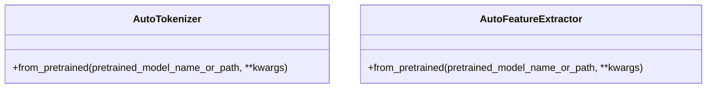

Model implementations refer to the specific code structures and classes that define how different NLP models are built and operate.

These implementations include the architecture of the models, the layers they consist of, and the methods for forward and backward propagation.

They also encompass the conversion functions that allow models to be converted from one framework to another, such as from <SwmToken path="src/transformers/models/openai/convert_openai_original_tf_checkpoint_to_pytorch.py" pos="59:10:10" line-data="        help=&quot;Path to the TensorFlow checkpoint path.&quot;,">`TensorFlow`</SwmToken> to <SwmToken path="src/transformers/models/openai/convert_openai_original_tf_checkpoint_to_pytorch.py" pos="41:5:5" line-data="    # Save pytorch-model">`pytorch`</SwmToken>.

For example, functions like <SwmToken path="src/transformers/models/openai/convert_openai_original_tf_checkpoint_to_pytorch.py" pos="30:2:2" line-data="def convert_openai_checkpoint_to_pytorch(openai_checkpoint_folder_path, openai_config_file, pytorch_dump_folder_path):">`convert_openai_checkpoint_to_pytorch`</SwmToken> and `convert_gpt2_checkpoint_to_pytorch` handle the conversion of model checkpoints from <SwmToken path="src/transformers/models/openai/convert_openai_original_tf_checkpoint_to_pytorch.py" pos="59:10:10" line-data="        help=&quot;Path to the TensorFlow checkpoint path.&quot;,">`TensorFlow`</SwmToken> to <SwmToken path="src/transformers/models/openai/convert_openai_original_tf_checkpoint_to_pytorch.py" pos="41:5:5" line-data="    # Save pytorch-model">`pytorch`</SwmToken>.

These functions typically involve loading the model configuration, initializing the model, loading the weights, and then saving the model in the desired format.

Model implementations ensure that the models are compatible with various deep learning frameworks and can be easily fine-tuned or used for inference.

<SwmSnippet path="/src/transformers/models/openai/convert_openai_original_tf_checkpoint_to_pytorch.py" line="30">

---

## Conversion Functions

The function <SwmToken path="src/transformers/models/openai/convert_openai_original_tf_checkpoint_to_pytorch.py" pos="30:2:2" line-data="def convert_openai_checkpoint_to_pytorch(openai_checkpoint_folder_path, openai_config_file, pytorch_dump_folder_path):">`convert_openai_checkpoint_to_pytorch`</SwmToken> handles the conversion of model checkpoints from <SwmToken path="src/transformers/models/openai/convert_openai_original_tf_checkpoint_to_pytorch.py" pos="59:10:10" line-data="        help=&quot;Path to the TensorFlow checkpoint path.&quot;,">`TensorFlow`</SwmToken> to <SwmToken path="src/transformers/models/openai/convert_openai_original_tf_checkpoint_to_pytorch.py" pos="41:5:5" line-data="    # Save pytorch-model">`pytorch`</SwmToken>. This involves loading the model configuration, initializing the model, loading the weights, and then saving the model in the desired format.

```python
def convert_openai_checkpoint_to_pytorch(openai_checkpoint_folder_path, openai_config_file, pytorch_dump_folder_path):
    # Construct model
    if openai_config_file == "":
        config = OpenAIGPTConfig()
    else:
        config = OpenAIGPTConfig.from_json_file(openai_config_file)
    model = OpenAIGPTModel(config)

    # Load weights from numpy
    load_tf_weights_in_openai_gpt(model, config, openai_checkpoint_folder_path)

    # Save pytorch-model
    pytorch_weights_dump_path = pytorch_dump_folder_path + "/" + WEIGHTS_NAME
    pytorch_config_dump_path = pytorch_dump_folder_path + "/" + CONFIG_NAME
    print(f"Save PyTorch model to {pytorch_weights_dump_path}")
    torch.save(model.state_dict(), pytorch_weights_dump_path)
    print(f"Save configuration file to {pytorch_config_dump_path}")
    with open(pytorch_config_dump_path, "w", encoding="utf-8") as f:
        f.write(config.to_json_string())
```

---

</SwmSnippet>

<SwmSnippet path="/src/transformers/models/auto/modeling_auto.py" line="370">

---

## Model Mappings

Various model mappings such as <SwmToken path="src/transformers/models/auto/modeling_auto.py" pos="370:0:0" line-data="MODEL_MAPPING = OrderedDict(">`MODEL_MAPPING`</SwmToken>, <SwmToken path="src/transformers/models/auto/modeling_auto.py" pos="434:0:0" line-data="MODEL_FOR_PRETRAINING_MAPPING = OrderedDict(">`MODEL_FOR_PRETRAINING_MAPPING`</SwmToken>, and <SwmToken path="src/transformers/models/auto/modeling_auto.py" pos="521:0:0" line-data="MODEL_FOR_CAUSAL_LM_MAPPING = OrderedDict(">`MODEL_FOR_CAUSAL_LM_MAPPING`</SwmToken> define how different configurations map to their respective model implementations. These mappings are used to dynamically load the appropriate model class based on the configuration.

```python
MODEL_MAPPING = OrderedDict(
    [
        # Base model mapping
        (VisualBertConfig, VisualBertModel),
        (RoFormerConfig, RoFormerModel),
        (CLIPConfig, CLIPModel),
        (BigBirdPegasusConfig, BigBirdPegasusModel),
        (DeiTConfig, DeiTModel),
        (LukeConfig, LukeModel),
        (DetrConfig, DetrModel),
        (GPTNeoConfig, GPTNeoModel),
        (BigBirdConfig, BigBirdModel),
        (Speech2TextConfig, Speech2TextModel),
        (ViTConfig, ViTModel),
        (Wav2Vec2Config, Wav2Vec2Model),
        (HubertConfig, HubertModel),
        (M2M100Config, M2M100Model),
        (ConvBertConfig, ConvBertModel),
        (LEDConfig, LEDModel),
        (BlenderbotSmallConfig, BlenderbotSmallModel),
        (RetriBertConfig, RetriBertModel),
```

---

</SwmSnippet>

# Model Implementation Endpoints

Model Implementation Endpoints

<SwmSnippet path="/src/transformers/models/auto/tokenization_auto.py" line="434">

---

## <SwmToken path="src/transformers/models/auto/tokenization_auto.py" pos="434:2:2" line-data="class AutoTokenizer:">`AutoTokenizer`</SwmToken>

The <SwmToken path="src/transformers/models/auto/tokenization_auto.py" pos="434:2:2" line-data="class AutoTokenizer:">`AutoTokenizer`</SwmToken> class provides a generic interface to instantiate tokenizers for various models. It uses the <SwmToken path="src/transformers/models/auto/feature_extraction_auto.py" pos="50:16:16" line-data="    library when created with the :meth:`AutoFeatureExtractor.from_pretrained` class method.">`from_pretrained`</SwmToken> method to load a tokenizer based on the model type or configuration.

```python
class AutoTokenizer:
```

---

</SwmSnippet>

<SwmSnippet path="/src/transformers/models/auto/feature_extraction_auto.py" line="47">

---

## <SwmToken path="src/transformers/models/auto/feature_extraction_auto.py" pos="47:2:2" line-data="class AutoFeatureExtractor:">`AutoFeatureExtractor`</SwmToken>

The <SwmToken path="src/transformers/models/auto/feature_extraction_auto.py" pos="47:2:2" line-data="class AutoFeatureExtractor:">`AutoFeatureExtractor`</SwmToken> class is a generic feature extractor class that can be instantiated with the <SwmToken path="src/transformers/models/auto/feature_extraction_auto.py" pos="50:16:16" line-data="    library when created with the :meth:`AutoFeatureExtractor.from_pretrained` class method.">`from_pretrained`</SwmToken> method. It selects the appropriate feature extractor based on the model type or configuration.

```python
class AutoFeatureExtractor:
    r"""
    This is a generic feature extractor class that will be instantiated as one of the feature extractor classes of the
    library when created with the :meth:`AutoFeatureExtractor.from_pretrained` class method.

    This class cannot be instantiated directly using ``__init__()`` (throws an error).
    """

    def __init__(self):
        raise EnvironmentError(
            "AutoFeatureExtractor is designed to be instantiated "
            "using the `AutoFeatureExtractor.from_pretrained(pretrained_model_name_or_path)` method."
        )

    @classmethod
    @replace_list_option_in_docstrings(FEATURE_EXTRACTOR_MAPPING)
    def from_pretrained(cls, pretrained_model_name_or_path, **kwargs):
        r"""
        Instantiate one of the feature extractor classes of the library from a pretrained model vocabulary.

        The tokenizer class to instantiate is selected based on the :obj:`model_type` property of the config object
```

---

</SwmSnippet>



&nbsp;

*This is an auto-generated document by Swimm AI 🌊 and has not yet been verified by a human*

<SwmMeta version="3.0.0" repo-id="Z2l0aHViJTNBJTNBdHJhbnNmb3JtZXJzJTNBJTNBc2h1anV1dQ==" repo-name="transformers"><sup>Powered by [Swimm](/)</sup></SwmMeta>
