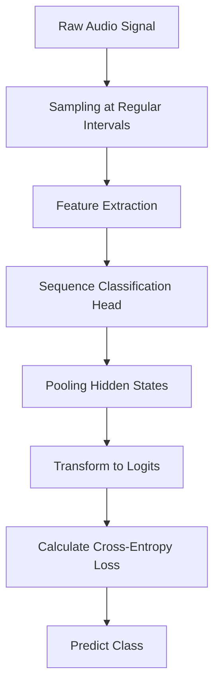

Audio processing in pipelines involves handling continuous audio signals, which are different from other modalities like text. Unlike text, a raw audio waveform can't be neatly split into discrete chunks.

To process audio, the raw audio signal is typically sampled at regular intervals. The sampling rate determines how closely the sampled audio resembles the original audio source.

In audio classification, a sequence classification head is added on top of the base Wav2Vec2 model. The classification head is a linear layer that accepts the encoder's hidden states, which represent the learned features from each audio frame.

The hidden states are pooled to create one vector of fixed length, which is then transformed into logits over the class labels. The cross-entropy loss is calculated between the logits and target to find the most likely class.

The `AudioClassificationPipeline` predicts the class of a raw waveform or an audio file. It supports multiple audio formats through ffmpeg and can be loaded using the task identifier 'audio-classification'.

The `ZeroShotAudioClassificationPipeline` uses the ClapModel to predict the class of an audio when provided with an audio and a set of candidate labels. It can be loaded using the task identifier 'zero-shot-audio-classification'.

The `AutomaticSpeechRecognitionPipeline` aims at extracting spoken text from audio. It supports both raw waveforms and audio files, and can transcribe audio sequences to text.

## Loading the Processor and Model

First, load the processor and a checkpoint of the model using `AutoProcessor` and `SeamlessM4TModel`.

## Preprocessing Audio Data

For audio tasks, a feature extractor is used to prepare the dataset for the model by extracting features from raw audio data and converting them into tensors.

## Using the Processor

You can use the processor to process both text and audio data. For example, you can load an audio sample from a dataset and process it using the processor.

## Example Usage

The example demonstrates how to load an audio sample from an Arabic speech corpus and process it using the processor.

&nbsp;

*This is an auto-generated document by Swimm AI 🌊 and has not yet been verified by a human*

<SwmMeta version="3.0.0" repo-id="Z2l0aHViJTNBJTNBdHJhbnNmb3JtZXJzJTNBJTNBc2h1anV1dQ==" repo-name="transformers" doc-type="overview">Powered by [Swimm](/)</SwmMeta>
