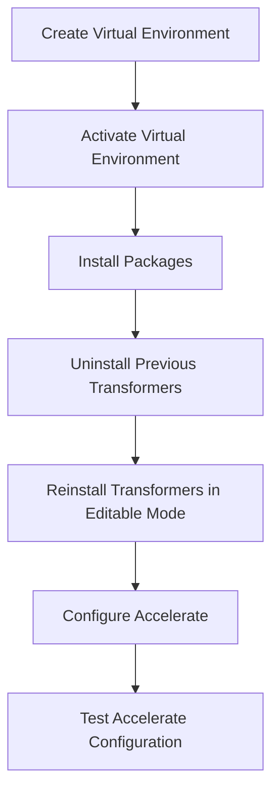

Environment setup involves creating a virtual environment in your project directory to isolate dependencies and ensure compatibility.

After creating the virtual environment, it needs to be activated. On Linux and MacOS, this is done using the `source .env/bin/activate` command, while on Windows, the command is `.env/Scripts/activate`.

Once the virtual environment is activated, the next step is to install the necessary packages. For development purposes, this is done using the command `pip install -e '.[dev]'`.

If the `transformers` library was previously installed in the virtual environment, it should be uninstalled using `pip uninstall transformers` before reinstalling it in editable mode with the `-e` flag.

For specific tasks like instance segmentation, additional configuration might be required using the `accelerate config` command, followed by `accelerate test` to ensure everything is ready for training.

## Creating a Virtual Environment

Start by creating a virtual environment in your project directory using the command `python -m venv .env`. This command sets up a new virtual environment in a directory named `.env`.

## Activating the Virtual Environment

Activate the virtual environment. On Linux and MacOS, use the command `source .env/bin/activate`. On Windows, use the command `.env/Scripts/activate`. This step ensures that the virtual environment is active and ready for package installations.

## Installing Necessary Packages

Once the virtual environment is activated, install the necessary packages using the command `pip install -e '.[dev]'`. This command installs the development dependencies required for the project.

## Reinstalling Transformers in Editable Mode

If the `transformers` library was previously installed in the virtual environment, uninstall it using `pip uninstall transformers` before reinstalling it in editable mode with the `-e` flag. This ensures that any changes made to the library are immediately reflected without needing to reinstall it.

## Additional Configuration for Specific Tasks

For specific tasks like instance segmentation, additional configuration might be required using the `accelerate config` command, followed by `accelerate test` to ensure everything is ready for training.

&nbsp;

*This is an auto-generated document by Swimm AI 🌊 and has not yet been verified by a human*

<SwmMeta version="3.0.0" repo-id="Z2l0aHViJTNBJTNBdHJhbnNmb3JtZXJzJTNBJTNBc2h1anV1dQ==" repo-name="transformers" doc-type="overview">Powered by [Swimm](/)</SwmMeta>
