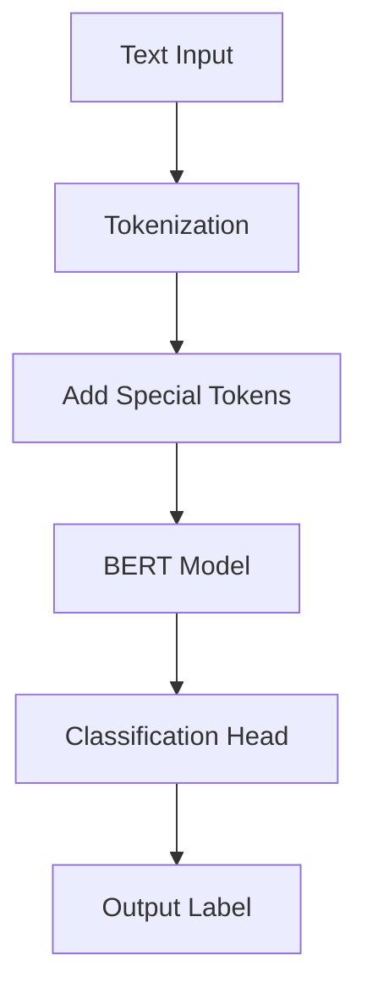

Text classification is a common NLP task that assigns a label or class to text.

The <SwmToken path="src/transformers/pipelines/text_classification.py" pos="48:2:2" line-data="class TextClassificationPipeline(Pipeline):">`TextClassificationPipeline`</SwmToken> uses any <SwmToken path="src/transformers/pipelines/text_classification.py" pos="50:12:12" line-data="    Text classification pipeline using any `ModelForSequenceClassification`. See the [sequence classification">`ModelForSequenceClassification`</SwmToken> to classify text inputs.

BERT, an encoder-only model, is often used for text classification tasks due to its deep bidirectionality and rich text representations.

BERT uses WordPiece tokenization to generate token embeddings and adds special tokens like `[SEP]` and `[CLS]` to differentiate between single sentences and pairs of sentences.

The final output with the `[CLS]` token is used as the input to the classification head for classification tasks.

The <SwmToken path="src/transformers/pipelines/text_classification.py" pos="48:2:2" line-data="class TextClassificationPipeline(Pipeline):">`TextClassificationPipeline`</SwmToken> can be loaded using the task identifier <SwmToken path="src/transformers/pipelines/text_classification.py" pos="69:3:5" line-data="    `&quot;sentiment-analysis&quot;` (for classifying sequences according to positive or negative sentiments).">`sentiment-analysis`</SwmToken> for classifying sequences according to positive or negative sentiments.

If multiple classification labels are available, the pipeline will run a softmax over the results; if there is a single label, it will run a sigmoid over the result.

The pipeline can handle both single texts and text pairs for classification.



### Text classification

Text classification is a common NLP task that assigns a label or class to text. Some of the largest companies run text classification in production for a wide range of practical applications. One of the most popular forms of text classification is sentiment analysis, which assigns a label like 🙂 positive, 🙁 negative, or 😐 neutral to a sequence of text.

### Text classification

BERT is an encoder-only model and is the first model to effectively implement deep bidirectionality to learn richer representations of the text by attending to words on both sides. BERT uses WordPiece tokenization to generate a token embedding of the text. To tell the difference between a single sentence and a pair of sentences, a special `[SEP]` token is added to differentiate them. A special `[CLS]` token is added to the beginning of every sequence of text. The final output with the `[CLS]` token is used as the input to the classification head for classification tasks. BERT also adds a segment embedding to denote whether a token belongs to the first or second sentence in a pair of sentences.

<SwmSnippet path="/src/transformers/pipelines/text_classification.py" line="48">

---

The <SwmToken path="src/transformers/pipelines/text_classification.py" pos="48:2:2" line-data="class TextClassificationPipeline(Pipeline):">`TextClassificationPipeline`</SwmToken> uses any <SwmToken path="src/transformers/pipelines/text_classification.py" pos="50:12:12" line-data="    Text classification pipeline using any `ModelForSequenceClassification`. See the [sequence classification">`ModelForSequenceClassification`</SwmToken>. It can be loaded using the task identifier <SwmToken path="src/transformers/pipelines/text_classification.py" pos="69:3:5" line-data="    `&quot;sentiment-analysis&quot;` (for classifying sequences according to positive or negative sentiments).">`sentiment-analysis`</SwmToken> for classifying sequences according to positive or negative sentiments. If multiple classification labels are available, the pipeline will run a softmax over the results; if there is a single label, it will run a sigmoid over the result.

````python
class TextClassificationPipeline(Pipeline):
    """
    Text classification pipeline using any `ModelForSequenceClassification`. See the [sequence classification
    examples](../task_summary#sequence-classification) for more information.

    Example:

    ```python
    >>> from transformers import pipeline

    >>> classifier = pipeline(model="distilbert/distilbert-base-uncased-finetuned-sst-2-english")
    >>> classifier("This movie is disgustingly good !")
    [{'label': 'POSITIVE', 'score': 1.0}]

    >>> classifier("Director tried too much.")
    [{'label': 'NEGATIVE', 'score': 0.996}]
    ```

    Learn more about the basics of using a pipeline in the [pipeline tutorial](../pipeline_tutorial)

    This text classification pipeline can currently be loaded from [`pipeline`] using the following task identifier:
````

---

</SwmSnippet>

<SwmSnippet path="/src/transformers/pipelines/text_classification.py" line="121">

---

The <SwmToken path="src/transformers/pipelines/text_classification.py" pos="121:3:3" line-data="    def __call__(self, inputs, **kwargs):">`__call__`</SwmToken> function in <SwmToken path="src/transformers/pipelines/text_classification.py" pos="48:2:2" line-data="class TextClassificationPipeline(Pipeline):">`TextClassificationPipeline`</SwmToken> classifies the <SwmToken path="src/transformers/pipelines/text_classification.py" pos="123:5:7" line-data="        Classify the text(s) given as inputs.">`text(s`</SwmToken>) given as inputs. It can handle both single texts and text pairs for classification.

```python
    def __call__(self, inputs, **kwargs):
        """
        Classify the text(s) given as inputs.

        Args:
            inputs (`str` or `List[str]` or `Dict[str]`, or `List[Dict[str]]`):
                One or several texts to classify. In order to use text pairs for your classification, you can send a
                dictionary containing `{"text", "text_pair"}` keys, or a list of those.
            top_k (`int`, *optional*, defaults to `1`):
                How many results to return.
            function_to_apply (`str`, *optional*, defaults to `"default"`):
                The function to apply to the model outputs in order to retrieve the scores. Accepts four different
                values:

                If this argument is not specified, then it will apply the following functions according to the number
                of labels:

                - If the model has a single label, will apply the sigmoid function on the output.
                - If the model has several labels, will apply the softmax function on the output.

                Possible values are:
```

---

</SwmSnippet>

# Main functions

Main functions

<SwmSnippet path="/src/transformers/pipelines/text_classification.py" line="48">

---

## <SwmToken path="src/transformers/pipelines/text_classification.py" pos="48:2:2" line-data="class TextClassificationPipeline(Pipeline):">`TextClassificationPipeline`</SwmToken>

The <SwmToken path="src/transformers/pipelines/text_classification.py" pos="48:2:2" line-data="class TextClassificationPipeline(Pipeline):">`TextClassificationPipeline`</SwmToken> class is used for text classification tasks using any <SwmToken path="src/transformers/pipelines/text_classification.py" pos="50:12:12" line-data="    Text classification pipeline using any `ModelForSequenceClassification`. See the [sequence classification">`ModelForSequenceClassification`</SwmToken>. It can classify text inputs and is often used for sentiment analysis.

````python
class TextClassificationPipeline(Pipeline):
    """
    Text classification pipeline using any `ModelForSequenceClassification`. See the [sequence classification
    examples](../task_summary#sequence-classification) for more information.

    Example:

    ```python
    >>> from transformers import pipeline

    >>> classifier = pipeline(model="distilbert/distilbert-base-uncased-finetuned-sst-2-english")
    >>> classifier("This movie is disgustingly good !")
    [{'label': 'POSITIVE', 'score': 1.0}]

    >>> classifier("Director tried too much.")
    [{'label': 'NEGATIVE', 'score': 0.996}]
    ```

    Learn more about the basics of using a pipeline in the [pipeline tutorial](../pipeline_tutorial)

    This text classification pipeline can currently be loaded from [`pipeline`] using the following task identifier:
````

---

</SwmSnippet>

<SwmSnippet path="/src/transformers/pipelines/text_classification.py" line="165">

---

## preprocess

The <SwmToken path="src/transformers/pipelines/text_classification.py" pos="165:3:3" line-data="    def preprocess(self, inputs, **tokenizer_kwargs) -&gt; Dict[str, GenericTensor]:">`preprocess`</SwmToken> function tokenizes the input text and prepares it for the model. It handles different input formats, including single texts and text pairs.

```python
    def preprocess(self, inputs, **tokenizer_kwargs) -> Dict[str, GenericTensor]:
        return_tensors = self.framework
        if isinstance(inputs, dict):
            return self.tokenizer(**inputs, return_tensors=return_tensors, **tokenizer_kwargs)
        elif isinstance(inputs, list) and len(inputs) == 1 and isinstance(inputs[0], list) and len(inputs[0]) == 2:
            # It used to be valid to use a list of list of list for text pairs, keeping this path for BC
            return self.tokenizer(
                text=inputs[0][0], text_pair=inputs[0][1], return_tensors=return_tensors, **tokenizer_kwargs
            )
        elif isinstance(inputs, list):
            # This is likely an invalid usage of the pipeline attempting to pass text pairs.
            raise ValueError(
                "The pipeline received invalid inputs, if you are trying to send text pairs, you can try to send a"
                ' dictionary `{"text": "My text", "text_pair": "My pair"}` in order to send a text pair.'
            )
        return self.tokenizer(inputs, return_tensors=return_tensors, **tokenizer_kwargs)
```

---

</SwmSnippet>

<SwmSnippet path="/src/transformers/pipelines/text_classification.py" line="189">

---

## postprocess

The <SwmToken path="src/transformers/pipelines/text_classification.py" pos="189:3:3" line-data="    def postprocess(self, model_outputs, function_to_apply=None, top_k=1, _legacy=True):">`postprocess`</SwmToken> function applies the appropriate function (sigmoid or softmax) to the model outputs and formats the results. It handles both single-label and multi-label classification.

```python
    def postprocess(self, model_outputs, function_to_apply=None, top_k=1, _legacy=True):
        # `_legacy` is used to determine if we're running the naked pipeline and in backward
        # compatibility mode, or if running the pipeline with `pipeline(..., top_k=1)` we're running
        # the more natural result containing the list.
        # Default value before `set_parameters`
        if function_to_apply is None:
            if self.model.config.problem_type == "multi_label_classification" or self.model.config.num_labels == 1:
                function_to_apply = ClassificationFunction.SIGMOID
            elif self.model.config.problem_type == "single_label_classification" or self.model.config.num_labels > 1:
                function_to_apply = ClassificationFunction.SOFTMAX
            elif hasattr(self.model.config, "function_to_apply") and function_to_apply is None:
                function_to_apply = self.model.config.function_to_apply
            else:
                function_to_apply = ClassificationFunction.NONE

        outputs = model_outputs["logits"][0]

        if self.framework == "pt":
            # To enable using fp16 and bf16
            outputs = outputs.float().numpy()
        else:
```

---

</SwmSnippet>

&nbsp;

*This is an auto-generated document by Swimm AI 🌊 and has not yet been verified by a human*

<SwmMeta version="3.0.0" repo-id="Z2l0aHViJTNBJTNBdHJhbnNmb3JtZXJzJTNBJTNBc2h1anV1dQ==" repo-name="transformers" doc-type="overview"><sup>Powered by [Swimm](/)</sup></SwmMeta>
