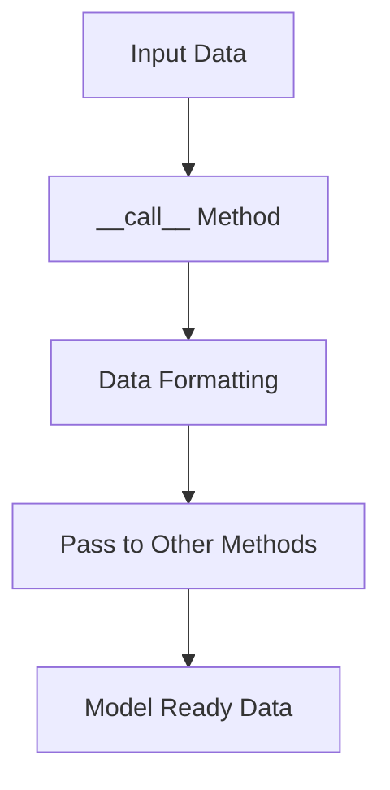

This document will cover the purpose and functionality of the **call** method in the tokenization process. We'll cover:

1. The role of the **call** method
2. How the **call** method processes input data
3. The impact on the end user

Technical document: <SwmLink doc-title="Overview of the __call__ Method">[Overview of the \__call_\_ Method](/.swm/overview-of-the-__call__-method.tkrj0sit.sw.md)</SwmLink>

# The role of the **call** method

The **call** method serves as the main entry point for tokenizing and preparing sequences or pairs of sequences for the model. It acts as a gatekeeper, ensuring that the input data is correctly formatted before passing it on to other methods for further processing. This method handles various input types and configurations, making sure that the data is in the right shape for the model to understand and use.

# How the **call** method processes input data

When the **call** method receives input data, it first checks the type of input provided. This can include single sequences, pairs of sequences, entity spans, and other configurations. The method then ensures that the data is correctly formatted by adding special tokens, handling padding, and managing truncation. Once the data is formatted, it is passed on to other methods like encode_plus or batch_encode_plus for further processing. These methods handle more specific tasks such as creating input sequences, entity sequences, and their respective spans.

# The impact on the end user

For the end user, the **call** method simplifies the process of preparing data for the model. Users can provide various types of input data without worrying about the underlying formatting and processing steps. The method ensures that the data is in the best possible shape for the model, which can lead to more accurate and efficient results. This ease of use and reliability is crucial for users who may not have a deep understanding of the technical details involved in data preparation.

&nbsp;

*This is an auto-generated document by Swimm AI 🌊 and has not yet been verified by a human*

<SwmMeta version="3.0.0" repo-id="Z2l0aHViJTNBJTNBdHJhbnNmb3JtZXJzJTNBJTNBc2h1anV1dQ==" repo-name="transformers">Powered by [Swimm](/)</SwmMeta>
