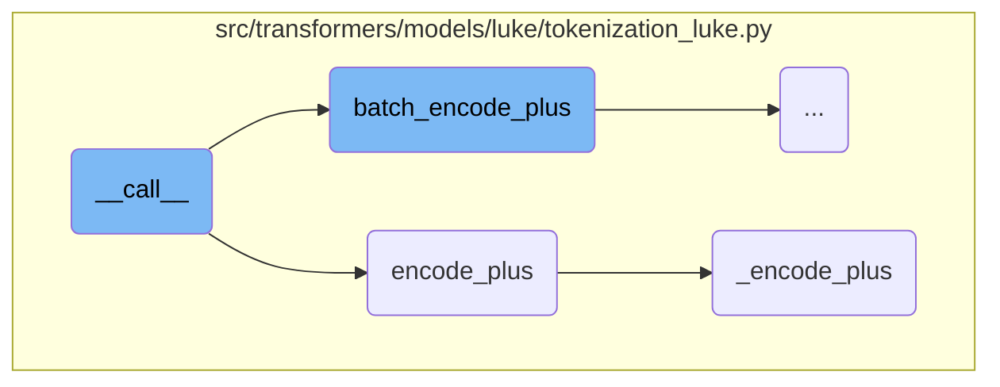

This document provides an overview of the <SwmToken path="src/transformers/models/luke/tokenization_luke.py" pos="245:3:3" line-data="    def __call__(">`__call__`</SwmToken> method, which is the main entry point for tokenizing and preparing sequences or pairs of sequences for the model. It explains how the method handles various input types and configurations, ensuring that the data is correctly formatted before passing it to other methods for further processing.

The <SwmToken path="src/transformers/models/luke/tokenization_luke.py" pos="245:3:3" line-data="    def __call__(">`__call__`</SwmToken> method is like a gatekeeper that takes in different types of text inputs and prepares them for the model. It makes sure everything is in the right format and then passes the data to other methods that handle more specific tasks like adding special tokens, padding, and truncation. Think of it as a multi-step process where each step ensures the data is in the best shape for the model to understand and use.

Here is a high level diagram of the flow, showing only the most important functions:

```mermaid
graph TD;
      subgraph src/transformers/models/luke/tokenization_luke.py
599076d75e2b8766cef8d74d34adf4a2a52079a940805da7009b32b92aab4756(__call__):::mainFlowStyle --> a62f7187224ca919e6f421edba1a1cd3a281776b22e45b8473517cfe7ef44a00(encode_plus)
end

subgraph src/transformers/models/luke/tokenization_luke.py
599076d75e2b8766cef8d74d34adf4a2a52079a940805da7009b32b92aab4756(__call__):::mainFlowStyle --> bee29cdcbaa9a3ab40caf66d7daed3bcfe3de53ab6c2ee852fa4f18b9bc55c1c(batch_encode_plus):::mainFlowStyle
end

subgraph src/transformers/models/luke/tokenization_luke.py
bee29cdcbaa9a3ab40caf66d7daed3bcfe3de53ab6c2ee852fa4f18b9bc55c1c(batch_encode_plus):::mainFlowStyle --> cf896343b0a857912eeb45a55543a3c23a7997002efcb868713b1f7dd762270e(_batch_encode_plus):::mainFlowStyle
end

subgraph src/transformers/models/luke/tokenization_luke.py
cf896343b0a857912eeb45a55543a3c23a7997002efcb868713b1f7dd762270e(_batch_encode_plus):::mainFlowStyle --> 2f3ce54100b90f1936c96f3fff14a151f24bc7599023d43f786bad0bd250f145(_batch_prepare_for_model):::mainFlowStyle
end

subgraph src/transformers/models/luke/tokenization_luke.py
2f3ce54100b90f1936c96f3fff14a151f24bc7599023d43f786bad0bd250f145(_batch_prepare_for_model):::mainFlowStyle --> df5909326bde1e8f2823e88880ebc494b9709db1b35bb0aff3d9a3e2be0e53ed(prepare_for_model):::mainFlowStyle
end

subgraph src/transformers/models/luke/tokenization_luke.py
df5909326bde1e8f2823e88880ebc494b9709db1b35bb0aff3d9a3e2be0e53ed(prepare_for_model):::mainFlowStyle --> 0a8811a266ad6b0a860756308d12fc3876eeff095173a1c9a0bd37a5ff20b777(pad):::mainFlowStyle
end


      classDef mainFlowStyle color:#000000,fill:#7CB9F4
classDef rootsStyle color:#000000,fill:#00FFF4
classDef Style1 color:#000000,fill:#00FFAA
classDef Style2 color:#000000,fill:#FFFF00
classDef Style3 color:#000000,fill:#AA7CB9

%% Swimm:
%% graph TD;
%%       subgraph <SwmPath>[src/transformers/models/luke/tokenization_luke.py](src/transformers/models/luke/tokenization_luke.py)</SwmPath>
%% 599076d75e2b8766cef8d74d34adf4a2a52079a940805da7009b32b92aab4756(__call__):::mainFlowStyle --> a62f7187224ca919e6f421edba1a1cd3a281776b22e45b8473517cfe7ef44a00(encode_plus)
%% end
%% 
%% subgraph <SwmPath>[src/transformers/models/luke/tokenization_luke.py](src/transformers/models/luke/tokenization_luke.py)</SwmPath>
%% 599076d75e2b8766cef8d74d34adf4a2a52079a940805da7009b32b92aab4756(__call__):::mainFlowStyle --> bee29cdcbaa9a3ab40caf66d7daed3bcfe3de53ab6c2ee852fa4f18b9bc55c1c(batch_encode_plus):::mainFlowStyle
%% end
%% 
%% subgraph <SwmPath>[src/transformers/models/luke/tokenization_luke.py](src/transformers/models/luke/tokenization_luke.py)</SwmPath>
%% bee29cdcbaa9a3ab40caf66d7daed3bcfe3de53ab6c2ee852fa4f18b9bc55c1c(batch_encode_plus):::mainFlowStyle --> cf896343b0a857912eeb45a55543a3c23a7997002efcb868713b1f7dd762270e(_batch_encode_plus):::mainFlowStyle
%% end
%% 
%% subgraph <SwmPath>[src/transformers/models/luke/tokenization_luke.py](src/transformers/models/luke/tokenization_luke.py)</SwmPath>
%% cf896343b0a857912eeb45a55543a3c23a7997002efcb868713b1f7dd762270e(_batch_encode_plus):::mainFlowStyle --> 2f3ce54100b90f1936c96f3fff14a151f24bc7599023d43f786bad0bd250f145(_batch_prepare_for_model):::mainFlowStyle
%% end
%% 
%% subgraph <SwmPath>[src/transformers/models/luke/tokenization_luke.py](src/transformers/models/luke/tokenization_luke.py)</SwmPath>
%% 2f3ce54100b90f1936c96f3fff14a151f24bc7599023d43f786bad0bd250f145(_batch_prepare_for_model):::mainFlowStyle --> df5909326bde1e8f2823e88880ebc494b9709db1b35bb0aff3d9a3e2be0e53ed(prepare_for_model):::mainFlowStyle
%% end
%% 
%% subgraph <SwmPath>[src/transformers/models/luke/tokenization_luke.py](src/transformers/models/luke/tokenization_luke.py)</SwmPath>
%% df5909326bde1e8f2823e88880ebc494b9709db1b35bb0aff3d9a3e2be0e53ed(prepare_for_model):::mainFlowStyle --> 0a8811a266ad6b0a860756308d12fc3876eeff095173a1c9a0bd37a5ff20b777(pad):::mainFlowStyle
%% end
%% 
%% 
%%       classDef mainFlowStyle color:#000000,fill:#7CB9F4
%% classDef rootsStyle color:#000000,fill:#00FFF4
%% classDef Style1 color:#000000,fill:#00FFAA
%% classDef Style2 color:#000000,fill:#FFFF00
%% classDef Style3 color:#000000,fill:#AA7CB9
```



# Flow drill down

First, we'll zoom into this section of the flow:



<SwmSnippet path="/src/transformers/models/luke/tokenization_luke.py" line="245">

---

## **call**

The <SwmToken path="src/transformers/models/luke/tokenization_luke.py" pos="245:3:3" line-data="    def __call__(">`__call__`</SwmToken> method is the main entry point for tokenizing and preparing sequences or pairs of sequences for the model. It handles various input types and configurations, ensuring that the data is correctly formatted before passing it to the <SwmToken path="src/transformers/models/luke/tokenization_luke.py" pos="573:3:3" line-data="    def batch_encode_plus(">`batch_encode_plus`</SwmToken> or <SwmToken path="src/transformers/models/luke/tokenization_luke.py" pos="393:3:3" line-data="    def encode_plus(">`encode_plus`</SwmToken> methods.

```python
    def __call__(
        self,
        text: Union[TextInput, List[TextInput]],
        text_pair: Optional[Union[TextInput, List[TextInput]]] = None,
        entity_spans: Optional[Union[EntitySpanInput, List[EntitySpanInput]]] = None,
        entity_spans_pair: Optional[Union[EntitySpanInput, List[EntitySpanInput]]] = None,
        entities: Optional[Union[EntityInput, List[EntityInput]]] = None,
        entities_pair: Optional[Union[EntityInput, List[EntityInput]]] = None,
        add_special_tokens: bool = True,
        padding: Union[bool, str, PaddingStrategy] = False,
        truncation: Union[bool, str, TruncationStrategy] = False,
        max_length: Optional[int] = None,
        max_entity_length: Optional[int] = None,
        stride: int = 0,
        is_split_into_words: Optional[bool] = False,
        pad_to_multiple_of: Optional[int] = None,
        return_tensors: Optional[Union[str, TensorType]] = None,
        return_token_type_ids: Optional[bool] = None,
        return_attention_mask: Optional[bool] = None,
        return_overflowing_tokens: bool = False,
        return_special_tokens_mask: bool = False,
```

---

</SwmSnippet>

<SwmSnippet path="/src/transformers/models/luke/tokenization_luke.py" line="393">

---

## <SwmToken path="src/transformers/models/luke/tokenization_luke.py" pos="393:3:3" line-data="    def encode_plus(">`encode_plus`</SwmToken>

The <SwmToken path="src/transformers/models/luke/tokenization_luke.py" pos="393:3:3" line-data="    def encode_plus(">`encode_plus`</SwmToken> method is responsible for tokenizing and preparing a single sequence or a pair of sequences. It is a deprecated method, and the <SwmToken path="src/transformers/models/luke/tokenization_luke.py" pos="245:3:3" line-data="    def __call__(">`__call__`</SwmToken> method should be used instead. This method calls <SwmToken path="src/transformers/models/luke/tokenization_luke.py" pos="491:3:3" line-data="    def _encode_plus(">`_encode_plus`</SwmToken> to perform the actual encoding.

```python
    def encode_plus(
        self,
        text: Union[TextInput],
        text_pair: Optional[Union[TextInput]] = None,
        entity_spans: Optional[EntitySpanInput] = None,
        entity_spans_pair: Optional[EntitySpanInput] = None,
        entities: Optional[EntityInput] = None,
        entities_pair: Optional[EntityInput] = None,
        add_special_tokens: bool = True,
        padding: Union[bool, str, PaddingStrategy] = False,
        truncation: Union[bool, str, TruncationStrategy] = False,
        max_length: Optional[int] = None,
        max_entity_length: Optional[int] = None,
        stride: int = 0,
        is_split_into_words: Optional[bool] = False,
        pad_to_multiple_of: Optional[int] = None,
        return_tensors: Optional[Union[str, TensorType]] = None,
        return_token_type_ids: Optional[bool] = None,
        return_attention_mask: Optional[bool] = None,
        return_overflowing_tokens: bool = False,
        return_special_tokens_mask: bool = False,
```

---

</SwmSnippet>

<SwmSnippet path="/src/transformers/models/luke/tokenization_luke.py" line="491">

---

## <SwmToken path="src/transformers/models/luke/tokenization_luke.py" pos="491:3:3" line-data="    def _encode_plus(">`_encode_plus`</SwmToken>

The <SwmToken path="src/transformers/models/luke/tokenization_luke.py" pos="491:3:3" line-data="    def _encode_plus(">`_encode_plus`</SwmToken> method performs the actual encoding of the sequences. It handles the creation of input sequences, entity sequences, and their respective spans. It then calls <SwmToken path="src/transformers/models/luke/tokenization_luke.py" pos="1010:3:3" line-data="    def prepare_for_model(">`prepare_for_model`</SwmToken> to finalize the preparation, including creating attention masks and token type <SwmToken path="src/transformers/models/luke/tokenization_luke.py" pos="1012:1:1" line-data="        ids: List[int],">`ids`</SwmToken>.

```python
    def _encode_plus(
        self,
        text: Union[TextInput],
        text_pair: Optional[Union[TextInput]] = None,
        entity_spans: Optional[EntitySpanInput] = None,
        entity_spans_pair: Optional[EntitySpanInput] = None,
        entities: Optional[EntityInput] = None,
        entities_pair: Optional[EntityInput] = None,
        add_special_tokens: bool = True,
        padding_strategy: PaddingStrategy = PaddingStrategy.DO_NOT_PAD,
        truncation_strategy: TruncationStrategy = TruncationStrategy.DO_NOT_TRUNCATE,
        max_length: Optional[int] = None,
        max_entity_length: Optional[int] = None,
        stride: int = 0,
        is_split_into_words: Optional[bool] = False,
        pad_to_multiple_of: Optional[int] = None,
        return_tensors: Optional[Union[str, TensorType]] = None,
        return_token_type_ids: Optional[bool] = None,
        return_attention_mask: Optional[bool] = None,
        return_overflowing_tokens: bool = False,
        return_special_tokens_mask: bool = False,
```

---

</SwmSnippet>

Now, lets zoom into this section of the flow:

```mermaid
graph TD;
      subgraph src/transformers/models/luke/tokenization_luke.py
bee29cdcbaa9a3ab40caf66d7daed3bcfe3de53ab6c2ee852fa4f18b9bc55c1c(batch_encode_plus):::mainFlowStyle --> cf896343b0a857912eeb45a55543a3c23a7997002efcb868713b1f7dd762270e(_batch_encode_plus):::mainFlowStyle
end

subgraph src/transformers/models/luke/tokenization_luke.py
cf896343b0a857912eeb45a55543a3c23a7997002efcb868713b1f7dd762270e(_batch_encode_plus):::mainFlowStyle --> 2f3ce54100b90f1936c96f3fff14a151f24bc7599023d43f786bad0bd250f145(_batch_prepare_for_model):::mainFlowStyle
end

subgraph src/transformers/models/luke/tokenization_luke.py
2f3ce54100b90f1936c96f3fff14a151f24bc7599023d43f786bad0bd250f145(_batch_prepare_for_model):::mainFlowStyle --> df5909326bde1e8f2823e88880ebc494b9709db1b35bb0aff3d9a3e2be0e53ed(prepare_for_model):::mainFlowStyle
end

subgraph src/transformers/models/luke/tokenization_luke.py
df5909326bde1e8f2823e88880ebc494b9709db1b35bb0aff3d9a3e2be0e53ed(prepare_for_model):::mainFlowStyle --> 0a8811a266ad6b0a860756308d12fc3876eeff095173a1c9a0bd37a5ff20b777(pad):::mainFlowStyle
end


      classDef mainFlowStyle color:#000000,fill:#7CB9F4
classDef rootsStyle color:#000000,fill:#00FFF4
classDef Style1 color:#000000,fill:#00FFAA
classDef Style2 color:#000000,fill:#FFFF00
classDef Style3 color:#000000,fill:#AA7CB9

%% Swimm:
%% graph TD;
%%       subgraph <SwmPath>[src/transformers/models/luke/tokenization_luke.py](src/transformers/models/luke/tokenization_luke.py)</SwmPath>
%% bee29cdcbaa9a3ab40caf66d7daed3bcfe3de53ab6c2ee852fa4f18b9bc55c1c(batch_encode_plus):::mainFlowStyle --> cf896343b0a857912eeb45a55543a3c23a7997002efcb868713b1f7dd762270e(_batch_encode_plus):::mainFlowStyle
%% end
%% 
%% subgraph <SwmPath>[src/transformers/models/luke/tokenization_luke.py](src/transformers/models/luke/tokenization_luke.py)</SwmPath>
%% cf896343b0a857912eeb45a55543a3c23a7997002efcb868713b1f7dd762270e(_batch_encode_plus):::mainFlowStyle --> 2f3ce54100b90f1936c96f3fff14a151f24bc7599023d43f786bad0bd250f145(_batch_prepare_for_model):::mainFlowStyle
%% end
%% 
%% subgraph <SwmPath>[src/transformers/models/luke/tokenization_luke.py](src/transformers/models/luke/tokenization_luke.py)</SwmPath>
%% 2f3ce54100b90f1936c96f3fff14a151f24bc7599023d43f786bad0bd250f145(_batch_prepare_for_model):::mainFlowStyle --> df5909326bde1e8f2823e88880ebc494b9709db1b35bb0aff3d9a3e2be0e53ed(prepare_for_model):::mainFlowStyle
%% end
%% 
%% subgraph <SwmPath>[src/transformers/models/luke/tokenization_luke.py](src/transformers/models/luke/tokenization_luke.py)</SwmPath>
%% df5909326bde1e8f2823e88880ebc494b9709db1b35bb0aff3d9a3e2be0e53ed(prepare_for_model):::mainFlowStyle --> 0a8811a266ad6b0a860756308d12fc3876eeff095173a1c9a0bd37a5ff20b777(pad):::mainFlowStyle
%% end
%% 
%% 
%%       classDef mainFlowStyle color:#000000,fill:#7CB9F4
%% classDef rootsStyle color:#000000,fill:#00FFF4
%% classDef Style1 color:#000000,fill:#00FFAA
%% classDef Style2 color:#000000,fill:#FFFF00
%% classDef Style3 color:#000000,fill:#AA7CB9
```



<SwmSnippet path="/src/transformers/models/luke/tokenization_luke.py" line="573">

---

## <SwmToken path="src/transformers/models/luke/tokenization_luke.py" pos="573:3:3" line-data="    def batch_encode_plus(">`batch_encode_plus`</SwmToken>

<SwmToken path="src/transformers/models/luke/tokenization_luke.py" pos="573:3:3" line-data="    def batch_encode_plus(">`batch_encode_plus`</SwmToken> is responsible for tokenizing and preparing a batch of sequences or pairs of sequences for the model. It handles various configurations like adding special tokens, padding, truncation, and returning different types of tensors. This function ensures backward compatibility and delegates the main processing to <SwmToken path="src/transformers/models/luke/tokenization_luke.py" pos="655:3:3" line-data="    def _batch_encode_plus(">`_batch_encode_plus`</SwmToken>.

```python
    def batch_encode_plus(
        self,
        batch_text_or_text_pairs: Union[List[TextInput], List[TextInputPair]],
        batch_entity_spans_or_entity_spans_pairs: Optional[
            Union[List[EntitySpanInput], List[Tuple[EntitySpanInput, EntitySpanInput]]]
        ] = None,
        batch_entities_or_entities_pairs: Optional[
            Union[List[EntityInput], List[Tuple[EntityInput, EntityInput]]]
        ] = None,
        add_special_tokens: bool = True,
        padding: Union[bool, str, PaddingStrategy] = False,
        truncation: Union[bool, str, TruncationStrategy] = False,
        max_length: Optional[int] = None,
        max_entity_length: Optional[int] = None,
        stride: int = 0,
        is_split_into_words: Optional[bool] = False,
        pad_to_multiple_of: Optional[int] = None,
        return_tensors: Optional[Union[str, TensorType]] = None,
        return_token_type_ids: Optional[bool] = None,
        return_attention_mask: Optional[bool] = None,
        return_overflowing_tokens: bool = False,
```

---

</SwmSnippet>

<SwmSnippet path="/src/transformers/models/luke/tokenization_luke.py" line="655">

---

## <SwmToken path="src/transformers/models/luke/tokenization_luke.py" pos="655:3:3" line-data="    def _batch_encode_plus(">`_batch_encode_plus`</SwmToken>

<SwmToken path="src/transformers/models/luke/tokenization_luke.py" pos="655:3:3" line-data="    def _batch_encode_plus(">`_batch_encode_plus`</SwmToken> processes each sequence or pair of sequences in the batch. It handles the creation of input sequences, entity <SwmToken path="src/transformers/models/luke/tokenization_luke.py" pos="1012:1:1" line-data="        ids: List[int],">`ids`</SwmToken>, and token spans. This function then calls <SwmToken path="src/transformers/models/luke/tokenization_luke.py" pos="928:3:3" line-data="    def _batch_prepare_for_model(">`_batch_prepare_for_model`</SwmToken> to further prepare the data for the model.

```python
    def _batch_encode_plus(
        self,
        batch_text_or_text_pairs: Union[List[TextInput], List[TextInputPair]],
        batch_entity_spans_or_entity_spans_pairs: Optional[
            Union[List[EntitySpanInput], List[Tuple[EntitySpanInput, EntitySpanInput]]]
        ] = None,
        batch_entities_or_entities_pairs: Optional[
            Union[List[EntityInput], List[Tuple[EntityInput, EntityInput]]]
        ] = None,
        add_special_tokens: bool = True,
        padding_strategy: PaddingStrategy = PaddingStrategy.DO_NOT_PAD,
        truncation_strategy: TruncationStrategy = TruncationStrategy.DO_NOT_TRUNCATE,
        max_length: Optional[int] = None,
        max_entity_length: Optional[int] = None,
        stride: int = 0,
        is_split_into_words: Optional[bool] = False,
        pad_to_multiple_of: Optional[int] = None,
        return_tensors: Optional[Union[str, TensorType]] = None,
        return_token_type_ids: Optional[bool] = None,
        return_attention_mask: Optional[bool] = None,
        return_overflowing_tokens: bool = False,
```

---

</SwmSnippet>

<SwmSnippet path="/src/transformers/models/luke/tokenization_luke.py" line="928">

---

## <SwmToken path="src/transformers/models/luke/tokenization_luke.py" pos="928:3:3" line-data="    def _batch_prepare_for_model(">`_batch_prepare_for_model`</SwmToken>

<SwmToken path="src/transformers/models/luke/tokenization_luke.py" pos="928:3:3" line-data="    def _batch_prepare_for_model(">`_batch_prepare_for_model`</SwmToken> prepares the tokenized sequences and entity data by adding special tokens, handling truncation, and managing padding. It calls <SwmToken path="src/transformers/models/luke/tokenization_luke.py" pos="1010:3:3" line-data="    def prepare_for_model(">`prepare_for_model`</SwmToken> for each sequence or pair of sequences to finalize the preparation.

```python
    def _batch_prepare_for_model(
        self,
        batch_ids_pairs: List[Tuple[List[int], None]],
        batch_entity_ids_pairs: List[Tuple[Optional[List[int]], Optional[List[int]]]],
        batch_entity_token_spans_pairs: List[Tuple[Optional[List[Tuple[int, int]]], Optional[List[Tuple[int, int]]]]],
        add_special_tokens: bool = True,
        padding_strategy: PaddingStrategy = PaddingStrategy.DO_NOT_PAD,
        truncation_strategy: TruncationStrategy = TruncationStrategy.DO_NOT_TRUNCATE,
        max_length: Optional[int] = None,
        max_entity_length: Optional[int] = None,
        stride: int = 0,
        pad_to_multiple_of: Optional[int] = None,
        return_tensors: Optional[str] = None,
        return_token_type_ids: Optional[bool] = None,
        return_attention_mask: Optional[bool] = None,
        return_overflowing_tokens: bool = False,
        return_special_tokens_mask: bool = False,
        return_length: bool = False,
        verbose: bool = True,
    ) -> BatchEncoding:
        """
```

---

</SwmSnippet>

<SwmSnippet path="/src/transformers/models/luke/tokenization_luke.py" line="1010">

---

## <SwmToken path="src/transformers/models/luke/tokenization_luke.py" pos="1010:3:3" line-data="    def prepare_for_model(">`prepare_for_model`</SwmToken>

<SwmToken path="src/transformers/models/luke/tokenization_luke.py" pos="1010:3:3" line-data="    def prepare_for_model(">`prepare_for_model`</SwmToken> adds special tokens, truncates sequences if necessary, and builds the final input dictionary for the model. It also handles entity <SwmToken path="src/transformers/models/luke/tokenization_luke.py" pos="1012:1:1" line-data="        ids: List[int],">`ids`</SwmToken> and token spans, ensuring they are correctly aligned with the input tokens.

```python
    def prepare_for_model(
        self,
        ids: List[int],
        pair_ids: Optional[List[int]] = None,
        entity_ids: Optional[List[int]] = None,
        pair_entity_ids: Optional[List[int]] = None,
        entity_token_spans: Optional[List[Tuple[int, int]]] = None,
        pair_entity_token_spans: Optional[List[Tuple[int, int]]] = None,
        add_special_tokens: bool = True,
        padding: Union[bool, str, PaddingStrategy] = False,
        truncation: Union[bool, str, TruncationStrategy] = False,
        max_length: Optional[int] = None,
        max_entity_length: Optional[int] = None,
        stride: int = 0,
        pad_to_multiple_of: Optional[int] = None,
        return_tensors: Optional[Union[str, TensorType]] = None,
        return_token_type_ids: Optional[bool] = None,
        return_attention_mask: Optional[bool] = None,
        return_overflowing_tokens: bool = False,
        return_special_tokens_mask: bool = False,
        return_offsets_mapping: bool = False,
```

---

</SwmSnippet>

<SwmSnippet path="/src/transformers/models/luke/tokenization_luke.py" line="1228">

---

## pad

<SwmToken path="src/transformers/models/luke/tokenization_luke.py" pos="1228:3:3" line-data="    def pad(">`pad`</SwmToken> ensures that all sequences in the batch are padded to the same length, according to the specified padding strategy. It can handle different types of input data, including lists, dictionaries, and tensors, and returns a <SwmToken path="src/transformers/models/luke/tokenization_luke.py" pos="1231:1:1" line-data="            BatchEncoding,">`BatchEncoding`</SwmToken> object with the padded sequences.

```python
    def pad(
        self,
        encoded_inputs: Union[
            BatchEncoding,
            List[BatchEncoding],
            Dict[str, EncodedInput],
            Dict[str, List[EncodedInput]],
            List[Dict[str, EncodedInput]],
        ],
        padding: Union[bool, str, PaddingStrategy] = True,
        max_length: Optional[int] = None,
        max_entity_length: Optional[int] = None,
        pad_to_multiple_of: Optional[int] = None,
        return_attention_mask: Optional[bool] = None,
        return_tensors: Optional[Union[str, TensorType]] = None,
        verbose: bool = True,
    ) -> BatchEncoding:
        """
        Pad a single encoded input or a batch of encoded inputs up to predefined length or to the max sequence length
        in the batch. Padding side (left/right) padding token ids are defined at the tokenizer level (with
        ``self.padding_side``, ``self.pad_token_id`` and ``self.pad_token_type_id``) .. note:: If the
```

---

</SwmSnippet>

&nbsp;

*This is an auto-generated document by Swimm AI 🌊 and has not yet been verified by a human*

<SwmMeta version="3.0.0" repo-id="Z2l0aHViJTNBJTNBdHJhbnNmb3JtZXJzJTNBJTNBc2h1anV1dQ==" repo-name="transformers"><sup>Powered by [Swimm](/)</sup></SwmMeta>
