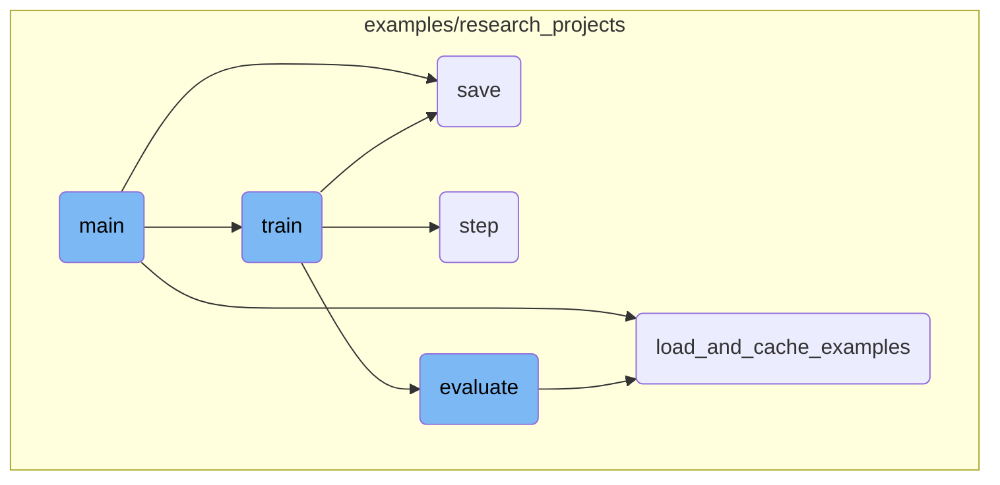
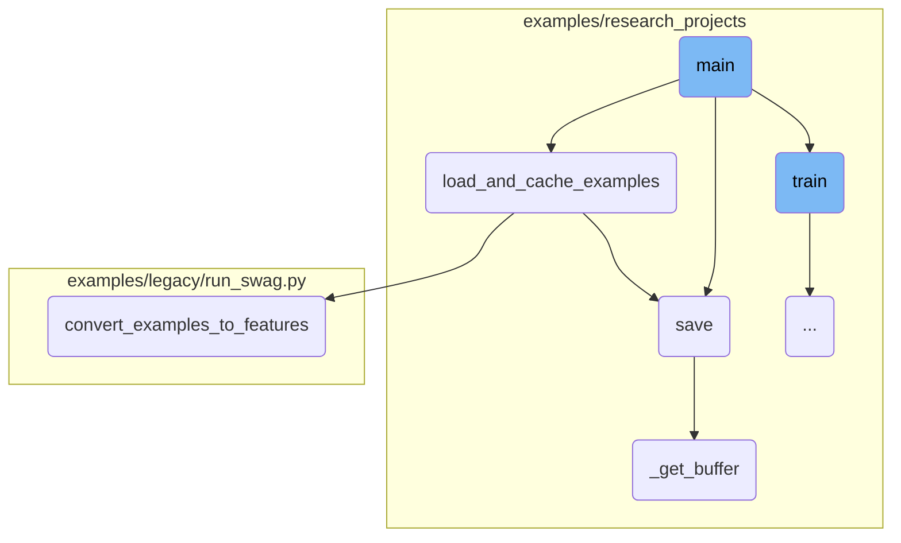
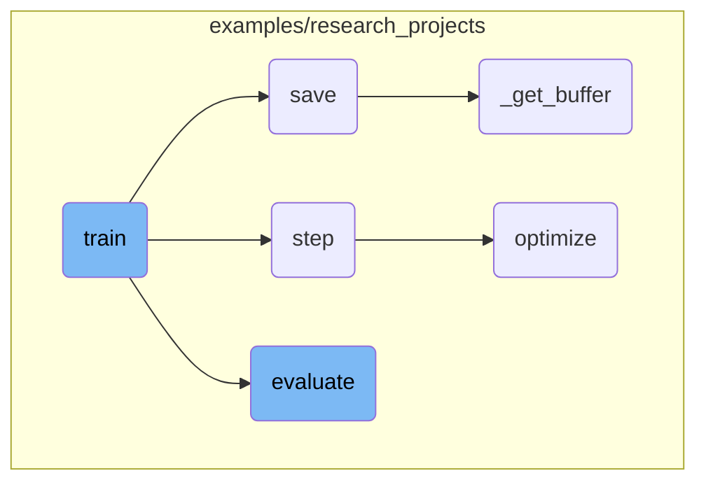

This document provides an overview of the main function, which is responsible for setting up the entire training and evaluation pipeline. It includes parsing command-line arguments, setting up the computation device, initializing logging, and preparing the GLUE task by loading the appropriate processor and labels.

The main function starts by reading the command-line arguments to configure the model, data, and training parameters. It then sets up the device for computation, initializes logging, and sets the random seed to ensure reproducibility. After that, it prepares the GLUE task by loading the necessary processor and labels, ensuring that the model is trained and evaluated correctly.

Here is a high level diagram of the flow, showing only the most important functions:



# Flow drill down

First, we'll zoom into this section of the flow:



<SwmSnippet path="/examples/research_projects/movement-pruning/masked_run_glue.py" line="561">

---

## Main Function

The <SwmToken path="examples/research_projects/movement-pruning/masked_run_glue.py" pos="561:2:2" line-data="def main():">`main`</SwmToken> function is responsible for setting up the entire training and evaluation pipeline. It starts by parsing command-line arguments to configure the model, data, and training parameters. It then sets up the device for computation, initializes logging, and sets the random seed for reproducibility. The function also prepares the GLUE task by loading the appropriate processor and labels. This setup is crucial for ensuring that the model is trained and evaluated correctly.

```python
def main():
    parser = argparse.ArgumentParser()

    # Required parameters
    parser.add_argument(
        "--data_dir",
        default=None,
        type=str,
        required=True,
        help="The input data dir. Should contain the .tsv files (or other data files) for the task.",
    )
    parser.add_argument(
        "--model_type",
        default=None,
        type=str,
        required=True,
        help="Model type selected in the list: " + ", ".join(MODEL_CLASSES.keys()),
    )
    parser.add_argument(
        "--model_name_or_path",
        default=None,
```

---

</SwmSnippet>

<SwmSnippet path="/examples/research_projects/movement-pruning/masked_run_glue.py" line="506">

---

## Loading and Caching Examples

The <SwmToken path="examples/research_projects/movement-pruning/masked_run_glue.py" pos="506:2:2" line-data="def load_and_cache_examples(args, task, tokenizer, evaluate=False):">`load_and_cache_examples`</SwmToken> function is used to load the dataset and cache the processed features for faster subsequent runs. It handles distributed training scenarios by ensuring that only the first process in distributed training processes the dataset, while others use the cached data. This function converts raw examples into features that can be fed into the model, making it a critical step in the data preprocessing pipeline.

```python
def load_and_cache_examples(args, task, tokenizer, evaluate=False):
    if args.local_rank not in [-1, 0] and not evaluate:
        torch.distributed.barrier()  # Make sure only the first process in distributed training process the dataset, and the others will use the cache

    processor = processors[task]()
    output_mode = output_modes[task]
    # Load data features from cache or dataset file
    cached_features_file = os.path.join(
        args.data_dir,
        "cached_{}_{}_{}_{}".format(
            "dev" if evaluate else "train",
            list(filter(None, args.model_name_or_path.split("/"))).pop(),
            str(args.max_seq_length),
            str(task),
        ),
    )
    if os.path.exists(cached_features_file) and not args.overwrite_cache:
        logger.info("Loading features from cached file %s", cached_features_file)
        features = torch.load(cached_features_file)
    else:
        logger.info("Creating features from dataset file at %s", args.data_dir)
```

---

</SwmSnippet>

<SwmSnippet path="/examples/research_projects/lxmert/visualizing_image.py" line="195">

---

## Saving the Model

The <SwmToken path="examples/research_projects/lxmert/visualizing_image.py" pos="195:3:3" line-data="    def save(self, saveas=None):">`save`</SwmToken> function is responsible for saving the visualized image to a file. It supports saving in different formats like JPG and PNG. This function ensures that the visualizations generated during the training or evaluation process are saved for later analysis.

```python
    def save(self, saveas=None):
        if saveas is None:
            saveas = self.saveas
        if saveas.lower().endswith(".jpg") or saveas.lower().endswith(".png"):
            cv2.imwrite(
                saveas,
                self._get_buffer()[:, :, ::-1],
            )
        else:
            self.fig.savefig(saveas)
```

---

</SwmSnippet>

<SwmSnippet path="/examples/research_projects/lxmert/visualizing_image.py" line="231">

---

## Getting the Buffer

The <SwmToken path="examples/research_projects/lxmert/visualizing_image.py" pos="231:3:3" line-data="    def _get_buffer(self):">`_get_buffer`</SwmToken> function retrieves the image buffer, which is used for saving the visualized image. It handles different backends and ensures that the image is correctly resized and formatted. This function is essential for preparing the image data before saving.

```python
    def _get_buffer(self):
        if not self.pynb:
            s, (width, height) = self.canvas.print_to_buffer()
            if (width, height) != (self.width, self.height):
                img = cv2.resize(self.img, (width, height))
            else:
                img = self.img
        else:
            buf = io.BytesIO()  # works for cairo backend
            self.canvas.print_rgba(buf)
            width, height = self.width, self.height
            s = buf.getvalue()
            img = self.img

        buffer = np.frombuffer(s, dtype="uint8")
        img_rgba = buffer.reshape(height, width, 4)
        rgb, alpha = np.split(img_rgba, [3], axis=2)

        try:
            import numexpr as ne  # fuse them with numexpr

```

---

</SwmSnippet>

<SwmSnippet path="/examples/legacy/run_swag.py" line="126">

---

## Converting Examples to Features

The <SwmToken path="examples/legacy/run_swag.py" pos="126:2:2" line-data="def convert_examples_to_features(examples, tokenizer, max_seq_length, is_training):">`convert_examples_to_features`</SwmToken> function converts raw examples into a format that can be fed into the model. For tasks like SWAG, it tokenizes the input text and organizes it into the required format, including input <SwmToken path="examples/research_projects/distillation/distiller.py" pos="379:22:22" line-data="        input_ids: `torch.tensor(bs, seq_length)` - The token ids.">`ids`</SwmToken>, attention masks, and segment <SwmToken path="examples/research_projects/distillation/distiller.py" pos="379:22:22" line-data="        input_ids: `torch.tensor(bs, seq_length)` - The token ids.">`ids`</SwmToken>. This function is crucial for preparing the data for model training and evaluation.

```python
def convert_examples_to_features(examples, tokenizer, max_seq_length, is_training):
    """Loads a data file into a list of `InputBatch`s."""

    # Swag is a multiple choice task. To perform this task using Bert,
    # we will use the formatting proposed in "Improving Language
    # Understanding by Generative Pre-Training" and suggested by
    # @jacobdevlin-google in this issue
    # https://github.com/google-research/bert/issues/38.
    #
    # Each choice will correspond to a sample on which we run the
    # inference. For a given Swag example, we will create the 4
    # following inputs:
    # - [CLS] context [SEP] choice_1 [SEP]
    # - [CLS] context [SEP] choice_2 [SEP]
    # - [CLS] context [SEP] choice_3 [SEP]
    # - [CLS] context [SEP] choice_4 [SEP]
    # The model will output a single value for each input. To get the
    # final decision of the model, we will run a softmax over these 4
    # outputs.
    features = []
    for example_index, example in tqdm(enumerate(examples)):
```

---

</SwmSnippet>

Now, lets zoom into this section of the flow:



<SwmSnippet path="/examples/research_projects/movement-pruning/masked_run_glue.py" line="106">

---

## Training the Model

The <SwmToken path="examples/research_projects/movement-pruning/masked_run_glue.py" pos="106:2:2" line-data="def train(args, train_dataset, model, tokenizer, teacher=None):">`train`</SwmToken> function is responsible for training the model. It sets up the training environment, including the data loader, optimizer, and scheduler. The function handles <SwmToken path="examples/research_projects/movement-pruning/masked_run_glue.py" pos="432:3:5" line-data="        # multi-gpu eval">`multi-gpu`</SwmToken> and distributed training setups, manages gradient accumulation, and supports mixed-precision training with Apex. It also includes logic for resuming training from checkpoints and logging training metrics.

```python
def train(args, train_dataset, model, tokenizer, teacher=None):
    """Train the model"""
    if args.local_rank in [-1, 0]:
        tb_writer = SummaryWriter(log_dir=args.output_dir)

    args.train_batch_size = args.per_gpu_train_batch_size * max(1, args.n_gpu)
    train_sampler = RandomSampler(train_dataset) if args.local_rank == -1 else DistributedSampler(train_dataset)
    train_dataloader = DataLoader(train_dataset, sampler=train_sampler, batch_size=args.train_batch_size)

    if args.max_steps > 0:
        t_total = args.max_steps
        args.num_train_epochs = args.max_steps // (len(train_dataloader) // args.gradient_accumulation_steps) + 1
    else:
        t_total = len(train_dataloader) // args.gradient_accumulation_steps * args.num_train_epochs

    # Prepare optimizer and schedule (linear warmup and decay)
    no_decay = ["bias", "LayerNorm.weight"]
    optimizer_grouped_parameters = [
        {
            "params": [p for n, p in model.named_parameters() if "mask_score" in n and p.requires_grad],
            "lr": args.mask_scores_learning_rate,
```

---

</SwmSnippet>

<SwmSnippet path="/examples/research_projects/distillation/distiller.py" line="372">

---

## Performing Optimization Steps

The <SwmToken path="examples/research_projects/distillation/distiller.py" pos="372:3:3" line-data="    def step(self, input_ids: torch.tensor, attention_mask: torch.tensor, lm_labels: torch.tensor):">`step`</SwmToken> function performs a single optimization step, including the forward pass for both the student and teacher models, loss computation, and backward pass for gradient accumulation. It handles different types of losses such as cross-entropy, mean squared error, and cosine similarity, and updates the model parameters accordingly.

```python
    def step(self, input_ids: torch.tensor, attention_mask: torch.tensor, lm_labels: torch.tensor):
        """
        One optimization step: forward of student AND teacher, backward on the loss (for gradient accumulation),
        and possibly a parameter update (depending on the gradient accumulation).

        Input:
        ------
        input_ids: `torch.tensor(bs, seq_length)` - The token ids.
        attention_mask: `torch.tensor(bs, seq_length)` - The attention mask for self attention.
        lm_labels: `torch.tensor(bs, seq_length)` - The language modeling labels (mlm labels for MLM and clm labels for CLM).
        """
        if self.mlm:
            student_outputs = self.student(
                input_ids=input_ids, attention_mask=attention_mask
            )  # (bs, seq_length, voc_size)
            with torch.no_grad():
                teacher_outputs = self.teacher(
                    input_ids=input_ids, attention_mask=attention_mask
                )  # (bs, seq_length, voc_size)
        else:
            student_outputs = self.student(input_ids=input_ids, attention_mask=None)  # (bs, seq_length, voc_size)
```

---

</SwmSnippet>

<SwmSnippet path="/examples/research_projects/distillation/distiller.py" line="466">

---

### Optimizing the Loss

The <SwmToken path="examples/research_projects/distillation/distiller.py" pos="466:3:3" line-data="    def optimize(self, loss):">`optimize`</SwmToken> function normalizes the loss, performs the backward pass, and updates the model parameters. It handles gradient clipping and supports mixed-precision training with Apex. This function is crucial for ensuring that the model parameters are updated correctly during training.

```python
    def optimize(self, loss):
        """
        Normalization on the loss (gradient accumulation or distributed training), followed by
        backward pass on the loss, possibly followed by a parameter update (depending on the gradient accumulation).
        Also update the metrics for tensorboard.
        """
        # Check for NaN
        if (loss != loss).data.any():
            logger.error("NaN detected")
            exit()

        if self.multi_gpu:
            loss = loss.mean()
        if self.params.gradient_accumulation_steps > 1:
            loss = loss / self.params.gradient_accumulation_steps

        if self.fp16:
            from apex import amp

            with amp.scale_loss(loss, self.optimizer) as scaled_loss:
                scaled_loss.backward()
```

---

</SwmSnippet>

<SwmSnippet path="/examples/research_projects/movement-pruning/masked_run_glue.py" line="415">

---

## Evaluating the Model

The <SwmToken path="examples/research_projects/movement-pruning/masked_run_glue.py" pos="415:2:2" line-data="def evaluate(args, model, tokenizer, prefix=&quot;&quot;):">`evaluate`</SwmToken> function evaluates the model on a validation dataset. It sets up the evaluation environment, including the data loader, and handles <SwmToken path="examples/research_projects/movement-pruning/masked_run_glue.py" pos="432:3:5" line-data="        # multi-gpu eval">`multi-gpu`</SwmToken> evaluation. The function computes evaluation metrics and logs the results. It also supports evaluation with global <SwmToken path="examples/research_projects/movement-pruning/masked_run_glue.py" pos="199:5:5" line-data="    # Global TopK">`TopK`</SwmToken> pruning.

```python
def evaluate(args, model, tokenizer, prefix=""):
    # Loop to handle MNLI double evaluation (matched, mis-matched)
    eval_task_names = ("mnli", "mnli-mm") if args.task_name == "mnli" else (args.task_name,)
    eval_outputs_dirs = (args.output_dir, args.output_dir + "/MM") if args.task_name == "mnli" else (args.output_dir,)

    results = {}
    for eval_task, eval_output_dir in zip(eval_task_names, eval_outputs_dirs):
        eval_dataset = load_and_cache_examples(args, eval_task, tokenizer, evaluate=True)

        if not os.path.exists(eval_output_dir) and args.local_rank in [-1, 0]:
            os.makedirs(eval_output_dir)

        args.eval_batch_size = args.per_gpu_eval_batch_size * max(1, args.n_gpu)
        # Note that DistributedSampler samples randomly
        eval_sampler = SequentialSampler(eval_dataset)
        eval_dataloader = DataLoader(eval_dataset, sampler=eval_sampler, batch_size=args.eval_batch_size)

        # multi-gpu eval
        if args.n_gpu > 1 and not isinstance(model, nn.DataParallel):
            model = nn.DataParallel(model)

```

---

</SwmSnippet>

&nbsp;

*This is an auto-generated document by Swimm AI 🌊 and has not yet been verified by a human*

<SwmMeta version="3.0.0" repo-id="Z2l0aHViJTNBJTNBdHJhbnNmb3JtZXJzJTNBJTNBc2h1anV1dQ==" repo-name="transformers" doc-type="flows"><sup>Powered by [Swimm](/)</sup></SwmMeta>
