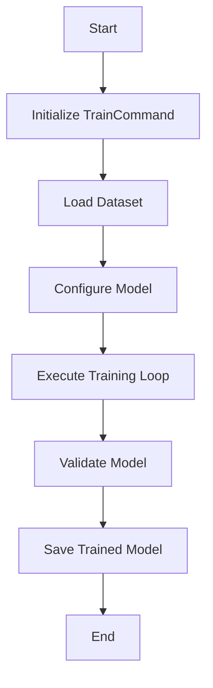

Training refers to the process of teaching a machine learning model to perform a specific task by feeding it data and adjusting its parameters.

The <SwmToken path="src/transformers/commands/train.py" pos="36:4:4" line-data="    Returns: TrainCommand">`TrainCommand`</SwmToken> class is responsible for handling the training process, including loading the dataset, configuring the model, and executing the training loop.

The <SwmToken path="src/transformers/commands/train.py" pos="32:2:2" line-data="def train_command_factory(args: Namespace):">`train_command_factory`</SwmToken> function instantiates the <SwmToken path="src/transformers/commands/train.py" pos="36:4:4" line-data="    Returns: TrainCommand">`TrainCommand`</SwmToken> class using the provided command line arguments.

The <SwmToken path="src/transformers/commands/train.py" pos="36:4:4" line-data="    Returns: TrainCommand">`TrainCommand`</SwmToken> class registers the training subcommand to the command-line interface, allowing users to specify various training parameters such as dataset paths, model configurations, and training hyperparameters.

During initialization, the <SwmToken path="src/transformers/commands/train.py" pos="36:4:4" line-data="    Returns: TrainCommand">`TrainCommand`</SwmToken> class sets up the logging, determines the framework to use (TensorFlow or <SwmToken path="src/transformers/commands/train.py" pos="25:14:14" line-data="    raise RuntimeError(&quot;At least one of PyTorch or TensorFlow 2.0+ should be installed to use CLI training&quot;)">`PyTorch`</SwmToken>), and loads the specified model and dataset.

The <SwmToken path="src/transformers/commands/train.py" pos="138:3:3" line-data="    def run(self):">`run`</SwmToken> method of the <SwmToken path="src/transformers/commands/train.py" pos="36:4:4" line-data="    Returns: TrainCommand">`TrainCommand`</SwmToken> class executes the training process, delegating to either the <SwmToken path="src/transformers/commands/train.py" pos="25:18:18" line-data="    raise RuntimeError(&quot;At least one of PyTorch or TensorFlow 2.0+ should be installed to use CLI training&quot;)">`TensorFlow`</SwmToken> or PyTorch-specific training methods.

The <SwmToken path="src/transformers/commands/train.py" pos="140:5:5" line-data="            return self.run_tf()">`run_tf`</SwmToken> method handles the training process for <SwmToken path="src/transformers/commands/train.py" pos="25:18:18" line-data="    raise RuntimeError(&quot;At least one of PyTorch or TensorFlow 2.0+ should be installed to use CLI training&quot;)">`TensorFlow`</SwmToken>, including fitting the model to the training data, validating it, and saving the trained model.



<SwmSnippet path="/src/transformers/commands/train.py" line="41">

---

# <SwmToken path="src/transformers/commands/train.py" pos="41:2:2" line-data="class TrainCommand(BaseTransformersCLICommand):">`TrainCommand`</SwmToken> Class

The <SwmToken path="src/transformers/commands/train.py" pos="41:2:2" line-data="class TrainCommand(BaseTransformersCLICommand):">`TrainCommand`</SwmToken> class is responsible for handling the training process, including loading the dataset, configuring the model, and executing the training loop.

```python
class TrainCommand(BaseTransformersCLICommand):
    @staticmethod
    def register_subcommand(parser: ArgumentParser):
        """
        Register this command to argparse so it's available for the transformer-cli

        Args:
            parser: Root parser to register command-specific arguments
        """
        train_parser = parser.add_parser("train", help="CLI tool to train a model on a task.")

        train_parser.add_argument(
            "--train_data",
            type=str,
            required=True,
            help="path to train (and optionally evaluation) dataset as a csv with tab separated labels and sentences.",
        )
        train_parser.add_argument(
            "--column_label", type=int, default=0, help="Column of the dataset csv file with example labels."
        )
        train_parser.add_argument(
```

---

</SwmSnippet>

<SwmSnippet path="/src/transformers/commands/train.py" line="32">

---

# <SwmToken path="src/transformers/commands/train.py" pos="32:2:2" line-data="def train_command_factory(args: Namespace):">`train_command_factory`</SwmToken> Function

The <SwmToken path="src/transformers/commands/train.py" pos="32:2:2" line-data="def train_command_factory(args: Namespace):">`train_command_factory`</SwmToken> function instantiates the <SwmToken path="src/transformers/commands/train.py" pos="36:4:4" line-data="    Returns: TrainCommand">`TrainCommand`</SwmToken> class using the provided command line arguments.

```python
def train_command_factory(args: Namespace):
    """
    Factory function used to instantiate training command from provided command line arguments.

    Returns: TrainCommand
    """
    return TrainCommand(args)
```

---

</SwmSnippet>

<SwmSnippet path="/src/transformers/commands/train.py" line="43">

---

# Registering Training Subcommand

The <SwmToken path="src/transformers/commands/train.py" pos="36:4:4" line-data="    Returns: TrainCommand">`TrainCommand`</SwmToken> class registers the training subcommand to the command-line interface, allowing users to specify various training parameters such as dataset paths, model configurations, and training hyperparameters.

```python
    def register_subcommand(parser: ArgumentParser):
        """
        Register this command to argparse so it's available for the transformer-cli

        Args:
            parser: Root parser to register command-specific arguments
        """
        train_parser = parser.add_parser("train", help="CLI tool to train a model on a task.")

        train_parser.add_argument(
            "--train_data",
            type=str,
            required=True,
            help="path to train (and optionally evaluation) dataset as a csv with tab separated labels and sentences.",
        )
        train_parser.add_argument(
            "--column_label", type=int, default=0, help="Column of the dataset csv file with example labels."
        )
        train_parser.add_argument(
            "--column_text", type=int, default=1, help="Column of the dataset csv file with example texts."
        )
```

---

</SwmSnippet>

<SwmSnippet path="/src/transformers/commands/train.py" line="93">

---

# Initialization of <SwmToken path="src/transformers/commands/train.py" pos="36:4:4" line-data="    Returns: TrainCommand">`TrainCommand`</SwmToken>

During initialization, the <SwmToken path="src/transformers/commands/train.py" pos="36:4:4" line-data="    Returns: TrainCommand">`TrainCommand`</SwmToken> class sets up the logging, determines the framework to use (TensorFlow or <SwmToken path="src/transformers/commands/train.py" pos="25:14:14" line-data="    raise RuntimeError(&quot;At least one of PyTorch or TensorFlow 2.0+ should be installed to use CLI training&quot;)">`PyTorch`</SwmToken>), and loads the specified model and dataset.

```python
    def __init__(self, args: Namespace):
        self.logger = logging.get_logger("transformers-cli/training")

        self.framework = "tf" if is_tf_available() else "torch"

        os.makedirs(args.output, exist_ok=True)
        self.output = args.output

        self.column_label = args.column_label
        self.column_text = args.column_text
        self.column_id = args.column_id

        self.logger.info(f"Loading {args.task} pipeline for {args.model}")
        if args.task == "text_classification":
            self.pipeline = TextClassificationPipeline.from_pretrained(args.model)
        elif args.task == "token_classification":
            raise NotImplementedError
        elif args.task == "question_answering":
            raise NotImplementedError

        self.logger.info(f"Loading dataset from {args.train_data}")
```

---

</SwmSnippet>

<SwmSnippet path="/src/transformers/commands/train.py" line="138">

---

# Running the Training Process

The <SwmToken path="src/transformers/commands/train.py" pos="138:3:3" line-data="    def run(self):">`run`</SwmToken> method of the <SwmToken path="src/transformers/commands/train.py" pos="36:4:4" line-data="    Returns: TrainCommand">`TrainCommand`</SwmToken> class executes the training process, delegating to either the <SwmToken path="src/transformers/commands/train.py" pos="25:18:18" line-data="    raise RuntimeError(&quot;At least one of PyTorch or TensorFlow 2.0+ should be installed to use CLI training&quot;)">`TensorFlow`</SwmToken> or PyTorch-specific training methods.

```python
    def run(self):
        if self.framework == "tf":
            return self.run_tf()
        return self.run_torch()
```

---

</SwmSnippet>

<SwmSnippet path="/src/transformers/commands/train.py" line="146">

---

# <SwmToken path="src/transformers/commands/train.py" pos="25:18:18" line-data="    raise RuntimeError(&quot;At least one of PyTorch or TensorFlow 2.0+ should be installed to use CLI training&quot;)">`TensorFlow`</SwmToken> Training

The <SwmToken path="src/transformers/commands/train.py" pos="146:3:3" line-data="    def run_tf(self):">`run_tf`</SwmToken> method handles the training process for <SwmToken path="src/transformers/commands/train.py" pos="25:18:18" line-data="    raise RuntimeError(&quot;At least one of PyTorch or TensorFlow 2.0+ should be installed to use CLI training&quot;)">`TensorFlow`</SwmToken>, including fitting the model to the training data, validating it, and saving the trained model.

```python
    def run_tf(self):
        self.pipeline.fit(
            self.train_dataset,
            validation_data=self.valid_dataset,
            validation_split=self.validation_split,
            learning_rate=self.learning_rate,
            adam_epsilon=self.adam_epsilon,
            train_batch_size=self.train_batch_size,
            valid_batch_size=self.valid_batch_size,
        )

        # Save trained pipeline
        self.pipeline.save_pretrained(self.output)
```

---

</SwmSnippet>

&nbsp;

*This is an auto-generated document by Swimm AI 🌊 and has not yet been verified by a human*

<SwmMeta version="3.0.0" repo-id="Z2l0aHViJTNBJTNBdHJhbnNmb3JtZXJzJTNBJTNBc2h1anV1dQ==" repo-name="transformers" doc-type="overview"><sup>Powered by [Swimm](/)</sup></SwmMeta>
