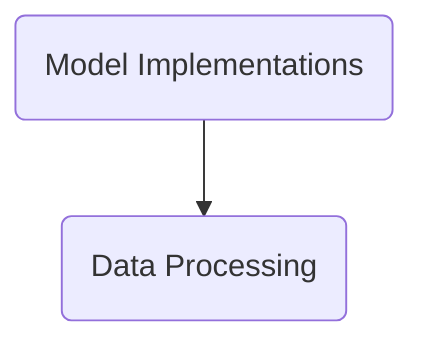

The transformers repository by Hugging Face provides state-of-the-art NLP models for Jax, PyTorch, and TensorFlow. It offers thousands of pretrained models for various NLP tasks, APIs for easy model usage, fine-tuning capabilities, and seamless integration with popular deep learning libraries.

## Main Components

### Data Processing

Data Processing involves transforming raw data into a format suitable for model training and evaluation. This includes reading data from various sources, converting it into structured examples, tokenizing text, adding special tokens, and creating input features. The goal is to ensure that the data is in the correct format and structure for the model to learn effectively.

- <SwmLink doc-title="Data processing overview">[Data processing overview](.swm/data-processing-overview.u990rrqr.sw.md)</SwmLink>
- <SwmLink doc-title="Getting started with data collator in data processing">[Getting started with data collator in data processing](.swm/getting-started-with-data-collator-in-data-processing.rdhagdlf.sw.md)</SwmLink>
- <SwmLink doc-title="Introduction to evaluation metrics">[Introduction to evaluation metrics](.swm/introduction-to-evaluation-metrics.zxrp75py.sw.md)</SwmLink>
- **Data Processors**
  - <SwmLink doc-title="Overview of data processors">[Overview of data processors](.swm/overview-of-data-processors.i08g6m60.sw.md)</SwmLink>
  - <SwmLink doc-title="Introduction to glue data processors">[Introduction to glue data processors](.swm/introduction-to-glue-data-processors.vwxkzc7d.sw.md)</SwmLink>
  - <SwmLink doc-title="Introduction to squad data processing">[Introduction to squad data processing](.swm/introduction-to-squad-data-processing.0lvcexg0.sw.md)</SwmLink>
  - **Utils**
    - <SwmLink doc-title="What is utils in data processors">[What is utils in data processors](.swm/what-is-utils-in-data-processors.kcox16un.sw.md)</SwmLink>
    - <SwmLink doc-title="The dataprocessor class">[The dataprocessor class](.swm/the-dataprocessor-class.vjwg0.sw.md)</SwmLink>
- **Data Datasets**
  - <SwmLink doc-title="Exploring data datasets">[Exploring data datasets](.swm/exploring-data-datasets.nnrn8n6z.sw.md)</SwmLink>
  - <SwmLink doc-title="Getting started with language modeling in data datasets">[Getting started with language modeling in data datasets](.swm/getting-started-with-language-modeling-in-data-datasets.6b4baxjf.sw.md)</SwmLink>

### Utilities

Utilities are tools and functions designed to assist with various tasks such as handling package versions, logging, and other supportive operations that facilitate the main functionalities of the repository.

- <SwmLink doc-title="Utilities overview">[Utilities overview](.swm/utilities-overview.pey33yd3.sw.md)</SwmLink>
- <SwmLink doc-title="Understanding logging utility">[Understanding logging utility](.swm/understanding-logging-utility.9igdesoa.sw.md)</SwmLink>
- <SwmLink doc-title="Overview of model mappings">[Overview of model mappings](.swm/overview-of-model-mappings.ug597pun.sw.md)</SwmLink>
- <SwmLink doc-title="The bertpretrainedmodel class">[The bertpretrainedmodel class](.swm/the-bertpretrainedmodel-class.bkeea.sw.md)</SwmLink>
- **Parallelization**
  - <SwmLink doc-title="Basic concepts of parallelization in utilities">[Basic concepts of parallelization in utilities](.swm/basic-concepts-of-parallelization-in-utilities.o8qkiu4j.sw.md)</SwmLink>
  - <SwmLink doc-title="What is model parallelism in transformers">[What is model parallelism in transformers](.swm/what-is-model-parallelism-in-transformers.q9qix9bc.sw.md)</SwmLink>
  - <SwmLink doc-title="Getting started with data parallelism in parallelization">[Getting started with data parallelism in parallelization](.swm/getting-started-with-data-parallelism-in-parallelization.f7gumz4x.sw.md)</SwmLink>

### Command Line

The Command Line interface allows users to interact with the system through text-based commands. It provides functionalities such as training models, managing repositories, and user authentication. Commands are instantiated and executed based on user inputs, facilitating various operations directly from the terminal.

- <SwmLink doc-title="Command line overview">[Command line overview](.swm/command-line-overview.uxh0vnav.sw.md)</SwmLink>
- <SwmLink doc-title="Understanding the iter function">[Understanding the iter function](.swm/understanding-the-iter-function.gso16sju.sw.md)</SwmLink>
- **Classes**
  - <SwmLink doc-title="The basetransformersclicommand class">[The basetransformersclicommand class](.swm/the-basetransformersclicommand-class.mg5s2.sw.md)</SwmLink>
  - <SwmLink doc-title="The baseusercommand class">[The baseusercommand class](.swm/the-baseusercommand-class.8rkk3.sw.md)</SwmLink>

### Pipelines

Pipelines are a high-level abstraction in transformers that simplify the use of models for various natural language processing tasks. They integrate tokenization, model inference, and post-processing steps into a single, easy-to-use interface. This allows users to perform tasks like text classification, question answering, and text generation with minimal code, making advanced NLP accessible and straightforward.

- <SwmLink doc-title="Pipelines overview">[Pipelines overview](.swm/pipelines-overview.c6yrg2si.sw.md)</SwmLink>
- <SwmLink doc-title="Overview of token classification in pipelines">[Overview of token classification in pipelines](.swm/overview-of-token-classification-in-pipelines.sj80vj21.sw.md)</SwmLink>
- <SwmLink doc-title="What is pipeline base in pipelines">[What is pipeline base in pipelines](.swm/what-is-pipeline-base-in-pipelines.gevbu6kj.sw.md)</SwmLink>
- <SwmLink doc-title="Overview of conversational pipelines">[Overview of conversational pipelines](.swm/overview-of-conversational-pipelines.mskudyge.sw.md)</SwmLink>
- <SwmLink doc-title="Getting started with speech recognition in pipelines">[Getting started with speech recognition in pipelines](.swm/getting-started-with-speech-recognition-in-pipelines.03vv0vlo.sw.md)</SwmLink>
- <SwmLink doc-title="Text generation flow">[Text generation flow](.swm/text-generation-flow.knhefkp5.sw.md)</SwmLink>
- **Classes**
  - <SwmLink doc-title="The pipeline class">[The pipeline class](.swm/the-pipeline-class.dmzfq.sw.md)</SwmLink>
  - <SwmLink doc-title="The argumenthandler class">[The argumenthandler class](.swm/the-argumenthandler-class.7nd0v.sw.md)</SwmLink>

### Model Implementations

Model implementations refer to the various classes and functions that define how different NLP models are constructed, trained, and utilized. These implementations include the architecture of the models, the methods for loading pre-trained weights, and the procedures for converting models between different frameworks such as TensorFlow and PyTorch. They are essential for enabling the use of state-of-the-art NLP models across different tasks and platforms.

- <SwmLink doc-title="Model implementations overview">[Model implementations overview](.swm/model-implementations-overview.djsa8yq3.sw.md)</SwmLink>
- <SwmLink doc-title="Exploring big bird model">[Exploring big bird model](.swm/exploring-big-bird-model.u3yklc7d.sw.md)</SwmLink>
- <SwmLink doc-title="Getting started with t5 model overview">[Getting started with t5 model overview](.swm/getting-started-with-t5-model-overview.4lwwhncv.sw.md)</SwmLink>
- <SwmLink doc-title="Overview of the __call__ method">[Overview of the \__call_\_ method](.swm/overview-of-the-__call__-method.tkrj0sit.sw.md)</SwmLink><SwmLink doc-title="Overview of the __call__ method">[Overview of the \__call_\_ method](.swm/overview-of-the-__call__-method.tkrj0sit.sw.md)</SwmLink><SwmLink doc-title="Overview of the __call__ method">[Overview of the \__call_\_ method](.swm/overview-of-the-__call__-method.tkrj0sit.sw.md)</SwmLink>
- **BERT Model**
  - <SwmLink doc-title="Getting started with bert model implementation">[Getting started with bert model implementation](.swm/getting-started-with-bert-model-implementation.5t555dws.sw.md)</SwmLink>
  - <SwmLink doc-title="The tfbertpretrainedmodel class">[The tfbertpretrainedmodel class](.swm/the-tfbertpretrainedmodel-class.7f7c6.sw.md)</SwmLink>
- **TAPAS Model**
  - <SwmLink doc-title="Introduction to tapas model">[Introduction to tapas model](.swm/introduction-to-tapas-model.v6b6xwzs.sw.md)</SwmLink>
  - <SwmLink doc-title="Preparing data for model">[Preparing data for model](.swm/preparing-data-for-model.ki78v5jg.sw.md)</SwmLink>
- **Classes**
  - <SwmLink doc-title="The megatronbertpretrainedmodel class">[The megatronbertpretrainedmodel class](.swm/the-megatronbertpretrainedmodel-class.eqr8e.sw.md)</SwmLink>
  - <SwmLink doc-title="The hfindexbase class">[The hfindexbase class](.swm/the-hfindexbase-class.0zzt1.sw.md)</SwmLink>

### Flows

- <SwmLink doc-title="Main function flow overview">[Main function flow overview](.swm/main-function-flow-overview.aaf6jkow.sw.md)</SwmLink>
- <SwmLink doc-title="Main function flow">[Main function flow](.swm/main-function-flow.cl496riz.sw.md)</SwmLink>
- <SwmLink doc-title="Main function overview">[Main function overview](.swm/main-function-overview.sysg0hhm.sw.md)</SwmLink>
- <SwmLink doc-title="Main function flow overview">[Main function flow overview](.swm/main-function-flow-overview.5jmcbzbd.sw.md)</SwmLink>
- <SwmLink doc-title="Main function flow">[Main function flow](.swm/main-function-flow.zuo7qvlz.sw.md)</SwmLink>

## Classes

- <SwmLink doc-title="The dataset class">[The dataset class](.swm/the-dataset-class.qbb2v.sw.md)</SwmLink>
- <SwmLink doc-title="The modeloutput class">[The modeloutput class](.swm/the-modeloutput-class.pkmuz.sw.md)</SwmLink>
- <SwmLink doc-title="The spmconverter class">[The spmconverter class](.swm/the-spmconverter-class.hdsg1.sw.md)</SwmLink>
- <SwmLink doc-title="The explicitenum class">[The explicitenum class](.swm/the-explicitenum-class.gjes9.sw.md)</SwmLink>
- <SwmLink doc-title="The trainercallback class">[The trainercallback class](.swm/the-trainercallback-class.ceknp.sw.md)</SwmLink>
- <SwmLink doc-title="The dataprocessor class">[The dataprocessor class](.swm/the-dataprocessor-class.j7ion.sw.md)</SwmLink>
- <SwmLink doc-title="The trainer class">[The trainer class](.swm/the-trainer-class.jfmov.sw.md)</SwmLink>
- <SwmLink doc-title="The logitsprocessor class">[The logitsprocessor class](.swm/the-logitsprocessor-class.w2xcc.sw.md)</SwmLink>
- <SwmLink doc-title="The dataprocessor class">[The dataprocessor class](.swm/the-dataprocessor-class.28ybv.sw.md)</SwmLink>
- <SwmLink doc-title="The tfsharedembeddings class">[The tfsharedembeddings class](.swm/the-tfsharedembeddings-class.aotx9.sw.md)</SwmLink>
- <SwmLink doc-title="The summarizationdistiller class">[The summarizationdistiller class](.swm/the-summarizationdistiller-class.c0x7h.sw.md)</SwmLink>
- <SwmLink doc-title="The trainingarguments class">[The trainingarguments class](.swm/the-trainingarguments-class.6lgwb.sw.md)</SwmLink>

## Build Tools

- <SwmLink doc-title="Using the makefile">[Using the makefile](.swm/using-the-makefile.s9p7pbz3.sw.md)</SwmLink>

&nbsp;

*This is an auto-generated document by Swimm AI 🌊 and has not yet been verified by a human*

<SwmMeta version="3.0.0" repo-id="Z2l0aHViJTNBJTNBdHJhbnNmb3JtZXJzJTNBJTNBc2h1anV1dQ==" repo-name="transformers">Powered by [Swimm](/)</SwmMeta>
