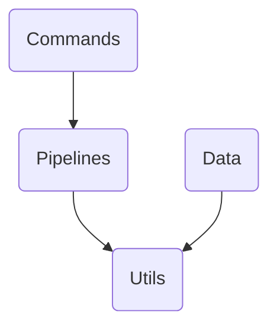

The 'transformers' repository by Hugging Face provides a library for state-of-the-art machine learning models, focusing on transformer architectures. It supports JAX, PyTorch, and TensorFlow, offering thousands of pretrained models for tasks in text, vision, and audio.

## Main Components

### Pipelines

Pipelines are objects that abstract most of the complex code from the library, offering a simple API dedicated to several tasks, including Named Entity Recognition, Masked Language Modeling, Sentiment Analysis, Feature Extraction, and Question Answering.

- <SwmLink doc-title="Pipelines overview">[Pipelines overview](.swm/pipelines-overview.wsdkbqhz.sw.md)</SwmLink>
- <SwmLink doc-title="Overview of text classification in pipelines">[Overview of text classification in pipelines](.swm/overview-of-text-classification-in-pipelines.pzlja662.sw.md)</SwmLink>
- <SwmLink doc-title="Basic concepts of text generation in pipelines">[Basic concepts of text generation in pipelines](.swm/basic-concepts-of-text-generation-in-pipelines.k1ulzz3t.sw.md)</SwmLink>
- <SwmLink doc-title="Getting started with image classification in pipelines">[Getting started with image classification in pipelines](.swm/getting-started-with-image-classification-in-pipelines.685lz2ys.sw.md)</SwmLink>
- <SwmLink doc-title="Understanding image segmentation in pipelines">[Understanding image segmentation in pipelines](.swm/understanding-image-segmentation-in-pipelines.ljbgea6j.sw.md)</SwmLink>
- <SwmLink doc-title="Overview of audio processing in pipelines">[Overview of audio processing in pipelines](.swm/overview-of-audio-processing-in-pipelines.o2h7as76.sw.md)</SwmLink>
- <SwmLink doc-title="The pipeline class">[The pipeline class](.swm/the-pipeline-class.l14ue.sw.md)</SwmLink>

### Data

Data refers to the input and output files used for training and evaluating machine learning models. These files are typically formatted in a specific way, such as having separate files for training, validation, and testing, with input and target data. Data collators are used to batch and preprocess these data elements, ensuring they are in the correct format for model training and evaluation.

- <SwmLink doc-title="Data overview">[Data overview](.swm/data-overview.kzcqdfi4.sw.md)</SwmLink>
- <SwmLink doc-title="Understanding datasets">[Understanding datasets](.swm/understanding-datasets.sudm7i8c.sw.md)</SwmLink>
- <SwmLink doc-title="Exploring model evaluation metrics">[Exploring model evaluation metrics](.swm/exploring-model-evaluation-metrics.tu4r486a.sw.md)</SwmLink>
- **Data Processing**
  - <SwmLink doc-title="Exploring data processing in transformers">[Exploring data processing in transformers](.swm/exploring-data-processing-in-transformers.tbgurj72.sw.md)</SwmLink>
  - <SwmLink doc-title="The dataprocessor class">[The dataprocessor class](.swm/the-dataprocessor-class.ouna5.sw.md)</SwmLink>
- **Flows**
  - <SwmLink doc-title="Generating final predictions from model logits">[Generating final predictions from model logits](.swm/generating-final-predictions-from-model-logits.q1i0axlg.sw.md)</SwmLink>
  - <SwmLink doc-title="Generating predictions flow">[Generating predictions flow](.swm/generating-predictions-flow.vw3jonv0.sw.md)</SwmLink>

### Commands

Commands are specific instructions or functions that can be executed within the transformers library to perform various tasks such as model conversion, downloading, environment setup, and user management. These commands are registered and parsed through a command-line interface (CLI) tool, allowing users to interact with the library efficiently.

- <SwmLink doc-title="Commands overview">[Commands overview](.swm/commands-overview.r80fngkj.sw.md)</SwmLink>
- <SwmLink doc-title="What is model conversion">[What is model conversion](.swm/what-is-model-conversion.qb0n4rat.sw.md)</SwmLink>
- <SwmLink doc-title="Overview of training command">[Overview of training command](.swm/overview-of-training-command.6r80l70o.sw.md)</SwmLink>
- <SwmLink doc-title="Introduction to model management in commands">[Introduction to model management in commands](.swm/introduction-to-model-management-in-commands.jgl85cso.sw.md)</SwmLink>
- <SwmLink doc-title="Overview of environment setup in commands">[Overview of environment setup in commands](.swm/overview-of-environment-setup-in-commands.n1w0yd43.sw.md)</SwmLink>
- <SwmLink doc-title="Overview of user management in commands">[Overview of user management in commands](.swm/overview-of-user-management-in-commands.gnjqn9fh.sw.md)</SwmLink>
- <SwmLink doc-title="The basetransformersclicommand class">[The basetransformersclicommand class](.swm/the-basetransformersclicommand-class.741eo.sw.md)</SwmLink>

### Utils

Utils are a collection of helper functions, constants, and classes designed to simplify common tasks and operations within the codebase. They provide reusable code snippets that handle tasks such as environment variable management, package availability checks, and error handling, ensuring consistency and reducing redundancy across the project.

- <SwmLink doc-title="Utils overview">[Utils overview](.swm/utils-overview.9uw7qov0.sw.md)</SwmLink>
- <SwmLink doc-title="Getting started with placeholder classes">[Getting started with placeholder classes](.swm/getting-started-with-placeholder-classes.qgin245b.sw.md)</SwmLink>
- <SwmLink doc-title="Exploring configuration in utils">[Exploring configuration in utils](.swm/exploring-configuration-in-utils.noungyr6.sw.md)</SwmLink>
- <SwmLink doc-title="What is logging in utils">[What is logging in utils](.swm/what-is-logging-in-utils.b7ewfgkw.sw.md)</SwmLink>
- <SwmLink doc-title="The bertpretrainedmodel class">[The bertpretrainedmodel class](.swm/the-bertpretrainedmodel-class.s78l5.sw.md)</SwmLink>
- **Utilities**
  - <SwmLink doc-title="Overview of utilities in utils">[Overview of utilities in utils](.swm/overview-of-utilities-in-utils.chdfaabl.sw.md)</SwmLink>
  - <SwmLink doc-title="The explicitenum class">[The explicitenum class](.swm/the-explicitenum-class.teir0.sw.md)</SwmLink>
  - **Flows**
    - <SwmLink doc-title="Saving visualized images">[Saving visualized images](.swm/saving-visualized-images.af4bf2op.sw.md)</SwmLink>
    - <SwmLink doc-title="Resizing token embeddings">[Resizing token embeddings](.swm/resizing-token-embeddings.448cw6fv.sw.md)</SwmLink>
    - <SwmLink doc-title="Resolving configuration files">[Resolving configuration files](.swm/resolving-configuration-files.x1nr8rne.sw.md)</SwmLink>
    - <SwmLink doc-title="Image resizing process">[Image resizing process](.swm/image-resizing-process.pb8kuy7x.sw.md)</SwmLink>
    - <SwmLink doc-title="Main function flow in text generation">[Main function flow in text generation](.swm/main-function-flow-in-text-generation.3yz1j0iq.sw.md)</SwmLink>

### Flows

- <SwmLink doc-title="Model conversion to onnx">[Model conversion to onnx](.swm/model-conversion-to-onnx.mvk5zm06.sw.md)</SwmLink>
- <SwmLink doc-title="Evaluating predictions with squad_evaluate">[Evaluating predictions with squad_evaluate](.swm/evaluating-predictions-with-squad_evaluate.xe1psuk4.sw.md)</SwmLink>
- <SwmLink doc-title="Main function flow overview">[Main function flow overview](.swm/main-function-flow-overview.ahw9t4s7.sw.md)</SwmLink>
- <SwmLink doc-title="Main function flow">[Main function flow](.swm/main-function-flow.s4zo51y0.sw.md)</SwmLink>
- <SwmLink doc-title="Overview of the main function">[Overview of the main function](.swm/overview-of-the-main-function.0ze89681.sw.md)</SwmLink>

## Classes

- <SwmLink doc-title="The tfbertpretrainedmodel class">[The tfbertpretrainedmodel class](.swm/the-tfbertpretrainedmodel-class.idxbd.sw.md)</SwmLink>
- <SwmLink doc-title="The pretrainedmodel class">[The pretrainedmodel class](.swm/the-pretrainedmodel-class.54794.sw.md)</SwmLink>
- <SwmLink doc-title="The dataset class">[The dataset class](.swm/the-dataset-class.qzd05.sw.md)</SwmLink>
- <SwmLink doc-title="The _baseautomodelclass class">[The \_baseautomodelclass class](.swm/the-_baseautomodelclass-class.yw1ba.sw.md)</SwmLink>
- <SwmLink doc-title="The spmconverter class">[The spmconverter class](.swm/the-spmconverter-class.kif7z.sw.md)</SwmLink>
- <SwmLink doc-title="The onnxconfig class">[The onnxconfig class](.swm/the-onnxconfig-class.ej8cw.sw.md)</SwmLink>
- <SwmLink doc-title="The cache class">[The cache class](.swm/the-cache-class.m5suu.sw.md)</SwmLink>
- <SwmLink doc-title="The stoppingcriteria class">[The stoppingcriteria class](.swm/the-stoppingcriteria-class.1srk8.sw.md)</SwmLink>
- <SwmLink doc-title="The dataprocessor class">[The dataprocessor class](.swm/the-dataprocessor-class.1hlwc.sw.md)</SwmLink>

## Build Tools

- <SwmLink doc-title="Using the makefile">[Using the makefile](.swm/using-the-makefile.eik642en.sw.md)</SwmLink>

&nbsp;

*This is an auto-generated document by Swimm AI 🌊 and has not yet been verified by a human*

<SwmMeta version="3.0.0" repo-id="Z2l0aHViJTNBJTNBdHJhbnNmb3JtZXJzJTNBJTNBc2h1anV1dQ==" repo-name="transformers" doc-type="other">Powered by [Swimm](/)</SwmMeta>
