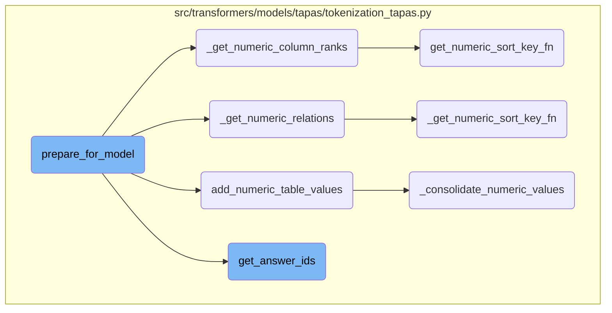

This document explains the process of preparing data for a model. The process involves handling numeric values and relations in tables, adding numeric values to both tables and questions, and ensuring that these values are properly annotated and ready for further processing.

The flow starts by parsing the table and question to identify numeric values. It then adds these numeric values to the table and question to ensure they are properly annotated. Next, it identifies numeric relations between the table and question, which helps in understanding how the numeric values are related. The process also involves ranking numeric columns to understand the order of numeric values. Finally, it retrieves answer <SwmToken path="src/transformers/models/tapas/tokenization_tapas.py" pos="197:17:17" line-data="    :class:`~transformers.TapasTokenizer` creates several token type ids to encode tabular structure. To be more">`ids`</SwmToken> based on the column and row <SwmToken path="src/transformers/models/tapas/tokenization_tapas.py" pos="197:17:17" line-data="    :class:`~transformers.TapasTokenizer` creates several token type ids to encode tabular structure. To be more">`ids`</SwmToken>, ensuring that the answers are correctly mapped to their positions in the table.

# Flow drill down



<SwmSnippet path="/src/transformers/models/tapas/tokenization_tapas.py" line="1158">

---

## Handling numeric values and relations in tables

The function <SwmToken path="src/transformers/models/tapas/tokenization_tapas.py" pos="499:12:12" line-data="        special tokens using the tokenizer ``prepare_for_model`` method.">`prepare_for_model`</SwmToken> first parses both the table and question in terms of numeric values by calling <SwmToken path="src/transformers/models/tapas/tokenization_tapas.py" pos="1158:5:5" line-data="        raw_table = add_numeric_table_values(raw_table)">`add_numeric_table_values`</SwmToken> and <SwmToken path="src/transformers/models/tapas/tokenization_tapas.py" pos="1159:5:5" line-data="        raw_query = add_numeric_values_to_question(raw_query)">`add_numeric_values_to_question`</SwmToken>. This step ensures that the numeric values are properly annotated and ready for further processing.

```python
        raw_table = add_numeric_table_values(raw_table)
        raw_query = add_numeric_values_to_question(raw_query)

```

---

</SwmSnippet>

<SwmSnippet path="/src/transformers/models/tapas/tokenization_tapas.py" line="2717">

---

### Adding numeric table values

The function <SwmToken path="src/transformers/models/tapas/tokenization_tapas.py" pos="2717:2:2" line-data="def add_numeric_table_values(table, min_consolidation_fraction=0.7, debug_info=None):">`add_numeric_table_values`</SwmToken> parses text in the table <SwmToken path="src/transformers/models/tapas/tokenization_tapas.py" pos="2719:9:11" line-data="    Parses text in table column-wise and adds the consolidated values. Consolidation refers to finding values with a">`column-wise`</SwmToken> and adds consolidated numeric values. This involves filtering invalid unicode, replacing cell values with <SwmToken path="src/transformers/models/tapas/tokenization_tapas.py" pos="2734:8:8" line-data="    # Second, replace cell values by Cell objects">`cell`</SwmToken> objects, and adding numeric value attributes to these <SwmToken path="src/transformers/models/tapas/tokenization_tapas.py" pos="2734:8:8" line-data="    # Second, replace cell values by Cell objects">`cell`</SwmToken> objects.

```python
def add_numeric_table_values(table, min_consolidation_fraction=0.7, debug_info=None):
    """
    Parses text in table column-wise and adds the consolidated values. Consolidation refers to finding values with a
    common types (date or number)

    Args:
        table:
            Table to annotate.
        min_consolidation_fraction:
            Fraction of cells in a column that need to have consolidated value.
        debug_info:
            Additional information used for logging.
    """
    table = table.copy()
    # First, filter table on invalid unicode
    filter_invalid_unicode_from_table(table)

    # Second, replace cell values by Cell objects
    for row_index, row in table.iterrows():
        for col_index, cell in enumerate(row):
            table.iloc[row_index, col_index] = Cell(text=cell)
```

---

</SwmSnippet>

<SwmSnippet path="/src/transformers/models/tapas/tokenization_tapas.py" line="1543">

---

### Getting numeric relations

The function <SwmToken path="src/transformers/models/tapas/tokenization_tapas.py" pos="1543:3:3" line-data="    def _get_numeric_relations(self, question, column_ids, row_ids, table):">`_get_numeric_relations`</SwmToken> returns numeric relations embeddings by mapping table cells to the set of all relations they have with any value in the question. This step is crucial for understanding the relationships between numeric values in the table and the question.

```python
    def _get_numeric_relations(self, question, column_ids, row_ids, table):
        """
        Returns numeric relations embeddings

        Args:
            question: Question object.
            column_ids: Maps word piece position to column id.
            row_ids: Maps word piece position to row id.
            table: The table containing the numeric cell values.
        """

        numeric_relations = [0] * len(column_ids)

        # first, we add any numeric value spans to the question:
        # Create a dictionary that maps a table cell to the set of all relations
        # this cell has with any value in the question.
        cell_indices_to_relations = collections.defaultdict(set)
        if question is not None and table is not None:
            for numeric_value_span in question.numeric_spans:
                for value in numeric_value_span.values:
                    for column_index in range(len(table.columns)):
```

---

</SwmSnippet>

<SwmSnippet path="/src/transformers/models/tapas/tokenization_tapas.py" line="1487">

---

### Getting numeric column ranks

The function <SwmToken path="src/transformers/models/tapas/tokenization_tapas.py" pos="1487:3:3" line-data="    def _get_numeric_column_ranks(self, column_ids, row_ids, table):">`_get_numeric_column_ranks`</SwmToken> returns column ranks for all numeric columns. This involves sorting the numeric values and assigning ranks to each cell token index, which helps in understanding the relative ordering of numeric values in the table.

```python
    def _get_numeric_column_ranks(self, column_ids, row_ids, table):
        """Returns column ranks for all numeric columns."""

        ranks = [0] * len(column_ids)
        inv_ranks = [0] * len(column_ids)

        # original code from tf_example_utils.py of the original implementation
        if table is not None:
            for col_index in range(len(table.columns)):
                table_numeric_values = self._get_column_values(table, col_index)

                if not table_numeric_values:
                    continue

                try:
                    key_fn = get_numeric_sort_key_fn(table_numeric_values.values())
                except ValueError:
                    continue

                table_numeric_values = {row_index: key_fn(value) for row_index, value in table_numeric_values.items()}

```

---

</SwmSnippet>

<SwmSnippet path="/src/transformers/models/tapas/tokenization_tapas.py" line="1746">

---

### Getting answer <SwmToken path="src/transformers/models/tapas/tokenization_tapas.py" pos="197:17:17" line-data="    :class:`~transformers.TapasTokenizer` creates several token type ids to encode tabular structure. To be more">`ids`</SwmToken>

The function <SwmToken path="src/transformers/models/tapas/tokenization_tapas.py" pos="1746:3:3" line-data="    def get_answer_ids(self, column_ids, row_ids, tokenized_table, answer_texts_question, answer_coordinates_question):">`get_answer_ids`</SwmToken> retrieves the answer <SwmToken path="src/transformers/models/tapas/tokenization_tapas.py" pos="197:17:17" line-data="    :class:`~transformers.TapasTokenizer` creates several token type ids to encode tabular structure. To be more">`ids`</SwmToken> based on the column and row <SwmToken path="src/transformers/models/tapas/tokenization_tapas.py" pos="197:17:17" line-data="    :class:`~transformers.TapasTokenizer` creates several token type ids to encode tabular structure. To be more">`ids`</SwmToken>, tokenized table, and answer texts or coordinates. This step is essential for mapping the answers to their respective positions in the table.

```python
    def get_answer_ids(self, column_ids, row_ids, tokenized_table, answer_texts_question, answer_coordinates_question):
        if self.update_answer_coordinates:
            return self._find_answer_ids_from_answer_texts(
                column_ids,
                row_ids,
                tokenized_table,
                answer_texts=[self.tokenize(at) for at in answer_texts_question],
            )
        return self._get_answer_ids(column_ids, row_ids, answer_coordinates_question)
```

---

</SwmSnippet>

<SwmSnippet path="/src/transformers/models/tapas/tokenization_tapas.py" line="2549">

---

### Getting numeric sort key function

The function <SwmToken path="src/transformers/models/tapas/tokenization_tapas.py" pos="2549:2:2" line-data="def get_numeric_sort_key_fn(numeric_values):">`get_numeric_sort_key_fn`</SwmToken> creates a function that can be used as a sort key or to compare numeric values. This function maps numeric values to a comparable tuple, which is useful for sorting and comparing numeric values in the table.

```python
def get_numeric_sort_key_fn(numeric_values):
    """
    Creates a function that can be used as a sort key or to compare the values. Maps to primitive types and finds the
    biggest common subset. Consider the values "05/05/2010" and "August 2007". With the corresponding primitive values
    (2010.,5.,5.) and (2007.,8., None). These values can be compared by year and date so we map to the sequence (2010.,
    5.), (2007., 8.). If we added a third value "2006" with primitive value (2006., None, None), we could only compare
    by the year so we would map to (2010.,), (2007.,) and (2006.,).

    Args:
     numeric_values: Values to compare

    Returns:
     A function that can be used as a sort key function (mapping numeric values to a comparable tuple)

    Raises:
      ValueError if values don't have a common type or are not comparable.
    """
    value_types = _get_all_types(numeric_values)
    if len(value_types) != 1:
        raise ValueError(f"No common value type in {numeric_values}")

```

---

</SwmSnippet>

<SwmSnippet path="/src/transformers/models/tapas/tokenization_tapas.py" line="2596">

---

### Consolidating numeric values

The function <SwmToken path="src/transformers/models/tapas/tokenization_tapas.py" pos="2596:2:2" line-data="def _consolidate_numeric_values(row_index_to_values, min_consolidation_fraction, debug_info):">`_consolidate_numeric_values`</SwmToken> finds the most common numeric values in a column and returns them. This step ensures that the numeric values are consistent and can be used for further processing.

```python
def _consolidate_numeric_values(row_index_to_values, min_consolidation_fraction, debug_info):
    """
    Finds the most common numeric values in a column and returns them

    Args:
        row_index_to_values:
            For each row index all the values in that cell.
        min_consolidation_fraction:
            Fraction of cells that need to have consolidated value.
        debug_info:
            Additional information only used for logging

    Returns:
        For each row index the first value that matches the most common value. Rows that don't have a matching value
        are dropped. Empty list if values can't be consolidated.
    """
    type_counts = collections.Counter()
    for numeric_values in row_index_to_values.values():
        type_counts.update(_get_all_types(numeric_values))
    if not type_counts:
        return {}
```

---

</SwmSnippet>

# Where is this flow used?

This flow is used multiple times in the codebase as represented in the following diagram:

```mermaid
graph TD;
      subgraph src/transformers/models
356c2e3b9aa8d609c3283b0721451e81f57a0eaa4d8f1e60fd75694ef1aec032(__call__):::rootsStyle --> b265aee4243ba863561bc6d8912bd43a8d963ab7da77f8bd96007d3788bf88cc(batch_encode_plus)
end

subgraph src/transformers/models
b265aee4243ba863561bc6d8912bd43a8d963ab7da77f8bd96007d3788bf88cc(batch_encode_plus) --> edaf8d3235689dffebfeca6d6159a4f1044f939364ef2e71abd0d5ad7a064f1e(_batch_encode_plus)
end

subgraph src/transformers/models
edaf8d3235689dffebfeca6d6159a4f1044f939364ef2e71abd0d5ad7a064f1e(_batch_encode_plus) --> 604df6e44650f53f4e57019d8e2d70f21eea23a2b9b993f7a9c21eae399527d6(_batch_prepare_for_model)
end

subgraph src/transformers/models
604df6e44650f53f4e57019d8e2d70f21eea23a2b9b993f7a9c21eae399527d6(_batch_prepare_for_model) --> a94f97389a7d9e844922df01057bcfcef848e69b09fb9f8cd1e7b48d9c843501(prepare_for_model):::mainFlowStyle
end

subgraph src/transformers/models
356c2e3b9aa8d609c3283b0721451e81f57a0eaa4d8f1e60fd75694ef1aec032(__call__):::rootsStyle --> 8640e8fb78d1bd946fed0b92685b1340bb52cc5bdf06297f4fff30ac15c40c61(postprocess_docs)
end

subgraph src/transformers/models
8640e8fb78d1bd946fed0b92685b1340bb52cc5bdf06297f4fff30ac15c40c61(postprocess_docs) --> b265aee4243ba863561bc6d8912bd43a8d963ab7da77f8bd96007d3788bf88cc(batch_encode_plus)
end

subgraph src/transformers/models
afc743491a1d2d9b6e067f61d05a7d574557613d93e89311fd8982b609353239(convert_bort_checkpoint_to_pytorch):::rootsStyle --> d0660c6b499f277de18472163d26a458871bf042b13e4e6d7ae8fbd24920eff4(encode_plus)
end

subgraph src/transformers/models
d0660c6b499f277de18472163d26a458871bf042b13e4e6d7ae8fbd24920eff4(encode_plus) --> c44b7d94ef52dfb98dbf782d5e85ac8bdaa3265617fafba9830d126a189baecc(_encode_plus)
end

subgraph src/transformers/models
c44b7d94ef52dfb98dbf782d5e85ac8bdaa3265617fafba9830d126a189baecc(_encode_plus) --> a94f97389a7d9e844922df01057bcfcef848e69b09fb9f8cd1e7b48d9c843501(prepare_for_model):::mainFlowStyle
end

subgraph src/transformers/models
e16892c1ab0608321794b1cdc43846a5801afa9258ea7dce19624524f37312dc(encode):::rootsStyle --> d0660c6b499f277de18472163d26a458871bf042b13e4e6d7ae8fbd24920eff4(encode_plus)
end


      classDef mainFlowStyle color:#000000,fill:#7CB9F4
classDef rootsStyle color:#000000,fill:#00FFF4
classDef Style1 color:#000000,fill:#00FFAA
classDef Style2 color:#000000,fill:#FFFF00
classDef Style3 color:#000000,fill:#AA7CB9

%% Swimm:
%% graph TD;
%%       subgraph <SwmPath>[src/transformers/models/](src/transformers/models/)</SwmPath>
%% 356c2e3b9aa8d609c3283b0721451e81f57a0eaa4d8f1e60fd75694ef1aec032(__call__):::rootsStyle --> b265aee4243ba863561bc6d8912bd43a8d963ab7da77f8bd96007d3788bf88cc(batch_encode_plus)
%% end
%% 
%% subgraph <SwmPath>[src/transformers/models/](src/transformers/models/)</SwmPath>
%% b265aee4243ba863561bc6d8912bd43a8d963ab7da77f8bd96007d3788bf88cc(batch_encode_plus) --> edaf8d3235689dffebfeca6d6159a4f1044f939364ef2e71abd0d5ad7a064f1e(_batch_encode_plus)
%% end
%% 
%% subgraph <SwmPath>[src/transformers/models/](src/transformers/models/)</SwmPath>
%% edaf8d3235689dffebfeca6d6159a4f1044f939364ef2e71abd0d5ad7a064f1e(_batch_encode_plus) --> 604df6e44650f53f4e57019d8e2d70f21eea23a2b9b993f7a9c21eae399527d6(_batch_prepare_for_model)
%% end
%% 
%% subgraph <SwmPath>[src/transformers/models/](src/transformers/models/)</SwmPath>
%% 604df6e44650f53f4e57019d8e2d70f21eea23a2b9b993f7a9c21eae399527d6(_batch_prepare_for_model) --> a94f97389a7d9e844922df01057bcfcef848e69b09fb9f8cd1e7b48d9c843501(prepare_for_model):::mainFlowStyle
%% end
%% 
%% subgraph <SwmPath>[src/transformers/models/](src/transformers/models/)</SwmPath>
%% 356c2e3b9aa8d609c3283b0721451e81f57a0eaa4d8f1e60fd75694ef1aec032(__call__):::rootsStyle --> 8640e8fb78d1bd946fed0b92685b1340bb52cc5bdf06297f4fff30ac15c40c61(postprocess_docs)
%% end
%% 
%% subgraph <SwmPath>[src/transformers/models/](src/transformers/models/)</SwmPath>
%% 8640e8fb78d1bd946fed0b92685b1340bb52cc5bdf06297f4fff30ac15c40c61(postprocess_docs) --> b265aee4243ba863561bc6d8912bd43a8d963ab7da77f8bd96007d3788bf88cc(batch_encode_plus)
%% end
%% 
%% subgraph <SwmPath>[src/transformers/models/](src/transformers/models/)</SwmPath>
%% afc743491a1d2d9b6e067f61d05a7d574557613d93e89311fd8982b609353239(convert_bort_checkpoint_to_pytorch):::rootsStyle --> d0660c6b499f277de18472163d26a458871bf042b13e4e6d7ae8fbd24920eff4(encode_plus)
%% end
%% 
%% subgraph <SwmPath>[src/transformers/models/](src/transformers/models/)</SwmPath>
%% d0660c6b499f277de18472163d26a458871bf042b13e4e6d7ae8fbd24920eff4(encode_plus) --> c44b7d94ef52dfb98dbf782d5e85ac8bdaa3265617fafba9830d126a189baecc(_encode_plus)
%% end
%% 
%% subgraph <SwmPath>[src/transformers/models/](src/transformers/models/)</SwmPath>
%% c44b7d94ef52dfb98dbf782d5e85ac8bdaa3265617fafba9830d126a189baecc(_encode_plus) --> a94f97389a7d9e844922df01057bcfcef848e69b09fb9f8cd1e7b48d9c843501(prepare_for_model):::mainFlowStyle
%% end
%% 
%% subgraph <SwmPath>[src/transformers/models/](src/transformers/models/)</SwmPath>
%% e16892c1ab0608321794b1cdc43846a5801afa9258ea7dce19624524f37312dc(encode):::rootsStyle --> d0660c6b499f277de18472163d26a458871bf042b13e4e6d7ae8fbd24920eff4(encode_plus)
%% end
%% 
%% 
%%       classDef mainFlowStyle color:#000000,fill:#7CB9F4
%% classDef rootsStyle color:#000000,fill:#00FFF4
%% classDef Style1 color:#000000,fill:#00FFAA
%% classDef Style2 color:#000000,fill:#FFFF00
%% classDef Style3 color:#000000,fill:#AA7CB9
```



&nbsp;

*This is an auto-generated document by Swimm AI 🌊 and has not yet been verified by a human*

<SwmMeta version="3.0.0" repo-id="Z2l0aHViJTNBJTNBdHJhbnNmb3JtZXJzJTNBJTNBc2h1anV1dQ==" repo-name="transformers"><sup>Powered by [Swimm](/)</sup></SwmMeta>
