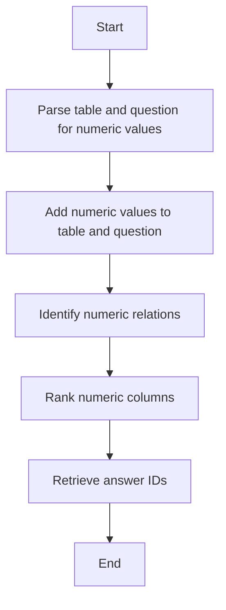

This document will cover the process of preparing data for a model. We'll cover:

1. Handling numeric values and relations in tables
2. Adding numeric values to tables and questions
3. Identifying numeric relations
4. Ranking numeric columns
5. Retrieving answer IDs.

Technical document: <SwmLink doc-title="Preparing Data for Model">[Preparing Data for Model](/.swm/preparing-data-for-model.ki78v5jg.sw.md)</SwmLink>

# Handling numeric values and relations in tables

The process begins by parsing both the table and the question to identify numeric values. This step ensures that all numeric values are properly annotated and ready for further processing. Proper annotation is crucial as it allows the model to understand and process numeric data accurately.

# Adding numeric values to tables and questions

Next, numeric values are added to both the table and the question. This involves parsing the text in the table column-wise and adding consolidated numeric values. Consolidation refers to finding values with common types, such as dates or numbers, and ensuring they are consistently represented. This step is essential for maintaining data integrity and ensuring that numeric values are accurately represented in both the table and the question.

# Identifying numeric relations

The process then identifies numeric relations between the table and the question. This involves mapping table cells to the set of all relations they have with any value in the question. Understanding these relationships is crucial for the model to accurately interpret how numeric values in the table relate to those in the question.

# Ranking numeric columns

After identifying numeric relations, the numeric columns are ranked. This involves sorting the numeric values and assigning ranks to each cell token index. Ranking helps in understanding the relative ordering of numeric values in the table, which is important for tasks that require comparison or sorting of numeric data.

# Retrieving answer IDs

Finally, answer IDs are retrieved based on the column and row IDs. This step ensures that the answers are correctly mapped to their positions in the table. Accurate mapping of answers is essential for the model to provide correct responses based on the data in the table.

&nbsp;

*This is an auto-generated document by Swimm AI 🌊 and has not yet been verified by a human*

<SwmMeta version="3.0.0" repo-id="Z2l0aHViJTNBJTNBdHJhbnNmb3JtZXJzJTNBJTNBc2h1anV1dQ==" repo-name="transformers">Powered by [Swimm](/)</SwmMeta>
