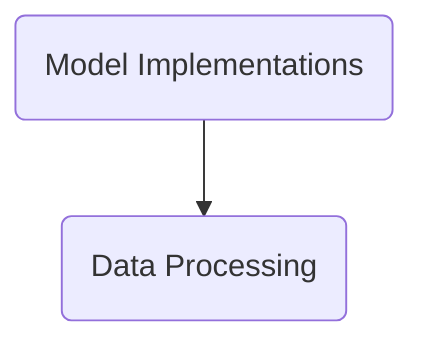

The transformers repository by Hugging Face provides state-of-the-art NLP models for Jax, PyTorch, and TensorFlow. It offers thousands of pretrained models for various NLP tasks, APIs for easy model usage, fine-tuning capabilities, and seamless integration with popular deep learning libraries.

## Main Components

### Data Processing

Data Processing involves transforming raw data into a format suitable for model training and evaluation. This includes reading data from various sources, converting it into structured examples, tokenizing text, adding special tokens, and creating input features. The goal is to ensure that the data is in the correct format and structure for the model to learn effectively.

### Utilities

Utilities are tools and functions designed to assist with various tasks such as handling package versions, logging, and other supportive operations that facilitate the main functionalities of the repository.

### Command Line

The Command Line interface allows users to interact with the system through text-based commands. It provides functionalities such as training models, managing repositories, and user authentication. Commands are instantiated and executed based on user inputs, facilitating various operations directly from the terminal.

- <SwmLink doc-title="Iter function overview">[Iter function overview](.swm/iter-function-overview.wv03iqkq.sw.md)</SwmLink>

### Pipelines

Pipelines are a high-level abstraction in transformers that simplify the use of models for various natural language processing tasks. They integrate tokenization, model inference, and post-processing steps into a single, easy-to-use interface. This allows users to perform tasks like text classification, question answering, and text generation with minimal code, making advanced NLP accessible and straightforward.

- <SwmLink doc-title="Text generation flow">[Text generation flow](.swm/text-generation-flow.prwcy491.sw.md)</SwmLink>

### Model Implementations

Model implementations refer to the various classes and functions that define how different NLP models are constructed, trained, and utilized. These implementations include the architecture of the models, the methods for loading pre-trained weights, and the procedures for converting models between different frameworks such as TensorFlow and PyTorch. They are essential for enabling the use of state-of-the-art NLP models across different tasks and platforms.

- <SwmLink doc-title="Preparing data for model">[Preparing data for model](.swm/preparing-data-for-model.v1ev7z60.sw.md)</SwmLink>
- <SwmLink doc-title="Overview of the __call__ method">[Overview of the \__call_\_ method](.swm/overview-of-the-__call__-method.d79ahoff.sw.md)</SwmLink><SwmLink doc-title="Overview of the __call__ method">[Overview of the \__call_\_ method](.swm/overview-of-the-__call__-method.d79ahoff.sw.md)</SwmLink><SwmLink doc-title="Overview of the __call__ method">[Overview of the \__call_\_ method](.swm/overview-of-the-__call__-method.d79ahoff.sw.md)</SwmLink>

### Flows

- <SwmLink doc-title="Main function flow overview">[Main function flow overview](.swm/main-function-flow-overview.brjs5unc.sw.md)</SwmLink>
- <SwmLink doc-title="Main function flow">[Main function flow](.swm/main-function-flow.631zj4q7.sw.md)</SwmLink>
- <SwmLink doc-title="Main function overview">[Main function overview](.swm/main-function-overview.j21s7q58.sw.md)</SwmLink>
- <SwmLink doc-title="Main function flow for training and evaluating nlp models">[Main function flow for training and evaluating nlp models](.swm/main-function-flow-for-training-and-evaluating-nlp-models.b82qm50e.sw.md)</SwmLink>
- <SwmLink doc-title="Main function flow for nlp model training and evaluation">[Main function flow for nlp model training and evaluation](.swm/main-function-flow-for-nlp-model-training-and-evaluation.rimivelx.sw.md)</SwmLink>

&nbsp;

*This is an auto-generated document by Swimm AI 🌊 and has not yet been verified by a human*

<SwmMeta version="3.0.0" repo-id="Z2l0aHViJTNBJTNBdHJhbnNmb3JtZXJzJTNBJTNBc2h1anV1dQ==" repo-name="transformers" doc-type="other">Powered by [Swimm](/)</SwmMeta>
