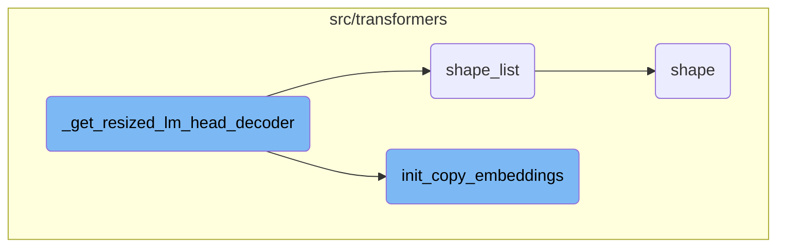

```mermaid
graph TD;
      subgraph src/transformers
0c2ad584e534c8c318e3924d5092980db6e77b1676b1a3513ba50b700658f9a2(_resize_token_embeddings):::mainFlowStyle --> 0e42f3055b499c555e284f4c23a3092ea6466d9f673b12015da3c48f4df29dec(_get_resized_embeddings)
end

subgraph src/transformers
0c2ad584e534c8c318e3924d5092980db6e77b1676b1a3513ba50b700658f9a2(_resize_token_embeddings):::mainFlowStyle --> 53aeeb407dc3fd3ed0690bef8b25dde1c0bc9a8ddff2a164c222b55756a1584d(_get_resized_lm_head_bias)
end

subgraph src/transformers
0c2ad584e534c8c318e3924d5092980db6e77b1676b1a3513ba50b700658f9a2(_resize_token_embeddings):::mainFlowStyle --> 8022fae25c4704365c89957588351c1115b986f93413981a2228ea9c514469bd(_get_resized_lm_head_decoder):::mainFlowStyle
end

subgraph src/transformers
8022fae25c4704365c89957588351c1115b986f93413981a2228ea9c514469bd(_get_resized_lm_head_decoder):::mainFlowStyle --> ktpam(...)
end

subgraph src/transformers
53aeeb407dc3fd3ed0690bef8b25dde1c0bc9a8ddff2a164c222b55756a1584d(_get_resized_lm_head_bias) --> 5faf14ebd86def7547e05ad97651f12ba95ca1b392b56226e6be192bf968778f(shape_list)
end

subgraph src/transformers
5faf14ebd86def7547e05ad97651f12ba95ca1b392b56226e6be192bf968778f(shape_list) --> 06ac57c726b69d5e4e330676c3b03eec83c7fa2f746d074162e49e025f6a1a7b(shape)
end

subgraph src/transformers
0e42f3055b499c555e284f4c23a3092ea6466d9f673b12015da3c48f4df29dec(_get_resized_embeddings) --> 5faf14ebd86def7547e05ad97651f12ba95ca1b392b56226e6be192bf968778f(shape_list)
end


      classDef mainFlowStyle color:#000000,fill:#7CB9F4
classDef rootsStyle color:#000000,fill:#00FFF4
classDef Style1 color:#000000,fill:#00FFAA
classDef Style2 color:#000000,fill:#FFFF00
classDef Style3 color:#000000,fill:#AA7CB9

%% Swimm:
%% graph TD;
%%       subgraph <SwmPath>[src/transformers/](src/transformers/)</SwmPath>
%% 0c2ad584e534c8c318e3924d5092980db6e77b1676b1a3513ba50b700658f9a2(_resize_token_embeddings):::mainFlowStyle --> 0e42f3055b499c555e284f4c23a3092ea6466d9f673b12015da3c48f4df29dec(_get_resized_embeddings)
%% end
%% 
%% subgraph <SwmPath>[src/transformers/](src/transformers/)</SwmPath>
%% 0c2ad584e534c8c318e3924d5092980db6e77b1676b1a3513ba50b700658f9a2(_resize_token_embeddings):::mainFlowStyle --> 53aeeb407dc3fd3ed0690bef8b25dde1c0bc9a8ddff2a164c222b55756a1584d(_get_resized_lm_head_bias)
%% end
%% 
%% subgraph <SwmPath>[src/transformers/](src/transformers/)</SwmPath>
%% 0c2ad584e534c8c318e3924d5092980db6e77b1676b1a3513ba50b700658f9a2(_resize_token_embeddings):::mainFlowStyle --> 8022fae25c4704365c89957588351c1115b986f93413981a2228ea9c514469bd(_get_resized_lm_head_decoder):::mainFlowStyle
%% end
%% 
%% subgraph <SwmPath>[src/transformers/](src/transformers/)</SwmPath>
%% 8022fae25c4704365c89957588351c1115b986f93413981a2228ea9c514469bd(_get_resized_lm_head_decoder):::mainFlowStyle --> ktpam(...)
%% end
%% 
%% subgraph <SwmPath>[src/transformers/](src/transformers/)</SwmPath>
%% 53aeeb407dc3fd3ed0690bef8b25dde1c0bc9a8ddff2a164c222b55756a1584d(_get_resized_lm_head_bias) --> 5faf14ebd86def7547e05ad97651f12ba95ca1b392b56226e6be192bf968778f(shape_list)
%% end
%% 
%% subgraph <SwmPath>[src/transformers/](src/transformers/)</SwmPath>
%% 5faf14ebd86def7547e05ad97651f12ba95ca1b392b56226e6be192bf968778f(shape_list) --> 06ac57c726b69d5e4e330676c3b03eec83c7fa2f746d074162e49e025f6a1a7b(shape)
%% end
%% 
%% subgraph <SwmPath>[src/transformers/](src/transformers/)</SwmPath>
%% 0e42f3055b499c555e284f4c23a3092ea6466d9f673b12015da3c48f4df29dec(_get_resized_embeddings) --> 5faf14ebd86def7547e05ad97651f12ba95ca1b392b56226e6be192bf968778f(shape_list)
%% end
%% 
%% 
%%       classDef mainFlowStyle color:#000000,fill:#7CB9F4
%% classDef rootsStyle color:#000000,fill:#00FFF4
%% classDef Style1 color:#000000,fill:#00FFAA
%% classDef Style2 color:#000000,fill:#FFFF00
%% classDef Style3 color:#000000,fill:#AA7CB9
```

In this document, we will explain the process of resizing token embeddings in a model. The process involves several steps, including checking the type of embeddings layer, delegating tasks to specific functions, and updating the model configuration.

The flow starts by checking if the model uses a Keras embeddings layer. If it does, the resizing task is delegated to a specific function. Otherwise, the embeddings are resized directly, and the model configuration is updated. The process also ensures that related components like the language model head bias and decoder are resized appropriately.

Here is a high level diagram of the flow, showing only the most important functions:

```mermaid
graph TD;
      subgraph src/transformers
4fb1bdd1b4c6ce7968adfdb625d14326ae02b098a1218ea37731637d783d1813(resize_token_embeddings):::mainFlowStyle --> 810ae80c0861511265521754b4219a0fae5576b9ae95564c8bbc395819c34f95(_v2_resized_token_embeddings)
end

subgraph src/transformers
4fb1bdd1b4c6ce7968adfdb625d14326ae02b098a1218ea37731637d783d1813(resize_token_embeddings):::mainFlowStyle --> 0c2ad584e534c8c318e3924d5092980db6e77b1676b1a3513ba50b700658f9a2(_resize_token_embeddings):::mainFlowStyle
end

subgraph src/transformers
0c2ad584e534c8c318e3924d5092980db6e77b1676b1a3513ba50b700658f9a2(_resize_token_embeddings):::mainFlowStyle --> 0e42f3055b499c555e284f4c23a3092ea6466d9f673b12015da3c48f4df29dec(_get_resized_embeddings)
end

subgraph src/transformers
0c2ad584e534c8c318e3924d5092980db6e77b1676b1a3513ba50b700658f9a2(_resize_token_embeddings):::mainFlowStyle --> 53aeeb407dc3fd3ed0690bef8b25dde1c0bc9a8ddff2a164c222b55756a1584d(_get_resized_lm_head_bias)
end

subgraph src/transformers
0c2ad584e534c8c318e3924d5092980db6e77b1676b1a3513ba50b700658f9a2(_resize_token_embeddings):::mainFlowStyle --> 8022fae25c4704365c89957588351c1115b986f93413981a2228ea9c514469bd(_get_resized_lm_head_decoder):::mainFlowStyle
end

subgraph src/transformers
8022fae25c4704365c89957588351c1115b986f93413981a2228ea9c514469bd(_get_resized_lm_head_decoder):::mainFlowStyle --> 5faf14ebd86def7547e05ad97651f12ba95ca1b392b56226e6be192bf968778f(shape_list)
end

subgraph src/transformers
8022fae25c4704365c89957588351c1115b986f93413981a2228ea9c514469bd(_get_resized_lm_head_decoder):::mainFlowStyle --> 884272f45190effbd0ba413b0249ce18ef58ff31f978929891f31ad53e707ed1(init_copy_embeddings):::mainFlowStyle
end

subgraph src/transformers
884272f45190effbd0ba413b0249ce18ef58ff31f978929891f31ad53e707ed1(init_copy_embeddings):::mainFlowStyle --> 5faf14ebd86def7547e05ad97651f12ba95ca1b392b56226e6be192bf968778f(shape_list)
end


      classDef mainFlowStyle color:#000000,fill:#7CB9F4
classDef rootsStyle color:#000000,fill:#00FFF4
classDef Style1 color:#000000,fill:#00FFAA
classDef Style2 color:#000000,fill:#FFFF00
classDef Style3 color:#000000,fill:#AA7CB9

%% Swimm:
%% graph TD;
%%       subgraph <SwmPath>[src/transformers/](src/transformers/)</SwmPath>
%% 4fb1bdd1b4c6ce7968adfdb625d14326ae02b098a1218ea37731637d783d1813(resize_token_embeddings):::mainFlowStyle --> 810ae80c0861511265521754b4219a0fae5576b9ae95564c8bbc395819c34f95(_v2_resized_token_embeddings)
%% end
%% 
%% subgraph <SwmPath>[src/transformers/](src/transformers/)</SwmPath>
%% 4fb1bdd1b4c6ce7968adfdb625d14326ae02b098a1218ea37731637d783d1813(resize_token_embeddings):::mainFlowStyle --> 0c2ad584e534c8c318e3924d5092980db6e77b1676b1a3513ba50b700658f9a2(_resize_token_embeddings):::mainFlowStyle
%% end
%% 
%% subgraph <SwmPath>[src/transformers/](src/transformers/)</SwmPath>
%% 0c2ad584e534c8c318e3924d5092980db6e77b1676b1a3513ba50b700658f9a2(_resize_token_embeddings):::mainFlowStyle --> 0e42f3055b499c555e284f4c23a3092ea6466d9f673b12015da3c48f4df29dec(_get_resized_embeddings)
%% end
%% 
%% subgraph <SwmPath>[src/transformers/](src/transformers/)</SwmPath>
%% 0c2ad584e534c8c318e3924d5092980db6e77b1676b1a3513ba50b700658f9a2(_resize_token_embeddings):::mainFlowStyle --> 53aeeb407dc3fd3ed0690bef8b25dde1c0bc9a8ddff2a164c222b55756a1584d(_get_resized_lm_head_bias)
%% end
%% 
%% subgraph <SwmPath>[src/transformers/](src/transformers/)</SwmPath>
%% 0c2ad584e534c8c318e3924d5092980db6e77b1676b1a3513ba50b700658f9a2(_resize_token_embeddings):::mainFlowStyle --> 8022fae25c4704365c89957588351c1115b986f93413981a2228ea9c514469bd(_get_resized_lm_head_decoder):::mainFlowStyle
%% end
%% 
%% subgraph <SwmPath>[src/transformers/](src/transformers/)</SwmPath>
%% 8022fae25c4704365c89957588351c1115b986f93413981a2228ea9c514469bd(_get_resized_lm_head_decoder):::mainFlowStyle --> 5faf14ebd86def7547e05ad97651f12ba95ca1b392b56226e6be192bf968778f(shape_list)
%% end
%% 
%% subgraph <SwmPath>[src/transformers/](src/transformers/)</SwmPath>
%% 8022fae25c4704365c89957588351c1115b986f93413981a2228ea9c514469bd(_get_resized_lm_head_decoder):::mainFlowStyle --> 884272f45190effbd0ba413b0249ce18ef58ff31f978929891f31ad53e707ed1(init_copy_embeddings):::mainFlowStyle
%% end
%% 
%% subgraph <SwmPath>[src/transformers/](src/transformers/)</SwmPath>
%% 884272f45190effbd0ba413b0249ce18ef58ff31f978929891f31ad53e707ed1(init_copy_embeddings):::mainFlowStyle --> 5faf14ebd86def7547e05ad97651f12ba95ca1b392b56226e6be192bf968778f(shape_list)
%% end
%% 
%% 
%%       classDef mainFlowStyle color:#000000,fill:#7CB9F4
%% classDef rootsStyle color:#000000,fill:#00FFF4
%% classDef Style1 color:#000000,fill:#00FFAA
%% classDef Style2 color:#000000,fill:#FFFF00
%% classDef Style3 color:#000000,fill:#AA7CB9
```



# Flow drill down

First, we'll zoom into this section of the flow:

```mermaid
graph TD;
      subgraph src/transformers/modeling_tf_utils.py
4fb1bdd1b4c6ce7968adfdb625d14326ae02b098a1218ea37731637d783d1813(resize_token_embeddings):::mainFlowStyle --> 810ae80c0861511265521754b4219a0fae5576b9ae95564c8bbc395819c34f95(_v2_resized_token_embeddings)
end

subgraph src/transformers/modeling_tf_utils.py
4fb1bdd1b4c6ce7968adfdb625d14326ae02b098a1218ea37731637d783d1813(resize_token_embeddings):::mainFlowStyle --> 0c2ad584e534c8c318e3924d5092980db6e77b1676b1a3513ba50b700658f9a2(_resize_token_embeddings):::mainFlowStyle
end

subgraph src/transformers/modeling_tf_utils.py
0c2ad584e534c8c318e3924d5092980db6e77b1676b1a3513ba50b700658f9a2(_resize_token_embeddings):::mainFlowStyle --> pbza5(...)
end

subgraph src/transformers/modeling_tf_utils.py
810ae80c0861511265521754b4219a0fae5576b9ae95564c8bbc395819c34f95(_v2_resized_token_embeddings) --> 9536eaaf5bdb7e9e8d21431c1dec6d922475fb19b186ce51093ff15796a8451a(_v2_resize_token_embeddings)
end


      classDef mainFlowStyle color:#000000,fill:#7CB9F4
classDef rootsStyle color:#000000,fill:#00FFF4
classDef Style1 color:#000000,fill:#00FFAA
classDef Style2 color:#000000,fill:#FFFF00
classDef Style3 color:#000000,fill:#AA7CB9

%% Swimm:
%% graph TD;
%%       subgraph <SwmPath>[src/transformers/modeling_tf_utils.py](src/transformers/modeling_tf_utils.py)</SwmPath>
%% 4fb1bdd1b4c6ce7968adfdb625d14326ae02b098a1218ea37731637d783d1813(resize_token_embeddings):::mainFlowStyle --> 810ae80c0861511265521754b4219a0fae5576b9ae95564c8bbc395819c34f95(_v2_resized_token_embeddings)
%% end
%% 
%% subgraph <SwmPath>[src/transformers/modeling_tf_utils.py](src/transformers/modeling_tf_utils.py)</SwmPath>
%% 4fb1bdd1b4c6ce7968adfdb625d14326ae02b098a1218ea37731637d783d1813(resize_token_embeddings):::mainFlowStyle --> 0c2ad584e534c8c318e3924d5092980db6e77b1676b1a3513ba50b700658f9a2(_resize_token_embeddings):::mainFlowStyle
%% end
%% 
%% subgraph <SwmPath>[src/transformers/modeling_tf_utils.py](src/transformers/modeling_tf_utils.py)</SwmPath>
%% 0c2ad584e534c8c318e3924d5092980db6e77b1676b1a3513ba50b700658f9a2(_resize_token_embeddings):::mainFlowStyle --> pbza5(...)
%% end
%% 
%% subgraph <SwmPath>[src/transformers/modeling_tf_utils.py](src/transformers/modeling_tf_utils.py)</SwmPath>
%% 810ae80c0861511265521754b4219a0fae5576b9ae95564c8bbc395819c34f95(_v2_resized_token_embeddings) --> 9536eaaf5bdb7e9e8d21431c1dec6d922475fb19b186ce51093ff15796a8451a(_v2_resize_token_embeddings)
%% end
%% 
%% 
%%       classDef mainFlowStyle color:#000000,fill:#7CB9F4
%% classDef rootsStyle color:#000000,fill:#00FFF4
%% classDef Style1 color:#000000,fill:#00FFAA
%% classDef Style2 color:#000000,fill:#FFFF00
%% classDef Style3 color:#000000,fill:#AA7CB9
```



<SwmSnippet path="/src/transformers/modeling_tf_utils.py" line="2008">

---

## Resizing Token Embeddings

The <SwmToken path="src/transformers/modeling_tf_utils.py" pos="2008:3:3" line-data="    def resize_token_embeddings(">`resize_token_embeddings`</SwmToken> function is responsible for resizing the input token embeddings matrix of the model. If the model has a Keras embeddings layer, it delegates the task to <SwmToken path="src/transformers/modeling_tf_utils.py" pos="2025:20:20" line-data="        # TODO (joao): flagged for replacement (by `_v2_resized_token_embeddings`) due to embeddings refactor">`_v2_resized_token_embeddings`</SwmToken>. Otherwise, it resizes the embeddings and updates the model configuration.

```python
    def resize_token_embeddings(
        self, new_num_tokens: Optional[int] = None
    ) -> Union[keras.layers.Embedding, tf.Variable]:
        """
        Resizes input token embeddings matrix of the model if `new_num_tokens != config.vocab_size`.

        Takes care of tying weights embeddings afterwards if the model class has a `tie_weights()` method.

        Arguments:
            new_num_tokens (`int`, *optional*):
                The number of new tokens in the embedding matrix. Increasing the size will add newly initialized
                vectors at the end. Reducing the size will remove vectors from the end. If not provided or `None`, just
                returns a pointer to the input tokens without doing anything.

        Return:
            `tf.Variable` or `keras.layers.Embedding`: Pointer to the input tokens of the model.
        """
        # TODO (joao): flagged for replacement (by `_v2_resized_token_embeddings`) due to embeddings refactor

        # Run the new code path if the model has a keras embeddings layer
        if isinstance(self.get_input_embeddings(), keras.layers.Embedding):
```

---

</SwmSnippet>

<SwmSnippet path="/src/transformers/modeling_tf_utils.py" line="2041">

---

## Delegating to <SwmToken path="src/transformers/modeling_tf_utils.py" pos="2133:20:20" line-data="            # TODO (joao): this one probably needs a v2 version with other models">`v2`</SwmToken> Resized Token Embeddings

The <SwmToken path="src/transformers/modeling_tf_utils.py" pos="2041:3:3" line-data="    def _v2_resized_token_embeddings(self, new_num_tokens: Optional[int] = None) -&gt; keras.layers.Embedding:">`_v2_resized_token_embeddings`</SwmToken> function handles the resizing of the token embeddings matrix when the model uses a Keras embeddings layer. It updates the model configuration and returns the resized embeddings.

```python
    def _v2_resized_token_embeddings(self, new_num_tokens: Optional[int] = None) -> keras.layers.Embedding:
        """
        Resizes input token embeddings matrix of the model if `new_num_tokens != config.vocab_size`.

        Arguments:
            new_num_tokens (`int`, *optional*):
                The number of new tokens in the embedding matrix. Increasing the size will add newly initialized
                vectors at the end. Reducing the size will remove vectors from the end. If not provided or `None`, just
                returns a pointer to the input tokens without doing anything.

        Return:
            `keras.layers.Embedding`: Pointer to the input tokens of the model.
        """
        if new_num_tokens is None or new_num_tokens == self.config.vocab_size:
            return self.get_input_embeddings()

        model_embeds = self._v2_resize_token_embeddings(new_num_tokens)

        # Update base model and current model config
        self.config.vocab_size = new_num_tokens

```

---

</SwmSnippet>

<SwmSnippet path="/src/transformers/modeling_tf_utils.py" line="2118">

---

### Resizing Embeddings and Bias

The <SwmToken path="src/transformers/modeling_tf_utils.py" pos="2118:3:3" line-data="    def _v2_resize_token_embeddings(self, new_num_tokens):">`_v2_resize_token_embeddings`</SwmToken> function performs the actual resizing of the embeddings. It also ensures that the language model head bias and decoder are resized if they are not tied to the word embeddings.

```python
    def _v2_resize_token_embeddings(self, new_num_tokens):
        old_embeddings = self.get_input_embeddings()
        new_embeddings = self._v2_get_resized_embeddings(old_embeddings, new_num_tokens)
        self.set_input_embeddings(new_embeddings)

        # If word embeddings are not tied, make sure that lm head bias is resized as well
        if self.get_bias() is not None:
            old_lm_head_bias = self.get_bias()
            new_lm_head_bias = self._v2_get_resized_lm_head_bias(old_lm_head_bias, new_num_tokens)
            self.set_bias(new_lm_head_bias)

        # If word embeddings are not tied, make sure that lm head decoder is resized as well.
        tied_weights = self.get_input_embeddings() == self.get_output_embeddings()
        if self.get_output_embeddings() is not None and not tied_weights:
            old_lm_head_decoder = self._get_word_embedding_weight(self.get_output_embeddings())
            # TODO (joao): this one probably needs a v2 version with other models
            new_lm_head_decoder = self._get_resized_lm_head_decoder(old_lm_head_decoder, new_num_tokens)
            self.set_output_embeddings(new_lm_head_decoder)

        return self.get_input_embeddings()
```

---

</SwmSnippet>

Now, lets zoom into this section of the flow:



<SwmSnippet path="/src/transformers/modeling_tf_utils.py" line="2097">

---

## <SwmToken path="src/transformers/modeling_tf_utils.py" pos="2034:7:7" line-data="        model_embeds = self._resize_token_embeddings(new_num_tokens)">`_resize_token_embeddings`</SwmToken>

<SwmToken path="src/transformers/modeling_tf_utils.py" pos="2034:7:7" line-data="        model_embeds = self._resize_token_embeddings(new_num_tokens)">`_resize_token_embeddings`</SwmToken> adjusts the size of the token embeddings matrix to accommodate a new number of tokens. It first retrieves the current embeddings and then resizes them using <SwmToken path="src/transformers/modeling_tf_utils.py" pos="2098:7:7" line-data="        new_embeddings = self._get_resized_embeddings(old_embeddings, new_num_tokens)">`_get_resized_embeddings`</SwmToken>. If the model has a bias, it resizes the bias using <SwmToken path="src/transformers/modeling_tf_utils.py" pos="2103:7:7" line-data="            new_lm_head_bias = self._get_resized_lm_head_bias(old_lm_head_bias, new_num_tokens)">`_get_resized_lm_head_bias`</SwmToken>. Similarly, if the model has an output embedding layer, it resizes this layer using <SwmToken path="src/transformers/modeling_tf_utils.py" pos="2110:7:7" line-data="            new_lm_head_decoder = self._get_resized_lm_head_decoder(old_lm_head_decoder, new_num_tokens)">`_get_resized_lm_head_decoder`</SwmToken>. Finally, it sets the resized embeddings back into the model.

```python
        old_embeddings = self._get_word_embedding_weight(self.get_input_embeddings())
        new_embeddings = self._get_resized_embeddings(old_embeddings, new_num_tokens)

        # if word embeddings are not tied, make sure that lm head bias is resized as well
        if self.get_bias() is not None:
            old_lm_head_bias = self.get_bias()
            new_lm_head_bias = self._get_resized_lm_head_bias(old_lm_head_bias, new_num_tokens)

            self.set_bias(new_lm_head_bias)

        # if word embeddings are not tied, make sure that lm head decoder is resized as well
        if self.get_output_embeddings() is not None:
            old_lm_head_decoder = self._get_word_embedding_weight(self.get_output_embeddings())
            new_lm_head_decoder = self._get_resized_lm_head_decoder(old_lm_head_decoder, new_num_tokens)

            self.set_output_embeddings(new_lm_head_decoder)

        self.set_input_embeddings(new_embeddings)

        return self.get_input_embeddings()
```

---

</SwmSnippet>

<SwmSnippet path="/src/transformers/modeling_tf_utils.py" line="2264">

---

### <SwmToken path="src/transformers/modeling_tf_utils.py" pos="2264:3:3" line-data="    def _get_resized_embeddings(self, old_embeddings, new_num_tokens=None) -&gt; tf.Variable:">`_get_resized_embeddings`</SwmToken>

<SwmToken path="src/transformers/modeling_tf_utils.py" pos="2264:3:3" line-data="    def _get_resized_embeddings(self, old_embeddings, new_num_tokens=None) -&gt; tf.Variable:">`_get_resized_embeddings`</SwmToken> creates a new embeddings matrix with the specified number of tokens. If the new size is larger, it initializes new vectors at the end. If smaller, it truncates the matrix. It uses <SwmToken path="src/transformers/modeling_tf_utils.py" pos="2284:5:5" line-data="        old_embedding_dim = shape_list(old_embeddings)[1]">`shape_list`</SwmToken> to get the dimensions of the old embeddings and <SwmToken path="src/transformers/modeling_tf_utils.py" pos="1089:2:2" line-data="def init_copy_embeddings(old_embeddings, new_num_tokens):">`init_copy_embeddings`</SwmToken> to handle the initialization.

```python
    def _get_resized_embeddings(self, old_embeddings, new_num_tokens=None) -> tf.Variable:
        """
        Build a resized Embedding weights from a provided token Embedding weights. Increasing the size will add newly
        initialized vectors at the end. Reducing the size will remove vectors from the end

        Args:
            old_embeddings (`tf.Variable`):
                Old embeddings to be resized.
            new_num_tokens (`int`, *optional*):
                New number of tokens in the embedding matrix.

                Increasing the size will add newly initialized vectors at the end. Reducing the size will remove
                vectors from the end. If not provided or `None`, just returns a pointer to the input tokens
                `tf.Variable` module of the model without doing anything.

        Return:
            `tf.Variable`: Pointer to the resized Embedding Module or the old Embedding Module if `new_num_tokens` is
            `None`
        """
        # TODO (joao): flagged for replacement (by `_v2_get_resized_embeddings`) due to embeddings refactor
        old_embedding_dim = shape_list(old_embeddings)[1]
```

---

</SwmSnippet>

<SwmSnippet path="/src/transformers/modeling_tf_utils.py" line="2139">

---

### <SwmToken path="src/transformers/modeling_tf_utils.py" pos="2139:3:3" line-data="    def _get_resized_lm_head_bias(self, old_lm_head_bias, new_num_tokens):">`_get_resized_lm_head_bias`</SwmToken>

<SwmToken path="src/transformers/modeling_tf_utils.py" pos="2139:3:3" line-data="    def _get_resized_lm_head_bias(self, old_lm_head_bias, new_num_tokens):">`_get_resized_lm_head_bias`</SwmToken> resizes the bias vectors for the language model head. It either pads the bias vectors with new values or truncates them, depending on whether the new size is larger or smaller. The function uses <SwmToken path="src/transformers/modeling_tf_utils.py" pos="1102:8:8" line-data="    old_num_tokens, old_embedding_dim = shape_list(old_embeddings)">`shape_list`</SwmToken> to determine the dimensions of the old bias vectors.

```python
    def _get_resized_lm_head_bias(self, old_lm_head_bias, new_num_tokens):
        """
        Build a resized bias from the old ones. Increasing the size will add newly initialized vectors at the end.
        Reducing the size will remove vectors from the end

        Args:
            old_lm_head_bias (`tf.Variable`):
                Old lm head bias to be resized.
            new_num_tokens (`int`, *optional*):
                New number of tokens in the linear matrix.

                Increasing the size will add newly initialized vectors at the end. Reducing the size will remove
                vectors from the end. If not provided or `None`, just returns None

        Return:
            `tf.Variable`: Pointer to the resized bias.
        """
        # TODO (joao): flagged for replacement (by `_v2_get_resized_lm_head_bias`) due to embeddings refactor
        new_lm_head_bias = {}

        for attr, weight in old_lm_head_bias.items():
```

---

</SwmSnippet>

<SwmSnippet path="/src/transformers/tf_utils.py" line="28">

---

### <SwmToken path="src/transformers/tf_utils.py" pos="28:2:2" line-data="def shape_list(tensor: Union[tf.Tensor, np.ndarray]) -&gt; List[int]:">`shape_list`</SwmToken>

<SwmToken path="src/transformers/tf_utils.py" pos="28:2:2" line-data="def shape_list(tensor: Union[tf.Tensor, np.ndarray]) -&gt; List[int]:">`shape_list`</SwmToken> returns the shape of a tensor as a list, handling both static and dynamic shapes in <SwmToken path="src/transformers/tf_utils.py" pos="30:11:11" line-data="    Deal with dynamic shape in tensorflow cleanly.">`tensorflow`</SwmToken>. It is used in resizing functions to determine the dimensions of tensors.

```python
def shape_list(tensor: Union[tf.Tensor, np.ndarray]) -> List[int]:
    """
    Deal with dynamic shape in tensorflow cleanly.

    Args:
        tensor (`tf.Tensor` or `np.ndarray`): The tensor we want the shape of.

    Returns:
        `List[int]`: The shape of the tensor as a list.
    """
    if isinstance(tensor, np.ndarray):
        return list(tensor.shape)

    dynamic = tf.shape(tensor)

    if tensor.shape == tf.TensorShape(None):
        return dynamic

    static = tensor.shape.as_list()

    return [dynamic[i] if s is None else s for i, s in enumerate(static)]
```

---

</SwmSnippet>

<SwmSnippet path="/src/transformers/utils/fx.py" line="651">

---

### shape

<SwmToken path="src/transformers/utils/fx.py" pos="652:3:3" line-data="    def shape(self):">`shape`</SwmToken> is a property that returns the shape of a tensor. It is used internally to manage tensor dimensions during operations like resizing.

```python
    @property
    def shape(self):
        return self.tracer.create_proxy("call_method", "size", (self,), {})
```

---

</SwmSnippet>

Now, lets zoom into this section of the flow:



<SwmSnippet path="/src/transformers/modeling_tf_utils.py" line="2244">

---

## Resizing the Language Model Head Decoder

The <SwmToken path="src/transformers/modeling_tf_utils.py" pos="2110:7:7" line-data="            new_lm_head_decoder = self._get_resized_lm_head_decoder(old_lm_head_decoder, new_num_tokens)">`_get_resized_lm_head_decoder`</SwmToken> function is responsible for resizing the language model head decoder. It checks if the old decoder is not `None` and if the input and output embeddings are not the same. If these conditions are met, it retrieves the shape of the old decoder and initializes the new decoder weights. The function then uses <SwmToken path="src/transformers/modeling_tf_utils.py" pos="2251:8:8" line-data="            decoder_mask, current_decoder = init_copy_embeddings(old_lm_head_decoder, new_num_tokens)">`init_copy_embeddings`</SwmToken> to create a mask and copy the old embeddings to the new decoder, ensuring that the new decoder is properly initialized.

```python
        new_lm_head_decoder = old_lm_head_decoder
        is_input_output_equals = tf.reduce_any(
            self._get_word_embedding_weight(self.get_input_embeddings()) == old_lm_head_decoder
        )

        if old_lm_head_decoder is not None and not is_input_output_equals:
            old_embedding_dim = shape_list(old_lm_head_decoder)[1]
            decoder_mask, current_decoder = init_copy_embeddings(old_lm_head_decoder, new_num_tokens)
            new_lm_head_decoder = self.add_weight(
                shape=(new_num_tokens, old_embedding_dim),
                initializer="zeros",
                trainable=True,
                name=old_lm_head_decoder.name.split(":")[0],
            )
            init_decoder = tf.where(decoder_mask, current_decoder, new_lm_head_decoder.value())

            new_lm_head_decoder.assign(init_decoder)

        return new_lm_head_decoder
```

---

</SwmSnippet>

<SwmSnippet path="/src/transformers/modeling_tf_utils.py" line="1089">

---

### Initializing and Copying Embeddings

The <SwmToken path="src/transformers/modeling_tf_utils.py" pos="1089:2:2" line-data="def init_copy_embeddings(old_embeddings, new_num_tokens):">`init_copy_embeddings`</SwmToken> function is used within <SwmToken path="src/transformers/modeling_tf_utils.py" pos="2110:7:7" line-data="            new_lm_head_decoder = self._get_resized_lm_head_decoder(old_lm_head_decoder, new_num_tokens)">`_get_resized_lm_head_decoder`</SwmToken> to handle the resizing of embeddings. It adjusts the size of the embeddings by either padding with <SwmToken path="src/transformers/modeling_tf_utils.py" pos="1091:33:34" line-data="    This function aims to reduce the embeddings in case new_num_tokens &lt; old_num_tokens or to pad with -1 in case">`-1`</SwmToken> if the new size is larger or slicing if the new size is smaller. The function also creates a mask to identify which weights should be kept or replaced, ensuring that the resized embeddings maintain the correct values.

```python
def init_copy_embeddings(old_embeddings, new_num_tokens):
    r"""
    This function aims to reduce the embeddings in case new_num_tokens < old_num_tokens or to pad with -1 in case
    new_num_tokens > old_num_tokens. A mask is also computed in order to know which weight in the embeddings should be
    kept or not. Example:

        - if new_num_tokens=5 and old_num_tokens=4 and old_embeddings=[w1,w2,w3,w4]

            -  mask=[True,True,True,True,False] and current_weights=[w1,w2,w3,w4,-1]
        - if new_num_tokens=4 and old_num_tokens=5 and old_embeddings=[w1,w2,w3,w4,w5]

            - mask=[True,True,True,True] and current_weights=[w1,w2,w3,w4]
    """
    old_num_tokens, old_embedding_dim = shape_list(old_embeddings)
    size_diff = new_num_tokens - old_num_tokens

    # initialize new embeddings
    # Copy token embeddings from the previous ones
    if tf.math.greater(size_diff, 0):
        # if the new size is greater than the old one, we extend the current embeddings with a padding until getting new size
        # and we create a mask to properly identify the padded values and be replaced by the values of the newly created
```

---

</SwmSnippet>

&nbsp;

*This is an auto-generated document by Swimm AI 🌊 and has not yet been verified by a human*

<SwmMeta version="3.0.0" repo-id="Z2l0aHViJTNBJTNBdHJhbnNmb3JtZXJzJTNBJTNBc2h1anV1dQ==" repo-name="transformers" doc-type="flows"><sup>Powered by [Swimm](/)</sup></SwmMeta>
