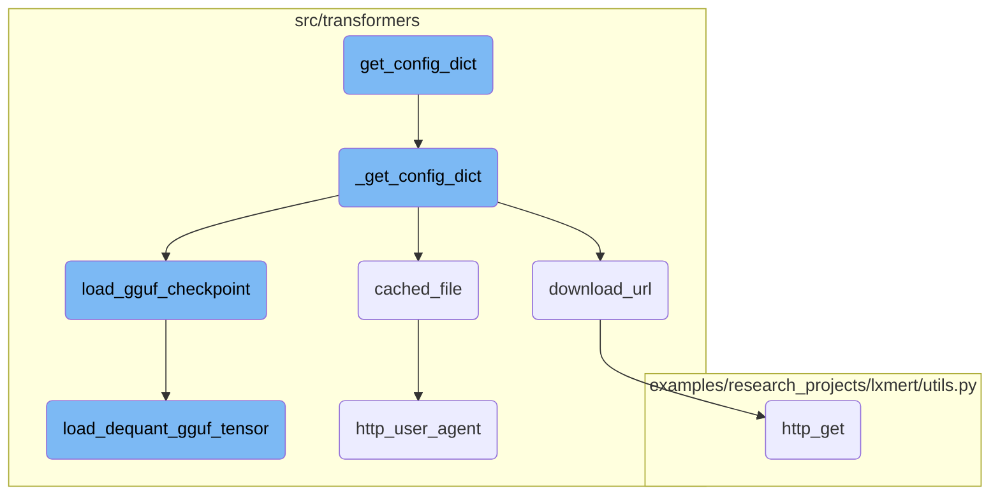

In this document, we will explain the process of resolving configuration files. The process involves calling various helper functions to download, cache, and load configuration files, including handling GGUF checkpoints and dequantizing tensors.

The flow starts by calling a function to get the base configuration file. If this file points to another configuration file, it resolves that as well. The process includes downloading files from <SwmToken path="src/transformers/utils/hub.py" pos="175:37:37" line-data="    etag, size_MB)`. Filenames in `cache_dir` are use to get the metadata for each model, only urls ending with *.bin*">`urls`</SwmToken>, caching them locally, and handling specific file types like GGUF. The final step involves loading and dequantizing tensor data if necessary.

# Flow drill down



<SwmSnippet path="/src/transformers/configuration_utils.py" line="628">

---

## Resolving Configuration Files

The <SwmToken path="src/transformers/configuration_utils.py" pos="603:10:10" line-data="        config_dict, kwargs = cls.get_config_dict(pretrained_model_name_or_path, **kwargs)">`get_config_dict`</SwmToken> function first calls <SwmToken path="src/transformers/configuration_utils.py" pos="632:10:10" line-data="        config_dict, kwargs = cls._get_config_dict(pretrained_model_name_or_path, **kwargs)">`_get_config_dict`</SwmToken> to resolve the base configuration file. If the configuration file points to another configuration file, it resolves that as well.

```python
        cls._set_token_in_kwargs(kwargs)

        original_kwargs = copy.deepcopy(kwargs)
        # Get config dict associated with the base config file
        config_dict, kwargs = cls._get_config_dict(pretrained_model_name_or_path, **kwargs)
        if "_commit_hash" in config_dict:
            original_kwargs["_commit_hash"] = config_dict["_commit_hash"]

        # That config file may point us toward another config file to use.
        if "configuration_files" in config_dict:
            configuration_file = get_configuration_file(config_dict["configuration_files"])
            config_dict, kwargs = cls._get_config_dict(
                pretrained_model_name_or_path, _configuration_file=configuration_file, **original_kwargs
            )
```

---

</SwmSnippet>

<SwmSnippet path="/src/transformers/configuration_utils.py" line="717">

---

## Loading GGUF Checkpoints

The <SwmToken path="src/transformers/configuration_utils.py" pos="632:10:10" line-data="        config_dict, kwargs = cls._get_config_dict(pretrained_model_name_or_path, **kwargs)">`_get_config_dict`</SwmToken> function checks if a GGUF file is specified and loads it using <SwmToken path="src/transformers/configuration_utils.py" pos="719:5:5" line-data="                config_dict = load_gguf_checkpoint(resolved_config_file, return_tensors=False)[&quot;config&quot;]">`load_gguf_checkpoint`</SwmToken>. This function reads the GGUF file and returns the parsed configuration.

```python
        try:
            if gguf_file:
                config_dict = load_gguf_checkpoint(resolved_config_file, return_tensors=False)["config"]
            else:
                # Load config dict
                config_dict = cls._dict_from_json_file(resolved_config_file)
```

---

</SwmSnippet>

<SwmSnippet path="/src/transformers/utils/hub.py" line="572">

---

### Downloading Files

The <SwmToken path="src/transformers/utils/hub.py" pos="572:2:2" line-data="def download_url(url, proxies=None):">`download_url`</SwmToken> function is used to download files from a given URL. This is particularly useful for deprecated behavior where a single URL is used instead of the Hugging Face Hub.

```python
def download_url(url, proxies=None):
    """
    Downloads a given url in a temporary file. This function is not safe to use in multiple processes. Its only use is
    for deprecated behavior allowing to download config/models with a single url instead of using the Hub.

    Args:
        url (`str`): The url of the file to download.
        proxies (`Dict[str, str]`, *optional*):
            A dictionary of proxy servers to use by protocol or endpoint, e.g., `{'http': 'foo.bar:3128',
            'http://hostname': 'foo.bar:4012'}.` The proxies are used on each request.

    Returns:
        `str`: The location of the temporary file where the url was downloaded.
    """
    warnings.warn(
        f"Using `from_pretrained` with the url of a file (here {url}) is deprecated and won't be possible anymore in"
        " v5 of Transformers. You should host your file on the Hub (hf.co) instead and use the repository ID. Note"
        " that this is not compatible with the caching system (your file will be downloaded at each execution) or"
        " multiple processes (each process will download the file in a different temporary file).",
        FutureWarning,
    )
```

---

</SwmSnippet>

<SwmSnippet path="/src/transformers/utils/hub.py" line="270">

---

### Caching Files

The <SwmToken path="src/transformers/utils/hub.py" pos="270:2:2" line-data="def cached_file(">`cached_file`</SwmToken> function tries to locate a file in a local folder or repository, downloading and caching it if necessary. This is crucial for efficient model loading and avoiding redundant downloads.

```python
def cached_file(
    path_or_repo_id: Union[str, os.PathLike],
    filename: str,
    cache_dir: Optional[Union[str, os.PathLike]] = None,
    force_download: bool = False,
    resume_download: Optional[bool] = None,
    proxies: Optional[Dict[str, str]] = None,
    token: Optional[Union[bool, str]] = None,
    revision: Optional[str] = None,
    local_files_only: bool = False,
    subfolder: str = "",
    repo_type: Optional[str] = None,
    user_agent: Optional[Union[str, Dict[str, str]]] = None,
    _raise_exceptions_for_gated_repo: bool = True,
    _raise_exceptions_for_missing_entries: bool = True,
    _raise_exceptions_for_connection_errors: bool = True,
    _commit_hash: Optional[str] = None,
    **deprecated_kwargs,
) -> Optional[str]:
    """
    Tries to locate a file in a local folder and repo, downloads and cache it if necessary.
```

---

</SwmSnippet>

<SwmSnippet path="/examples/research_projects/lxmert/utils.py" line="254">

---

### HTTP Requests

The <SwmToken path="examples/research_projects/lxmert/utils.py" pos="254:2:2" line-data="def http_get(">`http_get`</SwmToken> function handles HTTP GET requests, including support for proxies and resuming downloads. This function is used internally by <SwmToken path="src/transformers/utils/hub.py" pos="572:2:2" line-data="def download_url(url, proxies=None):">`download_url`</SwmToken> to fetch files.

```python
def http_get(
    url,
    temp_file,
    proxies=None,
    resume_size=0,
    user_agent=None,
):
    ua = "python/{}".format(sys.version.split()[0])
    if _torch_available:
        ua += "; torch/{}".format(torch.__version__)
    if isinstance(user_agent, dict):
        ua += "; " + "; ".join("{}/{}".format(k, v) for k, v in user_agent.items())
    elif isinstance(user_agent, str):
        ua += "; " + user_agent
    headers = {"user-agent": ua}
    if resume_size > 0:
        headers["Range"] = "bytes=%d-" % (resume_size,)
    response = requests.get(url, stream=True, proxies=proxies, headers=headers)
    if response.status_code == 416:  # Range not satisfiable
        return
    content_length = response.headers.get("Content-Length")
```

---

</SwmSnippet>

<SwmSnippet path="/src/transformers/utils/hub.py" line="233">

---

### User Agent

The <SwmToken path="src/transformers/utils/hub.py" pos="233:2:2" line-data="def http_user_agent(user_agent: Union[Dict, str, None] = None) -&gt; str:">`http_user_agent`</SwmToken> function formats a <SwmToken path="src/transformers/utils/hub.py" pos="235:5:7" line-data="    Formats a user-agent string with basic info about a request.">`user-agent`</SwmToken> string with basic information about the request. This is used to identify the client making the request.

```python
def http_user_agent(user_agent: Union[Dict, str, None] = None) -> str:
    """
    Formats a user-agent string with basic info about a request.
    """
    ua = f"transformers/{__version__}; python/{sys.version.split()[0]}; session_id/{SESSION_ID}"
    if is_torch_available():
        ua += f"; torch/{_torch_version}"
    if is_tf_available():
        ua += f"; tensorflow/{_tf_version}"
    if constants.HF_HUB_DISABLE_TELEMETRY:
        return ua + "; telemetry/off"
    if is_training_run_on_sagemaker():
        ua += "; " + "; ".join(f"{k}/{v}" for k, v in define_sagemaker_information().items())
    # CI will set this value to True
    if os.environ.get("TRANSFORMERS_IS_CI", "").upper() in ENV_VARS_TRUE_VALUES:
        ua += "; is_ci/true"
    if isinstance(user_agent, dict):
        ua += "; " + "; ".join(f"{k}/{v}" for k, v in user_agent.items())
    elif isinstance(user_agent, str):
        ua += "; " + user_agent
    return ua
```

---

</SwmSnippet>

<SwmSnippet path="/src/transformers/integrations/ggml.py" line="490">

---

### Dequantizing GGUF Tensors

The <SwmToken path="src/transformers/integrations/ggml.py" pos="490:2:2" line-data="def load_dequant_gguf_tensor(shape, ggml_type, data, n_bytes):">`load_dequant_gguf_tensor`</SwmToken> function dequantizes GGUF tensors based on their type. This is used when loading GGUF checkpoints to convert the tensor data into a usable format.

```python
def load_dequant_gguf_tensor(shape, ggml_type, data, n_bytes):
    if ggml_type == GGML_TYPES["F32"]:
        values = data
    elif ggml_type == GGML_TYPES["F16"]:
        values = data
    elif ggml_type == GGML_TYPES["Q8_0"]:
        values = dequantize_q8_0(data, n_bytes)
    elif ggml_type == GGML_TYPES["Q4_0"]:
        values = dequantize_q4_0(data, n_bytes)
    elif ggml_type == GGML_TYPES["Q4_K"]:
        values = dequantize_q4_k(data, n_bytes)
    elif ggml_type == GGML_TYPES["Q6_K"]:
        values = dequantize_q6_k(data, n_bytes)
    elif ggml_type == GGML_TYPES["Q2_K"]:
        values = dequantize_q2_k(data, n_bytes)
    elif ggml_type == GGML_TYPES["Q3_K"]:
        values = dequantize_q3_k(data, n_bytes)
    elif ggml_type == GGML_TYPES["Q5_K"]:
        values = dequantize_q5_k(data, n_bytes)
    else:
        raise NotImplementedError(
```

---

</SwmSnippet>

# Where is this flow used?

This flow is used multiple times in the codebase as represented in the following diagram:

(Note - these are only some of the entry points of this flow)

```mermaid
graph TD;
      subgraph src/transformers/models
c59f4022cb1f9132c04e5956f90e03236696ff4bfab40d87ecd1cd0aef12a815(convert_s3prl_checkpoint):::rootsStyle --> 4d668a3bc69097519d5f9a4792df9fddc0db6d0fea057e950efc2f3b9c9e2050(convert_xvector)
end

subgraph src/transformers/models/flava
4d668a3bc69097519d5f9a4792df9fddc0db6d0fea057e950efc2f3b9c9e2050(convert_xvector) --> 25b826d7f5371d1d95ffd6b95eecd65466a3d6accf88b65bac72fa1db48dd765(from_pretrained)
end

subgraph src/transformers/configuration_utils.py
25b826d7f5371d1d95ffd6b95eecd65466a3d6accf88b65bac72fa1db48dd765(from_pretrained) --> a5b37900b611be772d0e98e84297080798c55361baca629f2043e1057242387c(get_config_dict):::mainFlowStyle
end

subgraph src/transformers/models
c59f4022cb1f9132c04e5956f90e03236696ff4bfab40d87ecd1cd0aef12a815(convert_s3prl_checkpoint):::rootsStyle --> fcf979cf9c86b51e7d054b034c2bed973564c79912c353ddb39b2f8d74d816ea(convert_xvector)
end

subgraph src/transformers/models/flava
fcf979cf9c86b51e7d054b034c2bed973564c79912c353ddb39b2f8d74d816ea(convert_xvector) --> 25b826d7f5371d1d95ffd6b95eecd65466a3d6accf88b65bac72fa1db48dd765(from_pretrained)
end

subgraph src/transformers/models/flava
430ec05d57ed9e5c72ee54b9847824851b5bef57fa0c3febca7ed2c7a030a8ad(convert_flava_checkpoint):::rootsStyle --> 28000eeac6ad7990ccb3601250188807e12232e10e81ba779a55eb55801f13b6(convert_dalle_checkpoint)
end

subgraph src/transformers/models/flava
28000eeac6ad7990ccb3601250188807e12232e10e81ba779a55eb55801f13b6(convert_dalle_checkpoint) --> 25b826d7f5371d1d95ffd6b95eecd65466a3d6accf88b65bac72fa1db48dd765(from_pretrained)
end

subgraph src/transformers/models
227eaee48f790cb276fab7c3bb5c4aed07dc34a153c81931559b3ec413b1cb32(main):::rootsStyle --> 08d3a427108f878e808750f0626e7e521dc29c74c12492ae1c97b96279cdb3fb(convert_checkpoint_from_megatron_to_transformers)
end

subgraph src/transformers/models/flava
08d3a427108f878e808750f0626e7e521dc29c74c12492ae1c97b96279cdb3fb(convert_checkpoint_from_megatron_to_transformers) --> 25b826d7f5371d1d95ffd6b95eecd65466a3d6accf88b65bac72fa1db48dd765(from_pretrained)
end

subgraph src/transformers/models
227eaee48f790cb276fab7c3bb5c4aed07dc34a153c81931559b3ec413b1cb32(main):::rootsStyle --> 655d605273f521cb7b44da2f72befdd70ae485744c0afd04005131e713e92815(write_model)
end

subgraph src/transformers/models/flava
655d605273f521cb7b44da2f72befdd70ae485744c0afd04005131e713e92815(write_model) --> 25b826d7f5371d1d95ffd6b95eecd65466a3d6accf88b65bac72fa1db48dd765(from_pretrained)
end


      classDef mainFlowStyle color:#000000,fill:#7CB9F4
classDef rootsStyle color:#000000,fill:#00FFF4
classDef Style1 color:#000000,fill:#00FFAA
classDef Style2 color:#000000,fill:#FFFF00
classDef Style3 color:#000000,fill:#AA7CB9

%% Swimm:
%% graph TD;
%%       subgraph <SwmPath>[src/transformers/models/](src/transformers/models/)</SwmPath>
%% c59f4022cb1f9132c04e5956f90e03236696ff4bfab40d87ecd1cd0aef12a815(convert_s3prl_checkpoint):::rootsStyle --> 4d668a3bc69097519d5f9a4792df9fddc0db6d0fea057e950efc2f3b9c9e2050(convert_xvector)
%% end
%% 
%% subgraph <SwmPath>[src/transformers/models/flava/](src/transformers/models/flava/)</SwmPath>
%% 4d668a3bc69097519d5f9a4792df9fddc0db6d0fea057e950efc2f3b9c9e2050(convert_xvector) --> 25b826d7f5371d1d95ffd6b95eecd65466a3d6accf88b65bac72fa1db48dd765(from_pretrained)
%% end
%% 
%% subgraph <SwmPath>[src/transformers/configuration_utils.py](src/transformers/configuration_utils.py)</SwmPath>
%% 25b826d7f5371d1d95ffd6b95eecd65466a3d6accf88b65bac72fa1db48dd765(from_pretrained) --> a5b37900b611be772d0e98e84297080798c55361baca629f2043e1057242387c(get_config_dict):::mainFlowStyle
%% end
%% 
%% subgraph <SwmPath>[src/transformers/models/](src/transformers/models/)</SwmPath>
%% c59f4022cb1f9132c04e5956f90e03236696ff4bfab40d87ecd1cd0aef12a815(convert_s3prl_checkpoint):::rootsStyle --> fcf979cf9c86b51e7d054b034c2bed973564c79912c353ddb39b2f8d74d816ea(convert_xvector)
%% end
%% 
%% subgraph <SwmPath>[src/transformers/models/flava/](src/transformers/models/flava/)</SwmPath>
%% fcf979cf9c86b51e7d054b034c2bed973564c79912c353ddb39b2f8d74d816ea(convert_xvector) --> 25b826d7f5371d1d95ffd6b95eecd65466a3d6accf88b65bac72fa1db48dd765(from_pretrained)
%% end
%% 
%% subgraph <SwmPath>[src/transformers/models/flava/](src/transformers/models/flava/)</SwmPath>
%% 430ec05d57ed9e5c72ee54b9847824851b5bef57fa0c3febca7ed2c7a030a8ad(convert_flava_checkpoint):::rootsStyle --> 28000eeac6ad7990ccb3601250188807e12232e10e81ba779a55eb55801f13b6(convert_dalle_checkpoint)
%% end
%% 
%% subgraph <SwmPath>[src/transformers/models/flava/](src/transformers/models/flava/)</SwmPath>
%% 28000eeac6ad7990ccb3601250188807e12232e10e81ba779a55eb55801f13b6(convert_dalle_checkpoint) --> 25b826d7f5371d1d95ffd6b95eecd65466a3d6accf88b65bac72fa1db48dd765(from_pretrained)
%% end
%% 
%% subgraph <SwmPath>[src/transformers/models/](src/transformers/models/)</SwmPath>
%% 227eaee48f790cb276fab7c3bb5c4aed07dc34a153c81931559b3ec413b1cb32(main):::rootsStyle --> 08d3a427108f878e808750f0626e7e521dc29c74c12492ae1c97b96279cdb3fb(convert_checkpoint_from_megatron_to_transformers)
%% end
%% 
%% subgraph <SwmPath>[src/transformers/models/flava/](src/transformers/models/flava/)</SwmPath>
%% 08d3a427108f878e808750f0626e7e521dc29c74c12492ae1c97b96279cdb3fb(convert_checkpoint_from_megatron_to_transformers) --> 25b826d7f5371d1d95ffd6b95eecd65466a3d6accf88b65bac72fa1db48dd765(from_pretrained)
%% end
%% 
%% subgraph <SwmPath>[src/transformers/models/](src/transformers/models/)</SwmPath>
%% 227eaee48f790cb276fab7c3bb5c4aed07dc34a153c81931559b3ec413b1cb32(main):::rootsStyle --> 655d605273f521cb7b44da2f72befdd70ae485744c0afd04005131e713e92815(write_model)
%% end
%% 
%% subgraph <SwmPath>[src/transformers/models/flava/](src/transformers/models/flava/)</SwmPath>
%% 655d605273f521cb7b44da2f72befdd70ae485744c0afd04005131e713e92815(write_model) --> 25b826d7f5371d1d95ffd6b95eecd65466a3d6accf88b65bac72fa1db48dd765(from_pretrained)
%% end
%% 
%% 
%%       classDef mainFlowStyle color:#000000,fill:#7CB9F4
%% classDef rootsStyle color:#000000,fill:#00FFF4
%% classDef Style1 color:#000000,fill:#00FFAA
%% classDef Style2 color:#000000,fill:#FFFF00
%% classDef Style3 color:#000000,fill:#AA7CB9
```



&nbsp;

*This is an auto-generated document by Swimm AI 🌊 and has not yet been verified by a human*

<SwmMeta version="3.0.0" repo-id="Z2l0aHViJTNBJTNBdHJhbnNmb3JtZXJzJTNBJTNBc2h1anV1dQ==" repo-name="transformers" doc-type="flows"><sup>Powered by [Swimm](/)</sup></SwmMeta>
