In this document, we will explain the process of generating text using the <SwmToken path="src/transformers/pipelines/text2text_generation.py" pos="77:3:3" line-data="    def __call__(">`__call__`</SwmToken> method. The process involves several steps, including preparing the input, generating the text, and refining the output.

The flow starts with the <SwmToken path="src/transformers/pipelines/text2text_generation.py" pos="77:3:3" line-data="    def __call__(">`__call__`</SwmToken> method, which takes the input text and prepares it for processing. It then calls the <SwmToken path="src/transformers/pipelines/text2text_generation.py" pos="119:3:3" line-data="    def _generate(">`_generate`</SwmToken> function to handle the actual text generation. The <SwmToken path="src/transformers/pipelines/text2text_generation.py" pos="119:3:3" line-data="    def _generate(">`_generate`</SwmToken> function ensures the inputs are on the correct device and calls the model's <SwmToken path="src/transformers/pipelines/text2text_generation.py" pos="87:1:1" line-data="        Generate the output text(s) using text(s) given as inputs.">`Generate`</SwmToken> method. The <SwmToken path="src/transformers/pipelines/text2text_generation.py" pos="87:1:1" line-data="        Generate the output text(s) using text(s) given as inputs.">`Generate`</SwmToken> method supports various strategies for text generation, such as greedy decoding and beam search. Finally, the <SwmToken path="src/transformers/generation_utils.py" pos="1907:3:3" line-data="    def beam_sample(">`beam_sample`</SwmToken> function manages the beam search process to produce diverse and high-quality text outputs.

# Flow drill down

```mermaid
graph TD;
      subgraph src/transformers
baaec00ac61d9869bab37c6fcd0e922c7d090547fe32e0531fd93a38e1ce44c0(__call__):::mainFlowStyle --> a7aba0d3f64211d7905a8c3d4cd567c58d4ff42153165ba0563f5076115988f3(_generate):::mainFlowStyle
end

subgraph src/transformers
a7aba0d3f64211d7905a8c3d4cd567c58d4ff42153165ba0563f5076115988f3(_generate):::mainFlowStyle --> 6fe526cb4f7caec0dde16c40bc886b5006aef541578d443a0976ded96bb30010(generate):::mainFlowStyle
end

subgraph src/transformers
6fe526cb4f7caec0dde16c40bc886b5006aef541578d443a0976ded96bb30010(generate):::mainFlowStyle --> 9f6250ce46fba94117ff9ca178d6147c1f7b2fd38f763db1df09b7ea6866032f(beam_sample):::mainFlowStyle
end


      classDef mainFlowStyle color:#000000,fill:#7CB9F4
classDef rootsStyle color:#000000,fill:#00FFF4
classDef Style1 color:#000000,fill:#00FFAA
classDef Style2 color:#000000,fill:#FFFF00
classDef Style3 color:#000000,fill:#AA7CB9

%% Swimm:
%% graph TD;
%%       subgraph <SwmPath>[src/transformers/](src/transformers/)</SwmPath>
%% baaec00ac61d9869bab37c6fcd0e922c7d090547fe32e0531fd93a38e1ce44c0(__call__):::mainFlowStyle --> a7aba0d3f64211d7905a8c3d4cd567c58d4ff42153165ba0563f5076115988f3(_generate):::mainFlowStyle
%% end
%% 
%% subgraph <SwmPath>[src/transformers/](src/transformers/)</SwmPath>
%% a7aba0d3f64211d7905a8c3d4cd567c58d4ff42153165ba0563f5076115988f3(_generate):::mainFlowStyle --> 6fe526cb4f7caec0dde16c40bc886b5006aef541578d443a0976ded96bb30010(generate):::mainFlowStyle
%% end
%% 
%% subgraph <SwmPath>[src/transformers/](src/transformers/)</SwmPath>
%% 6fe526cb4f7caec0dde16c40bc886b5006aef541578d443a0976ded96bb30010(generate):::mainFlowStyle --> 9f6250ce46fba94117ff9ca178d6147c1f7b2fd38f763db1df09b7ea6866032f(beam_sample):::mainFlowStyle
%% end
%% 
%% 
%%       classDef mainFlowStyle color:#000000,fill:#7CB9F4
%% classDef rootsStyle color:#000000,fill:#00FFF4
%% classDef Style1 color:#000000,fill:#00FFAA
%% classDef Style2 color:#000000,fill:#FFFF00
%% classDef Style3 color:#000000,fill:#AA7CB9
```



<SwmSnippet path="/src/transformers/pipelines/text2text_generation.py" line="77">

---

## **call**

The <SwmToken path="src/transformers/pipelines/text2text_generation.py" pos="77:3:3" line-data="    def __call__(">`__call__`</SwmToken> function is the entry point for generating text. It takes input text, processes it, and then calls the <SwmToken path="src/transformers/pipelines/text2text_generation.py" pos="119:3:3" line-data="    def _generate(">`_generate`</SwmToken> function to produce the output. This function ensures that the input is tokenized and prepared correctly before passing it to the model for generation.

```python
    def __call__(
        self,
        *args,
        return_tensors=False,
        return_text=True,
        clean_up_tokenization_spaces=False,
        truncation=TruncationStrategy.DO_NOT_TRUNCATE,
        **generate_kwargs
    ):
        r"""
        Generate the output text(s) using text(s) given as inputs.

        Args:
            args (:obj:`str` or :obj:`List[str]`):
                Input text for the encoder.
            return_tensors (:obj:`bool`, `optional`, defaults to :obj:`False`):
                Whether or not to include the tensors of predictions (as token indices) in the outputs.
            return_text (:obj:`bool`, `optional`, defaults to :obj:`True`):
                Whether or not to include the decoded texts in the outputs.
            clean_up_tokenization_spaces (:obj:`bool`, `optional`, defaults to :obj:`False`):
                Whether or not to clean up the potential extra spaces in the text output.
```

---

</SwmSnippet>

<SwmSnippet path="/src/transformers/pipelines/text2text_generation.py" line="119">

---

## \_generate

The <SwmToken path="src/transformers/pipelines/text2text_generation.py" pos="119:3:3" line-data="    def _generate(">`_generate`</SwmToken> function handles the actual text generation process. It ensures that the inputs are on the correct device, checks the input lengths, and calls the model's <SwmToken path="src/transformers/pipelines/text2text_generation.py" pos="134:9:9" line-data="        generations = self.model.generate(">`generate`</SwmToken> method. The results are then decoded and returned in the desired format.

```python
    def _generate(
        self, inputs, return_tensors: bool, return_text: bool, clean_up_tokenization_spaces: bool, generate_kwargs
    ):
        if self.framework == "pt":
            inputs = self.ensure_tensor_on_device(**inputs)
            input_length = inputs["input_ids"].shape[-1]
        elif self.framework == "tf":
            input_length = tf.shape(inputs["input_ids"])[-1].numpy()

        min_length = generate_kwargs.get("min_length", self.model.config.min_length)
        max_length = generate_kwargs.get("max_length", self.model.config.max_length)
        self.check_inputs(input_length, min_length, max_length)

        generate_kwargs.update(inputs)

        generations = self.model.generate(
            **generate_kwargs,
        )
        results = []
        for generation in generations:
            record = {}
```

---

</SwmSnippet>

<SwmSnippet path="/src/transformers/generation_utils.py" line="644">

---

## generate

The <SwmToken path="src/transformers/generation_utils.py" pos="644:3:3" line-data="    def generate(">`generate`</SwmToken> function is a comprehensive method that supports various generation strategies like greedy decoding, beam search, and multinomial sampling. It takes numerous parameters to control the generation process and returns the generated sequences.

```python
    def generate(
        self,
        input_ids: Optional[torch.LongTensor] = None,
        max_length: Optional[int] = None,
        min_length: Optional[int] = None,
        do_sample: Optional[bool] = None,
        early_stopping: Optional[bool] = None,
        num_beams: Optional[int] = None,
        temperature: Optional[float] = None,
        top_k: Optional[int] = None,
        top_p: Optional[float] = None,
        repetition_penalty: Optional[float] = None,
        bad_words_ids: Optional[Iterable[int]] = None,
        bos_token_id: Optional[int] = None,
        pad_token_id: Optional[int] = None,
        eos_token_id: Optional[int] = None,
        length_penalty: Optional[float] = None,
        no_repeat_ngram_size: Optional[int] = None,
        encoder_no_repeat_ngram_size: Optional[int] = None,
        num_return_sequences: Optional[int] = None,
        max_time: Optional[float] = None,
```

---

</SwmSnippet>

<SwmSnippet path="/src/transformers/generation_utils.py" line="1907">

---

## <SwmToken path="src/transformers/generation_utils.py" pos="1907:3:3" line-data="    def beam_sample(">`beam_sample`</SwmToken>

The <SwmToken path="src/transformers/generation_utils.py" pos="1907:3:3" line-data="    def beam_sample(">`beam_sample`</SwmToken> function implements beam search with multinomial sampling. It manages the beam search process, including scoring and selecting the best sequences. This function is crucial for generating diverse and high-quality text outputs.

```python
    def beam_sample(
        self,
        input_ids: torch.LongTensor,
        beam_scorer: BeamScorer,
        logits_processor: Optional[LogitsProcessorList] = None,
        stopping_criteria: Optional[StoppingCriteriaList] = None,
        logits_warper: Optional[LogitsProcessorList] = None,
        max_length: Optional[int] = None,
        pad_token_id: Optional[int] = None,
        eos_token_id: Optional[int] = None,
        output_attentions: Optional[bool] = None,
        output_hidden_states: Optional[bool] = None,
        output_scores: Optional[bool] = None,
        return_dict_in_generate: Optional[bool] = None,
        synced_gpus: Optional[bool] = None,
        **model_kwargs,
    ) -> Union[BeamSampleOutput, torch.LongTensor]:
        r"""
        Generates sequences for models with a language modeling head using beam search with multinomial sampling.

        Parameters:
```

---

</SwmSnippet>

&nbsp;

*This is an auto-generated document by Swimm AI 🌊 and has not yet been verified by a human*

<SwmMeta version="3.0.0" repo-id="Z2l0aHViJTNBJTNBdHJhbnNmb3JtZXJzJTNBJTNBc2h1anV1dQ==" repo-name="transformers"><sup>Powered by [Swimm](/)</sup></SwmMeta>
