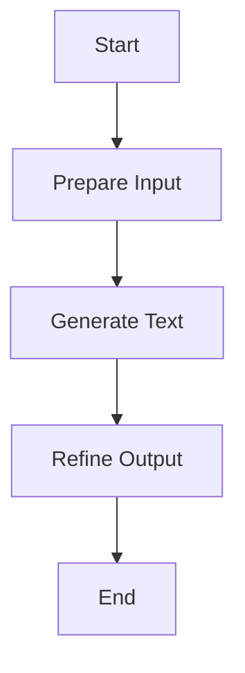

The process of generating text involves several key steps:

1. Preparing the input
2. Generating the text
3. Refining the output

Technical document: <SwmLink doc-title="Text Generation Flow">[Text Generation Flow](/.swm/text-generation-flow.knhefkp5.sw.md)</SwmLink>

# Preparing the Input

The text generation process begins with preparing the input text. This involves taking the raw input provided by the user and ensuring it is in the correct format for processing. This step includes tokenizing the input text, which means breaking it down into smaller units that the model can understand. Additionally, any necessary preprocessing, such as truncating or padding the input to a specific length, is performed to ensure compatibility with the model's requirements.

# Generating the Text

Once the input is prepared, the next step is to generate the text. This is where the model takes the processed input and produces a sequence of text as output. The generation process can use various strategies to create the text, such as greedy decoding, where the model selects the most likely next word at each step, or beam search, which explores multiple possible sequences to find the best one. The choice of strategy can affect the quality and diversity of the generated text.

# Refining the Output

After the text is generated, the final step is to refine the output. This involves post-processing the generated text to ensure it meets the desired quality standards. For example, any extra spaces or special tokens that were added during the generation process are cleaned up. Additionally, the output may be formatted or adjusted based on specific requirements, such as ensuring the text is coherent and grammatically correct. The refined output is then returned to the user as the final generated text.

&nbsp;

*This is an auto-generated document by Swimm AI 🌊 and has not yet been verified by a human*

<SwmMeta version="3.0.0" repo-id="Z2l0aHViJTNBJTNBdHJhbnNmb3JtZXJzJTNBJTNBc2h1anV1dQ==" repo-name="transformers">Powered by [Swimm](/)</SwmMeta>
