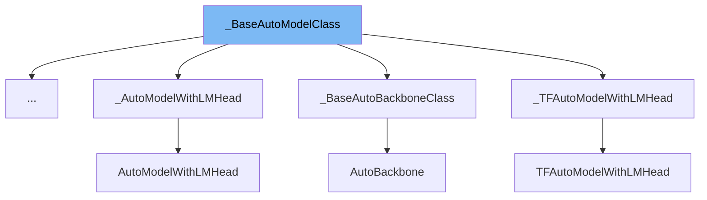

This document will cover the class <SwmToken path="src/transformers/models/auto/modeling_flax_auto.py" pos="368:4:4" line-data="class FlaxAutoModelForVision2Seq(_BaseAutoModelClass):">`_BaseAutoModelClass`</SwmToken> in the <SwmToken path="src/transformers/models/auto/auto_factory.py" pos="68:5:5" line-data="        &gt;&gt;&gt; from transformers import AutoConfig, BaseAutoModelClass">`transformers`</SwmToken> repository. We will cover:

1. What is <SwmToken path="src/transformers/models/auto/modeling_flax_auto.py" pos="368:4:4" line-data="class FlaxAutoModelForVision2Seq(_BaseAutoModelClass):">`_BaseAutoModelClass`</SwmToken>
2. Variables and functions
3. Usage example



# What is <SwmToken path="src/transformers/models/auto/modeling_flax_auto.py" pos="368:4:4" line-data="class FlaxAutoModelForVision2Seq(_BaseAutoModelClass):">`_BaseAutoModelClass`</SwmToken>

<SwmToken path="src/transformers/models/auto/modeling_flax_auto.py" pos="368:4:4" line-data="class FlaxAutoModelForVision2Seq(_BaseAutoModelClass):">`_BaseAutoModelClass`</SwmToken> is a base class for auto models in the <SwmToken path="src/transformers/models/auto/auto_factory.py" pos="68:5:5" line-data="        &gt;&gt;&gt; from transformers import AutoConfig, BaseAutoModelClass">`transformers`</SwmToken> library. It provides a generic interface for instantiating model classes from configurations or pretrained models. This class cannot be instantiated directly; instead, it provides class methods to create instances of specific model classes based on the provided configuration or pretrained model path.

<SwmSnippet path="/src/transformers/models/auto/auto_factory.py" line="405">

---

# Variables and functions

The variable <SwmToken path="src/transformers/models/auto/auto_factory.py" pos="405:1:1" line-data="    _model_mapping = None">`_model_mapping`</SwmToken> is used to store the mapping of configuration classes to model classes. It is initially set to `None` and is expected to be defined in subclasses.

```python
    _model_mapping = None
```

---

</SwmSnippet>

<SwmSnippet path="/src/transformers/models/auto/auto_factory.py" line="407">

---

The <SwmToken path="src/transformers/models/auto/auto_factory.py" pos="407:3:3" line-data="    def __init__(self, *args, **kwargs):">`__init__`</SwmToken> function raises an <SwmToken path="src/transformers/models/auto/auto_factory.py" pos="408:3:3" line-data="        raise EnvironmentError(">`EnvironmentError`</SwmToken> to prevent direct instantiation of <SwmToken path="src/transformers/models/auto/modeling_flax_auto.py" pos="368:4:4" line-data="class FlaxAutoModelForVision2Seq(_BaseAutoModelClass):">`_BaseAutoModelClass`</SwmToken>. It instructs users to use the <SwmToken path="src/transformers/models/auto/auto_factory.py" pos="410:16:16" line-data="            f&quot;using the `{self.__class__.__name__}.from_pretrained(pretrained_model_name_or_path)` or &quot;">`from_pretrained`</SwmToken> or <SwmToken path="src/transformers/models/auto/auto_factory.py" pos="411:12:12" line-data="            f&quot;`{self.__class__.__name__}.from_config(config)` methods.&quot;">`from_config`</SwmToken> class methods instead.

```python
    def __init__(self, *args, **kwargs):
        raise EnvironmentError(
            f"{self.__class__.__name__} is designed to be instantiated "
            f"using the `{self.__class__.__name__}.from_pretrained(pretrained_model_name_or_path)` or "
            f"`{self.__class__.__name__}.from_config(config)` methods."
        )
```

---

</SwmSnippet>

<SwmSnippet path="/src/transformers/models/auto/auto_factory.py" line="414">

---

The <SwmToken path="src/transformers/models/auto/auto_factory.py" pos="415:3:3" line-data="    def from_config(cls, config, **kwargs):">`from_config`</SwmToken> class method instantiates a model class based on the provided configuration. It checks if the configuration has remote code and whether it should trust remote code. If the configuration class is recognized, it returns an instance of the corresponding model class.

```python
    @classmethod
    def from_config(cls, config, **kwargs):
        trust_remote_code = kwargs.pop("trust_remote_code", None)
        has_remote_code = hasattr(config, "auto_map") and cls.__name__ in config.auto_map
        has_local_code = type(config) in cls._model_mapping.keys()
        trust_remote_code = resolve_trust_remote_code(
            trust_remote_code, config._name_or_path, has_local_code, has_remote_code
        )

        if has_remote_code and trust_remote_code:
            class_ref = config.auto_map[cls.__name__]
            if "--" in class_ref:
                repo_id, class_ref = class_ref.split("--")
            else:
                repo_id = config.name_or_path
            model_class = get_class_from_dynamic_module(class_ref, repo_id, **kwargs)
            if os.path.isdir(config._name_or_path):
                model_class.register_for_auto_class(cls.__name__)
            else:
                cls.register(config.__class__, model_class, exist_ok=True)
            _ = kwargs.pop("code_revision", None)
```

---

</SwmSnippet>

<SwmSnippet path="/src/transformers/models/auto/auto_factory.py" line="445">

---

The <SwmToken path="src/transformers/models/auto/auto_factory.py" pos="446:3:3" line-data="    def from_pretrained(cls, pretrained_model_name_or_path, *model_args, **kwargs):">`from_pretrained`</SwmToken> class method instantiates a model class from a pretrained model. It handles various arguments such as <SwmToken path="src/transformers/models/auto/auto_factory.py" pos="447:1:1" line-data="        config = kwargs.pop(&quot;config&quot;, None)">`config`</SwmToken>, <SwmToken path="src/transformers/models/auto/auto_factory.py" pos="448:1:1" line-data="        trust_remote_code = kwargs.pop(&quot;trust_remote_code&quot;, None)">`trust_remote_code`</SwmToken>, and <SwmToken path="src/transformers/models/auto/auto_factory.py" pos="461:1:1" line-data="        hub_kwargs = {name: kwargs.pop(name) for name in hub_kwargs_names if name in kwargs}">`hub_kwargs`</SwmToken>. It also manages the loading of adapter configurations if available.

```python
    @classmethod
    def from_pretrained(cls, pretrained_model_name_or_path, *model_args, **kwargs):
        config = kwargs.pop("config", None)
        trust_remote_code = kwargs.pop("trust_remote_code", None)
        kwargs["_from_auto"] = True
        hub_kwargs_names = [
            "cache_dir",
            "force_download",
            "local_files_only",
            "proxies",
            "resume_download",
            "revision",
            "subfolder",
            "use_auth_token",
            "token",
        ]
        hub_kwargs = {name: kwargs.pop(name) for name in hub_kwargs_names if name in kwargs}
        code_revision = kwargs.pop("code_revision", None)
        commit_hash = kwargs.pop("_commit_hash", None)
        adapter_kwargs = kwargs.pop("adapter_kwargs", None)

```

---

</SwmSnippet>

<SwmSnippet path="/src/transformers/models/auto/auto_factory.py" line="572">

---

The <SwmToken path="src/transformers/models/auto/auto_factory.py" pos="573:3:3" line-data="    def register(cls, config_class, model_class, exist_ok=False):">`register`</SwmToken> class method registers a new model class for a given configuration class. It ensures that the model class's <SwmToken path="src/transformers/models/auto/auto_factory.py" pos="573:8:8" line-data="    def register(cls, config_class, model_class, exist_ok=False):">`config_class`</SwmToken> attribute matches the provided configuration class.

```python
    @classmethod
    def register(cls, config_class, model_class, exist_ok=False):
        """
        Register a new model for this class.

        Args:
            config_class ([`PretrainedConfig`]):
                The configuration corresponding to the model to register.
            model_class ([`PreTrainedModel`]):
                The model to register.
        """
        if hasattr(model_class, "config_class") and str(model_class.config_class) != str(config_class):
            raise ValueError(
                "The model class you are passing has a `config_class` attribute that is not consistent with the "
                f"config class you passed (model has {model_class.config_class} and you passed {config_class}. Fix "
                "one of those so they match!"
            )
        cls._model_mapping.register(config_class, model_class, exist_ok=exist_ok)
```

---

</SwmSnippet>

# Usage example

Here is an example of how to use <SwmToken path="src/transformers/models/auto/modeling_flax_auto.py" pos="368:4:4" line-data="class FlaxAutoModelForVision2Seq(_BaseAutoModelClass):">`_BaseAutoModelClass`</SwmToken> in <SwmToken path="src/transformers/models/auto/modeling_flax_auto.py" pos="286:2:2" line-data="class FlaxAutoModelForPreTraining(_BaseAutoModelClass):">`FlaxAutoModelForPreTraining`</SwmToken>.

<SwmSnippet path="/src/transformers/models/auto/modeling_flax_auto.py" line="364">

---

The <SwmToken path="src/transformers/models/auto/modeling_flax_auto.py" pos="286:2:2" line-data="class FlaxAutoModelForPreTraining(_BaseAutoModelClass):">`FlaxAutoModelForPreTraining`</SwmToken> class uses <SwmToken path="src/transformers/models/auto/modeling_flax_auto.py" pos="368:4:4" line-data="class FlaxAutoModelForVision2Seq(_BaseAutoModelClass):">`_BaseAutoModelClass`</SwmToken> to instantiate a model from a pretrained checkpoint. It demonstrates how to download the model and configuration from Hugging Face and cache them locally.

```python
    FlaxAutoModelForImageClassification, head_doc="image classification"
)


class FlaxAutoModelForVision2Seq(_BaseAutoModelClass):
    _model_mapping = FLAX_MODEL_FOR_VISION_2_SEQ_MAPPING


FlaxAutoModelForVision2Seq = auto_class_update(FlaxAutoModelForVision2Seq, head_doc="vision-to-text modeling")


class FlaxAutoModelForSpeechSeq2Seq(_BaseAutoModelClass):
    _model_mapping = FLAX_MODEL_FOR_SPEECH_SEQ_2_SEQ_MAPPING


FlaxAutoModelForSpeechSeq2Seq = auto_class_update(
```

---

</SwmSnippet>

&nbsp;

*This is an auto-generated document by Swimm AI 🌊 and has not yet been verified by a human*

<SwmMeta version="3.0.0" repo-id="Z2l0aHViJTNBJTNBdHJhbnNmb3JtZXJzJTNBJTNBc2h1anV1dQ==" repo-name="transformers" doc-type="general-class"><sup>Powered by [Swimm](/)</sup></SwmMeta>
