```mermaid
graph TD;
  ArgumentHandler:::currentBaseStyle
ArgumentHandler --> TokenClassificationArgumentHandler
ArgumentHandler --> TableQuestionAnsweringArgumentHandler
ArgumentHandler --> ZeroShotClassificationArgumentHandler
ArgumentHandler --> QuestionAnsweringArgumentHandler

 classDef currentBaseStyle color:#000000,fill:#7CB9F4

%% Swimm:
%% graph TD;
%%   ArgumentHandler:::currentBaseStyle
%% <SwmToken path="src/transformers/pipelines/base.py" pos="282:2:2" line-data="class ArgumentHandler(ABC):">`ArgumentHandler`</SwmToken> --> TokenClassificationArgumentHandler
%% <SwmToken path="src/transformers/pipelines/base.py" pos="282:2:2" line-data="class ArgumentHandler(ABC):">`ArgumentHandler`</SwmToken> --> TableQuestionAnsweringArgumentHandler
%% <SwmToken path="src/transformers/pipelines/base.py" pos="282:2:2" line-data="class ArgumentHandler(ABC):">`ArgumentHandler`</SwmToken> --> ZeroShotClassificationArgumentHandler
%% <SwmToken path="src/transformers/pipelines/base.py" pos="282:2:2" line-data="class ArgumentHandler(ABC):">`ArgumentHandler`</SwmToken> --> <SwmToken path="src/transformers/pipelines/question_answering.py" pos="28:2:2" line-data="class QuestionAnsweringArgumentHandler(ArgumentHandler):">`QuestionAnsweringArgumentHandler`</SwmToken>
%% 
%%  classDef currentBaseStyle color:#000000,fill:#7CB9F4
```

This document will cover the <SwmToken path="src/transformers/pipelines/base.py" pos="282:2:2" line-data="class ArgumentHandler(ABC):">`ArgumentHandler`</SwmToken> class in the <SwmToken path="src/transformers/pipelines/base.py" pos="284:18:18" line-data="    Base interface for handling arguments for each :class:`~transformers.pipelines.Pipeline`.">`transformers`</SwmToken> repository. We will cover:

1. What <SwmToken path="src/transformers/pipelines/base.py" pos="282:2:2" line-data="class ArgumentHandler(ABC):">`ArgumentHandler`</SwmToken> is.
2. Variables and functions defined in <SwmToken path="src/transformers/pipelines/base.py" pos="282:2:2" line-data="class ArgumentHandler(ABC):">`ArgumentHandler`</SwmToken>.
3. Usage example of <SwmToken path="src/transformers/pipelines/base.py" pos="282:2:2" line-data="class ArgumentHandler(ABC):">`ArgumentHandler`</SwmToken> in <SwmToken path="src/transformers/pipelines/question_answering.py" pos="28:2:2" line-data="class QuestionAnsweringArgumentHandler(ArgumentHandler):">`QuestionAnsweringArgumentHandler`</SwmToken>.



# What is <SwmToken path="src/transformers/pipelines/base.py" pos="282:2:2" line-data="class ArgumentHandler(ABC):">`ArgumentHandler`</SwmToken>

The <SwmToken path="src/transformers/pipelines/base.py" pos="282:2:2" line-data="class ArgumentHandler(ABC):">`ArgumentHandler`</SwmToken> class is an abstract base class defined in <SwmPath>[src/transformers/pipelines/base.py](src/transformers/pipelines/base.py)</SwmPath>. It serves as a base interface for handling arguments for each <SwmToken path="src/transformers/pipelines/base.py" pos="284:22:22" line-data="    Base interface for handling arguments for each :class:`~transformers.pipelines.Pipeline`.">`Pipeline`</SwmToken> in the <SwmToken path="src/transformers/pipelines/base.py" pos="284:18:18" line-data="    Base interface for handling arguments for each :class:`~transformers.pipelines.Pipeline`.">`transformers`</SwmToken> library. This class is designed to be extended by other classes that implement specific argument handling logic for different types of pipelines.

<SwmSnippet path="/src/transformers/pipelines/base.py" line="282">

---

# Variables and functions

The <SwmToken path="src/transformers/pipelines/base.py" pos="282:2:2" line-data="class ArgumentHandler(ABC):">`ArgumentHandler`</SwmToken> class itself is defined here. It contains an abstract method <SwmToken path="src/transformers/pipelines/base.py" pos="288:3:3" line-data="    def __call__(self, *args, **kwargs):">`__call__`</SwmToken> which must be implemented by any subclass. This method is intended to handle the arguments passed to the pipeline.

```python
class ArgumentHandler(ABC):
    """
    Base interface for handling arguments for each :class:`~transformers.pipelines.Pipeline`.
    """

    @abstractmethod
    def __call__(self, *args, **kwargs):
        raise NotImplementedError()
```

---

</SwmSnippet>

# Usage example

The <SwmToken path="src/transformers/pipelines/question_answering.py" pos="28:2:2" line-data="class QuestionAnsweringArgumentHandler(ArgumentHandler):">`QuestionAnsweringArgumentHandler`</SwmToken> class is an example of how <SwmToken path="src/transformers/pipelines/base.py" pos="282:2:2" line-data="class ArgumentHandler(ABC):">`ArgumentHandler`</SwmToken> is used. This class is defined in <SwmPath>[src/transformers/pipelines/question_answering.py](src/transformers/pipelines/question_answering.py)</SwmPath> and implements the <SwmToken path="src/transformers/pipelines/base.py" pos="288:3:3" line-data="    def __call__(self, *args, **kwargs):">`__call__`</SwmToken> method to handle arguments specific to <SwmToken path="src/transformers/pipelines/question_answering.py" pos="101:6:8" line-data="    &lt;../task_summary.html#question-answering&gt;`__ for more information.">`question-answering`</SwmToken> pipelines.

<SwmSnippet path="/src/transformers/pipelines/question_answering.py" line="35">

---

# Usage example

The <SwmToken path="src/transformers/pipelines/question_answering.py" pos="28:2:2" line-data="class QuestionAnsweringArgumentHandler(ArgumentHandler):">`QuestionAnsweringArgumentHandler`</SwmToken> class extends <SwmToken path="src/transformers/pipelines/base.py" pos="282:2:2" line-data="class ArgumentHandler(ABC):">`ArgumentHandler`</SwmToken> and implements the <SwmToken path="src/transformers/pipelines/base.py" pos="288:3:3" line-data="    def __call__(self, *args, **kwargs):">`__call__`</SwmToken> method to handle <SwmToken path="src/transformers/pipelines/question_answering.py" pos="101:6:8" line-data="    &lt;../task_summary.html#question-answering&gt;`__ for more information.">`question-answering`</SwmToken> specific arguments.

```python
    """

    def normalize(self, item):
        if isinstance(item, SquadExample):
            return item
        elif isinstance(item, dict):
            for k in ["question", "context"]:
                if k not in item:
                    raise KeyError("You need to provide a dictionary with keys {question:..., context:...}")
                elif item[k] is None:
                    raise ValueError(f"`{k}` cannot be None")
                elif isinstance(item[k], str) and len(item[k]) == 0:
                    raise ValueError(f"`{k}` cannot be empty")

```

---

</SwmSnippet>

&nbsp;

*This is an auto-generated document by Swimm AI 🌊 and has not yet been verified by a human*

<SwmMeta version="3.0.0" repo-id="Z2l0aHViJTNBJTNBdHJhbnNmb3JtZXJzJTNBJTNBc2h1anV1dQ==" repo-name="transformers"><sup>Powered by [Swimm](/)</sup></SwmMeta>
