```mermaid
graph TD;
  BaseTransformersCLICommand:::currentBaseStyle
BaseTransformersCLICommand --> ServeCommand
BaseTransformersCLICommand --> EnvironmentCommand
BaseTransformersCLICommand --> TrainCommand
BaseTransformersCLICommand --> AddNewModelLikeCommand
BaseTransformersCLICommand --> ConvertCommand
BaseTransformersCLICommand --> DownloadCommand
BaseTransformersCLICommand --> PTtoTFCommand
BaseTransformersCLICommand --> LfsCommands
BaseTransformersCLICommand --> RunCommand
BaseTransformersCLICommand --> 1[...]

 classDef currentBaseStyle color:#000000,fill:#7CB9F4

%% Swimm:
%% graph TD;
%%   BaseTransformersCLICommand:::currentBaseStyle
%% <SwmToken path="src/transformers/commands/__init__.py" pos="19:2:2" line-data="class BaseTransformersCLICommand(ABC):">`BaseTransformersCLICommand`</SwmToken> --> <SwmToken path="src/transformers/commands/pt_to_tf.py" pos="61:4:4" line-data="    Returns: ServeCommand">`ServeCommand`</SwmToken>
%% <SwmToken path="src/transformers/commands/__init__.py" pos="19:2:2" line-data="class BaseTransformersCLICommand(ABC):">`BaseTransformersCLICommand`</SwmToken> --> EnvironmentCommand
%% <SwmToken path="src/transformers/commands/__init__.py" pos="19:2:2" line-data="class BaseTransformersCLICommand(ABC):">`BaseTransformersCLICommand`</SwmToken> --> TrainCommand
%% <SwmToken path="src/transformers/commands/__init__.py" pos="19:2:2" line-data="class BaseTransformersCLICommand(ABC):">`BaseTransformersCLICommand`</SwmToken> --> AddNewModelLikeCommand
%% <SwmToken path="src/transformers/commands/__init__.py" pos="19:2:2" line-data="class BaseTransformersCLICommand(ABC):">`BaseTransformersCLICommand`</SwmToken> --> ConvertCommand
%% <SwmToken path="src/transformers/commands/__init__.py" pos="19:2:2" line-data="class BaseTransformersCLICommand(ABC):">`BaseTransformersCLICommand`</SwmToken> --> DownloadCommand
%% <SwmToken path="src/transformers/commands/__init__.py" pos="19:2:2" line-data="class BaseTransformersCLICommand(ABC):">`BaseTransformersCLICommand`</SwmToken> --> <SwmToken path="src/transformers/commands/pt_to_tf.py" pos="63:3:3" line-data="    return PTtoTFCommand(">`PTtoTFCommand`</SwmToken>
%% <SwmToken path="src/transformers/commands/__init__.py" pos="19:2:2" line-data="class BaseTransformersCLICommand(ABC):">`BaseTransformersCLICommand`</SwmToken> --> LfsCommands
%% <SwmToken path="src/transformers/commands/__init__.py" pos="19:2:2" line-data="class BaseTransformersCLICommand(ABC):">`BaseTransformersCLICommand`</SwmToken> --> RunCommand
%% <SwmToken path="src/transformers/commands/__init__.py" pos="19:2:2" line-data="class BaseTransformersCLICommand(ABC):">`BaseTransformersCLICommand`</SwmToken> --> 1[...]
%% 
%%  classDef currentBaseStyle color:#000000,fill:#7CB9F4
```

This document will cover the <SwmToken path="src/transformers/commands/__init__.py" pos="19:2:2" line-data="class BaseTransformersCLICommand(ABC):">`BaseTransformersCLICommand`</SwmToken> class. We will discuss:

1. What <SwmToken path="src/transformers/commands/__init__.py" pos="19:2:2" line-data="class BaseTransformersCLICommand(ABC):">`BaseTransformersCLICommand`</SwmToken> is.
2. The variables and functions defined in <SwmToken path="src/transformers/commands/__init__.py" pos="19:2:2" line-data="class BaseTransformersCLICommand(ABC):">`BaseTransformersCLICommand`</SwmToken>.
3. An example of how to use <SwmToken path="src/transformers/commands/__init__.py" pos="19:2:2" line-data="class BaseTransformersCLICommand(ABC):">`BaseTransformersCLICommand`</SwmToken> in <SwmToken path="src/transformers/commands/pt_to_tf.py" pos="63:3:3" line-data="    return PTtoTFCommand(">`PTtoTFCommand`</SwmToken>.



# What is <SwmToken path="src/transformers/commands/__init__.py" pos="19:2:2" line-data="class BaseTransformersCLICommand(ABC):">`BaseTransformersCLICommand`</SwmToken>

<SwmToken path="src/transformers/commands/__init__.py" pos="19:2:2" line-data="class BaseTransformersCLICommand(ABC):">`BaseTransformersCLICommand`</SwmToken> is an abstract base class defined in <SwmPath>[src/transformers/commands/\__init_\_.py](src/transformers/commands/__init__.py)</SwmPath>. It serves as a template for creating command-line interface (CLI) commands within the Transformers library. This class enforces the implementation of specific methods that any subclass must define, ensuring a consistent interface for all CLI commands.

<SwmSnippet path="/src/transformers/commands/__init__.py" line="19">

---

# Variables and functions

The <SwmToken path="src/transformers/commands/__init__.py" pos="22:3:3" line-data="    def register_subcommand(parser: ArgumentParser):">`register_subcommand`</SwmToken> function is a static and abstract method. It is intended to be implemented by subclasses to register their specific subcommands to the argument parser. This method ensures that each CLI command can be integrated into the overall command structure.

```python
class BaseTransformersCLICommand(ABC):
    @staticmethod
    @abstractmethod
    def register_subcommand(parser: ArgumentParser):
        raise NotImplementedError()
```

---

</SwmSnippet>

<SwmSnippet path="/src/transformers/commands/__init__.py" line="25">

---

The <SwmToken path="src/transformers/commands/__init__.py" pos="26:3:3" line-data="    def run(self):">`run`</SwmToken> function is an abstract method that must be implemented by subclasses. This method contains the logic that will be executed when the CLI command is run. By defining this method as abstract, the base class enforces that each command provides its own implementation of the execution logic.

```python
    @abstractmethod
    def run(self):
        raise NotImplementedError()
```

---

</SwmSnippet>

# Usage example

The <SwmToken path="src/transformers/commands/pt_to_tf.py" pos="63:3:3" line-data="    return PTtoTFCommand(">`PTtoTFCommand`</SwmToken> class in <SwmPath>[src/transformers/commands/pt_to_tf.py](src/transformers/commands/pt_to_tf.py)</SwmPath> is an example of a class that implements <SwmToken path="src/transformers/commands/__init__.py" pos="19:2:2" line-data="class BaseTransformersCLICommand(ABC):">`BaseTransformersCLICommand`</SwmToken>. Here is how it is used:

<SwmSnippet path="/src/transformers/commands/pt_to_tf.py" line="19">

---

The <SwmToken path="src/transformers/commands/pt_to_tf.py" pos="63:3:3" line-data="    return PTtoTFCommand(">`PTtoTFCommand`</SwmToken> class extends <SwmToken path="src/transformers/commands/__init__.py" pos="19:2:2" line-data="class BaseTransformersCLICommand(ABC):">`BaseTransformersCLICommand`</SwmToken> and provides implementations for the <SwmToken path="src/transformers/commands/__init__.py" pos="22:3:3" line-data="    def register_subcommand(parser: ArgumentParser):">`register_subcommand`</SwmToken> and <SwmToken path="src/transformers/commands/__init__.py" pos="26:3:3" line-data="    def run(self):">`run`</SwmToken> methods. This class registers a subcommand for converting <SwmToken path="src/transformers/commands/pt_to_tf.py" pos="59:15:15" line-data="    Factory function used to convert a model PyTorch checkpoint in a TensorFlow 2 checkpoint.">`PyTorch`</SwmToken> models to <SwmToken path="src/transformers/commands/pt_to_tf.py" pos="43:3:3" line-data="    import tensorflow as tf">`tensorflow`</SwmToken> and defines the logic for performing the conversion when the command is executed.

```python

import huggingface_hub
import numpy as np
from packaging import version

from .. import (
    FEATURE_EXTRACTOR_MAPPING,
    IMAGE_PROCESSOR_MAPPING,
    PROCESSOR_MAPPING,
```

---

</SwmSnippet>

&nbsp;

*This is an auto-generated document by Swimm AI 🌊 and has not yet been verified by a human*

<SwmMeta version="3.0.0" repo-id="Z2l0aHViJTNBJTNBdHJhbnNmb3JtZXJzJTNBJTNBc2h1anV1dQ==" repo-name="transformers" doc-type="class"><sup>Powered by [Swimm](/)</sup></SwmMeta>
