```mermaid
graph TD;
  BaseTransformersCLICommand:::currentBaseStyle
BaseTransformersCLICommand --> ServeCommand
BaseTransformersCLICommand --> TrainCommand
BaseTransformersCLICommand --> AddNewModelCommand
BaseTransformersCLICommand --> ConvertCommand
BaseTransformersCLICommand --> DownloadCommand
BaseTransformersCLICommand --> EnvironmentCommand
BaseTransformersCLICommand --> LfsCommands
BaseTransformersCLICommand --> RunCommand
BaseTransformersCLICommand --> 1[...]

 classDef currentBaseStyle color:#000000,fill:#7CB9F4

%% Swimm:
%% graph TD;
%%   BaseTransformersCLICommand:::currentBaseStyle
%% <SwmToken path="src/transformers/commands/add_new_model.py" pos="23:6:6" line-data="from . import BaseTransformersCLICommand">`BaseTransformersCLICommand`</SwmToken> --> ServeCommand
%% <SwmToken path="src/transformers/commands/add_new_model.py" pos="23:6:6" line-data="from . import BaseTransformersCLICommand">`BaseTransformersCLICommand`</SwmToken> --> TrainCommand
%% <SwmToken path="src/transformers/commands/add_new_model.py" pos="23:6:6" line-data="from . import BaseTransformersCLICommand">`BaseTransformersCLICommand`</SwmToken> --> <SwmToken path="src/transformers/commands/add_new_model.py" pos="37:3:3" line-data="    return AddNewModelCommand(args.testing, args.testing_file, path=args.path)">`AddNewModelCommand`</SwmToken>
%% <SwmToken path="src/transformers/commands/add_new_model.py" pos="23:6:6" line-data="from . import BaseTransformersCLICommand">`BaseTransformersCLICommand`</SwmToken> --> ConvertCommand
%% <SwmToken path="src/transformers/commands/add_new_model.py" pos="23:6:6" line-data="from . import BaseTransformersCLICommand">`BaseTransformersCLICommand`</SwmToken> --> DownloadCommand
%% <SwmToken path="src/transformers/commands/add_new_model.py" pos="23:6:6" line-data="from . import BaseTransformersCLICommand">`BaseTransformersCLICommand`</SwmToken> --> EnvironmentCommand
%% <SwmToken path="src/transformers/commands/add_new_model.py" pos="23:6:6" line-data="from . import BaseTransformersCLICommand">`BaseTransformersCLICommand`</SwmToken> --> LfsCommands
%% <SwmToken path="src/transformers/commands/add_new_model.py" pos="23:6:6" line-data="from . import BaseTransformersCLICommand">`BaseTransformersCLICommand`</SwmToken> --> RunCommand
%% <SwmToken path="src/transformers/commands/add_new_model.py" pos="23:6:6" line-data="from . import BaseTransformersCLICommand">`BaseTransformersCLICommand`</SwmToken> --> 1[...]
%% 
%%  classDef currentBaseStyle color:#000000,fill:#7CB9F4
```

This document will cover the class <SwmToken path="src/transformers/commands/add_new_model.py" pos="23:6:6" line-data="from . import BaseTransformersCLICommand">`BaseTransformersCLICommand`</SwmToken>. We will discuss:

1. What <SwmToken path="src/transformers/commands/add_new_model.py" pos="23:6:6" line-data="from . import BaseTransformersCLICommand">`BaseTransformersCLICommand`</SwmToken> is.
2. The variables and functions defined in <SwmToken path="src/transformers/commands/add_new_model.py" pos="23:6:6" line-data="from . import BaseTransformersCLICommand">`BaseTransformersCLICommand`</SwmToken>.
3. An example of how to use <SwmToken path="src/transformers/commands/add_new_model.py" pos="23:6:6" line-data="from . import BaseTransformersCLICommand">`BaseTransformersCLICommand`</SwmToken> in <SwmToken path="src/transformers/commands/add_new_model.py" pos="37:3:3" line-data="    return AddNewModelCommand(args.testing, args.testing_file, path=args.path)">`AddNewModelCommand`</SwmToken>.



# What is <SwmToken path="src/transformers/commands/add_new_model.py" pos="23:6:6" line-data="from . import BaseTransformersCLICommand">`BaseTransformersCLICommand`</SwmToken>

<SwmToken path="src/transformers/commands/add_new_model.py" pos="23:6:6" line-data="from . import BaseTransformersCLICommand">`BaseTransformersCLICommand`</SwmToken> is an abstract base class defined in <SwmPath>[src/transformers/commands/\__init_\_.py](src/transformers/commands/__init__.py)</SwmPath>. It serves as a template for creating command-line interface (CLI) commands within the Transformers library. This class ensures that any derived class implements the necessary methods to register and run a subcommand.

<SwmSnippet path="/src/transformers/commands/__init__.py" line="20">

---

# Variables and functions

The static method <SwmToken path="src/transformers/commands/__init__.py" pos="22:3:3" line-data="    def register_subcommand(parser: ArgumentParser):">`register_subcommand`</SwmToken> is an abstract method that must be implemented by any subclass. It is intended to register the subcommand with an <SwmToken path="src/transformers/commands/__init__.py" pos="22:8:8" line-data="    def register_subcommand(parser: ArgumentParser):">`ArgumentParser`</SwmToken> instance.

```python
    @staticmethod
    @abstractmethod
    def register_subcommand(parser: ArgumentParser):
        raise NotImplementedError()
```

---

</SwmSnippet>

<SwmSnippet path="/src/transformers/commands/__init__.py" line="25">

---

The method <SwmToken path="src/transformers/commands/__init__.py" pos="26:3:3" line-data="    def run(self):">`run`</SwmToken> is another abstract method that must be implemented by any subclass. This method contains the logic to execute the command.

```python
    @abstractmethod
    def run(self):
        raise NotImplementedError()
```

---

</SwmSnippet>

# Usage example

Here is an example of how to use <SwmToken path="src/transformers/commands/add_new_model.py" pos="23:6:6" line-data="from . import BaseTransformersCLICommand">`BaseTransformersCLICommand`</SwmToken> in the <SwmToken path="src/transformers/commands/add_new_model.py" pos="37:3:3" line-data="    return AddNewModelCommand(args.testing, args.testing_file, path=args.path)">`AddNewModelCommand`</SwmToken> class.

<SwmSnippet path="/src/transformers/commands/add_new_model.py" line="19">

---

# Usage example

<SwmToken path="src/transformers/commands/add_new_model.py" pos="37:3:3" line-data="    return AddNewModelCommand(args.testing, args.testing_file, path=args.path)">`AddNewModelCommand`</SwmToken> is a concrete implementation of <SwmToken path="src/transformers/commands/add_new_model.py" pos="23:6:6" line-data="from . import BaseTransformersCLICommand">`BaseTransformersCLICommand`</SwmToken>. It provides specific implementations for the <SwmToken path="src/transformers/commands/__init__.py" pos="22:3:3" line-data="    def register_subcommand(parser: ArgumentParser):">`register_subcommand`</SwmToken> and <SwmToken path="src/transformers/commands/__init__.py" pos="26:3:3" line-data="    def run(self):">`run`</SwmToken> methods, allowing it to be used as a CLI command for adding new models.

```python
from pathlib import Path
from typing import List

from ..utils import logging
from . import BaseTransformersCLICommand


try:
    from cookiecutter.main import cookiecutter
```

---

</SwmSnippet>

&nbsp;

*This is an auto-generated document by Swimm AI 🌊 and has not yet been verified by a human*

<SwmMeta version="3.0.0" repo-id="Z2l0aHViJTNBJTNBdHJhbnNmb3JtZXJzJTNBJTNBc2h1anV1dQ==" repo-name="transformers"><sup>Powered by [Swimm](/)</sup></SwmMeta>
