```mermaid
graph TD;
  BaseUserCommand:::currentBaseStyle
BaseUserCommand --> LoginCommand
BaseUserCommand --> WhoamiCommand
BaseUserCommand --> LogoutCommand
BaseUserCommand --> ListObjsCommand
BaseUserCommand --> DeleteObjCommand
BaseUserCommand --> 1[...]

 classDef currentBaseStyle color:#000000,fill:#7CB9F4

%% Swimm:
%% graph TD;
%%   BaseUserCommand:::currentBaseStyle
%% <SwmToken path="src/transformers/commands/user.py" pos="143:2:2" line-data="class BaseUserCommand:">`BaseUserCommand`</SwmToken> --> <SwmToken path="src/transformers/commands/user.py" pos="149:2:2" line-data="class LoginCommand(BaseUserCommand):">`LoginCommand`</SwmToken>
%% <SwmToken path="src/transformers/commands/user.py" pos="143:2:2" line-data="class BaseUserCommand:">`BaseUserCommand`</SwmToken> --> <SwmToken path="src/transformers/commands/user.py" pos="38:12:12" line-data="        whoami_parser.set_defaults(func=lambda args: WhoamiCommand(args))">`WhoamiCommand`</SwmToken>
%% <SwmToken path="src/transformers/commands/user.py" pos="143:2:2" line-data="class BaseUserCommand:">`BaseUserCommand`</SwmToken> --> <SwmToken path="src/transformers/commands/user.py" pos="40:12:12" line-data="        logout_parser.set_defaults(func=lambda args: LogoutCommand(args))">`LogoutCommand`</SwmToken>
%% <SwmToken path="src/transformers/commands/user.py" pos="143:2:2" line-data="class BaseUserCommand:">`BaseUserCommand`</SwmToken> --> <SwmToken path="src/transformers/commands/user.py" pos="48:12:12" line-data="        ls_parser.set_defaults(func=lambda args: ListObjsCommand(args))">`ListObjsCommand`</SwmToken>
%% <SwmToken path="src/transformers/commands/user.py" pos="143:2:2" line-data="class BaseUserCommand:">`BaseUserCommand`</SwmToken> --> <SwmToken path="src/transformers/commands/user.py" pos="56:12:12" line-data="        rm_parser.set_defaults(func=lambda args: DeleteObjCommand(args))">`DeleteObjCommand`</SwmToken>
%% <SwmToken path="src/transformers/commands/user.py" pos="143:2:2" line-data="class BaseUserCommand:">`BaseUserCommand`</SwmToken> --> 1[...]
%% 
%%  classDef currentBaseStyle color:#000000,fill:#7CB9F4
```

This document will cover the <SwmToken path="src/transformers/commands/user.py" pos="143:2:2" line-data="class BaseUserCommand:">`BaseUserCommand`</SwmToken> class. We will discuss:

1. What <SwmToken path="src/transformers/commands/user.py" pos="143:2:2" line-data="class BaseUserCommand:">`BaseUserCommand`</SwmToken> is.
2. The variables and functions defined in <SwmToken path="src/transformers/commands/user.py" pos="143:2:2" line-data="class BaseUserCommand:">`BaseUserCommand`</SwmToken>.
3. An example of how to use <SwmToken path="src/transformers/commands/user.py" pos="143:2:2" line-data="class BaseUserCommand:">`BaseUserCommand`</SwmToken> in <SwmToken path="src/transformers/commands/user.py" pos="149:2:2" line-data="class LoginCommand(BaseUserCommand):">`LoginCommand`</SwmToken>.



# What is <SwmToken path="src/transformers/commands/user.py" pos="143:2:2" line-data="class BaseUserCommand:">`BaseUserCommand`</SwmToken>

<SwmToken path="src/transformers/commands/user.py" pos="143:2:2" line-data="class BaseUserCommand:">`BaseUserCommand`</SwmToken> is a base class in <SwmPath>[src/transformers/commands/user.py](src/transformers/commands/user.py)</SwmPath> used for user-related commands in the Hugging Face CLI. It provides a common structure and shared functionality for various user commands such as login, logout, and querying user information.

<SwmSnippet path="/src/transformers/commands/user.py" line="143">

---

# Variables and functions

The <SwmToken path="src/transformers/commands/user.py" pos="143:2:2" line-data="class BaseUserCommand:">`BaseUserCommand`</SwmToken> class is defined here.

```python
class BaseUserCommand:
```

---

</SwmSnippet>

<SwmSnippet path="/src/transformers/commands/user.py" line="144">

---

The <SwmToken path="src/transformers/commands/user.py" pos="144:3:3" line-data="    def __init__(self, args):">`__init__`</SwmToken> method initializes the <SwmToken path="src/transformers/commands/user.py" pos="143:2:2" line-data="class BaseUserCommand:">`BaseUserCommand`</SwmToken> class. It takes <SwmToken path="src/transformers/commands/user.py" pos="144:8:8" line-data="    def __init__(self, args):">`args`</SwmToken> as a parameter and initializes the <SwmToken path="src/transformers/commands/user.py" pos="145:1:3" line-data="        self.args = args">`self.args`</SwmToken> and <SwmToken path="src/transformers/commands/user.py" pos="146:1:3" line-data="        self._api = HfApi()">`self._api`</SwmToken> attributes. <SwmToken path="src/transformers/commands/user.py" pos="146:1:3" line-data="        self._api = HfApi()">`self._api`</SwmToken> is an instance of <SwmToken path="src/transformers/commands/user.py" pos="146:7:7" line-data="        self._api = HfApi()">`HfApi`</SwmToken> used to interact with the Hugging Face API.

```python
    def __init__(self, args):
        self.args = args
        self._api = HfApi()
```

---

</SwmSnippet>

# Usage example

Here is an example of how to use <SwmToken path="src/transformers/commands/user.py" pos="143:2:2" line-data="class BaseUserCommand:">`BaseUserCommand`</SwmToken> in the <SwmToken path="src/transformers/commands/user.py" pos="149:2:2" line-data="class LoginCommand(BaseUserCommand):">`LoginCommand`</SwmToken> class.

<SwmSnippet path="/src/transformers/commands/user.py" line="149">

---

# Usage example

<SwmToken path="src/transformers/commands/user.py" pos="149:2:2" line-data="class LoginCommand(BaseUserCommand):">`LoginCommand`</SwmToken> is a subclass of <SwmToken path="src/transformers/commands/user.py" pos="149:4:4" line-data="class LoginCommand(BaseUserCommand):">`BaseUserCommand`</SwmToken>. It implements the <SwmToken path="src/transformers/commands/user.py" pos="150:3:3" line-data="    def run(self):">`run`</SwmToken> method to handle the login process. The <SwmToken path="src/transformers/commands/user.py" pos="150:3:3" line-data="    def run(self):">`run`</SwmToken> method prompts the user for their username and password, attempts to log in using the Hugging Face API, and saves the authentication token if successful.

```python
class LoginCommand(BaseUserCommand):
    def run(self):
        print(  # docstyle-ignore
            """
        _|    _|  _|    _|    _|_|_|    _|_|_|  _|_|_|  _|      _|    _|_|_|      _|_|_|_|    _|_|      _|_|_|  _|_|_|_|
        _|    _|  _|    _|  _|        _|          _|    _|_|    _|  _|            _|        _|    _|  _|        _|
        _|_|_|_|  _|    _|  _|  _|_|  _|  _|_|    _|    _|  _|  _|  _|  _|_|      _|_|_|    _|_|_|_|  _|        _|_|_|
        _|    _|  _|    _|  _|    _|  _|    _|    _|    _|    _|_|  _|    _|      _|        _|    _|  _|        _|
        _|    _|    _|_|      _|_|_|    _|_|_|  _|_|_|  _|      _|    _|_|_|      _|        _|    _|    _|_|_|  _|_|_|_|

        """
        )
        username = input("Username: ")
        password = getpass()
        try:
            token = self._api.login(username, password)
        except HTTPError as e:
            # probably invalid credentials, display error message.
            print(e)
            print(ANSI.red(e.response.text))
            exit(1)
```

---

</SwmSnippet>

&nbsp;

*This is an auto-generated document by Swimm AI 🌊 and has not yet been verified by a human*

<SwmMeta version="3.0.0" repo-id="Z2l0aHViJTNBJTNBdHJhbnNmb3JtZXJzJTNBJTNBc2h1anV1dQ==" repo-name="transformers"><sup>Powered by [Swimm](/)</sup></SwmMeta>
