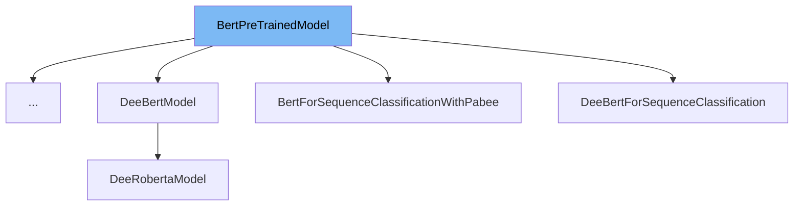

This document will provide an overview of the <SwmToken path="src/transformers/utils/dummy_pt_objects.py" pos="672:2:2" line-data="class BertPreTrainedModel:">`BertPreTrainedModel`</SwmToken> class. We will cover:

1. What <SwmToken path="src/transformers/utils/dummy_pt_objects.py" pos="672:2:2" line-data="class BertPreTrainedModel:">`BertPreTrainedModel`</SwmToken> is.
2. Variables and functions within <SwmToken path="src/transformers/utils/dummy_pt_objects.py" pos="672:2:2" line-data="class BertPreTrainedModel:">`BertPreTrainedModel`</SwmToken>.
3. Usage example of <SwmToken path="src/transformers/utils/dummy_pt_objects.py" pos="672:2:2" line-data="class BertPreTrainedModel:">`BertPreTrainedModel`</SwmToken> in <SwmToken path="examples/research_projects/deebert/src/modeling_highway_roberta.py" pos="38:2:2" line-data="class DeeRobertaForSequenceClassification(BertPreTrainedModel):">`DeeRobertaForSequenceClassification`</SwmToken>.



# What is <SwmToken path="src/transformers/utils/dummy_pt_objects.py" pos="672:2:2" line-data="class BertPreTrainedModel:">`BertPreTrainedModel`</SwmToken>

<SwmToken path="src/transformers/utils/dummy_pt_objects.py" pos="672:2:2" line-data="class BertPreTrainedModel:">`BertPreTrainedModel`</SwmToken> is a class defined in <SwmPath>[src/transformers/utils/dummy_pt_objects.py](src/transformers/utils/dummy_pt_objects.py)</SwmPath>. It serves as a base class for all BERT model variants. This class ensures that the necessary backend, in this case, PyTorch, is available before any BERT model operations are performed. It is primarily used to provide common functionalities and configurations for BERT models.

<SwmSnippet path="/src/transformers/utils/dummy_pt_objects.py" line="672">

---

# Variables and functions

The constructor <SwmToken path="src/transformers/utils/dummy_pt_objects.py" pos="673:3:3" line-data="    def __init__(self, *args, **kwargs):">`__init__`</SwmToken> initializes the <SwmToken path="src/transformers/utils/dummy_pt_objects.py" pos="672:2:2" line-data="class BertPreTrainedModel:">`BertPreTrainedModel`</SwmToken> class and ensures that the PyTorch backend is available by calling <SwmToken path="src/transformers/utils/dummy_pt_objects.py" pos="674:1:11" line-data="        requires_backends(self, [&quot;torch&quot;])">`requires_backends(self, ["torch"])`</SwmToken>.

```python
class BertPreTrainedModel:
    def __init__(self, *args, **kwargs):
        requires_backends(self, ["torch"])

```

---

</SwmSnippet>

<SwmSnippet path="/src/transformers/utils/dummy_pt_objects.py" line="677">

---

The class method <SwmToken path="src/transformers/utils/dummy_pt_objects.py" pos="677:3:3" line-data="    def from_pretrained(cls, *args, **kwargs):">`from_pretrained`</SwmToken> is used to load a pretrained BERT model. It ensures that the PyTorch backend is available by calling <SwmToken path="src/transformers/utils/dummy_pt_objects.py" pos="678:1:11" line-data="        requires_backends(cls, [&quot;torch&quot;])">`requires_backends(cls, ["torch"])`</SwmToken>.

```python
    def from_pretrained(cls, *args, **kwargs):
        requires_backends(cls, ["torch"])

```

---

</SwmSnippet>

# Usage example

Here is an example of how to use <SwmToken path="src/transformers/utils/dummy_pt_objects.py" pos="672:2:2" line-data="class BertPreTrainedModel:">`BertPreTrainedModel`</SwmToken> in <SwmToken path="examples/research_projects/deebert/src/modeling_highway_roberta.py" pos="38:2:2" line-data="class DeeRobertaForSequenceClassification(BertPreTrainedModel):">`DeeRobertaForSequenceClassification`</SwmToken>.

<SwmSnippet path="/examples/research_projects/deebert/src/modeling_highway_roberta.py" line="5">

---

# Usage example

<SwmToken path="examples/research_projects/deebert/src/modeling_highway_roberta.py" pos="38:2:2" line-data="class DeeRobertaForSequenceClassification(BertPreTrainedModel):">`DeeRobertaForSequenceClassification`</SwmToken> extends <SwmToken path="src/transformers/utils/dummy_pt_objects.py" pos="672:2:2" line-data="class BertPreTrainedModel:">`BertPreTrainedModel`</SwmToken> to leverage its functionalities for sequence classification tasks. This example shows how <SwmToken path="src/transformers/utils/dummy_pt_objects.py" pos="672:2:2" line-data="class BertPreTrainedModel:">`BertPreTrainedModel`</SwmToken> can be used as a base class for specific model implementations.

```python

from transformers import RobertaConfig
from transformers.file_utils import add_start_docstrings, add_start_docstrings_to_model_forward
from transformers.models.roberta.modeling_roberta import (
    ROBERTA_INPUTS_DOCSTRING,
    ROBERTA_START_DOCSTRING,
```

---

</SwmSnippet>

&nbsp;

*This is an auto-generated document by Swimm AI 🌊 and has not yet been verified by a human*

<SwmMeta version="3.0.0" repo-id="Z2l0aHViJTNBJTNBdHJhbnNmb3JtZXJzJTNBJTNBc2h1anV1dQ==" repo-name="transformers"><sup>Powered by [Swimm](/)</sup></SwmMeta>
