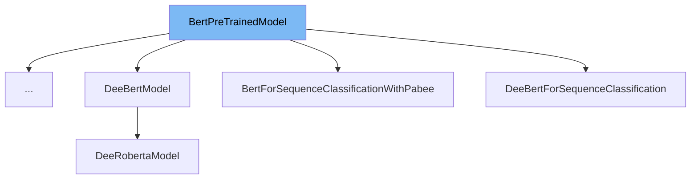

This document will cover the class <SwmToken path="src/transformers/utils/dummy_pt_objects.py" pos="1286:2:2" line-data="class BertPreTrainedModel(metaclass=DummyObject):">`BertPreTrainedModel`</SwmToken>. We will cover:

1. What <SwmToken path="src/transformers/utils/dummy_pt_objects.py" pos="1286:2:2" line-data="class BertPreTrainedModel(metaclass=DummyObject):">`BertPreTrainedModel`</SwmToken> is in the repo.
2. Main variables and functions in <SwmToken path="src/transformers/utils/dummy_pt_objects.py" pos="1286:2:2" line-data="class BertPreTrainedModel(metaclass=DummyObject):">`BertPreTrainedModel`</SwmToken>.
3. Example of how to use <SwmToken path="src/transformers/utils/dummy_pt_objects.py" pos="1286:2:2" line-data="class BertPreTrainedModel(metaclass=DummyObject):">`BertPreTrainedModel`</SwmToken> in `BertForSequenceClassificationWithPabee`.



# What is <SwmToken path="src/transformers/utils/dummy_pt_objects.py" pos="1286:2:2" line-data="class BertPreTrainedModel(metaclass=DummyObject):">`BertPreTrainedModel`</SwmToken>

<SwmToken path="src/transformers/utils/dummy_pt_objects.py" pos="1286:2:2" line-data="class BertPreTrainedModel(metaclass=DummyObject):">`BertPreTrainedModel`</SwmToken> in <SwmPath>[src/transformers/utils/dummy_pt_objects.py](src/transformers/utils/dummy_pt_objects.py)</SwmPath> is a placeholder class that represents a pre-trained BERT model. It is used as a dummy object to indicate that the actual implementation requires the PyTorch backend. This class is part of a mechanism to handle missing dependencies gracefully by providing a clear error message when the required backend is not available.

<SwmSnippet path="/src/transformers/utils/dummy_pt_objects.py" line="1286">

---

# Variables and functions

The <SwmToken path="src/transformers/utils/dummy_pt_objects.py" pos="1286:2:2" line-data="class BertPreTrainedModel(metaclass=DummyObject):">`BertPreTrainedModel`</SwmToken> class is defined with a metaclass <SwmToken path="src/transformers/utils/dummy_pt_objects.py" pos="1286:6:6" line-data="class BertPreTrainedModel(metaclass=DummyObject):">`DummyObject`</SwmToken> and a <SwmToken path="src/transformers/utils/dummy_pt_objects.py" pos="1287:1:1" line-data="    _backends = [&quot;torch&quot;]">`_backends`</SwmToken> attribute set to `['torch']`. The constructor <SwmToken path="src/transformers/utils/dummy_pt_objects.py" pos="1289:3:3" line-data="    def __init__(self, *args, **kwargs):">`__init__`</SwmToken> calls the <SwmToken path="src/transformers/utils/dummy_pt_objects.py" pos="1290:1:1" line-data="        requires_backends(self, [&quot;torch&quot;])">`requires_backends`</SwmToken> function to check for the required backend.

```python
class BertPreTrainedModel(metaclass=DummyObject):
    _backends = ["torch"]

    def __init__(self, *args, **kwargs):
        requires_backends(self, ["torch"])

```

---

</SwmSnippet>

# Usage example

To use <SwmToken path="src/transformers/utils/dummy_pt_objects.py" pos="1286:2:2" line-data="class BertPreTrainedModel(metaclass=DummyObject):">`BertPreTrainedModel`</SwmToken> in `BertForSequenceClassificationWithPabee`, you would typically inherit from <SwmToken path="src/transformers/utils/dummy_pt_objects.py" pos="1286:2:2" line-data="class BertPreTrainedModel(metaclass=DummyObject):">`BertPreTrainedModel`</SwmToken> and implement the specific functionality for sequence classification. Here is a conceptual example:

```python
from transformers import BertPreTrainedModel

class BertForSequenceClassificationWithPabee(BertPreTrainedModel):
    def __init__(self, config):
        super().__init__(config)
        # Additional initialization for sequence classification

    def forward(self, input_ids, attention_mask=None, token_type_ids=None, labels=None):
        # Forward pass implementation
        pass
```

In this example, `BertForSequenceClassificationWithPabee` inherits from <SwmToken path="src/transformers/utils/dummy_pt_objects.py" pos="1286:2:2" line-data="class BertPreTrainedModel(metaclass=DummyObject):">`BertPreTrainedModel`</SwmToken> and implements the `forward` method for sequence classification.

&nbsp;

*This is an auto-generated document by Swimm AI 🌊 and has not yet been verified by a human*

<SwmMeta version="3.0.0" repo-id="Z2l0aHViJTNBJTNBdHJhbnNmb3JtZXJzJTNBJTNBc2h1anV1dQ==" repo-name="transformers" doc-type="class"><sup>Powered by [Swimm](/)</sup></SwmMeta>
