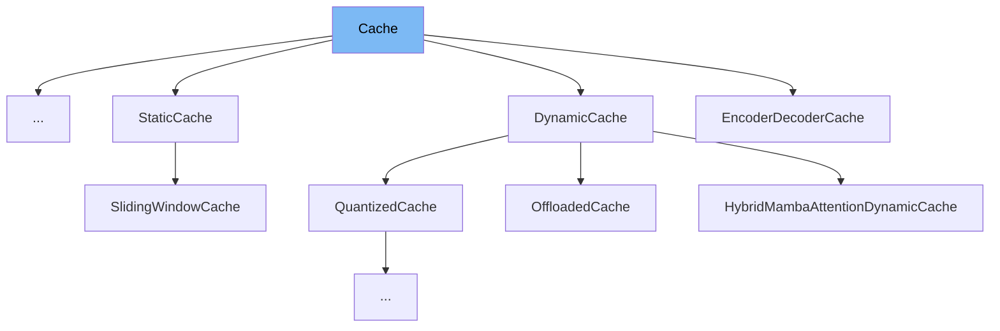

This document will cover the <SwmToken path="src/transformers/cache_utils.py" pos="42:5:5" line-data="        Updates the cache with the new `key_states` and `value_states` for the layer `layer_idx`.">`cache`</SwmToken> class in the <SwmPath>[src/transformers/cache_utils.py](src/transformers/cache_utils.py)</SwmPath> file. We will cover:

1. What is Cache
2. Variables and functions
3. Usage example



# What is Cache

The <SwmToken path="src/transformers/cache_utils.py" pos="42:5:5" line-data="        Updates the cache with the new `key_states` and `value_states` for the layer `layer_idx`.">`cache`</SwmToken> class in <SwmPath>[src/transformers/cache_utils.py](src/transformers/cache_utils.py)</SwmPath> is a base, abstract class for all caches. The actual data structure is specific to each subclass. It is used to manage and update <SwmToken path="src/transformers/cache_utils.py" pos="184:19:21" line-data="            `Dict[str, Any]`: Dictionary containing all the key-value pairs that were not used to update the instance.">`key-value`</SwmToken> states during model inference, particularly for transformer models. The <SwmToken path="src/transformers/cache_utils.py" pos="42:5:5" line-data="        Updates the cache with the new `key_states` and `value_states` for the layer `layer_idx`.">`cache`</SwmToken> class provides a framework for subclasses to implement their own caching mechanisms, which can be tailored to specific needs such as dynamic growth, quantization, or offloading to conserve memory.

<SwmSnippet path="/src/transformers/cache_utils.py" line="31">

---

# Variables and functions

The <SwmToken path="src/transformers/cache_utils.py" pos="31:3:3" line-data="    def __init__(self):">`__init__`</SwmToken> function initializes the <SwmToken path="src/transformers/cache_utils.py" pos="42:5:5" line-data="        Updates the cache with the new `key_states` and `value_states` for the layer `layer_idx`.">`cache`</SwmToken> class by calling the superclass initializer.

```python
    def __init__(self):
        super().__init__()

```

---

</SwmSnippet>

<SwmSnippet path="/src/transformers/cache_utils.py" line="34">

---

The <SwmToken path="src/transformers/cache_utils.py" pos="34:3:3" line-data="    def update(">`update`</SwmToken> function is an abstract method meant to be implemented by subclasses. It updates the cache with new key and value states for a specific layer index. This function must be overridden in any subclass of <SwmToken path="src/transformers/cache_utils.py" pos="42:5:5" line-data="        Updates the cache with the new `key_states` and `value_states` for the layer `layer_idx`.">`cache`</SwmToken>.

```python
    def update(
        self,
        key_states: torch.Tensor,
        value_states: torch.Tensor,
        layer_idx: int,
        cache_kwargs: Optional[Dict[str, Any]] = None,
    ) -> Tuple[torch.Tensor, torch.Tensor]:
        """
        Updates the cache with the new `key_states` and `value_states` for the layer `layer_idx`.

        Parameters:
            key_states (`torch.Tensor`):
                The new key states to cache.
            value_states (`torch.Tensor`):
                The new value states to cache.
            layer_idx (`int`):
                The index of the layer to cache the states for.
            cache_kwargs (`Dict[str, Any]`, `optional`):
                Additional arguments for the cache subclass. These are specific to each subclass and allow new types of
                cache to be created.

```

---

</SwmSnippet>

<SwmSnippet path="/src/transformers/cache_utils.py" line="60">

---

The <SwmToken path="src/transformers/cache_utils.py" pos="60:3:3" line-data="    def get_seq_length(self, layer_idx: Optional[int] = 0) -&gt; int:">`get_seq_length`</SwmToken> function is an abstract method that returns the sequence length of the cached states for a given layer index. This function must be implemented by subclasses.

```python
    def get_seq_length(self, layer_idx: Optional[int] = 0) -> int:
        """Returns the sequence length of the cached states. A layer index can be optionally passed."""
        # TODO: deprecate this function in favor of `cache_position`
        raise NotImplementedError("Make sure to implement `get_seq_length` in a subclass.")
```

---

</SwmSnippet>

<SwmSnippet path="/src/transformers/cache_utils.py" line="65">

---

The <SwmToken path="src/transformers/cache_utils.py" pos="65:3:3" line-data="    def get_max_length(self) -&gt; Optional[int]:">`get_max_length`</SwmToken> function is an abstract method that returns the maximum sequence length of the cached states, if any. This function must be implemented by subclasses.

```python
    def get_max_length(self) -> Optional[int]:
        """Returns the maximum sequence length of the cached states, if there is any."""
        raise NotImplementedError("Make sure to implement `get_max_length` in a subclass.")
```

---

</SwmSnippet>

<SwmSnippet path="/src/transformers/cache_utils.py" line="69">

---

The <SwmToken path="src/transformers/cache_utils.py" pos="69:3:3" line-data="    def get_usable_length(self, new_seq_length: int, layer_idx: Optional[int] = 0) -&gt; int:">`get_usable_length`</SwmToken> function calculates the usable length of the cache given the sequence length of new inputs. It takes into account the maximum cache length and the previous sequence length.

```python
    def get_usable_length(self, new_seq_length: int, layer_idx: Optional[int] = 0) -> int:
        """Given the sequence length of the new inputs, returns the usable length of the cache."""
        # Cache without size limit -> all cache is usable
        # Cache with size limit -> if the length cache plus the length of the new inputs is larger the maximum cache
        #   length, we will need to evict part of the cache (and thus not all cache is usable)
        max_length = self.get_max_length()
        previous_seq_length = self.get_seq_length(layer_idx)
        if max_length is not None and previous_seq_length + new_seq_length > max_length:
            return max_length - new_seq_length
        return previous_seq_length
```

---

</SwmSnippet>

<SwmSnippet path="/src/transformers/cache_utils.py" line="80">

---

The <SwmToken path="src/transformers/cache_utils.py" pos="80:3:3" line-data="    def reorder_cache(self, beam_idx: torch.LongTensor):">`reorder_cache`</SwmToken> function reorders the cache for beam search based on the selected beam indices. It updates the key and value caches for each layer.

```python
    def reorder_cache(self, beam_idx: torch.LongTensor):
        """Reorders the cache for beam search, given the selected beam indices."""
        for layer_idx in range(len(self.key_cache)):
            device = self.key_cache[layer_idx].device
            self.key_cache[layer_idx] = self.key_cache[layer_idx].index_select(0, beam_idx.to(device))
            device = self.value_cache[layer_idx].device
            self.value_cache[layer_idx] = self.value_cache[layer_idx].index_select(0, beam_idx.to(device))
```

---

</SwmSnippet>

<SwmSnippet path="/src/transformers/cache_utils.py" line="88">

---

The <SwmToken path="src/transformers/cache_utils.py" pos="89:3:3" line-data="    def seen_tokens(self):">`seen_tokens`</SwmToken> property is a deprecated attribute that returns the number of tokens seen by the cache. It is recommended to use the <SwmToken path="src/transformers/cache_utils.py" pos="91:34:34" line-data="            &quot;The `seen_tokens` attribute is deprecated and will be removed in v4.41. Use the `cache_position` &quot;">`cache_position`</SwmToken> model input instead.

```python
    @property
    def seen_tokens(self):
        logger.warning_once(
            "The `seen_tokens` attribute is deprecated and will be removed in v4.41. Use the `cache_position` "
            "model input instead."
        )
        if hasattr(self, "_seen_tokens"):
            return self._seen_tokens
        else:
            return None
```

---

</SwmSnippet>

# Usage example

The <SwmToken path="src/transformers/cache_utils.py" pos="789:2:2" line-data="class SinkCache(Cache):">`SinkCache`</SwmToken> class is an example of a subclass that implements the <SwmToken path="src/transformers/cache_utils.py" pos="42:5:5" line-data="        Updates the cache with the new `key_states` and `value_states` for the layer `layer_idx`.">`cache`</SwmToken> class. Here is an example of how to use <SwmToken path="src/transformers/cache_utils.py" pos="42:5:5" line-data="        Updates the cache with the new `key_states` and `value_states` for the layer `layer_idx`.">`cache`</SwmToken> in <SwmToken path="src/transformers/cache_utils.py" pos="789:2:2" line-data="class SinkCache(Cache):">`SinkCache`</SwmToken>.

<SwmSnippet path="/src/transformers/cache_utils.py" line="789">

---

The <SwmToken path="src/transformers/cache_utils.py" pos="789:2:2" line-data="class SinkCache(Cache):">`SinkCache`</SwmToken> class extends the <SwmToken path="src/transformers/cache_utils.py" pos="789:4:4" line-data="class SinkCache(Cache):">`Cache`</SwmToken> class and provides an implementation for managing <SwmToken path="src/transformers/cache_utils.py" pos="184:19:21" line-data="            `Dict[str, Any]`: Dictionary containing all the key-value pairs that were not used to update the instance.">`key-value`</SwmToken> states. It is designed to allow models to generate beyond the length of their context window by discarding past tokens.

````python
class SinkCache(Cache):
    """
    A cache that as described in the [Attention Sinks paper](https://arxiv.org/abs/2309.17453). It allows the model to
    generate beyond the length of its context window, without losing fluency in the conversation. As it discards past
    tokens, the model will lose the ability to generate tokens that depend on the context that was discarded.

    It stores the Key and Value states as a list of tensors, one for each layer. The expected shape for each tensor is
    `[batch_size, num_heads, seq_len, head_dim]`.

    Parameters:
        window_length (`int`):
            The length of the context window.
        num_sink_tokens (`int`):
            The number of sink tokens. See the original paper for more information.

    Example:

        ```python
        >>> from transformers import AutoTokenizer, AutoModelForCausalLM, SinkCache

        >>> model = AutoModelForCausalLM.from_pretrained("openai-community/gpt2")
````

---

</SwmSnippet>

&nbsp;

*This is an auto-generated document by Swimm AI 🌊 and has not yet been verified by a human*

<SwmMeta version="3.0.0" repo-id="Z2l0aHViJTNBJTNBdHJhbnNmb3JtZXJzJTNBJTNBc2h1anV1dQ==" repo-name="transformers" doc-type="general-class"><sup>Powered by [Swimm](/)</sup></SwmMeta>
