This document will cover the <SwmToken path="examples/legacy/multiple_choice/utils_multiple_choice.py" pos="415:4:4" line-data="class ArcProcessor(DataProcessor):">`DataProcessor`</SwmToken> class in the <SwmPath>[examples/legacy/multiple_choice/utils_multiple_choice.py](examples/legacy/multiple_choice/utils_multiple_choice.py)</SwmPath> file. We will cover:

1. What is <SwmToken path="examples/legacy/multiple_choice/utils_multiple_choice.py" pos="415:4:4" line-data="class ArcProcessor(DataProcessor):">`DataProcessor`</SwmToken>
2. Variables and functions
3. Usage example

```mermaid
graph TD;
  DataProcessor:::currentBaseStyle
DataProcessor --> RaceProcessor
DataProcessor --> SwagProcessor
DataProcessor --> ArcProcessor
DataProcessor --> SynonymProcessor
DataProcessor --> HansProcessor

 classDef currentBaseStyle color:#000000,fill:#7CB9F4

%% Swimm:
%% graph TD;
%%   DataProcessor:::currentBaseStyle
%% <SwmToken path="examples/legacy/multiple_choice/utils_multiple_choice.py" pos="415:4:4" line-data="class ArcProcessor(DataProcessor):">`DataProcessor`</SwmToken> --> <SwmToken path="examples/legacy/multiple_choice/utils_multiple_choice.py" pos="251:2:2" line-data="class RaceProcessor(DataProcessor):">`RaceProcessor`</SwmToken>
%% <SwmToken path="examples/legacy/multiple_choice/utils_multiple_choice.py" pos="415:4:4" line-data="class ArcProcessor(DataProcessor):">`DataProcessor`</SwmToken> --> <SwmToken path="examples/legacy/multiple_choice/utils_multiple_choice.py" pos="364:2:2" line-data="class SwagProcessor(DataProcessor):">`SwagProcessor`</SwmToken>
%% <SwmToken path="examples/legacy/multiple_choice/utils_multiple_choice.py" pos="415:4:4" line-data="class ArcProcessor(DataProcessor):">`DataProcessor`</SwmToken> --> <SwmToken path="examples/legacy/multiple_choice/utils_multiple_choice.py" pos="415:2:2" line-data="class ArcProcessor(DataProcessor):">`ArcProcessor`</SwmToken>
%% <SwmToken path="examples/legacy/multiple_choice/utils_multiple_choice.py" pos="415:4:4" line-data="class ArcProcessor(DataProcessor):">`DataProcessor`</SwmToken> --> <SwmToken path="examples/legacy/multiple_choice/utils_multiple_choice.py" pos="318:2:2" line-data="class SynonymProcessor(DataProcessor):">`SynonymProcessor`</SwmToken>
%% <SwmToken path="examples/legacy/multiple_choice/utils_multiple_choice.py" pos="415:4:4" line-data="class ArcProcessor(DataProcessor):">`DataProcessor`</SwmToken> --> HansProcessor
%% 
%%  classDef currentBaseStyle color:#000000,fill:#7CB9F4
```



# What is <SwmToken path="examples/legacy/multiple_choice/utils_multiple_choice.py" pos="415:4:4" line-data="class ArcProcessor(DataProcessor):">`DataProcessor`</SwmToken>

The <SwmToken path="examples/legacy/multiple_choice/utils_multiple_choice.py" pos="415:4:4" line-data="class ArcProcessor(DataProcessor):">`DataProcessor`</SwmToken> class in <SwmPath>[examples/legacy/multiple_choice/utils_multiple_choice.py](examples/legacy/multiple_choice/utils_multiple_choice.py)</SwmPath> is a base class for data converters for multiple choice data sets. It provides an interface for loading and processing data for training, development, and testing purposes. The class defines several methods that need to be implemented by subclasses to handle specific datasets.

<SwmSnippet path="/examples/legacy/multiple_choice/utils_multiple_choice.py" line="234">

---

# Variables and functions

The function <SwmToken path="examples/legacy/multiple_choice/utils_multiple_choice.py" pos="234:3:3" line-data="    def get_train_examples(self, data_dir):">`get_train_examples`</SwmToken> is used to get a collection of <SwmToken path="examples/legacy/multiple_choice/utils_multiple_choice.py" pos="235:13:13" line-data="        &quot;&quot;&quot;Gets a collection of `InputExample`s for the train set.&quot;&quot;&quot;">`InputExample`</SwmToken>s for the training set. It needs to be implemented by subclasses.

```python
    def get_train_examples(self, data_dir):
        """Gets a collection of `InputExample`s for the train set."""
        raise NotImplementedError()
```

---

</SwmSnippet>

<SwmSnippet path="/examples/legacy/multiple_choice/utils_multiple_choice.py" line="238">

---

The function <SwmToken path="examples/legacy/multiple_choice/utils_multiple_choice.py" pos="238:3:3" line-data="    def get_dev_examples(self, data_dir):">`get_dev_examples`</SwmToken> is used to get a collection of <SwmToken path="examples/legacy/multiple_choice/utils_multiple_choice.py" pos="239:13:13" line-data="        &quot;&quot;&quot;Gets a collection of `InputExample`s for the dev set.&quot;&quot;&quot;">`InputExample`</SwmToken>s for the development set. It needs to be implemented by subclasses.

```python
    def get_dev_examples(self, data_dir):
        """Gets a collection of `InputExample`s for the dev set."""
        raise NotImplementedError()
```

---

</SwmSnippet>

<SwmSnippet path="/examples/legacy/multiple_choice/utils_multiple_choice.py" line="242">

---

The function <SwmToken path="examples/legacy/multiple_choice/utils_multiple_choice.py" pos="242:3:3" line-data="    def get_test_examples(self, data_dir):">`get_test_examples`</SwmToken> is used to get a collection of <SwmToken path="examples/legacy/multiple_choice/utils_multiple_choice.py" pos="243:13:13" line-data="        &quot;&quot;&quot;Gets a collection of `InputExample`s for the test set.&quot;&quot;&quot;">`InputExample`</SwmToken>s for the test set. It needs to be implemented by subclasses.

```python
    def get_test_examples(self, data_dir):
        """Gets a collection of `InputExample`s for the test set."""
        raise NotImplementedError()
```

---

</SwmSnippet>

<SwmSnippet path="/examples/legacy/multiple_choice/utils_multiple_choice.py" line="246">

---

The function <SwmToken path="examples/legacy/multiple_choice/utils_multiple_choice.py" pos="246:3:3" line-data="    def get_labels(self):">`get_labels`</SwmToken> is used to get the list of labels for the dataset. It needs to be implemented by subclasses.

```python
    def get_labels(self):
        """Gets the list of labels for this data set."""
        raise NotImplementedError()
```

---

</SwmSnippet>

# Usage example

The <SwmToken path="examples/legacy/multiple_choice/utils_multiple_choice.py" pos="415:2:2" line-data="class ArcProcessor(DataProcessor):">`ArcProcessor`</SwmToken> class is an example of how to use the <SwmToken path="examples/legacy/multiple_choice/utils_multiple_choice.py" pos="415:4:4" line-data="class ArcProcessor(DataProcessor):">`DataProcessor`</SwmToken> class. It implements the methods defined in <SwmToken path="examples/legacy/multiple_choice/utils_multiple_choice.py" pos="415:4:4" line-data="class ArcProcessor(DataProcessor):">`DataProcessor`</SwmToken> to handle the ARC dataset.

<SwmSnippet path="/examples/legacy/multiple_choice/utils_multiple_choice.py" line="415">

---

The <SwmToken path="examples/legacy/multiple_choice/utils_multiple_choice.py" pos="415:2:2" line-data="class ArcProcessor(DataProcessor):">`ArcProcessor`</SwmToken> class extends <SwmToken path="examples/legacy/multiple_choice/utils_multiple_choice.py" pos="415:4:4" line-data="class ArcProcessor(DataProcessor):">`DataProcessor`</SwmToken> and implements the methods <SwmToken path="examples/legacy/multiple_choice/utils_multiple_choice.py" pos="418:3:3" line-data="    def get_train_examples(self, data_dir):">`get_train_examples`</SwmToken>, <SwmToken path="examples/legacy/multiple_choice/utils_multiple_choice.py" pos="423:3:3" line-data="    def get_dev_examples(self, data_dir):">`get_dev_examples`</SwmToken>, <SwmToken path="examples/legacy/multiple_choice/utils_multiple_choice.py" pos="428:3:3" line-data="    def get_test_examples(self, data_dir):">`get_test_examples`</SwmToken>, <SwmToken path="examples/legacy/multiple_choice/utils_multiple_choice.py" pos="432:3:3" line-data="    def get_labels(self):">`get_labels`</SwmToken>, <SwmToken path="examples/legacy/multiple_choice/utils_multiple_choice.py" pos="421:9:9" line-data="        return self._create_examples(self._read_json(os.path.join(data_dir, &quot;train.jsonl&quot;)), &quot;train&quot;)">`_read_json`</SwmToken>, and <SwmToken path="examples/legacy/multiple_choice/utils_multiple_choice.py" pos="421:5:5" line-data="        return self._create_examples(self._read_json(os.path.join(data_dir, &quot;train.jsonl&quot;)), &quot;train&quot;)">`_create_examples`</SwmToken> to process the ARC dataset.

```python
class ArcProcessor(DataProcessor):
    """Processor for the ARC data set (request from allennlp)."""

    def get_train_examples(self, data_dir):
        """See base class."""
        logger.info("LOOKING AT {} train".format(data_dir))
        return self._create_examples(self._read_json(os.path.join(data_dir, "train.jsonl")), "train")

    def get_dev_examples(self, data_dir):
        """See base class."""
        logger.info("LOOKING AT {} dev".format(data_dir))
        return self._create_examples(self._read_json(os.path.join(data_dir, "dev.jsonl")), "dev")

    def get_test_examples(self, data_dir):
        logger.info("LOOKING AT {} test".format(data_dir))
        return self._create_examples(self._read_json(os.path.join(data_dir, "test.jsonl")), "test")

    def get_labels(self):
        """See base class."""
        return ["0", "1", "2", "3"]

```

---

</SwmSnippet>

&nbsp;

*This is an auto-generated document by Swimm AI 🌊 and has not yet been verified by a human*

<SwmMeta version="3.0.0" repo-id="Z2l0aHViJTNBJTNBdHJhbnNmb3JtZXJzJTNBJTNBc2h1anV1dQ==" repo-name="transformers" doc-type="general-class"><sup>Powered by [Swimm](/)</sup></SwmMeta>
