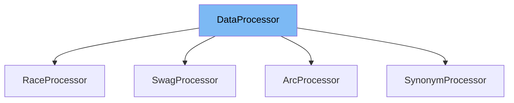

This document will cover the <SwmToken path="examples/tensorflow/multiple-choice/utils_multiple_choice.py" pos="411:4:4" line-data="class ArcProcessor(DataProcessor):">`DataProcessor`</SwmToken> class in the <SwmPath>[examples/tensorflow/multiple-choice/utils_multiple_choice.py](examples/tensorflow/multiple-choice/utils_multiple_choice.py)</SwmPath> file. We will cover:

1. What <SwmToken path="examples/tensorflow/multiple-choice/utils_multiple_choice.py" pos="411:4:4" line-data="class ArcProcessor(DataProcessor):">`DataProcessor`</SwmToken> is.
2. Variables and functions in <SwmToken path="examples/tensorflow/multiple-choice/utils_multiple_choice.py" pos="411:4:4" line-data="class ArcProcessor(DataProcessor):">`DataProcessor`</SwmToken>.
3. Usage example of <SwmToken path="examples/tensorflow/multiple-choice/utils_multiple_choice.py" pos="411:4:4" line-data="class ArcProcessor(DataProcessor):">`DataProcessor`</SwmToken> in <SwmToken path="examples/tensorflow/multiple-choice/utils_multiple_choice.py" pos="411:2:2" line-data="class ArcProcessor(DataProcessor):">`ArcProcessor`</SwmToken>.



# What is <SwmToken path="examples/tensorflow/multiple-choice/utils_multiple_choice.py" pos="411:4:4" line-data="class ArcProcessor(DataProcessor):">`DataProcessor`</SwmToken>

The <SwmToken path="examples/tensorflow/multiple-choice/utils_multiple_choice.py" pos="411:4:4" line-data="class ArcProcessor(DataProcessor):">`DataProcessor`</SwmToken> class in <SwmPath>[examples/tensorflow/multiple-choice/utils_multiple_choice.py](examples/tensorflow/multiple-choice/utils_multiple_choice.py)</SwmPath> is a base class for data converters for multiple choice datasets. It provides an interface for loading and processing data for training, development, and testing purposes. The class is designed to be extended by specific dataset processors that implement the required methods.

<SwmSnippet path="/examples/tensorflow/multiple-choice/utils_multiple_choice.py" line="230">

---

# Variables and functions

The function <SwmToken path="examples/tensorflow/multiple-choice/utils_multiple_choice.py" pos="230:3:3" line-data="    def get_train_examples(self, data_dir):">`get_train_examples`</SwmToken> is used to get a collection of <SwmToken path="examples/tensorflow/multiple-choice/utils_multiple_choice.py" pos="231:13:13" line-data="        &quot;&quot;&quot;Gets a collection of `InputExample`s for the train set.&quot;&quot;&quot;">`InputExample`</SwmToken>s for the training set. It is an abstract method that must be implemented by subclasses.

```python
    def get_train_examples(self, data_dir):
        """Gets a collection of `InputExample`s for the train set."""
        raise NotImplementedError()
```

---

</SwmSnippet>

<SwmSnippet path="/examples/tensorflow/multiple-choice/utils_multiple_choice.py" line="234">

---

The function <SwmToken path="examples/tensorflow/multiple-choice/utils_multiple_choice.py" pos="234:3:3" line-data="    def get_dev_examples(self, data_dir):">`get_dev_examples`</SwmToken> is used to get a collection of <SwmToken path="examples/tensorflow/multiple-choice/utils_multiple_choice.py" pos="235:13:13" line-data="        &quot;&quot;&quot;Gets a collection of `InputExample`s for the dev set.&quot;&quot;&quot;">`InputExample`</SwmToken>s for the development set. It is an abstract method that must be implemented by subclasses.

```python
    def get_dev_examples(self, data_dir):
        """Gets a collection of `InputExample`s for the dev set."""
        raise NotImplementedError()
```

---

</SwmSnippet>

<SwmSnippet path="/examples/tensorflow/multiple-choice/utils_multiple_choice.py" line="238">

---

The function <SwmToken path="examples/tensorflow/multiple-choice/utils_multiple_choice.py" pos="238:3:3" line-data="    def get_test_examples(self, data_dir):">`get_test_examples`</SwmToken> is used to get a collection of <SwmToken path="examples/tensorflow/multiple-choice/utils_multiple_choice.py" pos="239:13:13" line-data="        &quot;&quot;&quot;Gets a collection of `InputExample`s for the test set.&quot;&quot;&quot;">`InputExample`</SwmToken>s for the test set. It is an abstract method that must be implemented by subclasses.

```python
    def get_test_examples(self, data_dir):
        """Gets a collection of `InputExample`s for the test set."""
        raise NotImplementedError()
```

---

</SwmSnippet>

<SwmSnippet path="/examples/tensorflow/multiple-choice/utils_multiple_choice.py" line="242">

---

The function <SwmToken path="examples/tensorflow/multiple-choice/utils_multiple_choice.py" pos="242:3:3" line-data="    def get_labels(self):">`get_labels`</SwmToken> is used to get the list of labels for the dataset. It is an abstract method that must be implemented by subclasses.

```python
    def get_labels(self):
        """Gets the list of labels for this data set."""
        raise NotImplementedError()
```

---

</SwmSnippet>

# Usage example

Here is an example of how to use <SwmToken path="examples/tensorflow/multiple-choice/utils_multiple_choice.py" pos="411:4:4" line-data="class ArcProcessor(DataProcessor):">`DataProcessor`</SwmToken> in the <SwmToken path="examples/tensorflow/multiple-choice/utils_multiple_choice.py" pos="411:2:2" line-data="class ArcProcessor(DataProcessor):">`ArcProcessor`</SwmToken> class.

<SwmSnippet path="/examples/tensorflow/multiple-choice/utils_multiple_choice.py" line="411">

---

# Usage example

The <SwmToken path="examples/tensorflow/multiple-choice/utils_multiple_choice.py" pos="411:2:2" line-data="class ArcProcessor(DataProcessor):">`ArcProcessor`</SwmToken> class extends <SwmToken path="examples/tensorflow/multiple-choice/utils_multiple_choice.py" pos="411:4:4" line-data="class ArcProcessor(DataProcessor):">`DataProcessor`</SwmToken> and implements the required methods for the ARC dataset. It provides specific implementations for <SwmToken path="examples/tensorflow/multiple-choice/utils_multiple_choice.py" pos="414:3:3" line-data="    def get_train_examples(self, data_dir):">`get_train_examples`</SwmToken>, <SwmToken path="examples/tensorflow/multiple-choice/utils_multiple_choice.py" pos="419:3:3" line-data="    def get_dev_examples(self, data_dir):">`get_dev_examples`</SwmToken>, <SwmToken path="examples/tensorflow/multiple-choice/utils_multiple_choice.py" pos="424:3:3" line-data="    def get_test_examples(self, data_dir):">`get_test_examples`</SwmToken>, and <SwmToken path="examples/tensorflow/multiple-choice/utils_multiple_choice.py" pos="428:3:3" line-data="    def get_labels(self):">`get_labels`</SwmToken>.

```python
class ArcProcessor(DataProcessor):
    """Processor for the ARC data set (request from allennlp)."""

    def get_train_examples(self, data_dir):
        """See base class."""
        logger.info(f"LOOKING AT {data_dir} train")
        return self._create_examples(self._read_json(os.path.join(data_dir, "train.jsonl")), "train")

    def get_dev_examples(self, data_dir):
        """See base class."""
        logger.info(f"LOOKING AT {data_dir} dev")
        return self._create_examples(self._read_json(os.path.join(data_dir, "dev.jsonl")), "dev")

    def get_test_examples(self, data_dir):
        logger.info(f"LOOKING AT {data_dir} test")
        return self._create_examples(self._read_json(os.path.join(data_dir, "test.jsonl")), "test")

    def get_labels(self):
        """See base class."""
        return ["0", "1", "2", "3"]

```

---

</SwmSnippet>

&nbsp;

*This is an auto-generated document by Swimm AI 🌊 and has not yet been verified by a human*

<SwmMeta version="3.0.0" repo-id="Z2l0aHViJTNBJTNBdHJhbnNmb3JtZXJzJTNBJTNBc2h1anV1dQ==" repo-name="transformers"><sup>Powered by [Swimm](/)</sup></SwmMeta>
