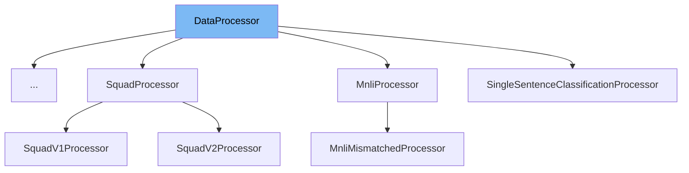

This document will cover the <SwmToken path="src/transformers/data/processors/utils.py" pos="80:2:2" line-data="class DataProcessor:">`DataProcessor`</SwmToken> class. We will cover:

1. What <SwmToken path="src/transformers/data/processors/utils.py" pos="80:2:2" line-data="class DataProcessor:">`DataProcessor`</SwmToken> is.
2. Variables and functions in <SwmToken path="src/transformers/data/processors/utils.py" pos="80:2:2" line-data="class DataProcessor:">`DataProcessor`</SwmToken>.
3. Usage example of <SwmToken path="src/transformers/data/processors/utils.py" pos="80:2:2" line-data="class DataProcessor:">`DataProcessor`</SwmToken> in <SwmToken path="src/transformers/data/processors/glue.py" pos="417:2:2" line-data="class QqpProcessor(DataProcessor):">`QqpProcessor`</SwmToken>.



# What is <SwmToken path="src/transformers/data/processors/utils.py" pos="80:2:2" line-data="class DataProcessor:">`DataProcessor`</SwmToken>

The <SwmToken path="src/transformers/data/processors/utils.py" pos="80:2:2" line-data="class DataProcessor:">`DataProcessor`</SwmToken> class in <SwmPath>[src/transformers/data/processors/utils.py](src/transformers/data/processors/utils.py)</SwmPath> is a base class for data converters for sequence classification datasets. It provides a standard interface for loading, processing, and converting data into a format suitable for model training and evaluation. This class is designed to be extended by specific dataset processors that implement the required methods.

<SwmSnippet path="/src/transformers/data/processors/utils.py" line="83">

---

# Variables and functions

The function <SwmToken path="src/transformers/data/processors/utils.py" pos="83:3:3" line-data="    def get_example_from_tensor_dict(self, tensor_dict):">`get_example_from_tensor_dict`</SwmToken> is used to get an example from a dictionary containing <SwmToken path="src/transformers/data/processors/utils.py" pos="85:15:15" line-data="        Gets an example from a dict with tensorflow tensors.">`tensorflow`</SwmToken> tensors. This method needs to be implemented by subclasses.

```python
    def get_example_from_tensor_dict(self, tensor_dict):
        """
        Gets an example from a dict with tensorflow tensors.

        Args:
            tensor_dict: Keys and values should match the corresponding Glue
                tensorflow_dataset examples.
        """
        raise NotImplementedError()
```

---

</SwmSnippet>

<SwmSnippet path="/src/transformers/data/processors/utils.py" line="93">

---

The function <SwmToken path="src/transformers/data/processors/utils.py" pos="93:3:3" line-data="    def get_train_examples(self, data_dir):">`get_train_examples`</SwmToken> is used to get a collection of <SwmToken path="src/transformers/data/processors/utils.py" pos="94:14:14" line-data="        &quot;&quot;&quot;Gets a collection of [`InputExample`] for the train set.&quot;&quot;&quot;">`InputExample`</SwmToken> instances for the training set. This method needs to be implemented by subclasses.

```python
    def get_train_examples(self, data_dir):
        """Gets a collection of [`InputExample`] for the train set."""
        raise NotImplementedError()
```

---

</SwmSnippet>

<SwmSnippet path="/src/transformers/data/processors/utils.py" line="97">

---

The function <SwmToken path="src/transformers/data/processors/utils.py" pos="97:3:3" line-data="    def get_dev_examples(self, data_dir):">`get_dev_examples`</SwmToken> is used to get a collection of <SwmToken path="src/transformers/data/processors/utils.py" pos="98:14:14" line-data="        &quot;&quot;&quot;Gets a collection of [`InputExample`] for the dev set.&quot;&quot;&quot;">`InputExample`</SwmToken> instances for the development set. This method needs to be implemented by subclasses.

```python
    def get_dev_examples(self, data_dir):
        """Gets a collection of [`InputExample`] for the dev set."""
        raise NotImplementedError()
```

---

</SwmSnippet>

<SwmSnippet path="/src/transformers/data/processors/utils.py" line="101">

---

The function <SwmToken path="src/transformers/data/processors/utils.py" pos="101:3:3" line-data="    def get_test_examples(self, data_dir):">`get_test_examples`</SwmToken> is used to get a collection of <SwmToken path="src/transformers/data/processors/utils.py" pos="102:14:14" line-data="        &quot;&quot;&quot;Gets a collection of [`InputExample`] for the test set.&quot;&quot;&quot;">`InputExample`</SwmToken> instances for the test set. This method needs to be implemented by subclasses.

```python
    def get_test_examples(self, data_dir):
        """Gets a collection of [`InputExample`] for the test set."""
        raise NotImplementedError()
```

---

</SwmSnippet>

<SwmSnippet path="/src/transformers/data/processors/utils.py" line="105">

---

The function <SwmToken path="src/transformers/data/processors/utils.py" pos="105:3:3" line-data="    def get_labels(self):">`get_labels`</SwmToken> is used to get the list of labels for the dataset. This method needs to be implemented by subclasses.

```python
    def get_labels(self):
        """Gets the list of labels for this data set."""
        raise NotImplementedError()
```

---

</SwmSnippet>

<SwmSnippet path="/src/transformers/data/processors/utils.py" line="109">

---

The function <SwmToken path="src/transformers/data/processors/utils.py" pos="109:3:3" line-data="    def tfds_map(self, example):">`tfds_map`</SwmToken> is used to convert examples from <SwmToken path="src/transformers/data/processors/utils.py" pos="85:15:15" line-data="        Gets an example from a dict with tensorflow tensors.">`tensorflow`</SwmToken> datasets to the correct format expected by the GLUE datasets. It modifies the label of the example if necessary.

```python
    def tfds_map(self, example):
        """
        Some tensorflow_datasets datasets are not formatted the same way the GLUE datasets are. This method converts
        examples to the correct format.
        """
        if len(self.get_labels()) > 1:
            example.label = self.get_labels()[int(example.label)]
        return example
```

---

</SwmSnippet>

<SwmSnippet path="/src/transformers/data/processors/utils.py" line="118">

---

The class method <SwmToken path="src/transformers/data/processors/utils.py" pos="119:3:3" line-data="    def _read_tsv(cls, input_file, quotechar=None):">`_read_tsv`</SwmToken> is used to read a tab-separated value (TSV) file and return its contents as a list of rows.

```python
    @classmethod
    def _read_tsv(cls, input_file, quotechar=None):
        """Reads a tab separated value file."""
        with open(input_file, "r", encoding="utf-8-sig") as f:
            return list(csv.reader(f, delimiter="\t", quotechar=quotechar))
```

---

</SwmSnippet>

# Usage example

The <SwmToken path="src/transformers/data/processors/glue.py" pos="417:2:2" line-data="class QqpProcessor(DataProcessor):">`QqpProcessor`</SwmToken> class in <SwmPath>[src/transformers/data/processors/glue.py](src/transformers/data/processors/glue.py)</SwmPath> is an example of how to use the <SwmToken path="src/transformers/data/processors/utils.py" pos="80:2:2" line-data="class DataProcessor:">`DataProcessor`</SwmToken> class. It extends <SwmToken path="src/transformers/data/processors/utils.py" pos="80:2:2" line-data="class DataProcessor:">`DataProcessor`</SwmToken> and implements the required methods to process the QQP dataset.

<SwmSnippet path="/src/transformers/data/processors/glue.py" line="89">

---

In <SwmToken path="src/transformers/data/processors/glue.py" pos="417:2:2" line-data="class QqpProcessor(DataProcessor):">`QqpProcessor`</SwmToken>, the <SwmToken path="src/transformers/data/processors/glue.py" pos="90:8:8" line-data="        examples = [processor.tfds_map(processor.get_example_from_tensor_dict(example)) for example in examples]">`tfds_map`</SwmToken> function from <SwmToken path="src/transformers/data/processors/utils.py" pos="80:2:2" line-data="class DataProcessor:">`DataProcessor`</SwmToken> is used to map examples from <SwmToken path="src/transformers/data/processors/utils.py" pos="85:15:15" line-data="        Gets an example from a dict with tensorflow tensors.">`tensorflow`</SwmToken> datasets to the correct format.

```python
        processor = glue_processors[task]()
        examples = [processor.tfds_map(processor.get_example_from_tensor_dict(example)) for example in examples]
        features = glue_convert_examples_to_features(examples, tokenizer, max_length=max_length, task=task)
```

---

</SwmSnippet>

&nbsp;

*This is an auto-generated document by Swimm AI 🌊 and has not yet been verified by a human*

<SwmMeta version="3.0.0" repo-id="Z2l0aHViJTNBJTNBdHJhbnNmb3JtZXJzJTNBJTNBc2h1anV1dQ==" repo-name="transformers" doc-type="class"><sup>Powered by [Swimm](/)</sup></SwmMeta>
