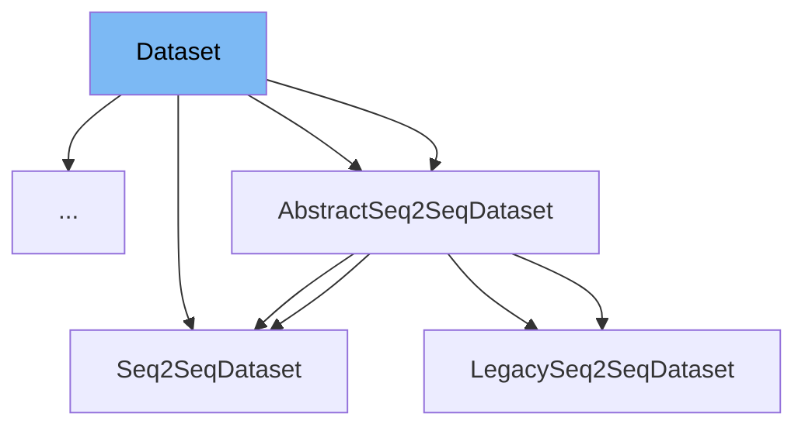

This document will cover the <SwmToken path="examples/research_projects/pplm/run_pplm_discrim_train.py" pos="213:1:1" line-data="        dataset=Dataset(xs, ys), batch_size=batch_size, shuffle=shuffle, collate_fn=cached_collate_fn">`dataset`</SwmToken> class in <SwmPath>[examples/research_projects/pplm/run_pplm_discrim_train.py](examples/research_projects/pplm/run_pplm_discrim_train.py)</SwmPath>. We will cover:

1. What is Dataset
2. Variables and functions
3. Usage example



# What is Dataset

The <SwmToken path="examples/research_projects/pplm/run_pplm_discrim_train.py" pos="213:1:1" line-data="        dataset=Dataset(xs, ys), batch_size=batch_size, shuffle=shuffle, collate_fn=cached_collate_fn">`dataset`</SwmToken> class in <SwmPath>[examples/research_projects/pplm/run_pplm_discrim_train.py](examples/research_projects/pplm/run_pplm_discrim_train.py)</SwmPath> is a custom dataset class used for handling and processing data for training and evaluation. It is designed to read source and target sequences from text files and provide them in a format suitable for training machine learning models. This class is particularly useful in scenarios where you need to manage and preprocess data efficiently for tasks such as text classification or sequence modeling.

<SwmSnippet path="/examples/research_projects/pplm/run_pplm_discrim_train.py" line="85">

---

# Variables and functions

The <SwmToken path="examples/research_projects/pplm/run_pplm_discrim_train.py" pos="85:3:3" line-data="    def __init__(self, X, y):">`__init__`</SwmToken> method initializes the <SwmToken path="examples/research_projects/pplm/run_pplm_discrim_train.py" pos="213:1:1" line-data="        dataset=Dataset(xs, ys), batch_size=batch_size, shuffle=shuffle, collate_fn=cached_collate_fn">`dataset`</SwmToken> class with two variables, <SwmToken path="examples/research_projects/pplm/run_pplm_discrim_train.py" pos="85:8:8" line-data="    def __init__(self, X, y):">`X`</SwmToken> and <SwmToken path="examples/research_projects/pplm/run_pplm_discrim_train.py" pos="85:11:11" line-data="    def __init__(self, X, y):">`y`</SwmToken>, which represent the input data and the corresponding labels, respectively.

```python
    def __init__(self, X, y):
        """Reads source and target sequences from txt files."""
        self.X = X
        self.y = y
```

---

</SwmSnippet>

<SwmSnippet path="/examples/research_projects/pplm/run_pplm_discrim_train.py" line="90">

---

The <SwmToken path="examples/research_projects/pplm/run_pplm_discrim_train.py" pos="90:3:3" line-data="    def __len__(self):">`__len__`</SwmToken> method returns the length of the dataset, which is the number of samples in <SwmToken path="examples/research_projects/pplm/run_pplm_discrim_train.py" pos="91:7:7" line-data="        return len(self.X)">`X`</SwmToken>.

```python
    def __len__(self):
        return len(self.X)
```

---

</SwmSnippet>

<SwmSnippet path="/examples/research_projects/pplm/run_pplm_discrim_train.py" line="93">

---

The <SwmToken path="examples/research_projects/pplm/run_pplm_discrim_train.py" pos="93:3:3" line-data="    def __getitem__(self, index):">`__getitem__`</SwmToken> method retrieves a data pair (input and label) at the specified index. It returns a dictionary containing the input data (<SwmToken path="examples/research_projects/pplm/run_pplm_discrim_train.py" pos="96:4:4" line-data="        data[&quot;X&quot;] = self.X[index]">`X`</SwmToken>) and the corresponding label (<SwmToken path="examples/research_projects/pplm/run_pplm_discrim_train.py" pos="97:4:4" line-data="        data[&quot;y&quot;] = self.y[index]">`y`</SwmToken>).

```python
    def __getitem__(self, index):
        """Returns one data pair (source and target)."""
        data = {}
        data["X"] = self.X[index]
        data["y"] = self.y[index]
        return data
```

---

</SwmSnippet>

# Usage example

Here is an example of how to use the <SwmToken path="examples/research_projects/pplm/run_pplm_discrim_train.py" pos="213:1:1" line-data="        dataset=Dataset(xs, ys), batch_size=batch_size, shuffle=shuffle, collate_fn=cached_collate_fn">`dataset`</SwmToken> class in the context of `LmSeqsDataset`.

<SwmSnippet path="/examples/research_projects/pplm/run_pplm_discrim_train.py" line="212">

---

# Usage example

The <SwmToken path="examples/research_projects/pplm/run_pplm_discrim_train.py" pos="213:1:1" line-data="        dataset=Dataset(xs, ys), batch_size=batch_size, shuffle=shuffle, collate_fn=cached_collate_fn">`dataset`</SwmToken> class is instantiated with input data <SwmToken path="examples/research_projects/pplm/run_pplm_discrim_train.py" pos="213:5:5" line-data="        dataset=Dataset(xs, ys), batch_size=batch_size, shuffle=shuffle, collate_fn=cached_collate_fn">`xs`</SwmToken> and labels <SwmToken path="examples/research_projects/pplm/run_pplm_discrim_train.py" pos="213:8:8" line-data="        dataset=Dataset(xs, ys), batch_size=batch_size, shuffle=shuffle, collate_fn=cached_collate_fn">`ys`</SwmToken>, and then used to create a <SwmToken path="examples/research_projects/pplm/run_pplm_discrim_train.py" pos="212:11:11" line-data="    data_loader = torch.utils.data.DataLoader(">`DataLoader`</SwmToken> with the <SwmToken path="examples/research_projects/pplm/run_pplm_discrim_train.py" pos="213:24:24" line-data="        dataset=Dataset(xs, ys), batch_size=batch_size, shuffle=shuffle, collate_fn=cached_collate_fn">`cached_collate_fn`</SwmToken> function.

```python
    data_loader = torch.utils.data.DataLoader(
        dataset=Dataset(xs, ys), batch_size=batch_size, shuffle=shuffle, collate_fn=cached_collate_fn
    )
```

---

</SwmSnippet>

<SwmSnippet path="/examples/research_projects/pplm/run_pplm_discrim_train.py" line="259">

---

The <SwmToken path="examples/research_projects/pplm/run_pplm_discrim_train.py" pos="260:5:5" line-data="        train_dataset = Dataset(x, y)">`Dataset`</SwmToken> class is used to create a training dataset (<SwmToken path="examples/research_projects/pplm/run_pplm_discrim_train.py" pos="260:1:1" line-data="        train_dataset = Dataset(x, y)">`train_dataset`</SwmToken>) with input sequences and their corresponding labels.

```python
            y.append(class2idx[vars(train_data[i])["label"]])
        train_dataset = Dataset(x, y)
```

---

</SwmSnippet>

<SwmSnippet path="/examples/research_projects/pplm/run_pplm_discrim_train.py" line="269">

---

The <SwmToken path="examples/research_projects/pplm/run_pplm_discrim_train.py" pos="270:5:5" line-data="        test_dataset = Dataset(test_x, test_y)">`Dataset`</SwmToken> class is used to create a test dataset (<SwmToken path="examples/research_projects/pplm/run_pplm_discrim_train.py" pos="270:1:1" line-data="        test_dataset = Dataset(test_x, test_y)">`test_dataset`</SwmToken>) with input sequences and their corresponding labels.

```python
            test_y.append(class2idx[vars(test_data[i])["label"]])
        test_dataset = Dataset(test_x, test_y)
```

---

</SwmSnippet>

<SwmSnippet path="/examples/research_projects/pplm/run_pplm_discrim_train.py" line="315">

---

The <SwmToken path="examples/research_projects/pplm/run_pplm_discrim_train.py" pos="315:5:5" line-data="        full_dataset = Dataset(x, y)">`Dataset`</SwmToken> class is used to create a full dataset (<SwmToken path="examples/research_projects/pplm/run_pplm_discrim_train.py" pos="315:1:1" line-data="        full_dataset = Dataset(x, y)">`full_dataset`</SwmToken>) with input sequences and their corresponding labels, which is then split into training and test datasets.

```python
        full_dataset = Dataset(x, y)
        train_size = int(0.9 * len(full_dataset))
```

---

</SwmSnippet>

&nbsp;

*This is an auto-generated document by Swimm AI 🌊 and has not yet been verified by a human*

<SwmMeta version="3.0.0" repo-id="Z2l0aHViJTNBJTNBdHJhbnNmb3JtZXJzJTNBJTNBc2h1anV1dQ==" repo-name="transformers"><sup>Powered by [Swimm](/)</sup></SwmMeta>
